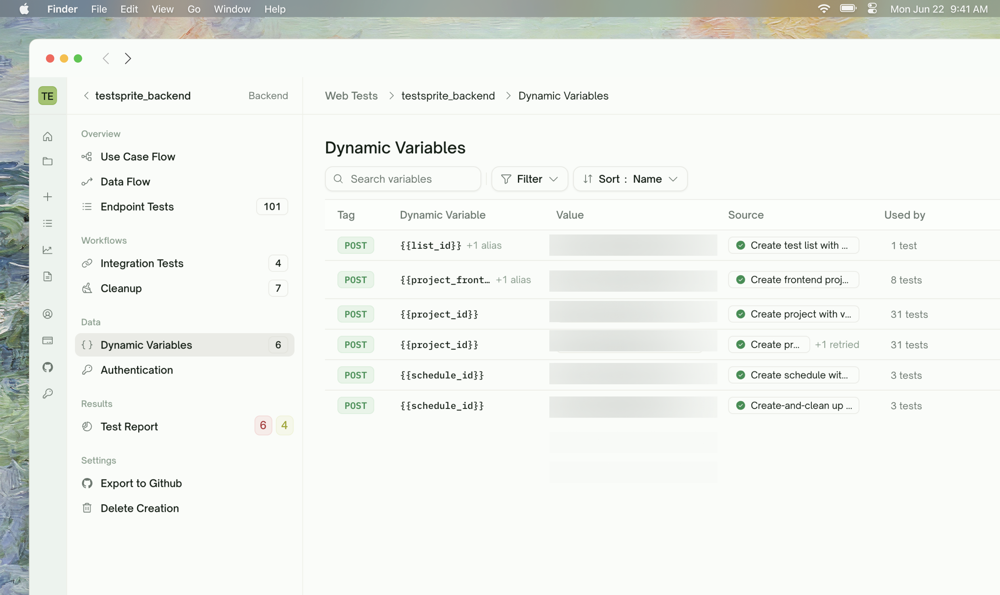

<Frame>
  
</Frame>

## What Dynamic Variables Are

A **dynamic variable** is a value that one test produces and another test uses. The simplest example:

```
POST /users           produces user_id    →   POST /orders   uses user_id
                      from the response   →                  in the request body
```

The `user_id` isn't known until POST /users runs. By "dynamic" we mean: it's resolved at runtime, after the earlier test executes, then carried into the next HTTP call.

Dynamic variables are the connective tissue of Integration Tests and the source data for Auto Cleanup and Data Flow.

<CardGroup cols={3}>
  <Card title="Integration Tests" href="/web-portal/core/api/integration-tests" icon="link">
    Multi-step chains where one test's response feeds the next
  </Card>
  <Card title="Auto Cleanup" href="/web-portal/core/api/auto-cleanup" icon="broom">
    Records created during a run get removed afterward
  </Card>
  <Card title="Data Flow" href="/web-portal/core/api/data-flow" icon="diagram-project">
    Visual graph of every HTTP call with producer/consumer wiring
  </Card>
</CardGroup>

## Producers and Consumers

Every test in a chain has one of two roles for each variable:

| Role | What it does |
| :--- | :--- |
| **Producer** | Extracts a named value from its response |
| **Consumer** | Uses a named value (produced earlier) in its request |

A test can produce variables, use them, both, or neither. A pure GET typically only uses values (e.g., the `id` to look up); a POST that creates a record typically produces the new record's ID.

## The Dynamic Variables Tab

Sidebar → **Data → Dynamic Variables**. This view answers: *"Across the most recent run, what values flowed through the system?"*

| Column | What it shows |
| :--- | :--- |
| <kbd>Tag</kbd> | Type tag for the captured value (e.g., resource type) |
| <kbd>Dynamic Variable</kbd> | Name of the captured variable (e.g., `user_id`, `order_id`, `session_token`) |
| <kbd>Value</kbd> | A preview of the actual value captured |
| <kbd>Source</kbd> | The producer test (with click-to-navigate to its detail page) |
| <kbd>Used by</kbd> | The consumer tests (multiple if shared across chains) |
| <kbd>Deleted by</kbd> | The cleanup test that deletes the resource this variable points to, when applicable |

The page supports search + filter:

- **Search** — by variable name
- **Filter: Cleanup** — `Has cleanup` (variables the auto-cleanup chain references) or `Orphaned` (no matching cleanup)
- **Filter: Consumer** — `Used downstream` (have at least one consumer) or `Unused`
- **Sort** — by Name (default), by Consumers, or by Sources

## What Counts as "Cleanup-Relevant"

Some variables represent **records that exist in your test environment after the run**. These need to be cleaned up so subsequent runs start fresh.

TestSprite identifies cleanup-relevant variables by recognizing which ones look like resource handles (record IDs from POST/PUT calls with a matching DELETE endpoint) versus plain values used only for assertions.

These flagged variables appear in the Dynamic Variables tab with a populated **Deleted by** column (and can be filtered via the Cleanup → "Has cleanup" filter). They feed into the cleanup chain.

<Card title="Auto Cleanup" href="/web-portal/core/api/auto-cleanup" icon="broom">
  How TestSprite removes records created during a run
</Card>

<Tip>
**Most fields don't trigger cleanup.** A `total_amount` is just a number used for an assertion downstream — it doesn't represent a record to delete. An `order_id` is the handle to a created record — deletion is needed.
</Tip>

## Refining Producer/Consumer Wiring

If a chain is wrong (missing producer, mismatched name, or a path that doesn't resolve in the response), the recovery path is the per-test **Chat** on the test detail page — describe what should change and TestSprite regenerates the test.

## When a Value Isn't Available

If a test needs a value that wasn't produced upstream, TestSprite marks it **Blocked** with the missing variable name in the error trace.

The most common causes:

<AccordionGroup>
  <Accordion title="The producer test failed (or didn't run yet)">
    The downstream test is blocked until the producer runs cleanly. Check the producer test detail page; fix it; rerun the consumer (or rerun the chain).
  </Accordion>
  <Accordion title="The producer didn't return the expected field">
    The producer Passed but its response shape doesn't include the field you wanted (e.g., the value is nested under `data.id` instead of `id`). Refine in chat: "Capture user_id from data.id in the response".
  </Accordion>
  <Accordion title="Name mismatch — producer says `userId`, consumer says `user_id`">
    Variable names must match exactly (case-sensitive). Refine one or the other to align.
  </Accordion>
  <Accordion title="Producer was unticked at plan-review">
    A producer was pruned from the plan, but a downstream test depended on it. The downstream test gets Blocked. Either re-add the producer, or refine the downstream to not need that variable.
  </Accordion>
</AccordionGroup>

## Reusing the Same Variable Across Chains

A variable produced once is available to every test downstream in the run, not just one chain. So:

```
POST /users (chain A producer)        produces user_id
  → POST /orders (chain A consumer)   uses user_id
GET /users/{id} (chain B consumer)    uses user_id  ← same value, no re-create
```

Chain B doesn't have to call POST /users again — it reuses the value from chain A's producer. This is why "Used By" can show multiple test names per row.

<Info>
**Per-run scope, not per-chain scope.** Variables are produced fresh on each run. Across runs the values reset (new POST /users → new user_id). Within a single run, values persist for the entire run's duration.
</Info>

## Edge Cases & Troubleshooting

<AccordionGroup>
  <Accordion title="The value I need is in a list, not a single field">
    Refine in chat to point at the right item: "Capture the first item's id from the items array".
  </Accordion>
  <Accordion title="The response is a JSON array at the root">
    Refine in chat: "Capture id from the first array element of the response".
  </Accordion>
  <Accordion title="The endpoint returns the resource but with the ID inside a header (Location)">
    Refine the test in chat to read from the header — TestSprite produces the appropriate code from the instruction.
  </Accordion>
  <Accordion title="I see the variable in the Dynamic Variables tab but the consumer still says BLOCKED">
    Probably a name mismatch. Check the producer's name and the consumer's name — they must match exactly (case-sensitive).
  </Accordion>
  <Accordion title="Two tests produce the same variable name from different responses">
    TestSprite tries to avoid this; if it happens, one producer "wins" consistently. Refine names to be unique (`order_id_a`, `order_id_b`) if you genuinely need both.
  </Accordion>
</AccordionGroup>

## Where to Go Next

<Columns cols={2}>
  <Card title="Integration Tests" href="/web-portal/core/api/integration-tests" icon="link">
    Multi-step chains that pass values from one step to the next
  </Card>
  <Card title="Dependency Chains" href="/web-portal/core/api/dependency-chains" icon="diagram-project">
    How run order is determined
  </Card>
  <Card title="Auto Cleanup" href="/web-portal/core/api/auto-cleanup" icon="broom">
    What happens to cleanup-flagged variables after the run
  </Card>
  <Card title="Data Flow" href="/web-portal/core/api/data-flow" icon="diagram-project">
    Visual graph showing how values wired calls together
  </Card>
</Columns>
