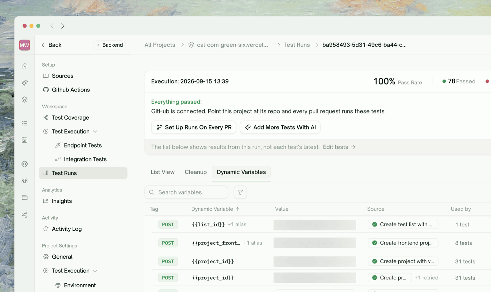

<Frame>
  
</Frame>

## What Dynamic Variables Are

A **dynamic variable** is a value one test produces and another test uses:

```
POST /users           produces user_id    →   POST /orders   uses user_id
                      from the response   →                  in the request body
```

The `user_id` isn't known until POST /users runs, so it's resolved at runtime and carried into the next call. [Integration Tests](/web-portal/core/api/integration-tests), [Auto Cleanup](/web-portal/core/api/auto-cleanup), and each test's [Data Flow](#the-data-flow-section-on-a-test) section are all built on these values.

## Producers and Consumers

| Role | What it does |
| :--- | :--- |
| **Producer** | Extracts a named value from its response |
| **Consumer** | Uses a named value (produced earlier) in its request |

A test can produce, consume, both, or neither. A GET usually only consumes (the `id` to look up); a POST that creates a record usually produces the new record's ID.

## The Dynamic Variables Tab

Open **Test Runs → a run → Dynamic Variables** to see what values flowed through that run.

| Column | What it shows |
| :--- | :--- |
| <kbd>Tag</kbd> | Type tag for the captured value (e.g., resource type) |
| <kbd>Dynamic Variable</kbd> | Name of the captured variable (e.g., `user_id`, `order_id`, `session_token`) |
| <kbd>Value</kbd> | A preview of the actual value captured |
| <kbd>Source</kbd> | The producer test (with click-to-navigate to its detail page) |
| <kbd>Used by</kbd> | The consumer tests (multiple if shared across chains) |
| <kbd>Deleted by</kbd> | The cleanup test that deletes the resource this variable points to, when applicable |

You can search by variable name, filter by **Cleanup** (`Has cleanup` or `Orphaned`) and **Consumer** (`Used downstream` or `Unused`), and sort by Name (default), Consumers, or Sources.

## The Data Flow Section on a Test

Each endpoint test also shows its own slice of this wiring, in the collapsible **Data Flow** section of its detail page:

| Part | What it shows |
| :--- | :--- |
| <kbd>Captures (N)</kbd> | The variables this test produces |
| <kbd>Consumes (N)</kbd> | The variables this test needs, each with the test it comes from |

The same section appears on each API test's result inside a run.

## What Counts as "Cleanup-Relevant"

Some variables are handles to **records that still exist after the run**: IDs from POST/PUT calls that have a matching DELETE endpoint. TestSprite flags these, gives them a **Deleted by** entry (filter: Cleanup → `Has cleanup`), and feeds them into [Auto Cleanup](/web-portal/core/api/auto-cleanup). Plain values used only for assertions, like a `total_amount`, aren't cleaned up; an `order_id` is.

## Refining Producer/Consumer Wiring

If a chain is wrong (missing producer, mismatched name, or a path that doesn't resolve in the response), edit the test's description on its detail page to say what should change, then click **Regenerate**.

## When a Value Isn't Available

If a test needs a value nobody produced, TestSprite marks it **Blocked** and names the missing variable in the error trace. Common causes:

<AccordionGroup>
  <Accordion title="The producer test failed (or didn't run yet)">
    The downstream test stays blocked until the producer runs cleanly. Fix the producer, then rerun the consumer or the chain.
  </Accordion>
  <Accordion title="The producer didn't return the expected field">
    The producer passed, but the field lives somewhere else in the response (e.g., `data.id` instead of `id`). Refine in chat: "Capture user_id from data.id in the response".
  </Accordion>
  <Accordion title="Name mismatch: producer says `userId`, consumer says `user_id`">
    Names must match exactly (case-sensitive). This is the usual reason a variable shows in the Dynamic Variables tab while its consumer is still Blocked. Refine one side to match.
  </Accordion>
  <Accordion title="Producer was unticked at plan-review">
    A test depended on a producer you removed from the plan. Re-add the producer, or refine the downstream test so it doesn't need that variable.
  </Accordion>
</AccordionGroup>

## Reusing the Same Variable Across Chains

A variable is available to every later test in the run, not just its own chain:

```
POST /users (chain A producer)        produces user_id
  → POST /orders (chain A consumer)   uses user_id
GET /users/{id} (chain B consumer)    uses user_id  ← same value, no re-create
```

That's why **Used by** can list several tests. Values last for one run; the next run produces fresh ones.

## <a id="edge-cases-and-troubleshooting"></a>Edge Cases & Troubleshooting

<AccordionGroup>
  <Accordion title="The value I need is in a list, not a single field">
    Refine in chat to point at the right item: "Capture the first item's id from the items array".
  </Accordion>
  <Accordion title="The response is a JSON array at the root">
    Refine in chat: "Capture id from the first array element of the response".
  </Accordion>
  <Accordion title="The endpoint returns the ID in a header (Location)">
    Refine the test in chat to read it from the header.
  </Accordion>
  <Accordion title="Two tests produce the same variable name from different responses">
    TestSprite tries to avoid this; if it happens, one producer "wins" consistently. Give them unique names (`order_id_a`, `order_id_b`) if you need both.
  </Accordion>
</AccordionGroup>

## Where to Go Next

<Columns cols={2}>
  <Card title="Integration Tests" href="/web-portal/core/api/integration-tests" icon="link">
    Multi-step chains that pass values from one step to the next
  </Card>
  <Card title="Dependency Chains" href="/web-portal/core/api/dependency-chains" icon="diagram-project">
    How run order is determined
  </Card>
  <Card title="Auto Cleanup" href="/web-portal/core/api/auto-cleanup" icon="broom">
    What happens to cleanup-flagged variables after the run
  </Card>
</Columns>
