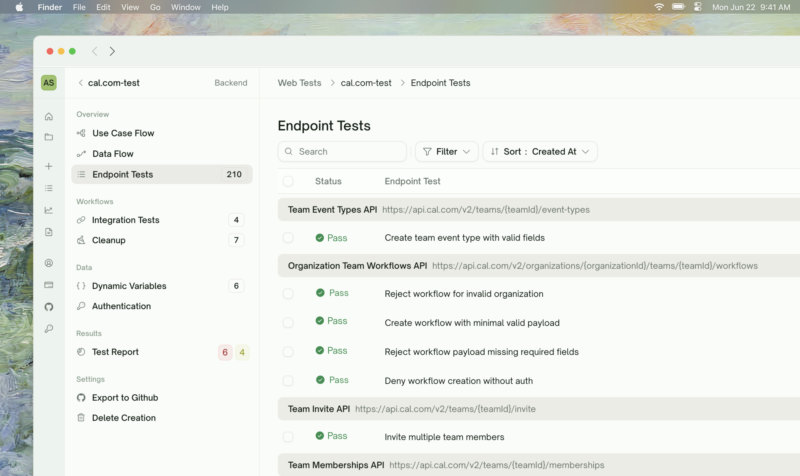

<Frame>
  
</Frame>

## What Endpoint Tests Are

An **endpoint test** is the simplest kind of API test in TestSprite: one HTTP call to one of your endpoints, with assertions on the response. Each row in your reviewed plan ([Plan Generation](/web-portal/core/api/api-plan-gen)) becomes one endpoint test in this phase.

<Frame>
  
</Frame>

Endpoint tests are the building blocks. [Integration Tests](/web-portal/core/api/integration-tests) chain endpoint tests together; [Auto Cleanup](/web-portal/core/api/auto-cleanup) removes records they create; [Data Flow](/web-portal/core/api/data-flow) shows their HTTP traffic. On their own, an endpoint test is a small, self-contained Python file that exercises one route.

## What Code Gets Generated

For each plan row, TestSprite writes a Python test using `requests`. The generated tests are straightforward: build the request, send it, assert on status code and response shape. Roughly:

```python Generated test (illustrative)
import requests

def test_get_user_returns_200_with_expected_shape():
    response = requests.get(f"{BASE_URL}/users/123", headers={"Authorization": f"Bearer {TOKEN}"}, timeout=10)

    assert response.status_code == 200
    body = response.json()
    assert "id" in body
    assert "email" in body
    assert isinstance(body["created_at"], str)
```

Tests for security and edge-case categories are more elaborate — multi-step setups, signature handling, deliberate-tamper assertions — but the structure is the same: standard `requests` calls, plain assertions, no framework lock-in.

What this gets you:

- **Coverage humans skip.** Plans span functional happy paths, schema validation, auth edges, malformed-input edges, boundary / load, and security probes — AI consistently surfaces the cases handwritten suites forget. A 50-endpoint API typically gets 150–400 tests; reviewing the plan takes minutes, not the days a human would need to write that suite.
- **Auditable, not magical.** The generated code is plain Python + `requests`. Your QA team or security reviewer can read every assertion line by line and sign off — no proprietary DSL, no opaque runtime. If the AI gets something wrong, you can see exactly what.
- **Maintained for you.** When endpoints evolve, refine in chat in your own words and TestSprite regenerates the affected tests. The cost of keeping the suite green is a paragraph of feedback, not a sprint.

## Generation and Verification

TestSprite verifies every generated test before it lands in your suite — checking that it's well-formed, hits the right endpoint, and contains a real assertion. If verification can't be satisfied, the test is marked **Failed**, the credit is refunded, and the test detail page exposes **Chat** — describe what to fix and TestSprite either tweaks the assertions or generates a fresh test, depending on the instruction.

This means low-quality output never gets stranded silently in your suite — if generation can't produce a sound test, you get a clear Failed status with a recovery path, not a broken test you have to debug.

## Watching Generation Live

The endpoint tests list streams updates as generation runs. Each row surfaces one of these statuses:

| Status | What's happening | What you should do |
| :--- | :--- | :--- |
| <kbd>Pending</kbd> | Queued, not yet started | Wait |
| <kbd>Running</kbd> | Generation and (when in a run) execution are surfaced under this single status | Wait — generation is typically 5–20 seconds per test; execution is typically 1–5 seconds |
| <kbd>Pass</kbd> / <kbd>Failed</kbd> / <kbd>Blocked</kbd> | Final outcome | If Failed: click into the row to see the error |

<Tip>
**Generation is paralleled across endpoints.** A 50-test plan typically completes generation in 1–2 minutes total, not 50 × per-test time. Tests stream into the list as they finish — you don't have to wait for the slowest one to start reviewing the early arrivals.
</Tip>

## What "Rerun" Does

Once an endpoint test is generated and Idle, **Rerun** (single, selected, or all) sends one HTTP request per test to your API:

1. Substitutes your base URL and credentials (Static Credentials or an [Auto-Auth](/web-portal/core/api/auto-auth)-fetched token)
2. Issues the request from TestSprite's cloud sandbox
3. Captures the request, response, headers, body, status code, latency
4. Runs the assertions in the test
5. Persists Passed / Failed plus the full request/response for later review

<Card title="Rerun (with/without Dependencies)" href="/web-portal/core/api/api-rerun" icon="arrow-rotate-right">
  The same Run runs again with **Rerun** — read about per-test rerun and skip-dependencies options
</Card>

## Test Outcomes

| Outcome | Meaning |
| :--- | :--- |
| <kbd>Passed</kbd> | Every assertion held. |
| <kbd>Failed</kbd> | At least one assertion failed. The test detail page shows the failed line + actual vs expected. |
| <kbd>Blocked</kbd> | The test couldn't run end-to-end — typically because an upstream dependency in an integration chain failed. Surfaced as `TEST BLOCKED` in error trace. |

<Warning>
**Blocked is not Failed.** A Blocked test was prevented from running by something upstream; we don't know if your endpoint passes or fails. Fix the upstream and rerun.
</Warning>

## Reviewing a Failed Test

Click any Failed row to land on its detail page. You get:

| Element | What you get |
| :--- | :--- |
| <kbd>Request panel</kbd> | Exact HTTP call we made |
| <kbd>Response panel</kbd> | What your API returned |
| <kbd>Error trace</kbd> | Where the assertion failed (file/line + Python traceback) |
| <kbd>Cause & Fix</kbd> | AI analysis of likely root cause + suggested fix |
| <kbd>Refine in Chat</kbd> | Natural-language refinement of the test |
| <kbd>Rerun</kbd> | Re-execute as-is |

<Card title="Test Detail" href="/web-portal/core/working-with-test/test-detail" icon="file-magnifying-glass">
  Full walkthrough of the test detail page — panels, error trace, Cause & Fix, and the chat-driven recovery flow
</Card>

## Iterating on a Test

To iterate on a generated test, open its detail page and use **Chat** — describe the change in natural language and TestSprite either rewrites the assertions in place or regenerates the test from scratch, depending on what you ask for. For coverage on a brand-new endpoint or scenario, create a new project for it.

<Frame>
  
</Frame>

<Card title="Refining Tests" href="/web-portal/core/working-with-test/refining-tests" icon="pen">
  How to drive Chat for assertion tweaks vs full rewrites
</Card>

## Edge Cases & Troubleshooting

<AccordionGroup>
  <Accordion title="A test was generated, run, and Failed but I think the test is wrong, not my API">
    Open the test detail page and use chat. Describe what's wrong in natural language — "the assertion on `created_at` is too strict, accept any ISO 8601 string" for a small fix, or "rewrite this test to also send the `Idempotency-Key` header" for something larger. TestSprite either rewrites the assertions in place or regenerates the whole test, depending on the instruction.
  </Accordion>
  <Accordion title="Generation says Failed before any HTTP call was made">
    Verification couldn't be satisfied. Open the test detail page and ask Chat for another pass — generation isn't deterministic, so a re-run often succeeds. If it keeps failing, the plan-row description may be ambiguous; clarify it in chat.
  </Accordion>
  <Accordion title="The test asserts on a field that doesn't exist in the response">
    The expected response shape was guessed from incomplete data. Open the test, click into the chat, paste the actual response body — TestSprite rewrites the assertions to match.
  </Accordion>
  <Accordion title="My endpoint requires a request signature I haven't given TestSprite">
    Use the Extra-Context textarea or chat to explain the signing scheme — "All requests need a `X-Signature: t=<ms>,v=<hmac-sha256-hex>` header where the body is the canonical JSON". TestSprite produces the signing helper inline.
  </Accordion>
  <Accordion title="The generated test imports a library I don't have">
    Standard generation uses `requests` + `pytest` + stdlib only. If your prompt accidentally implied something exotic (e.g. "use httpx async client"), generation may follow. Refine to standard or accept the dependency.
  </Accordion>
</AccordionGroup>

## Where to Go Next

<Columns cols={2}>
  <Card title="Integration Tests Generation" href="/web-portal/core/api/integration-tests" icon="link">
    Chain endpoint tests into multi-step workflows
  </Card>
  <Card title="Test Detail" href="/web-portal/core/working-with-test/test-detail" icon="file-magnifying-glass">
    Reviewing a single test's request, response, and analysis
  </Card>
  <Card title="Refining Tests" href="/web-portal/core/working-with-test/refining-tests" icon="pen">
    Natural-language adjustments to a generated test
  </Card>
  <Card title="Auto-Auth (Pro)" href="/web-portal/core/api/auto-auth" icon="arrows-rotate">
    Stop pasting tokens before every run
  </Card>
</Columns>
