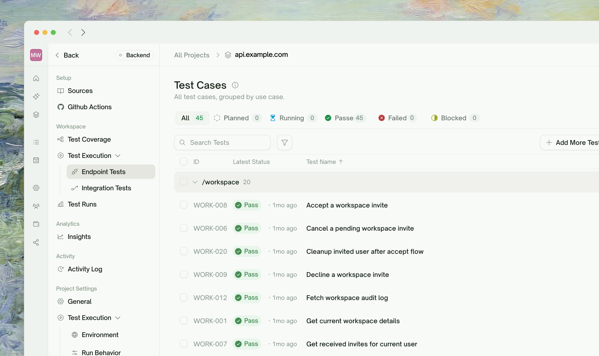
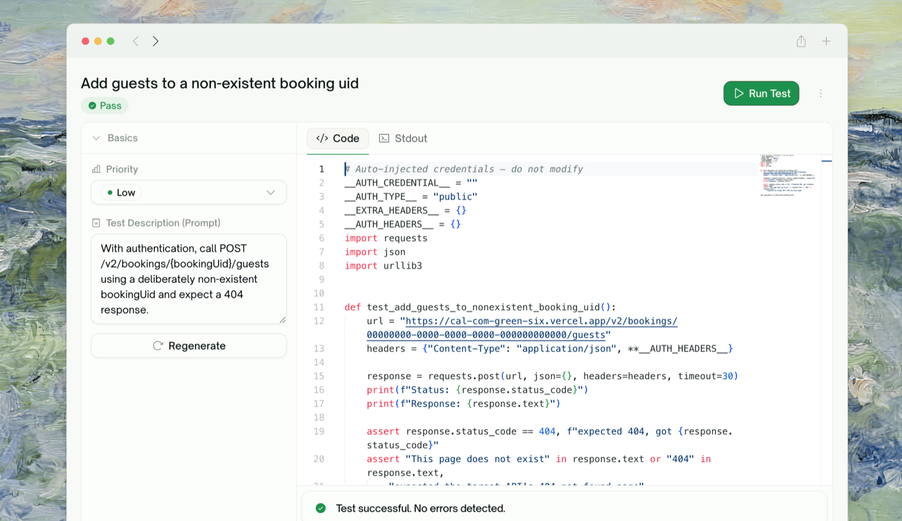
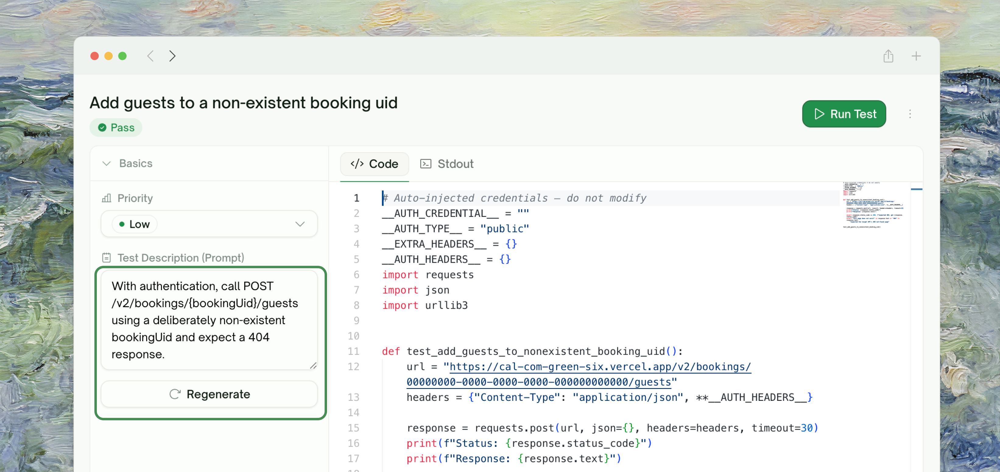

<Frame>
  
</Frame>

## What Endpoint Tests Are

An **endpoint test** is the simplest kind of API test: one HTTP call to one of your endpoints, with assertions on the response. Each row in your reviewed plan ([Plan Generation](/web-portal/core/api/api-plan-gen)) becomes one endpoint test.

<Frame>
  
</Frame>

Endpoint tests are the building blocks: [Integration Tests](/web-portal/core/api/integration-tests) chain them, [Auto Cleanup](/web-portal/core/api/auto-cleanup) removes the records they create, and the [Data Flow](/web-portal/core/api/dynamic-variables#the-data-flow-section-on-a-test) section shows the values they capture and consume.

## What Code Gets Generated

For each plan row, TestSprite writes a Python test using `requests`: build the request, send it, assert on status code and response shape. Roughly:

```python Generated test (illustrative)
import requests

def test_get_user_returns_200_with_expected_shape():
    response = requests.get(f"{BASE_URL}/users/123", headers={"Authorization": f"Bearer {TOKEN}"}, timeout=10)

    assert response.status_code == 200
    body = response.json()
    assert "id" in body
    assert "email" in body
    assert isinstance(body["created_at"], str)
```

Security and edge-case tests are more elaborate (multi-step setups, signature handling, deliberate tampering), but the structure is the same: plain `requests` calls and assertions, no framework lock-in. Your QA team or security reviewer can read every assertion line by line.

## Generation and Verification

TestSprite verifies every generated test before it lands in your suite, checking that it's well-formed, hits the right endpoint, and contains a real assertion. If verification can't be satisfied, the test is marked **Failed** instead of being left broken in your suite. To recover, describe what to fix in the test's description and click **Regenerate**.

## Watching Generation Live

The endpoint tests list updates as generation runs. Each row shows one of these statuses:

| Status | What's happening | What you should do |
| :--- | :--- | :--- |
| <kbd>Queued</kbd> | Queued, not yet started | Wait |
| <kbd>Running</kbd> | Generation and (when in a run) execution are surfaced under this single status | Wait. Generation is typically 5–20 seconds per test; execution is typically 1–5 seconds |
| <kbd>Passed</kbd> / <kbd>Failed</kbd> / <kbd>Blocked</kbd> | Final outcome | If Failed: click into the row to see the error |

Generation runs in parallel across endpoints, and tests appear as they finish, so you can start reviewing before the slowest one is done.

## What "Rerun" Does

A rerun (single, selected, or all) sends one HTTP request per test from TestSprite's cloud sandbox, using your base URL and credentials (Static Credentials or an [Auto-Auth](/web-portal/core/api/auto-auth) token). It captures the request, response, headers, body, status code, and latency, runs the assertions, and saves the result. See [Rerun](/web-portal/core/api/api-rerun) for per-test and batch reruns.

## Test Outcomes

| Outcome | Meaning |
| :--- | :--- |
| <kbd>Passed</kbd> | Every assertion held. |
| <kbd>Failed</kbd> | At least one assertion failed. The test detail page shows the failed line + actual vs expected. |
| <kbd>Blocked</kbd> | The test couldn't run end to end, typically because an upstream dependency in an integration chain failed. Surfaced as `TEST BLOCKED` in the error trace. |

<Warning>
**Blocked is not Failed.** A Blocked test was prevented from running by something upstream, so we don't know whether your endpoint passes. Fix the upstream and rerun.
</Warning>

## Reviewing a Failed Test

Click any Failed row to open its detail page:

| Element | What you get |
| :--- | :--- |
| <kbd>Stdout</kbd> | The run's output, including what your API returned |
| <kbd>Error</kbd> / <kbd>Trace</kbd> | Where the assertion failed (file/line + Python traceback) |
| <kbd>Cause</kbd> / <kbd>Fix</kbd> | AI analysis of likely root cause + suggested fix |
| <kbd>Regenerate</kbd> | Natural-language refinement of the test, from its description |
| <kbd>Run test</kbd> | Re-execute as-is |

See [Test Detail](/web-portal/core/working-with-test/test-detail) for the full page.

## Iterating on a Test

Open the test, describe the change in its description, and click **Regenerate**. For coverage on a brand-new endpoint or scenario, create a new project for it.

<Frame>
  
</Frame>

## Edge Cases & Troubleshooting

<AccordionGroup>
  <Accordion title="A test was generated, run, and Failed but I think the test is wrong, not my API">
    Edit the test's description to say what's wrong: "the assertion on `created_at` is too strict, accept any ISO 8601 string" for a small fix, or "rewrite this test to also send the `Idempotency-Key` header" for something larger. TestSprite either rewrites the assertions or regenerates the whole test, depending on the instruction.
  </Accordion>
  <Accordion title="Generation says Failed before any HTTP call was made">
    Verification couldn't be satisfied. Click **Regenerate** for another pass; generation isn't deterministic, so a retry often succeeds. If it keeps failing, the description may be ambiguous; clarify it.
  </Accordion>
  <Accordion title="The test asserts on a field that doesn't exist in the response">
    The expected shape was guessed from incomplete data. Paste the actual response body into the test's description and click **Regenerate**. TestSprite rewrites the assertions to match.
  </Accordion>
  <Accordion title="My endpoint requires a request signature I haven't given TestSprite">
    Explain the signing scheme in **Extra Instructions** (in **Project Settings → General**) or in **Chats**, e.g. "All requests need a `X-Signature: t=<ms>,v=<hmac-sha256-hex>` header where the body is the canonical JSON". TestSprite produces the signing helper inline.
  </Accordion>
  <Accordion title="The generated test imports a library I don't have">
    Standard generation uses `requests` + `pytest` + stdlib only. If your description implied something else (e.g. "use httpx async client"), generation may follow it. Refine it back to standard, or accept the dependency.
  </Accordion>
</AccordionGroup>

## Where to Go Next

<Columns cols={2}>
  <Card title="Integration Tests Generation" href="/web-portal/core/api/integration-tests" icon="link">
    Chain endpoint tests into multi-step workflows
  </Card>
  <Card title="Test Detail" href="/web-portal/core/working-with-test/test-detail" icon="file-magnifying-glass">
    Reviewing a single test's request, response, and analysis
  </Card>
  <Card title="Managing Test Cases" href="/web-portal/core/working-with-test/managing-test-cases" icon="pen">
    Natural-language adjustments to a generated test
  </Card>
  <Card title="Auto-Auth" href="/web-portal/core/api/auto-auth" icon="arrows-rotate">
    Stop pasting tokens before every run
  </Card>
</Columns>
