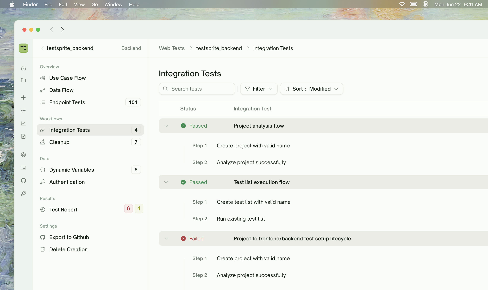
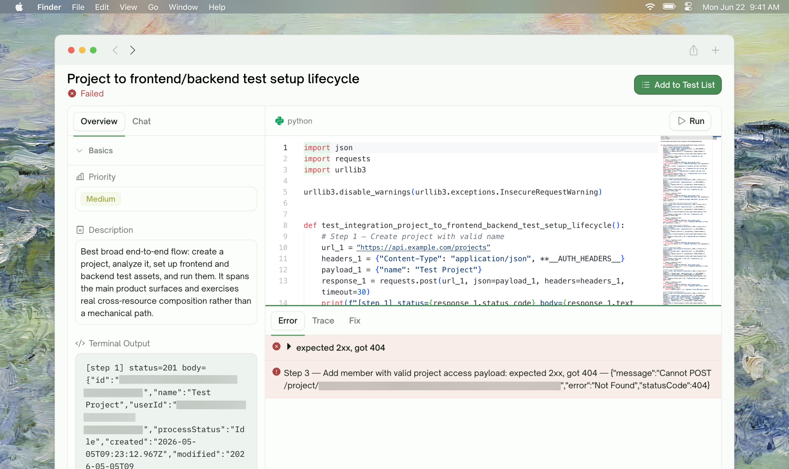
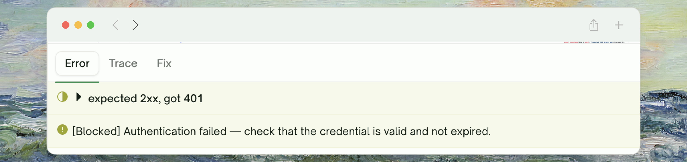

<Frame>
  
</Frame>

## What Integration Tests Are

An integration test exercises a **sequence of endpoints** as a single workflow. The classic shape:

```
POST /users        → create a user, capture user_id
POST /orders       → create an order for that user, capture order_id
GET  /orders/{id}  → confirm the order is retrievable
DELETE /orders/{id}→ cancel the order, confirm 204
```

Each step depends on data from the previous step. The user ID returned by step 1 is used in step 2's body; the order ID returned by step 2 is used in steps 3 and 4. TestSprite identifies these dependencies and runs the chain end-to-end as a single test.

Related capabilities — each has its own page:

<CardGroup cols={2}>
  <Card title="Dynamic Variables" href="/web-portal/core/api/dynamic-variables" icon="brackets-curly">
    Values captured from one step and reused in another
  </Card>
  <Card title="Dependency Chains" href="/web-portal/core/api/dependency-chains" icon="diagram-project">
    How chained steps run in the right order
  </Card>
  <Card title="Auto Cleanup" href="/web-portal/core/api/auto-cleanup" icon="broom">
    Records created during a run get deleted afterward
  </Card>
  <Card title="Data Flow" href="/web-portal/core/api/data-flow" icon="diagram-project">
    Visual graph of every HTTP call across a chain
  </Card>
</CardGroup>

## Where Integration Tests Live in the UI

Integration tests have their own sidebar tab — **Workflows → Integration Tests** — distinct from the per-endpoint **Endpoint Tests** list. From this tab you can:

- Browse the list of auto-assembled chains
- Click into any chain to see its step sequence + per-step status
- **Rerun all** chains from the toolbar, or open a chain and rerun it on its own
- Refine a chain in chat (add a step, drop a step, change the sequence)
- See per-chain statistics — how many steps, which captures flow through it

## What a Chain Looks Like

A chain is a sequence of steps with data flowing forward — one step produces a value, later steps consume it.

```mermaid
flowchart LR
    A[POST /users<br/>produces: user_id]
    B[POST /orders<br/>uses: user_id<br/>produces: order_id]
    C[GET /orders/&#123;id&#125;<br/>uses: order_id]
    D[DELETE /orders/&#123;id&#125;<br/>uses: order_id]

    A --> B
    B --> C
    B --> D
```

<Card>

</Card>

Each arrow represents data flowing from one step's response to the next step's request. TestSprite identifies these handoffs and runs the steps in the correct order.

See [Dynamic Variables](/web-portal/core/api/dynamic-variables) for how captured values surface in the UI, and [Dependency Chains](/web-portal/core/api/dependency-chains) for how the run order is determined.

## Why Integration Tests Matter

A typical user journey through your API has multiple steps that have to work together. Endpoint tests verify each step in isolation; integration tests verify the **handoffs**. Things integration tests catch that endpoint tests miss:

| Failure mode | Caught by |
| :--- | :--- |
| GET /users returns a user with id `42` but POST /users created id `42a`-format strings | Integration |
| POST /orders silently strips the `metadata` field that GET /orders/{id} expects to round-trip | Integration |
| DELETE works, but the GET that follows still returns the record (eventual consistency bug) | Integration |
| The `order_id` field in POST /orders' response is named differently than what GET /orders/{id} needs as path param | Integration |

These are the common "individual endpoints work but the system doesn't" bugs. Endpoint tests pass; integration tests catch the misalignment.

## Per-Chain View

Click into an integration test from the list. The detail page shows:

<Frame>
  
</Frame>

| Section | What you see |
| :--- | :--- |
| <kbd>Step list</kbd> | Each step with its method, path, status chip, and what values it produces or uses |
| <kbd>Variable wiring</kbd> | Between consecutive steps, badges show which variable was produced and consumed |
| <kbd>Per-step request/response</kbd> | Click a step to expand the full HTTP detail (same shape as an endpoint test detail) |
| <kbd>Chain-level error</kbd> | If the chain failed, surface where it broke and why |

## When a Chain Fails

Integration tests can fail in three distinguishable ways:

<Frame>
  
</Frame>

| Failure shape | Meaning | Where to look |
| :--- | :--- | :--- |
| <kbd>Step N failed assertion</kbd> | Step N's HTTP call returned, but the assertion failed | Click step N → review request/response → refine or fix the API |
| <kbd>Step N TEST BLOCKED</kbd> | An upstream step (M before N) failed, so step N couldn't run | Fix step M first; step N runs automatically on rerun |
| <kbd>Variable not found</kbd> | Step N needs a value that wasn't produced by any earlier step | Refine in chat with a hint: "Make sure POST /users captures user_id" |

The "TEST BLOCKED" pattern is what differentiates Blocked from Failed — see [Endpoint Tests](/web-portal/core/api/endpoint-tests#test-outcomes).

## Auto Cleanup Pairing

Integration tests create records in your test environment — users, orders, sessions. After a chain runs, TestSprite automatically removes those records so subsequent runs start fresh.

<Card title="Auto Cleanup" href="/web-portal/core/api/auto-cleanup" icon="broom">
  Records created during a run get deleted afterward — no manual configuration
</Card>

<Info>
**Cleanup chains run after every Run / Rerun, even if the test passed.** The point is to leave your test environment in a known-empty state, not to reverse only failures.
</Info>

## Frontend Equivalent

UI testing has its own multi-step concept — a "use case" with multiple actions in a browser. The mental model is the same (sequence with handoffs) but the underlying execution is browser actions instead of HTTP calls.

<Card title="UI Testing — Overview" href="/web-portal/core/ui/ui-testing" icon="window-maximize">
  The frontend journey — multi-step user flows in the browser
</Card>

## Edge Cases & Troubleshooting

<AccordionGroup>
  <Accordion title="No integration tests were detected">
    Common when your API is mostly read-only (no chained mutations) or when initial plan generation had sparse hints. To get integration coverage:
    - Re-run plan generation with a hint: "Generate integration chains that exercise create → read → update → delete on /orders"
    - Or refine in chat to ask for specific multi-step flows
  </Accordion>
  <Accordion title="A chain looks wrong — wrong order, missing steps">
    Open the chain, use the chat, and describe the right shape: "The right order is POST /users → POST /sessions → POST /orders, not /users → /orders directly". TestSprite re-runs with the corrected sequence.
  </Accordion>
  <Accordion title="A chain runs N steps then says 'Variable not found'">
    A later step needs a value that no earlier step provided. Common causes:
    - **Naming mismatch**: an earlier step produces `user_id` but the later step references `userId`. Refine in chat to align the names.
    - **Earlier step didn't return the expected field**: the producer step Passed but its response didn't include the field. Click that step and review the response — the field may not exist. Refine to capture from a different field.
  </Accordion>
  <Accordion title="My chain runs faster than my API can handle (eventual consistency)">
    Add a wait in chat: "After the POST step, wait 250ms before the GET". Useful for systems with eventual consistency.
  </Accordion>
  <Accordion title="A step passes on its own, but breaks the chain">
    The step has a side effect the chain didn't account for — for example, it leaves a session active that conflicts with subsequent steps. Either:
    - Refine the step to clean up after itself
    - Or add a cleanup step explicitly: "After the GET step, DELETE the session created in step 2"
  </Accordion>
</AccordionGroup>

## Where to Go Next

<Columns cols={2}>
  <Card title="Dynamic Variables" href="/web-portal/core/api/dynamic-variables" icon="brackets-curly">
    Where captured values surface in the UI
  </Card>
  <Card title="Dependency Chains" href="/web-portal/core/api/dependency-chains" icon="diagram-project">
    How run order is determined
  </Card>
  <Card title="Auto Cleanup" href="/web-portal/core/api/auto-cleanup" icon="broom">
    Records created during a run get deleted afterward
  </Card>
  <Card title="Data Flow" href="/web-portal/core/api/data-flow" icon="diagram-project">
    Visualize what actually happened during the run
  </Card>
</Columns>
