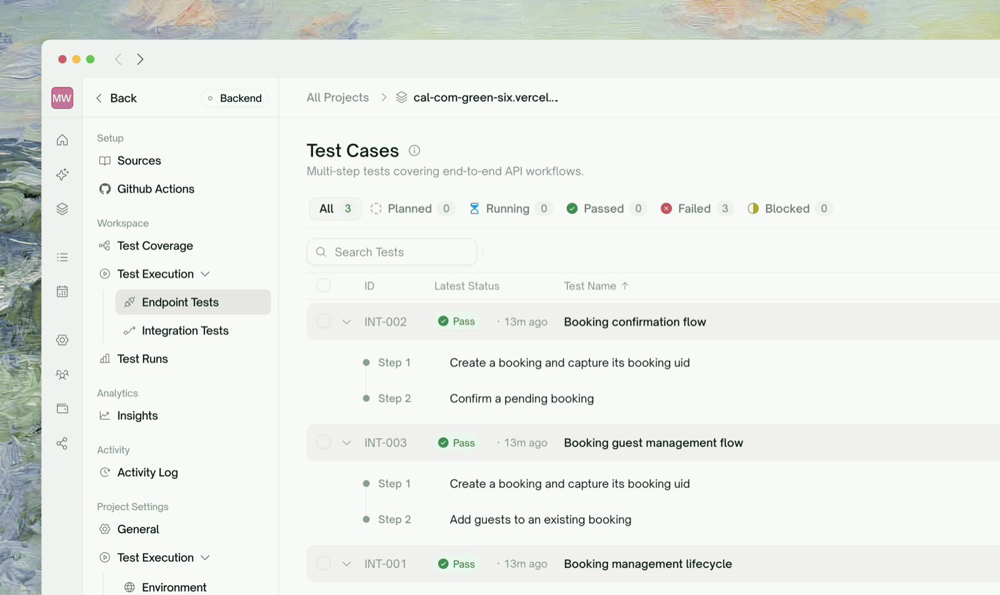
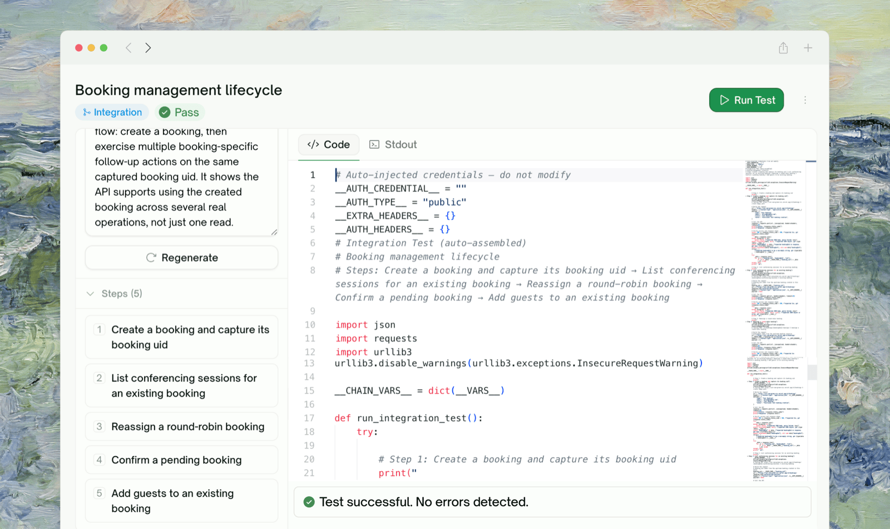
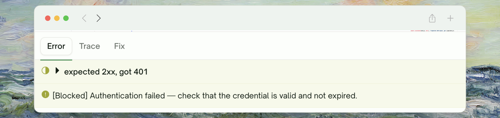

<Frame>
  
</Frame>

## What Integration Tests Are

An integration test runs a **sequence of endpoints** as one workflow, with each step using data from the one before:

```
POST /users        → create a user, capture user_id
POST /orders       → create an order for that user, capture order_id
GET  /orders/{id}  → confirm the order is retrievable
DELETE /orders/{id}→ cancel the order, confirm 204
```

TestSprite identifies these handoffs and runs the chain end to end as a single test. [Dynamic Variables](/web-portal/core/api/dynamic-variables) shows the captured values; [Dependency Chains](/web-portal/core/api/dependency-chains) explains how the run order is determined.

## Where Integration Tests Live in the UI

Integration tests have their own sidebar row, **Test Cases → Integration Tests**, next to **Endpoint Tests**. From there you can:

- Browse the auto-assembled chains and open any one to see its steps
- **Run all** chains from the toolbar, or open a chain and rerun it on its own
- Refine a chain in chat (add a step, drop a step, change the sequence)

## Why Integration Tests Matter

Endpoint tests verify each step in isolation; integration tests verify the **handoffs**. They catch the "individual endpoints work but the system doesn't" bugs:

| Failure mode | Caught by |
| :--- | :--- |
| GET /users returns a user with id `42` but POST /users created id `42a`-format strings | Integration |
| POST /orders silently strips the `metadata` field that GET /orders/{id} expects to round-trip | Integration |
| DELETE works, but the GET that follows still returns the record (eventual consistency bug) | Integration |
| The `order_id` field in POST /orders' response is named differently than what GET /orders/{id} needs as path param | Integration |

## Per-Chain View

Click into an integration test to see its detail page:

<Frame>
  
</Frame>

| Section | What you see |
| :--- | :--- |
| <kbd>Step list</kbd> | Each step with its method and path |
| <kbd>Stdout</kbd> | The full HTTP detail of each step's call, once the chain has run |
| <kbd>Chain-level error</kbd> | If the chain failed, where it broke and why |

## When a Chain Fails

Chains fail in three distinguishable ways:

<Frame>
  
</Frame>

| Failure shape | Meaning | Where to look |
| :--- | :--- | :--- |
| <kbd>Step N failed assertion</kbd> | Step N's HTTP call returned, but the assertion failed | Check step N's request/response in **Stdout** → refine or fix the API |
| <kbd>Step N TEST BLOCKED</kbd> | An upstream step (M before N) failed, so step N couldn't run | Fix step M first; step N runs automatically on rerun |
| <kbd>Variable not found</kbd> | Step N needs a value that wasn't produced by any earlier step | Refine in chat with a hint: "Make sure POST /users captures user_id" |

See [Endpoint Tests](/web-portal/core/api/endpoint-tests#test-outcomes) for how Blocked differs from Failed.

## Auto Cleanup Pairing

After every run or rerun, even a passing one, TestSprite removes the records your chains created (users, orders, sessions), so the next run starts from a known-empty state. See [Auto Cleanup](/web-portal/core/api/auto-cleanup).

UI testing has the same idea, a use case with multiple steps, but runs browser actions instead of HTTP calls. See [UI Testing](/web-portal/core/ui/ui-testing).

## Edge Cases & Troubleshooting

<AccordionGroup>
  <Accordion title="No integration tests were detected">
    Common when your API is mostly read-only or the initial plan had sparse hints. Re-run plan generation with a hint like "Generate integration chains that exercise create → read → update → delete on /orders", or ask for specific multi-step flows in chat.
  </Accordion>
  <Accordion title="A chain looks wrong — wrong order, missing steps">
    Open the chain and describe the right shape in chat: "The right order is POST /users → POST /sessions → POST /orders, not /users → /orders directly". TestSprite re-runs with the corrected sequence.
  </Accordion>
  <Accordion title="A chain runs N steps then says 'Variable not found'">
    A later step needs a value no earlier step provided. Common causes:
    - **Naming mismatch**: an earlier step produces `user_id` but the later step references `userId`. Refine in chat to align the names.
    - **Missing field**: the producer step Passed but its response didn't include the field. Check its response in **Stdout** and refine to capture from a different field.
  </Accordion>
  <Accordion title="My chain runs faster than my API can handle (eventual consistency)">
    Add a wait in chat: "After the POST step, wait 250ms before the GET".
  </Accordion>
  <Accordion title="A step passes on its own, but breaks the chain">
    The step has a side effect the chain didn't account for, such as leaving a session active. Refine the step to clean up after itself, or add an explicit cleanup step: "After the GET step, DELETE the session created in step 2".
  </Accordion>
</AccordionGroup>

## Where to Go Next

<Columns cols={2}>
  <Card title="Dynamic Variables" href="/web-portal/core/api/dynamic-variables" icon="brackets-curly">
    Where captured values surface in the UI
  </Card>
  <Card title="Dependency Chains" href="/web-portal/core/api/dependency-chains" icon="diagram-project">
    How run order is determined
  </Card>
  <Card title="Auto Cleanup" href="/web-portal/core/api/auto-cleanup" icon="broom">
    Records created during a run get deleted afterward
  </Card>
</Columns>
