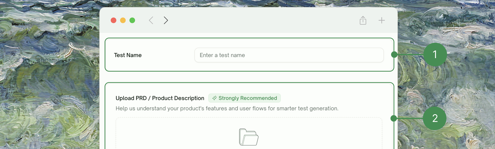
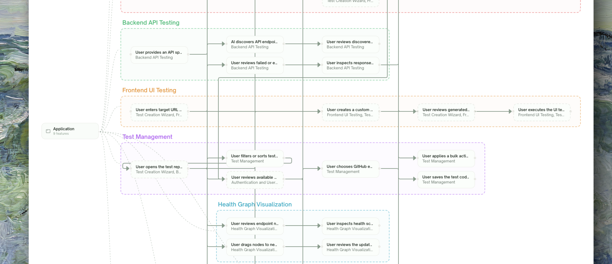
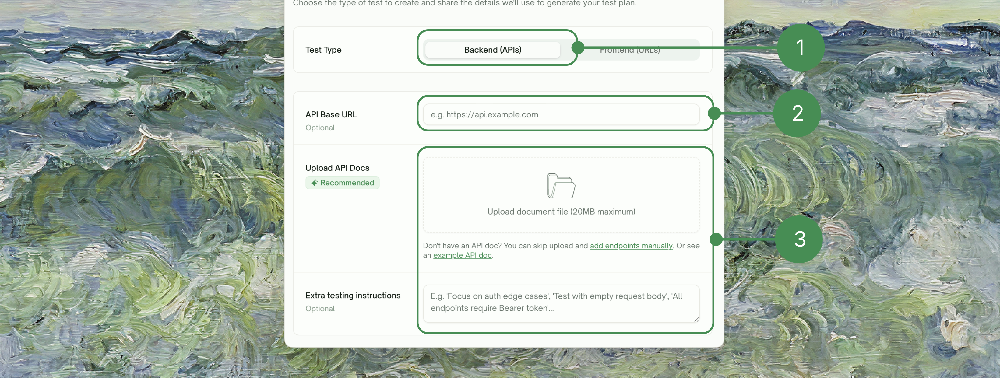
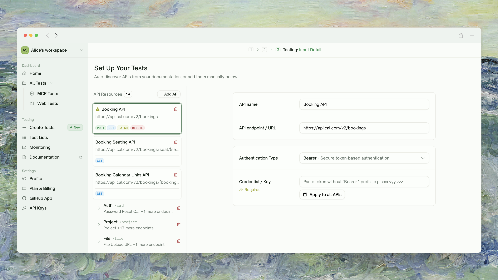
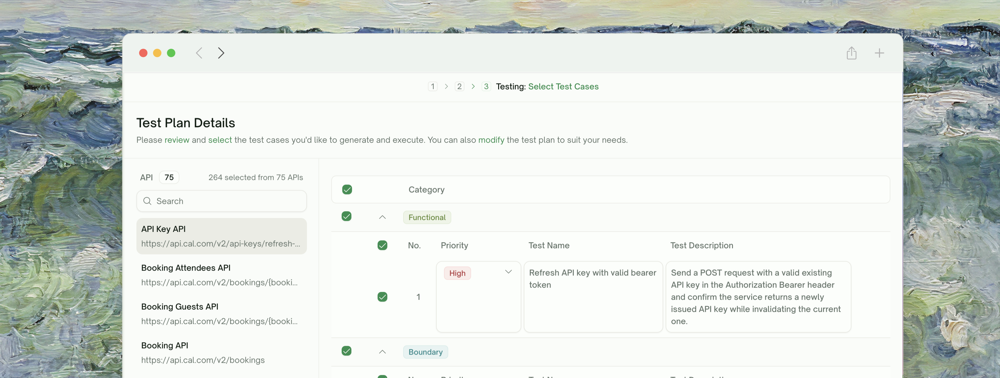
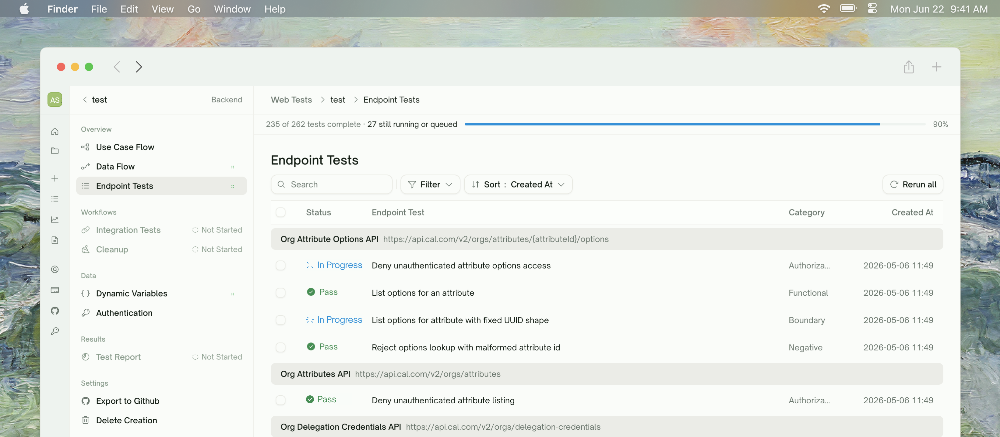
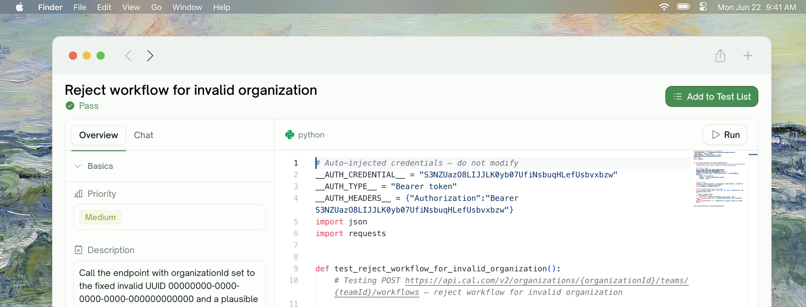
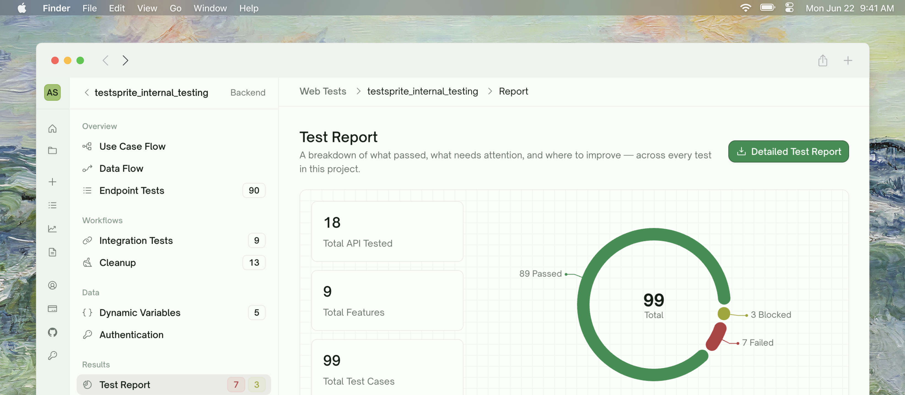

By the end of this guide you'll have an API project that's been discovered, planned, generated as Python tests, and executed against your live API, with full request/response capture for every call. No code on your side.

<Info>
**Doing UI testing instead?** See the [UI Quickstart](/web-portal/core/ui/quickstart) for the frontend-flavored walkthrough.
</Info>

## Step 1: Project Setup & PRD Upload

From the dashboard, click <kbd>Create Tests</kbd>. The first screen asks for two things only: a **project name** and your **PRD** (or any product-spec document — markdown, PDF, plain text all work).

<Frame>
  
</Frame>

<Tip>
**PRDs aren't only for UI.** They let plan generation scope tests to the *intent* of each endpoint, not just the shape from your OpenAPI spec — the difference between "covers `POST /orders`" and "covers the actual order-placement scenarios your product supports". Skip the PRD upload for a quick demo; for real coverage, upload one.
</Tip>

## Step 2: Feature & Use-Case Extraction

If you uploaded a PRD, TestSprite analyzes it and shows the **Use Cases & Features** screen with a flow graph of every feature it identified and the use cases under each.

<Frame>
  
</Frame>

This feature map is what grounds plan generation downstream — test cases get scoped to the use cases here. Click <kbd>Re-extract</kbd> to redo the analysis on the same PRD (e.g. after editing the file). Otherwise continue.

<Note>
If you skipped the PRD upload, this step is bypassed and the wizard goes straight to configuration.
</Note>

## Step 3: Choose Test Type and Configure

Pick the test type tab — <kbd>Backend (APIs)</kbd> for this API walkthrough — then provide your base URL, API documentation, auth type, and any extra testing instructions.

<Frame>
  
</Frame>

| Field | What to provide |
| :--- | :--- |
| <kbd>Base URL</kbd> | The base URL TestSprite will hit |
| <kbd>API Documentation</kbd> | OpenAPI / Swagger / Postman collections, or any free-form docs |
| <kbd>Authentication Type</kbd> | **Basic**, **Bearer**, **API-key**, or **None** — applied per API family |
| <kbd>Extra testing instructions</kbd> | Free-form hints — e.g. *"skip /admin"*, *"focus on the checkout flow"* |

<Tip>
The richer the input, the better the plan. Even a half-finished OpenAPI plus a paragraph of context outperforms a perfect spec with no hints.
</Tip>

Click <kbd>Parse with AI</kbd> at the bottom to start discovery. TestSprite reads your docs and confirms endpoint shapes against the live URL.

## Step 4: Review Discovered Endpoints

Once discovery completes, you'll see your endpoints grouped by resource family in an expandable table.

<Frame>
  
</Frame>

For each row you can:

- **Remove an endpoint** — Click the **×** at the end of the row. Useful for internal-only endpoints, deprecated paths, or anything outside your test scope.
- **Adjust the method or path** — Click the row to edit if the inferred path template is wrong.
- **Set the auth type per family** — Use the **Authentication Type** dropdown. Choices: **Basic**, **Bearer**, **API-key**, **None**.

If discovery missed an endpoint, click <kbd>Add Manually</kbd> at the bottom of the page (or use the inline link under the upload card) to add it by hand.

When you're satisfied, continue to plan generation.

## Step 5: Review and Adjust the Plan

TestSprite drafts a comprehensive plan organized by category — typically functional / happy path, authorization & auth, error handling & edge cases, and (where relevant) boundary / load and security probes. Categories are picked based on what each endpoint does.

<Frame>
  
</Frame>

Untick any tests that don't apply, tweak titles or descriptions in natural language, and click <kbd>Generate Tests</kbd>.

<Tip>
**Don't be precious about pruning.** Selecting all is usually right on a first run — you get full coverage. If a category produces too many tests for your liking, untick the ones you find low-value rather than disabling the whole category. The high-leverage tests in any category tend to be 60% of what's there.
</Tip>

## Step 6: Watch Tests Generate and Run

TestSprite generates a Python test per plan row, verifies each one before it lands in your suite, and executes them against your API. Tests stream into the project view as they finish.

<Frame>
  
</Frame>

Each row surfaces one of: <kbd>Pending</kbd>, <kbd>Running</kbd>, <kbd>Pass</kbd>, <kbd>Failed</kbd>, <kbd>Blocked</kbd>.

For multi-step workflows, TestSprite identifies which tests depend on each other and runs the chain in the right order — see [Dependency Chains](/web-portal/core/api/dependency-chains).

## Step 7: Review and Refine

Click any test row to open its detail page. You get the **request panel** (exact HTTP call we made), **response panel** (what your API returned), **error trace** (where the assertion failed), and an **AI cause-and-fix** suggestion for failures.

<Frame>
  
</Frame>

To iterate, use the <kbd>Chat</kbd> tab — describe what to fix in natural language. TestSprite either tweaks the assertions or regenerates the test.

The run-level **Test Report** rolls up pass / fail / blocked counts with cause-and-fix highlights — share that link with the team.

<Frame>
  
</Frame>

## Step 8: Cleanup Runs Automatically

After the run finishes, TestSprite removes the records your tests created (users, orders, sessions) so subsequent runs start fresh. The **Cleanup** tab shows what got deleted.

<Card title="Auto Cleanup" href="/web-portal/core/api/auto-cleanup" icon="broom">
  How records created during a run get removed afterward
</Card>

## Step 9: Rerun and Schedule

To re-execute, use <kbd>Rerun</kbd> on a single test or <kbd>Rerun all</kbd> on the project toolbar. The **Skip dependencies** toggle in the rerun dialog lets you re-execute one test in isolation against cached upstream values — fast iteration when you've just refined an assertion.

<CardGroup cols={2}>
  <Card title="Rerun" href="/web-portal/core/api/api-rerun" icon="arrow-rotate-right">
    Single test, batch, scheduled — and when to skip dependencies
  </Card>
  <Card title="Auto-Auth (Pro)" href="/web-portal/core/api/auto-auth" icon="arrows-rotate">
    Auto-refresh login tokens before every run
  </Card>
</CardGroup>

## Where to Go Next

<Columns cols={2}>
  <Card title="API Discovery" href="/web-portal/core/api/api-discovery" icon="magnifying-glass">
    Deep dive on the discovery phase
  </Card>
  <Card title="Plan Generation & Editing" href="/web-portal/core/api/api-plan-gen" icon="list-check">
    The mechanics of plan review
  </Card>
  <Card title="Integration Tests" href="/web-portal/core/api/integration-tests" icon="link">
    Multi-step workflows that chain endpoints
  </Card>
  <Card title="Schedule Monitoring" href="/web-portal/maintenance/monitoring" icon="clock">
    Run on a cadence to catch regressions
  </Card>
</Columns>
