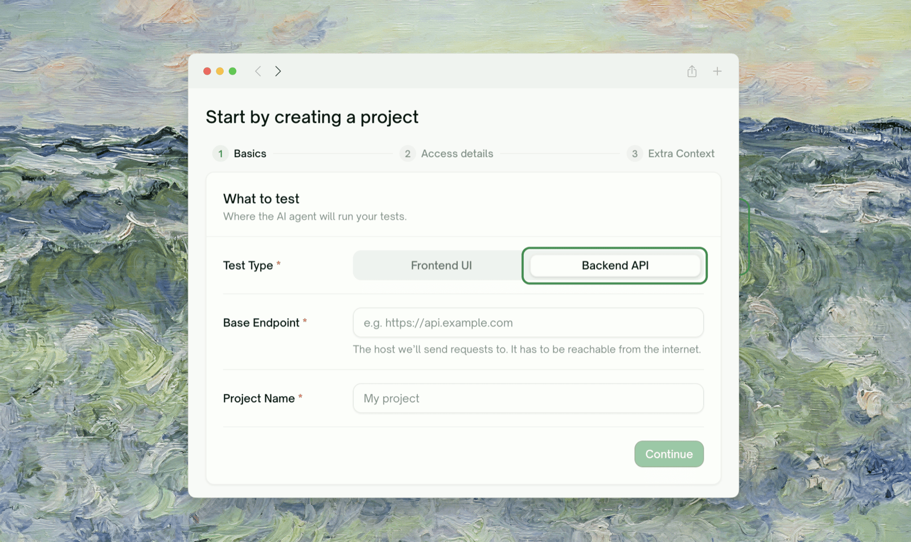
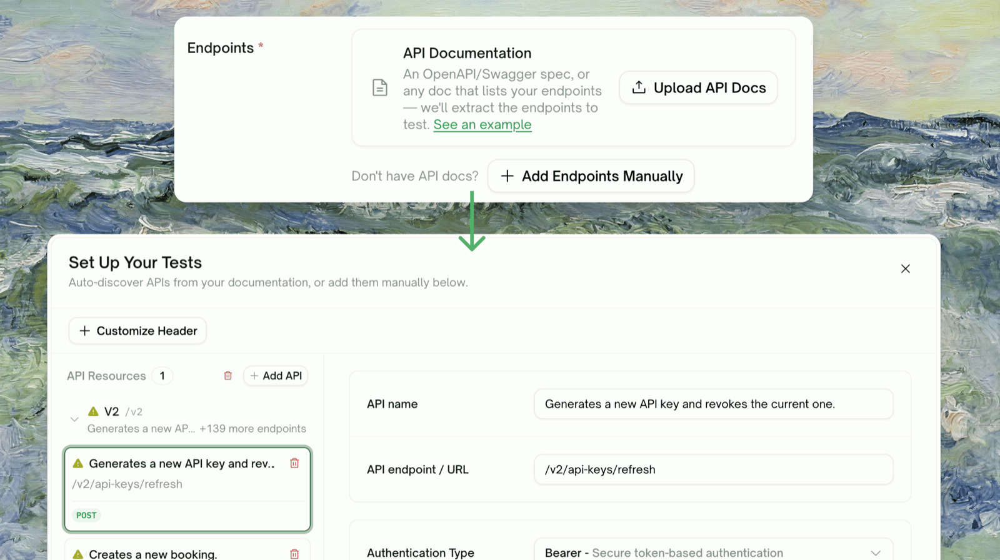
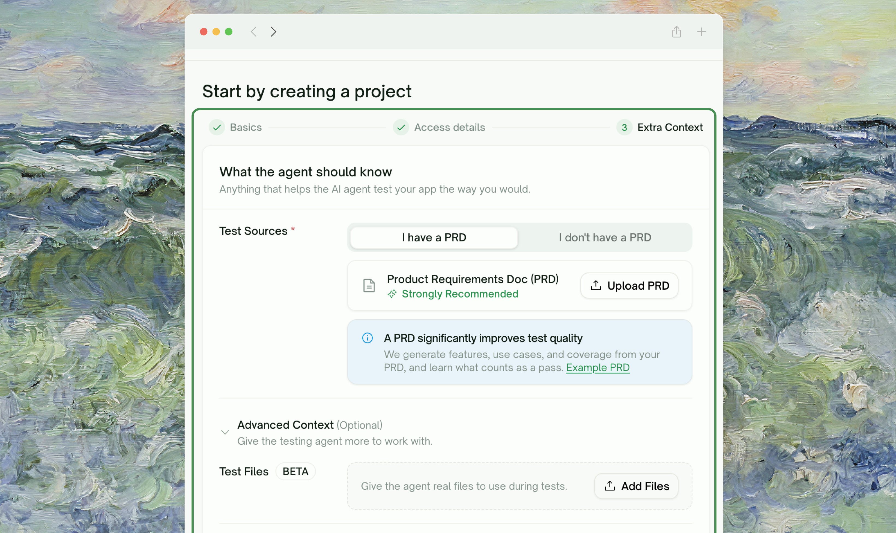
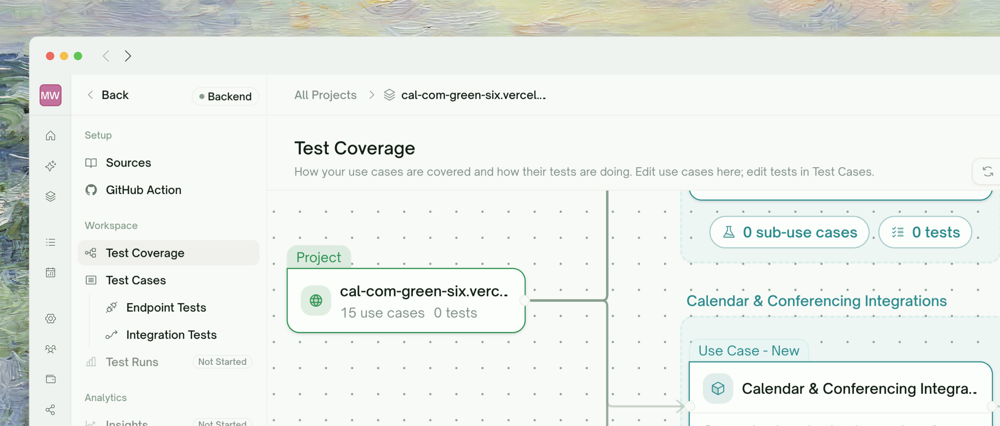
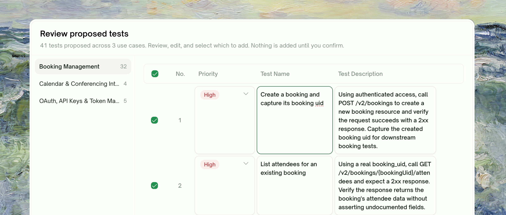
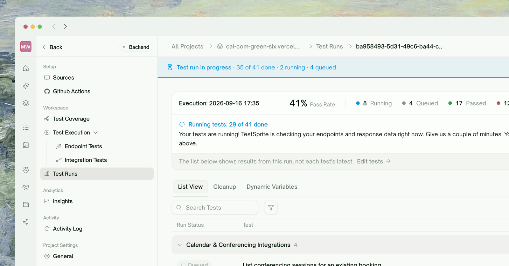
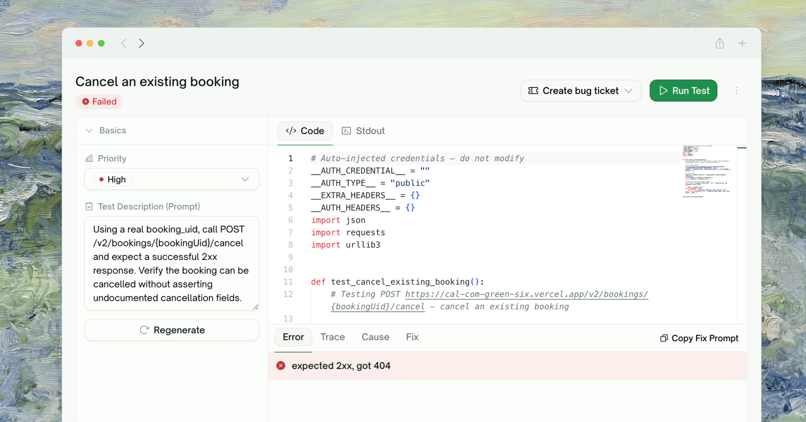

By the end of this guide you'll have an API project that's been discovered, planned, generated as Python tests, and executed against your live API, with full request/response capture for every call. No code on your side.

<Info>
**Doing UI testing instead?** See the [UI Quickstart](/web-portal/core/ui/quickstart) for the frontend-flavored walkthrough.
</Info>

## Step 1: Project Setup

From **All Projects**, click <kbd>New Project</kbd>. The form has three steps: **Basics**, **Access details**, and **Extra Context**. On **Basics**, pick the **Test Type** (<kbd>Backend API</kbd> for this API walkthrough), then provide your **Base Endpoint** and a **project name**.

<Frame>
  
</Frame>

## Step 2: Review Discovered Endpoints

On **Access details**, click <kbd>Upload API docs</kbd> (OpenAPI / Swagger / Postman collections, or any free-form docs). Discovery starts as soon as the file is uploaded: TestSprite reads your docs and confirms endpoint shapes against the live URL.

Once discovery completes, you'll see your endpoints grouped by resource family in the **Set Up Your Tests** dialog.

<Frame>
  
</Frame>

For each row you can:

- **Remove an endpoint**: Click the trash icon on the row. Useful for internal-only endpoints, deprecated paths, or anything outside your test scope.
- **Adjust the path**: Click the row to edit if the inferred path template is wrong.
- **Set the auth type per endpoint**: Use the **Authentication Type** dropdown. Choices: **Basic**, **Bearer**, **API-key**, **None**.

If discovery missed an endpoint, click <kbd>Add API</kbd> in the dialog to add it by hand (with no docs at all, use <kbd>Add Endpoints Manually</kbd> on **Access details** instead).

When you're satisfied, click <kbd>Save N endpoints</kbd> and continue to **Extra Context**.

<Tip>
The richer the input, the better the plan. Even a half-finished OpenAPI plus a paragraph of context outperforms a perfect spec with no hints.
</Tip>

## Step 3: PRD Upload & Extra Instructions

On **Extra Context**, choose <kbd>I have a PRD</kbd> and upload your **PRD** (or any product-spec document; markdown, PDF, and plain text all work). Add any <kbd>Extra Instructions</kbd> (e.g. *"skip /admin"*, *"focus on the checkout flow"*), then click <kbd>Create project</kbd>.

<Frame>
  
</Frame>

<Tip>
**PRDs aren't only for UI.** They let plan generation scope tests to the *intent* of each endpoint, not just the shape from your OpenAPI spec — the difference between "covers `POST /orders`" and "covers the actual order-placement scenarios your product supports". Skip the PRD upload for a quick demo; for real coverage, upload one.
</Tip>

## Step 4: Feature & Use-Case Extraction

The new project opens on **Test Coverage**. If you uploaded a PRD (or API docs), TestSprite analyzes it and shows a flow graph of every feature it identified and the use cases under each.

<Frame>
  
</Frame>

This feature map is what grounds plan generation downstream: test cases get scoped to the use cases here. Click <kbd>Regenerate from sources</kbd> to redo the analysis (e.g. after editing the file). Otherwise continue.

## Step 5: Review and Adjust the Plan

Click <kbd>Plan Tests</kbd>. TestSprite drafts a comprehensive plan organized by use case, covering categories: typically functional / happy path, authorization & auth, error handling & edge cases, and (where relevant) boundary / load and security probes. Categories are picked based on what each endpoint does.

<Frame>
  
</Frame>

Untick any tests that don't apply, tweak titles or descriptions in natural language, and click <kbd>Run all</kbd>.

<Tip>
**Don't be precious about pruning.** Selecting all is usually right on a first run, since you get full coverage. If a use case produces too many tests for your liking, untick the ones you find low-value rather than disabling the whole use case. The high-leverage tests in any use case tend to be 60% of what's there.
</Tip>

## Step 6: Watch Tests Generate and Run

TestSprite generates a Python test per plan row, verifies each one before it lands in your suite, and executes them against your API. Tests stream into the project view as they finish.

<Frame>
  
</Frame>

Each row surfaces one of: <kbd>Planned</kbd>, <kbd>Running</kbd>, <kbd>Passed</kbd>, <kbd>Failed</kbd>, <kbd>Blocked</kbd>.

For multi-step workflows, TestSprite identifies which tests depend on each other and runs the chain in the right order — see [Dependency Chains](/web-portal/core/api/dependency-chains).

## Step 7: Review and Refine

Click any test row to open its detail page. You get the generated **Code**, its **Stdout** (the HTTP calls we made and what your API returned), **error trace** (where the assertion failed), and an **AI cause-and-fix** suggestion for failures.

<Frame>
  
</Frame>

To iterate, edit the test description and click <kbd>Regenerate</kbd>. TestSprite regenerates the test from your wording.

The run-level **Test Report** rolls up pass / fail / blocked counts with cause-and-fix highlights — share that link with the team.

<Frame>
  
</Frame>

## Step 8: Cleanup Runs Automatically

After the run finishes, TestSprite removes the records your tests created (users, orders, sessions) so subsequent runs start fresh. The **Cleanup** tab shows what got deleted.

<Card title="Auto Cleanup" href="/web-portal/core/api/auto-cleanup" icon="broom">
  How records created during a run get removed afterward
</Card>

## Step 9: Rerun and Schedule

To re-execute, use <kbd>Run test</kbd> on a single test or <kbd>Run all</kbd> on the **Test Cases** toolbar.

<CardGroup cols={2}>
  <Card title="Rerun" href="/web-portal/core/api/api-rerun" icon="arrow-rotate-right">
    Single test, batch, scheduled
  </Card>
  <Card title="Auto-Auth" href="/web-portal/core/api/auto-auth" icon="arrows-rotate">
    Auto-refresh login tokens before every run
  </Card>
</CardGroup>

## Where to Go Next

<Columns cols={2}>
  <Card title="API Discovery" href="/web-portal/core/api/api-discovery" icon="magnifying-glass">
    Deep dive on the discovery phase
  </Card>
  <Card title="Plan Generation & Editing" href="/web-portal/core/api/api-plan-gen" icon="list-check">
    The mechanics of plan review
  </Card>
  <Card title="Integration Tests" href="/web-portal/core/api/integration-tests" icon="link">
    Multi-step workflows that chain endpoints
  </Card>
  <Card title="Test Schedules" href="/web-portal/maintenance/monitoring" icon="clock">
    Run on a cadence to catch regressions
  </Card>
</Columns>
