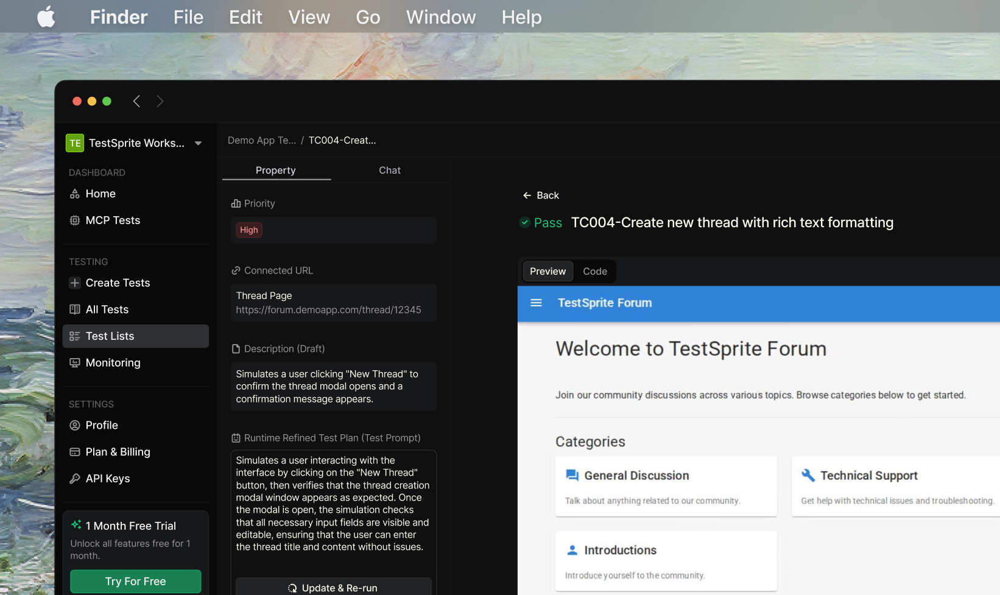
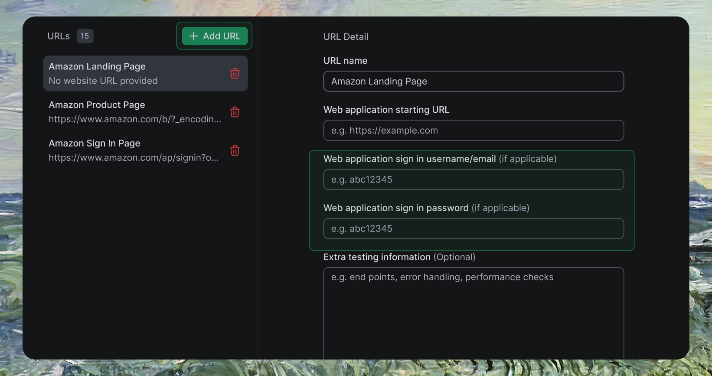
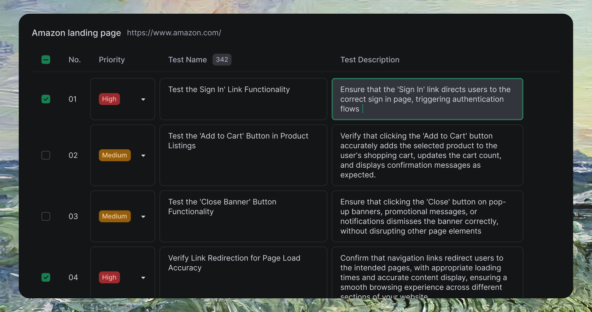
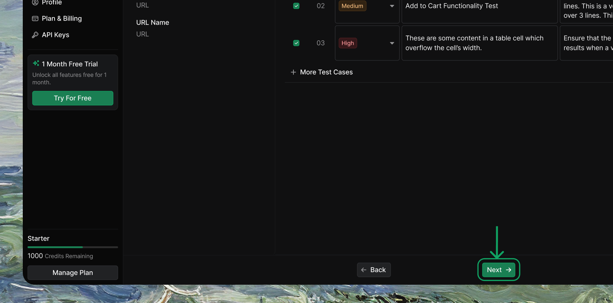
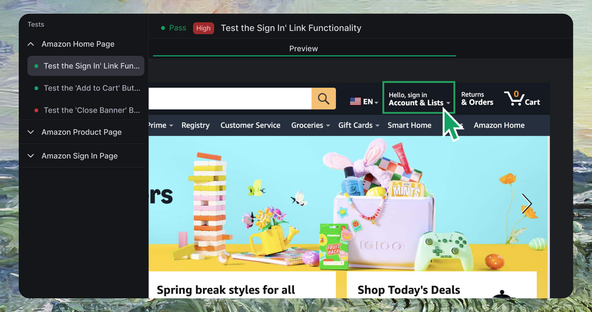
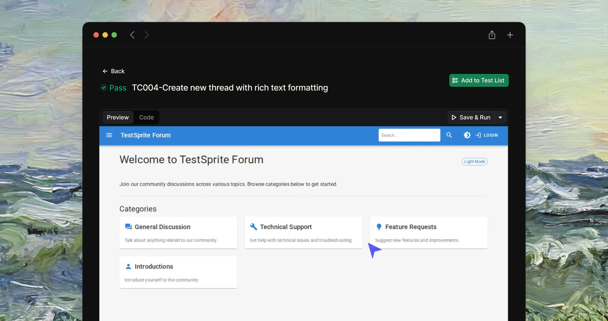
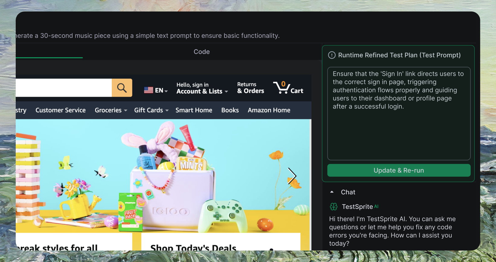

      <Frame>
      
      </Frame>

### Key Features

| Feature | Description |
| :--- | :--- |
| <kbd>Fast Setup</kbd> | Get started in minutes with minimal configuration. Just provide your website URLs and let our AI agent handle the rest |
| <kbd>AI-Generated Test Cases</kbd> | Dynamically creates intelligent test plans tailored to your product's content and edge cases with full customization control |
| <kbd>Smart Video Playback</kbd> | Every interaction is recorded and replayable—see exactly how tests run and spot UI issues visually |
| <kbd>Live Test Preview</kbd> | Watch test execution unfold in real-time to catch potential issues instantly |
| <kbd>Actionable Reports</kbd> | Detailed execution reports with error analysis, root cause identification, and AI-suggested fixes |
| <kbd>Natural Language Control</kbd> | Refine tests using plain English—no code required for tweaking scenarios or adding edge cases |

<Info>
**Bonus:** TestSprite automatically generates reusable Python + Playwright test code perfect for CI/CD pipelines and regression testing.
</Info>


## Getting Started


To begin using TestSprite for front-end testing, follow these steps:


### Step 1: Set Up Your Front-End Testing Environment
<br />
      <Frame>
      
      </Frame>
<Steps>
  <Step title="Access TestSprite Dashboard">
    Navigate to [TestSprite Dashboard  <Icon icon="arrow-up-right-from-square" size={12} />](https://www.testsprite.com/dashboard/testing) and click <kbd>Create a Test</kbd> from the sidebar
  </Step>
  <Step title="Enter Application Details">
    Provide your web application URL and optional authentication credentials
  </Step>
  <Step title="Add Testing URLs">
    Include additional pages you want to test within the same flow
  </Step>
  <Step title="Special Instructions (Optional)">
    Add specific testing requirements to help AI generate more accurate test plans
  </Step>
</Steps>


<Accordion title="Example Application Configuration">
```json
{
  "Web application starting URL": "https://www.example.com",
  "Web application sign in username/email (optional)": "user@example.com", 
  "Web application sign in password (optional)": "password123"
}
```
</Accordion>

### Step 2: Configure Test Plans
<br />
      <Frame>
      
      </Frame>

<Steps>
  <Step title="Review AI-Generated Test Plan">
    Review the draft test plan tailored to your UI with end-to-end scenarios
  </Step>
  <Step title="Select & Modify Scenarios">
    Choose test scenarios to execute and modify descriptions to match your requirements
  </Step>
</Steps>


<Accordion title="Example Test Scenarios Generated by AI">
- **Test the 'Log In' Link Functionality**  
  Ensure login link directs users to correct page and handles authentication properly

- **Test the 'Add to Cart' Button**  
  Verify cart button adds products, updates cart count, and shows confirmation messages

- **Test the 'Close Banner' Button**  
  Ensure banner close buttons dismiss properly without disrupting other elements

- **Verify Link Redirection Accuracy**  
  Confirm navigation links redirect to intended pages with proper loading and content
</Accordion>

<Info>
Our AI may further refine test plans after performing real-time analysis of your application during execution.
</Info>

### Step 3: Run Your Tests


    <Frame>
    
    </Frame>

<Steps>
  <Step title="Start Test Execution">
    Click <kbd>Next</kbd> to begin generating and executing your selected test cases
  </Step>
  <Step title="Monitor Web Preview">
    Watch real-time test execution through the Web Preview feature
  </Step>
  <Step title="Automatic Validation">
    TestSprite validates UI interactions and generates detailed results automatically
  </Step>
</Steps>


### Step 4: Review Test Results

<br />
    <Frame>
    
    </Frame>

<Steps>
  <Step title="Access Detailed Report">
    TestSprite provides comprehensive test results with visual insights
  </Step>
  <Step title="Analyze Results">
    Review test outcomes, errors, and performance metrics for your UI
  </Step>
</Steps>


## Advanced Features

### Web Preview for Context


TestSprite includes a Web Preview feature that allows you to visualize the testing process

    <Frame>
    
    </Frame>

- Watch as each element is interacted with on your web page
- Understand how the page responds to various actions  
- Quickly identify UI issues that might otherwise be missed


### Using Natural Language to Refine and Regenerate Tests

Refine tests using plain English—no technical configuration required.

    <Frame>
    
    </Frame>


<Tabs>
  <Tab title="How it works">
    1. Edit the test description in plain language
    2. TestSprite automatically regenerates the test
  </Tab>
  <Tab title="Example">
    ```
    Original: "Test login functionality"

    Refined: "Ensure the Sign In link directs users to the login page and guides them to their dashboard after successful authentication."
    ```
  </Tab>
</Tabs>