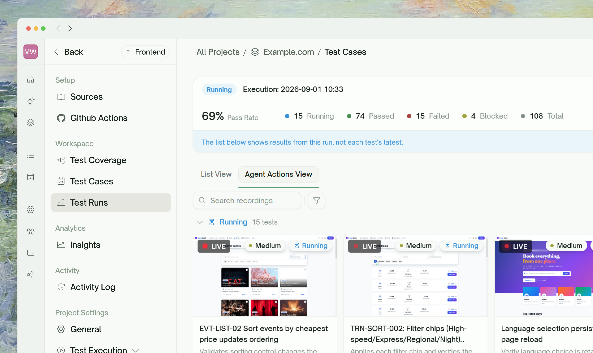
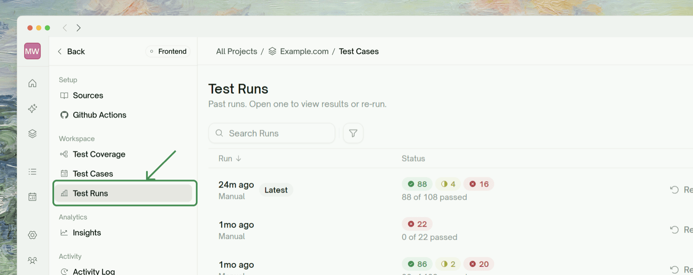
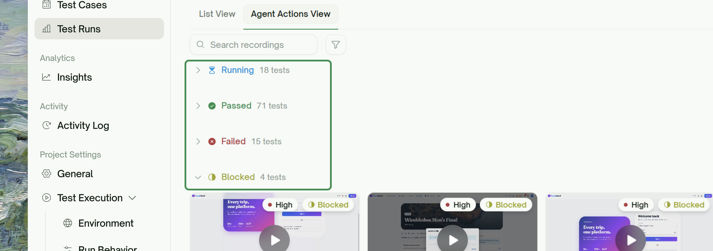

<Frame>
  
</Frame>

## What Agent Actions Is

One of two ways to look at a **single test run's** results — as video tiles instead of a list. Each tile is the recording TestSprite captured while walking through one test case in that run. The recording itself *is* the action log: click X, type Y, navigate to Z, all captured as video.

<Info>
This is UI-only. API projects don't have it (HTTP requests don't need to be filmed; their request/response bodies are the equivalent artifact).
</Info>

<Tabs>
  <Tab title="Where it lives">
    Open <kbd>Test Runs</kbd> in the project sidebar and click into a specific run.
    <Frame>
      
    </Frame>

    Inside that run, two tabs show the same results two ways. The header above both shows that run's live stats (Pass Rate, and Running / Passed / Failed / Blocked / Total counts), which keep updating while the run is still going.

    <Tabs>
      <Tab title="List View">
        <Frame>
          
        </Frame>
      </Tab>
      <Tab title="Agent Actions View">
        <Frame>
          
        </Frame>
      </Tab>
    </Tabs>
  </Tab>
  <Tab title="When you'll use it">
    - **Replay a failing test** to see exactly what happened on screen
    - **Hand a recording to a teammate** instead of describing the bug in chat
    - **Audit this run** at a glance, filtered to just Failed
    - **Spot-check passing tests** when something looks off in the report numbers
  </Tab>
</Tabs>

<Note>
The tiles show **this run's** results, not each test's latest. If a test was re-run individually after this run finished, its newer result lives on that test's own page — this view stays frozen to what happened in this specific execution.
</Note>

## How the Gallery Is Organized

Tiles are bucketed by status into collapsible sections, each showing its count in the header:

| Bucket | What's in it |
| :--- | :--- |
| <kbd>Running</kbd> | Tests still in progress — only shown while the run is still going |
| <kbd>Passed</kbd> | Tests whose run finished and assertions held |
| <kbd>Failed</kbd> | Tests whose run finished and assertions didn't hold |
| <kbd>Blocked</kbd> | Tests that couldn't complete — idle, or anything that didn't resolve to Pass / Fail |

<Frame>
  
</Frame>

A tile still inside **Running** shows a **LIVE** badge over a live thumbnail once its recording actually starts, or a **Starting…** placeholder before that. A finished tile shows the recording thumbnail, the test title, a priority chip, and a status badge — Blocked and Failed tiles also carry a short diagnosis line under the description (e.g. *"The hosting side is likely serving a…"*). Clicking a finished tile opens an inline player.

<Note>
**Tiles need a recording to appear.** Tests that ran but didn't produce a video (rare — typically a vendor-side recording timeout) are excluded from the gallery. They're still visible in the **Integration Tests** list.
</Note>

## Search and Filter

The toolbar above the gallery has:

- **Search** — matches against the test title and description (case-insensitive)
- **Status filter** — Passed / Failed / Blocked
- **Priority filter** — High / Medium / Low

Filters are independent and clearable individually. The bucket sections re-render to show only matching tiles.

## What You'll See While a Run Is Still Going

<Tabs>
  <Tab title="No tiles yet">
    The run just started, no test has produced a recording yet. Tiles trickle in as each test starts and finishes.
  </Tab>
  <Tab title="Some tiles, more coming">
    Tests still going sit in the **Running** bucket — **Starting…** before the recording begins, then a **LIVE** thumbnail once it does. As each finishes, its tile moves into Passed / Failed / Blocked, and the stats header updates live.
  </Tab>
</Tabs>

## Agent Actions vs. Step-by-Step

Both are visual replay tools, but at different scopes:

| | Agent Actions | Step-by-Step Walkthrough |
| :--- | :--- | :--- |
| **Scope** | This run — every test's recording in that execution, as tiles | Per-test — a single test's run, one step at a time |
| **Primary artifact** | Video tile | Per-step screenshots + recorded video |
| **Surface area** | Browse / filter / triage this run at a glance | Drill into one test's flow + assertions |
| **When to use** | "Show me everything that failed in this run" | "What exactly happened on step 4 of this test?" |

Both pull from the same recordings — Agent Actions is the index, Step-by-Step is the inspector.

<Card title="Step-by-Step Walkthrough" href="/web-portal/core/ui/ui-step-by-step" icon="list-check">
  Per-step screenshots, video, and behavior trace for a single test
</Card>

## Edge Cases & Troubleshooting

<AccordionGroup>
  <Accordion title="A failed test has no recording in the gallery">
    The recording wasn't captured for this run — rare, typically a transient hiccup. Rerun the test; subsequent recordings land in the gallery normally. The original failure is still visible in this run's **List View**; the gallery just hides tiles with no playable video.
  </Accordion>
  <Accordion title="Tile opens but the video won't play">
    Usually a stale playback link. Refresh the page; the link is regenerated on every load.
  </Accordion>
  <Accordion title="Playing a recording counts against credits?">
    No. Recordings are static artifacts; playback doesn't trigger any agent activity. Only re-running the test consumes credits.
  </Accordion>
</AccordionGroup>

## Where to Go Next

<Columns cols={2}>
  <Card title="Step-by-Step Walkthrough" href="/web-portal/core/ui/ui-step-by-step" icon="list-check">
    Drill into a single test's run
  </Card>
  <Card title="Test Detail" href="/web-portal/core/working-with-test/test-detail" icon="file-circle-info">
    Everything else available once you open a test run
  </Card>
  <Card title="Rerun" href="/web-portal/core/ui/ui-rerun" icon="arrow-rotate-right">
    Trigger a fresh run when a recording shows the wrong behavior
  </Card>
  <Card title="Refining Tests" href="/web-portal/core/working-with-test/refining-tests" icon="pen-to-square">
    Iterate on a test in natural language after watching its recording
  </Card>
</Columns>
