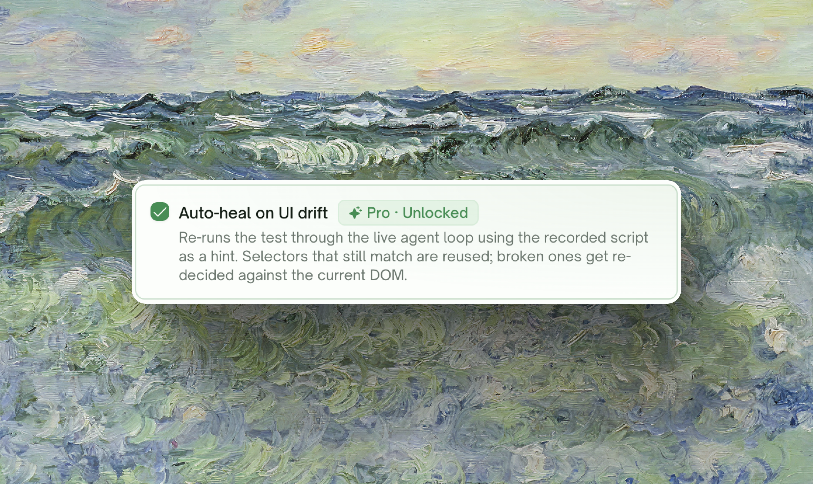
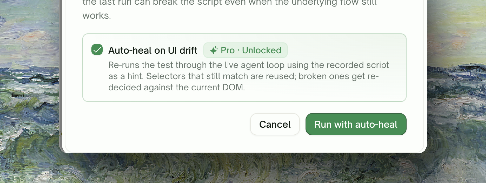

<Frame>
  
</Frame>

## Two Ways UI Tests Fail on Rerun

When you rerun a UI test that previously passed, two things can have changed since the last run:

| Failure mode | What it looks like |
| :--- | :--- |
| <kbd>UI moved, flow still correct</kbd> | A button got renamed, a form got an extra field, a sidebar got reordered. The test fails even though there's nothing actually broken in your product. |
| <kbd>The flow itself is broken</kbd> | Real bug. The test catching it is the point. |

A plain rerun can't tell these apart. **Auto-Heal** is what tells them apart — it lets the test recover from the first kind, while the second kind still fails (which is what you want).

<Info>
**Auto-Heal is a Pro feature** (Starter and Standard). Free-plan users still have full access to plain rerun and scheduled rerun — the auto-heal toggle is shown but locked, with the upgrade pathway in plain sight. See [Rerun](/web-portal/core/ui/ui-rerun) for plain replay.
</Info>

## What Happens When You Turn Auto-Heal On

<Frame>
  
</Frame>

| Auto-Heal toggle | Behavior |
| :--- | :--- |
| <kbd>Off</kbd> | TestSprite runs your saved test. If the page changed in a way that breaks the test, you get a Failed status — the test won't pass until you fix it manually. |
| <kbd>On</kbd> | TestSprite runs your saved test. If the page changed but the underlying flow still works, the test recovers and is marked **Passed** with a note that auto-heal succeeded. If the flow itself is broken, the test stays Failed (correctly). |

Net effect: tests that used to break on every UI tweak now stay green through refactors, design system swaps, and copy edits — without anyone editing the test by hand. Real bugs still surface as Failed.

## Turning Auto-Heal On

Auto-Heal opts in at the rerun-trigger level — there's no project-level setting. Three places carry the toggle, and each remembers its own choice:

| Surface | Where the toggle lives |
| :--- | :--- |
| <kbd>Single test rerun</kbd> | The **Rerun this test** confirmation dialog has an **Auto-heal on UI drift** toggle. Choose per rerun. |
| <kbd>Rerun all (batch)</kbd> | The batch confirmation dialog carries the same toggle; it applies to every test in the batch. |
| <kbd>Scheduled runs</kbd> | The schedule creation page has an **Enable auto-heal** toggle saved with the schedule. Set once at creation; subsequent runs use it automatically. |

<Frame>
  
</Frame>

<Card title="Rerun" href="/web-portal/core/ui/ui-rerun" icon="arrow-rotate-right">
  Full mechanics of rerun itself — where the buttons are, the difference between Run and Save & Run, and Quick Start
</Card>

## When Auto-Heal Helps and When It Doesn't

<AccordionGroup>
  <Accordion title="Helps: minor UI refactor that moves things around" icon="circle-check">
    Renamed buttons (`Submit` → `Save`), restructured navigation (sidebar moved into a hamburger), added a wrapper element around a form field. The flow you're testing still works; only the references to the page are stale. Auto-Heal recovers most of these.
  </Accordion>
  <Accordion title="Helps: design system swap on a page you didn't think about" icon="circle-check">
    A team replaced a custom dropdown with a shadcn `Select`. Component API changed, DOM changed, accessibility roles changed — pure refactor. Auto-Heal re-binds the test to the new component without anyone hand-editing it.
  </Accordion>
  <Accordion title="Helps: copy edit you didn't think tests would care about" icon="circle-check">
    "Continue" became "Next" on the wizard step. Anything matching by text content breaks on plain replay. Auto-Heal sees the rename in context and continues.
  </Accordion>
  <Accordion title="Doesn't help: actual product bug" icon="circle-xmark">
    The form is broken — a required field always rejects valid input, an API endpoint returns 500, the redirect goes to the wrong page. Auto-Heal will try to recover and won't be able to; the test stays Failed. **This is the correct outcome** — Auto-Heal is not "make tests pass". It's "absorb UI drift, surface real bugs."
  </Accordion>
  <Accordion title="Doesn't help: feature was removed" icon="circle-xmark">
    The flow the test was checking has been intentionally deleted (rather than refactored). The test should be removed from your suite, not healed. Auto-Heal can't tell intentional removal from regression — it'll fail the test, and you can clean up.
  </Accordion>
  <Accordion title="Doesn't help: long auth/onboarding gate" icon="circle-xmark">
    If the test only runs after a multi-step login + onboarding sequence and that sequence itself broke, recovery work hits the broken gate before reaching the actual flow. **Use [Auto-Auth](/web-portal/core/api/auto-auth) for backend tests; for UI tests, make sure your test account stays in a known state.**
  </Accordion>
</AccordionGroup>

## Free vs Pro Behavior

| | Free plan | Starter / Standard |
| :--- | :--- | :--- |
| Plain rerun | <Icon icon="check" /> | <Icon icon="check" /> |
| Rerun all | <Icon icon="check" /> | <Icon icon="check" /> |
| Scheduled reruns | <Icon icon="check" /> | <Icon icon="check" /> |
| Auto-Heal toggle | <Icon icon="lock" /> Visible, locked, leads to upgrade | <Icon icon="check" /> Toggleable per rerun |
| Recovery on UI drift | <Icon icon="xmark" /> | <Icon icon="check" /> |

<Note>
**Why the toggle is shown to free users.** Hiding the auto-heal toggle entirely from free-plan users would make the feature invisible — they'd never discover it. We render it locked with a **Pro** badge plus the helper copy that explains what they'd unlock by upgrading. The same pattern applies on the schedule creation page.
</Note>

## Cost and Credits

Auto-Heal **only consumes extra credits when recovery actually does work** — i.e. when your test would otherwise have failed and Auto-Heal saved it. Tests that pass on plain replay cost the same as a regular rerun; nothing extra is billed.

<Tip>
**Realistic napkin math**: if your nightly schedule has 50 tests and historically 5 fail per night because of UI drift, opt-in auto-heal costs extra only for those 5 recoveries. The other 45 are pure replay cost. Compared to triaging 5 false-positive failures by hand each morning, Auto-Heal usually pays for itself within a week of cadence.
</Tip>

<Info>
The **Credits Remaining** counter on your wizard / billing page reflects all of this. There's no separate "auto-heal credits" budget — recovery deducts from your normal monthly credit allowance.
</Info>

## Why Frontend-Only

Auto-Heal applies only to UI (frontend) tests. **Backend tests don't need it** — they run by issuing HTTP requests to your API, which doesn't drift in the same way a UI does. Routes don't subtly change without an explicit API version bump.

When backend tests fail on rerun, the cause is almost always one of these — and the right tool is the corresponding feature:

<CardGroup cols={3}>
  <Card title="Endpoint behaves differently" href="/web-portal/core/working-with-test/test-detail" icon="bug">
    A real bug. Investigate via the test detail page — the failing assertion plus the recorded request/response usually tells you what changed.
  </Card>
  <Card title="Auth token expired" href="/web-portal/core/api/auto-auth" icon="arrows-rotate">
    Configure **Auto-Auth** so a fresh token is fetched before every run.
  </Card>
  <Card title="Required fixture was deleted" href="/web-portal/core/api/auto-cleanup" icon="broom">
    Check **Auto Cleanup** and your dependency chains — a producer's record may have been removed before its consumer ran.
  </Card>
</CardGroup>

## Edge Cases & Troubleshooting

<AccordionGroup>
  <Accordion title="Auto-Heal recovered the test but I want to know what changed">
    Open the test detail page and look at the **Steps** panel inside the **Overview** tab. Steps that were re-decided during recovery are flagged. Your saved test stays the persisted source of truth — Auto-Heal doesn't overwrite it unless you explicitly save updates (currently a manual operation).
  </Accordion>
  <Accordion title="The test always fails on rerun, even though I just regenerated it">
    Rerun replays the *saved* test. If you regenerated through Refining or a fresh generation, the saved version may be stale relative to your latest plan. Try a regular Run (not Rerun) to overwrite the saved artifact, then Rerun.
  </Accordion>
  <Accordion title="My scheduled run uses auto-heal but I'm not on a Pro plan anymore">
    The schedule's **Enable auto-heal** flag stays saved on the schedule, but your tier is re-checked on every run. If you've downgraded, scheduled runs still execute as plain reruns. Re-upgrade and the next run picks up Auto-Heal again automatically.
  </Accordion>
  <Accordion title="Can I auto-heal an integration (multi-step) UI test?">
    Yes — recovery covers the entire step sequence, not just the failing step. Steps that still work get reused; broken steps get re-decided in context.
  </Accordion>
  <Accordion title="The auto-heal toggle is locked even though I just upgraded">
    The tier check uses the value from your most recent Plan & Billing change. If you just upgraded, refresh the page so it picks up your new plan. If it's still locked after a refresh, log out and back in.
  </Accordion>
  <Accordion title="What happens if recovery itself errors out (network, transient failure)?">
    The test is marked Failed with the last-known error in the **Error / Trace / Fix** tabs of the test detail page. Re-click Rerun to try again. If recovery consistently errors out on a test, [contact support](https://discord.gg/QQB9tJ973e) with the test ID.
  </Accordion>
</AccordionGroup>

## Where to Go Next

<Columns cols={2}>
  <Card title="Rerun" href="/web-portal/core/ui/ui-rerun" icon="arrow-rotate-right">
    The rerun surfaces themselves — single, batch, scheduled
  </Card>
  <Card title="Schedule Monitoring" href="/web-portal/maintenance/monitoring" icon="clock">
    Set up nightly schedules with auto-heal turned on
  </Card>
  <Card title="Comparing Runs" href="/web-portal/maintenance/comparing-runs" icon="code-compare">
    Diff two runs to see what changed step-by-step
  </Card>
  <Card title="Subscription Plans" href="/web-portal/admin/billing-and-plans" icon="credit-card">
    Unlock auto-heal on Starter or Standard
  </Card>
</Columns>
