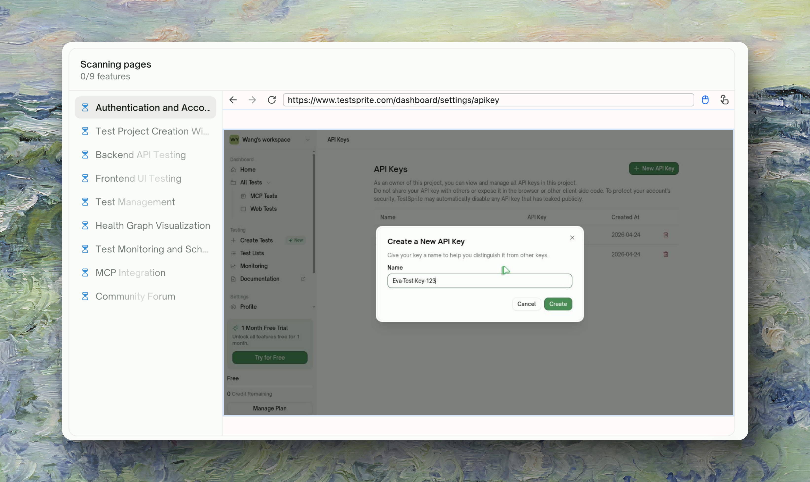
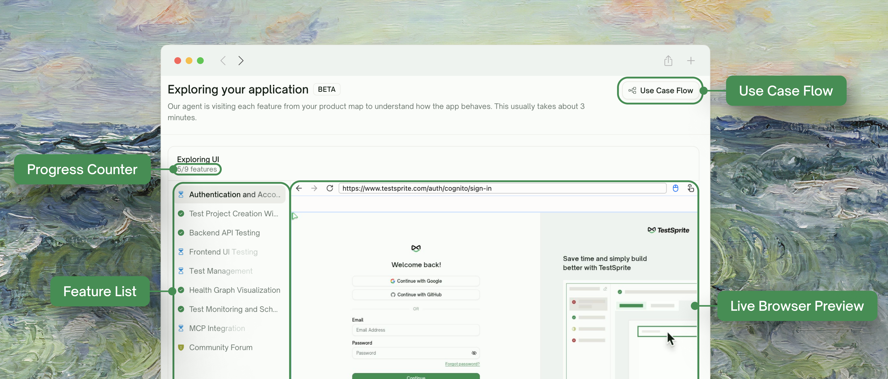
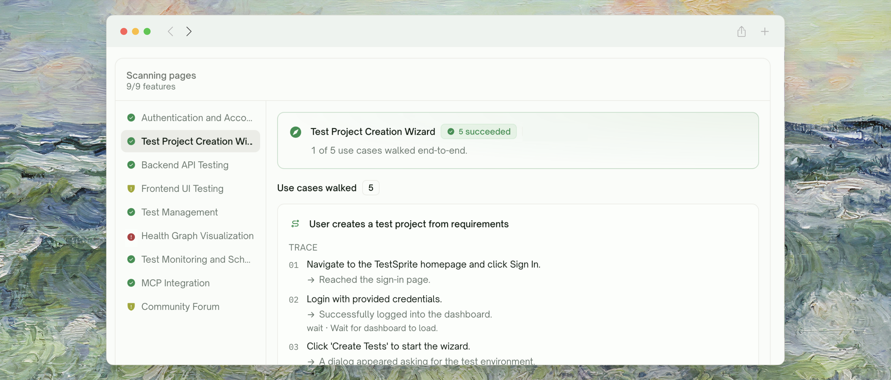
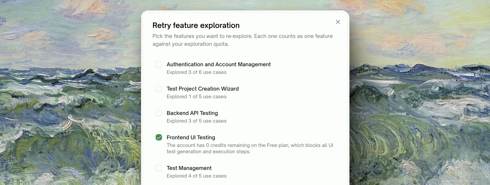
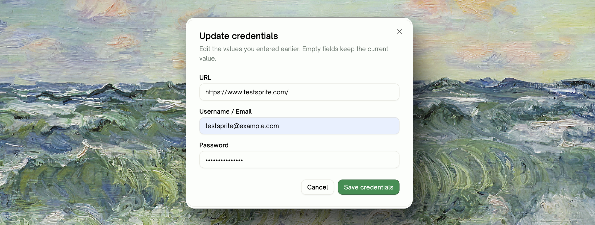
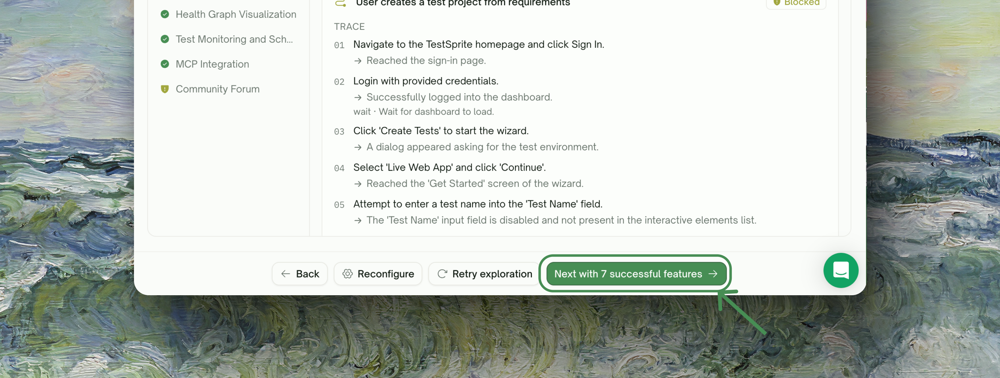
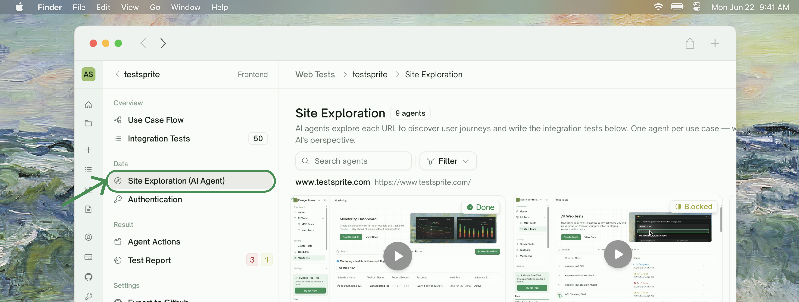

    <Frame>
      
    </Frame>

## Overview

Before writing any UI tests, TestSprite visits your live application and explores it feature by feature — opening real pages, attempting common user flows, signing in if you provided a test account, and recording what it could and couldn't reach. The test plan generated in the next step is grounded in **how your app actually behaves**, not just how it's described in your PRD.

This phase only runs for UI projects. Backend (API) tests skip exploration and go straight from configuration to plan generation.

<Warning>
**Currently in Beta.** Output is being refined — some features may explore only partially while we tune the experience. Even when exploration falls short, you can still continue to the test plan: TestSprite uses what was observed for explored features and falls back to your PRD/description for the rest.
</Warning>

## What Exploration Does for You

<Tabs>
  <Tab title="What it is">
    A short, watchable run where TestSprite acts like a first-time user of your app. It opens your starting URL, identifies a list of features (e.g. *Sign Up*, *Dashboard*, *Checkout*), and walks through each one — clicking buttons, filling forms, navigating between pages — while you watch.

    Each feature is explored independently and in parallel, so a long flow doesn't block the rest.
  </Tab>
  <Tab title="Why it matters">
    Plans written from real behavior beat plans written from descriptions:
    - **Steps reference real selectors and copy** observed on your pages
    - **Edge cases come from real screens**, not assumed ones
    - **Auth flows match your actual login**, including unexpected redirects
    - **Features behind paywalls or gated by plan tier** are flagged honestly, instead of generating tests we can't run

    The result: fewer "this test doesn't match my UI" surprises during execution.
  </Tab>
  <Tab title="When it runs">
    Exploration runs automatically once configuration is finished on the **Create Tests** wizard. It typically takes about **3 minutes** for an average app, though longer flows or large feature sets can take more.

    You don't have to babysit the run — you can leave the tab and come back. If exploration was already running when you returned to the wizard, TestSprite picks up where it left off.
  </Tab>
</Tabs>

## What You'll See During Exploration

    <Frame>
      
    </Frame>

While exploration runs you'll see:

| Element | What it shows |
| :--- | :--- |
| <kbd>Progress counter</kbd> | In the live-preview pane (e.g. *"3/8 features"*) — ticks up as each feature settles |
| <kbd>Feature list</kbd> | Which feature is queued, in progress, or complete |
| <kbd>Live browser preview</kbd> | Streams TestSprite navigating your app in real time — click any feature in the list to switch the preview to that feature's session |
| <kbd>Use Case Flow</kbd> | Button (header, top-right) that opens an interactive map of how features connect; nodes light up as exploration completes |

You can switch between features freely — switching feeds the live preview, but exploration of every feature continues in the background.

## Reviewing the Results

When exploration finishes (or you choose to stop), TestSprite shows a **summary panel** with one row per feature. Each row carries an outcome status:

    <Frame>
      
    </Frame>

| Status | What it means | What to do |
| :--- | :--- | :--- |
| <kbd>Explored successfully</kbd> | TestSprite walked the main user flows for this feature end-to-end and captured everything plan generation needs. | Nothing required — this feature's tests will be grounded in real observations. |
| <kbd>Explored N of M use cases</kbd> | Some flows were reached but others were cut short (e.g. blocked by a paywall, plan gate, unsupported screen, or a step that timed out). | Optional: click the row to see which flows were reached. Retry if you want full coverage; otherwise, partial observations are still used. |
| <kbd>Could not be explored</kbd> | TestSprite wasn't able to reach this feature at all (most often: a login issue, a feature that lives behind a feature flag, or the feature wasn't reachable from the starting URL). | Either reconfigure (often a credential or URL fix) and retry, or continue — TestSprite will fall back to your PRD/description for this feature's plan. |

Click any row to expand its detailed report. You'll see:

- **The flows attempted** — what TestSprite tried to do for this feature
- **The pages visited** — URLs reached during the walk
- **A short outcome summary** — a plain-English explanation of how the run went, including why anything was cut short

## Adjusting Before Plan Generation

You're not stuck with whatever the first run produced. Three options before you continue:

<Steps>
  <Step title="Retry specific features">
    Click <kbd>Retry exploration</kbd> in the footer to open a multi-select picker. Features that didn't fully explore are pre-checked — uncheck any you don't want to re-run, or include successful ones if you want to re-explore them against fresh credentials.

    Each retried feature counts against your exploration quota (see [Free-plan limits](#free-plan-limit)).
      <Frame>
      
    </Frame>
  </Step>
  <Step title="Reconfigure URL or credentials">
    If exploration was blocked because TestSprite couldn't sign in or reached a different URL than expected, click <kbd>Reconfigure</kbd> in the footer. The **Update credentials** dialog opens — edit the starting URL, username, or password inline (empty fields keep the current value), then click **Save credentials**.

    <Info>
      Reconfiguring **does not re-run exploration on its own**. It saves the new credentials and returns you to the summary so you choose which features to retry. That way one bad password doesn't burn your whole quota — fix the credential, then retry only the features that need it.
    </Info>
     <Frame>
      
    </Frame>
  </Step>
  <Step title="Continue when you're satisfied">
    Click <kbd>Continue to test plan</kbd> in the footer to generate the test plan from what's been explored so far. Fully and partially explored features feed real observations into plan generation; could-not-be-explored features fall back to your PRD/description as a safety net.
       <Frame>
      
    </Frame>
  </Step>
</Steps>

## What Happens If Exploration Times Out

Long-running exploration sessions have a built-in cap so the wizard doesn't sit forever. If the cap is hit:

- **Partial results are kept.** Anything already captured for any feature — even features whose run hadn't finished — is preserved and shown in the summary.
- **Cut-short features get an "Explored N of M use cases" status** if they captured something useful, or **"Could not be explored"** if they captured nothing.
- **You can retry just the affected features.** No need to start over.

This means a slow flow on one feature doesn't kill the whole run.

## Free-Plan Limit

<Note>
**Free accounts can explore up to 10 features total, lifetime — across all projects.** A banner on the exploration step shows your remaining quota. Each feature you retry counts against this limit, so prefer **Reconfigure → retry only the broken features** over re-running everything.

When you hit the cap, TestSprite shows an upgrade prompt. [Upgrade to Starter](https://www.testsprite.com/pricing) for unlimited exploration.
</Note>

## Tips for a Good First Run

<AccordionGroup>
  <Accordion title="Provide a test account when possible">
    If your app requires sign-in, share a test account in the configuration step. Both username and password are optional, but providing them dramatically expands what TestSprite can reach — without credentials, exploration is limited to whatever's accessible without login.
  </Accordion>
  <Accordion title="Start from your real entry URL">
    Use the URL a real user would land on (e.g. your marketing homepage or app dashboard). Avoid deep links into specific tools — TestSprite uses the starting URL to discover the rest.
  </Accordion>
  <Accordion title="Use the extra-context field for hints">
    The optional context field is a good place for things like *"Skip the help center"*, *"Focus on the checkout flow"*, or *"The dashboard route is `/app/v2/home`"*. TestSprite uses these to guide both exploration and plan generation.
  </Accordion>
  <Accordion title="Don't worry about partial results">
    Plans generated from a mix of fully and partially explored features still come out solid — partial observations are real signal. The fallback path for couldn't-be-explored features is also well-trodden; you'll get a usable plan regardless.
  </Accordion>
</AccordionGroup>

## Returning to Exploration Later

Once a UI project has run, you can revisit the exploration view from the test detail page's left nav under <kbd>Site Exploration</kbd>. It shows one video tile per feature TestSprite explored, with the recorded session and a summary of what was discovered. Click any tile to open the full per-feature report.
     <Frame>
      
    </Frame>
<Card title="Site Exploration tab" href="/web-portal/core/working-with-test/test-detail#site-exploration" icon="compass">
  Browsing exploration recordings after the wizard completes
</Card>

## Where to Go Next

<Columns cols={2}>
  <Card title="UI Testing" href="/web-portal/core/ui/ui-testing" icon="window-maximize">
    The full UI testing flow, with exploration as one step
  </Card>
  <Card title="Test Detail" href="/web-portal/core/working-with-test/test-detail" icon="layout">
    What you can do after the test runs
  </Card>
  <Card title="Refining Tests" href="/web-portal/core/working-with-test/refining-tests" icon="pen-to-square">
    Iterate after the first run
  </Card>
  <Card title="Billing and Plans" href="/web-portal/admin/billing-and-plans" icon="credit-card">
    Plan tiers and quota details
  </Card>
</Columns>
