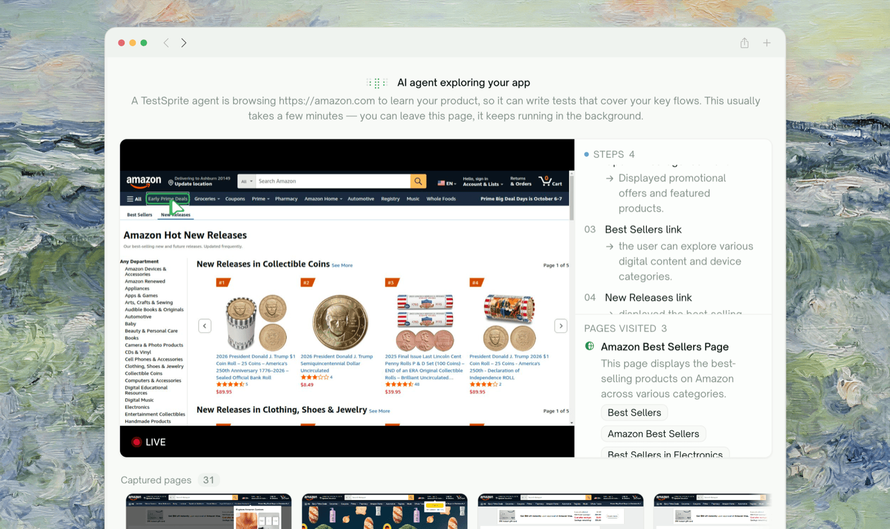
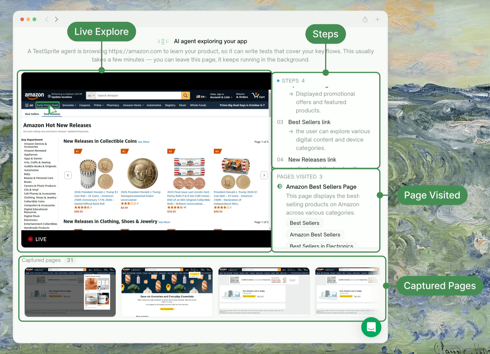
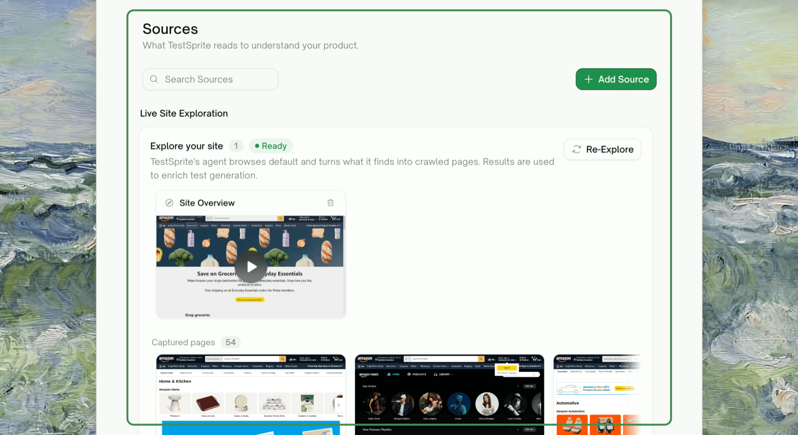

    <Frame>
      
    </Frame>

## Overview

Before writing any UI tests, TestSprite's testing agent visits your live app and explores it feature by feature: opening real pages, trying common user flows, signing in if you [configured login](/web-portal/core/ui/ui-authentication), and recording what it could and couldn't reach. The test plan is then grounded in **how your app actually behaves**, not just how your PRD describes it.

Feature exploration runs only for UI projects. API projects discover endpoints from your docs and probe them against your live API instead; see [API Discovery](/web-portal/core/api/api-discovery).

<Note>
Some features may explore only partially. You can still continue to the test plan: TestSprite uses what it observed and falls back to your PRD or description for the rest.
</Note>

## How It Works

The agent opens your starting URL, identifies your features (e.g. *Sign Up*, *Dashboard*, *Checkout*), and walks through each one, clicking buttons, filling forms, and moving between pages. Features are explored in parallel, so a long flow doesn't hold up the rest.

Plans written from what it observed are more reliable:

- **Steps reference real selectors and copy** from your pages
- **Edge cases come from real screens**, not assumed ones
- **Auth flows match your actual login**, including unexpected redirects
- **Features behind paywalls or plan gates** in your app are flagged, instead of producing tests that can't run

Exploration starts as soon as you click <kbd>Create project</kbd> and typically takes about **3 minutes** for an average app; longer flows or large feature sets take more. You can leave and come back: if it's still running when you return, TestSprite picks up where it left off.

## What You'll See During Exploration

While exploration runs, the project's <kbd>Sources</kbd> page shows a live view headed **AI agent exploring your app** (or **AI agents exploring your app** when several are working):

    <Frame>
      
    </Frame>

| Element | What it shows |
| :--- | :--- |
| <kbd>Progress counter</kbd> | With several agents, how many have finished (e.g. *"2/4 agents finished"*) |
| <kbd>Agent status</kbd> | Each agent's state: <kbd>Starting</kbd>, <kbd>Logging in</kbd>, <kbd>Exploring</kbd>, then <kbd>Done</kbd> or <kbd>Failed</kbd> |
| <kbd>Live browser preview</kbd> | Streams TestSprite navigating your app in real time |

When exploration finishes, TestSprite composes your coverage map on <kbd>Test Coverage</kbd>.

## Reviewing the Results

    <Frame>
      
    </Frame>

Results live under **Live Site Exploration** on the project's <kbd>Sources</kbd> page. The **Explore your site** card has a status chip (<kbd>Processing</kbd> while agents work, <kbd>Ready</kbd> when done, <kbd>Failed</kbd> if the run didn't complete) and one card per exploration run with its recording and captured pages. Click a run to open its recording and report.

## Adjusting Before Plan Generation

<Steps>
  <Step title="Reconfigure URL or credentials">
    If TestSprite couldn't sign in or reached a different URL than expected, open <kbd>Project Settings → Test Execution → Environment</kbd> and correct the environment's URL or test account.
  </Step>
  <Step title="Re-explore">
    Back on <kbd>Sources</kbd>, click <kbd>Re-explore</kbd> on the **Explore your site** card.
  </Step>
</Steps>

## Tips for a Good First Run

<AccordionGroup>
  <Accordion title="Provide a test account when possible">
    If your app requires sign-in, share a test account when you create the project. Without credentials, exploration is limited to what's accessible without login.
  </Accordion>
  <Accordion title="Start from your real entry URL">
    Use the URL a real user lands on (your homepage or app dashboard), not a deep link into one tool. TestSprite uses the starting URL to discover the rest.
  </Accordion>
  <Accordion title="Use the extra-context field for hints">
    Add hints like *"Skip the help center"*, *"Focus on the checkout flow"*, or *"The dashboard route is `/app/v2/home`"*. TestSprite uses them to guide both exploration and plan generation.
  </Accordion>
</AccordionGroup>

## Where to Go Next

<Columns cols={2}>
  <Card title="UI Testing" href="/web-portal/core/ui/ui-testing" icon="window-maximize">
    The full UI testing flow, with exploration as one step
  </Card>
  <Card title="Plan Generation & Editing" href="/web-portal/core/ui/ui-plan-gen" icon="list-check">
    What happens with the results next
  </Card>
</Columns>
