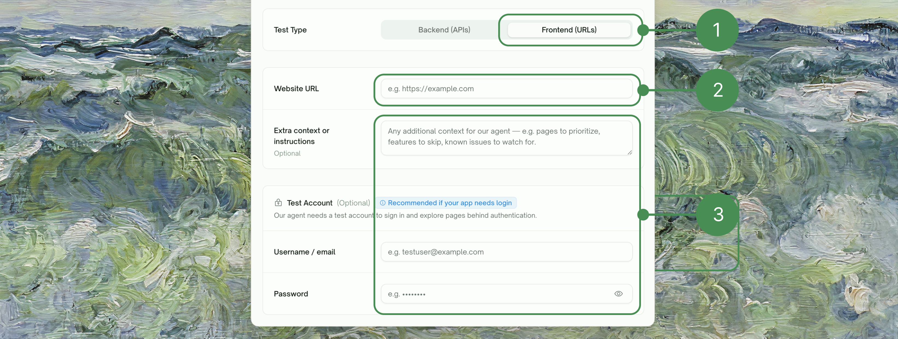
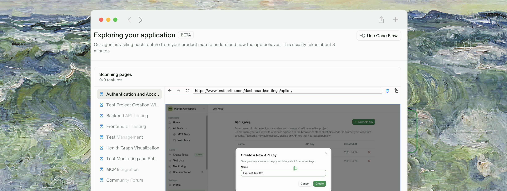
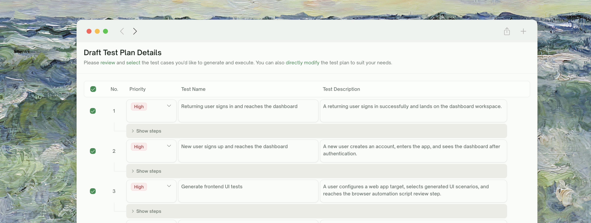
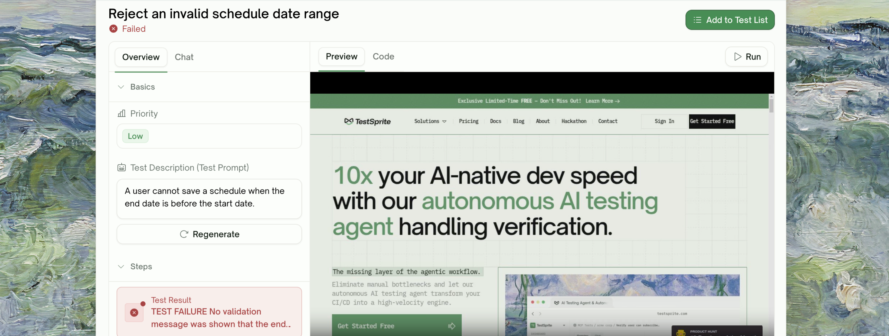

By the end of this guide you'll have a UI project that's been explored, planned, generated as Playwright code, and run against your live app, with a recorded video for every test. No code on your side.

<Info>
**Doing API testing instead?** See the [API Quickstart](/web-portal/core/api/quickstart) for the backend-flavored walkthrough.
</Info>

## Step 1: Project Setup & PRD Upload

From the dashboard, click <kbd>Create Tests</kbd>. The first screen asks for two things only: a **project name** and your **PRD** (or any product-spec document — markdown, PDF, plain text all work).

<Frame>
  
</Frame>

<Tip>
**Uploading a PRD is the single biggest lever on plan quality.** With a PRD, plans reflect what your product is *supposed to do*. Without one, plans rely only on what TestSprite can see by clicking around your live app — useful, but missing intent. Skipping the PRD upload is fine for a quick demo; for any real coverage, upload one.
</Tip>

## Step 2: Feature & Use-Case Extraction

If you uploaded a PRD, TestSprite analyzes it and shows the **Use Cases & Features** screen with a flow graph of every feature it identified and the use cases under each. Stages while it's working: *Reading your documentation → Identifying key features → Mapping use cases*. A toast confirms the count when it's done (e.g. "Found 12 features and 47 use cases").

<Frame>
  
</Frame>

This feature map is what grounds everything downstream — exploration targets these use cases, plan generation scopes test cases to them, and the report attributes coverage back to them. Click <kbd>Re-extract</kbd> to redo the analysis on the same PRD (e.g. after editing the file). Otherwise continue.

<Note>
If you skipped the PRD upload, this step is bypassed and the wizard goes straight to configuration.
</Note>

## Step 3: Choose Test Type and Configure

Pick the test type tab — <kbd>Frontend (URLs)</kbd> for this UI walkthrough — then provide your starting URL, test account, and any extra testing instructions.

<Frame>
  
</Frame>

| Field | What to provide |
| :--- | :--- |
| <kbd>Application URL</kbd> | The live URL TestSprite will explore (staging or local with a tunnel) |
| <kbd>Authentication</kbd> | Test-account credentials TestSprite uses to log in |
| <kbd>Extra testing instructions</kbd> | Free-form hints — e.g. *"avoid the help center"*, *"focus on the checkout flow"* |

<Tip>
Provide a long-lived **test account** with permissions across the surface you want covered. Exploration and runs both use real credentials; using a dedicated account keeps your real users' data clean.
</Tip>

## Step 4: Wait for Feature Exploration *(Beta)*

TestSprite walks your live app feature by feature, targeting the use cases from your feature map. You watch a live preview as it runs.

<Frame>
  
</Frame>

Per-feature status: <kbd>Exploring</kbd> while it's running, then <kbd>Done</kbd>, <kbd>Failed</kbd>, or <kbd>Blocked</kbd> when it finishes. You can retry individual features or update credentials without re-running everything.

When you're satisfied, click <kbd>Continue to test plan</kbd>.

<Note>
Free plan: **10 features lifetime** for exploration. Pro plans: unlimited.
</Note>

## Step 5: Review and Adjust the Plan

TestSprite drafts a customized test plan grounded in what was observed. Each row has a clear description explaining its purpose.

<Frame>
  
</Frame>

Use <kbd>Select All</kbd> to toggle the whole batch. Untick anything irrelevant, edit descriptions in natural language to refine focus, then click <kbd>Generate Tests</kbd>.

<Tip>
**Don't be precious about pruning.** Selecting all is usually right on a first run for full coverage. The high-leverage cases tend to be 60% of what's there; pruning the rest makes runs faster but doesn't change correctness.
</Tip>

## Step 6: Watch Tests Generate and Run

TestSprite converts the approved plan into Playwright code per test case, then executes each test in our cloud sandbox. Tests stream into the project view as they finish.

<Frame>
  
</Frame>

Each row surfaces one of: <kbd>Pending</kbd>, <kbd>Running</kbd>, <kbd>Pass</kbd>, <kbd>Failed</kbd>, <kbd>Blocked</kbd>.

## Step 7: Replay Step-by-Step

Click any test row to open its detail page. The right pane plays the **recorded video** of the run; the **Steps** panel inside the **Overview** tab lists every action with a clickable HTML snapshot per step.

<Frame>
  
</Frame>

For failures, the **Error / Trace / Fix** tabs surface the Playwright error, raw stack trace, and an AI-authored cause-and-fix suggestion.

<Card title="Step-by-Step Walkthrough" href="/web-portal/core/ui/ui-step-by-step" icon="list-check">
  Deeper tour of the per-step replay view
</Card>

## Step 8: Refine and Rerun

To iterate on a test, open its detail page and use the <kbd>Chat</kbd> tab — describe what to fix in natural language. TestSprite either tweaks the assertions in place or regenerates the test.

To re-execute, click <kbd>Run</kbd> (or <kbd>Save & Run</kbd> if you have unsaved edits) and confirm in the **Rerun this test** dialog. Pro plans get the **Auto-heal on UI drift** toggle there, which absorbs UI changes that don't actually break the flow.

<CardGroup cols={2}>
  <Card title="Refining Tests" href="/web-portal/core/working-with-test/refining-tests" icon="pen-to-square">
    Every refinement path in detail
  </Card>
  <Card title="Auto-Heal (Pro)" href="/web-portal/core/ui/auto-heal" icon="wand-magic-sparkles">
    Recover UI tests when the page changed but the flow is fine
  </Card>
</CardGroup>

## The Final Report

Once the run finishes, the **Test Report** tab summarizes pass / fail / blocked counts, highlights failures with cause-and-fix suggestions, and links into per-test detail. This is what you'll share with the team.

<Frame>
  
</Frame>

## Where to Go Next

<Columns cols={2}>
  <Card title="Feature Exploration" href="/web-portal/core/ui/feature-exploration" icon="compass">
    Deep dive on the exploration phase
  </Card>
  <Card title="Plan Generation & Editing" href="/web-portal/core/ui/ui-plan-gen" icon="list-check">
    The mechanics of plan review
  </Card>
  <Card title="Agent Actions" href="/web-portal/core/ui/agent-actions" icon="film">
    Project-level video gallery of every recording
  </Card>
  <Card title="Schedule Monitoring" href="/web-portal/maintenance/monitoring" icon="clock">
    Run on a cadence to catch regressions
  </Card>
</Columns>
