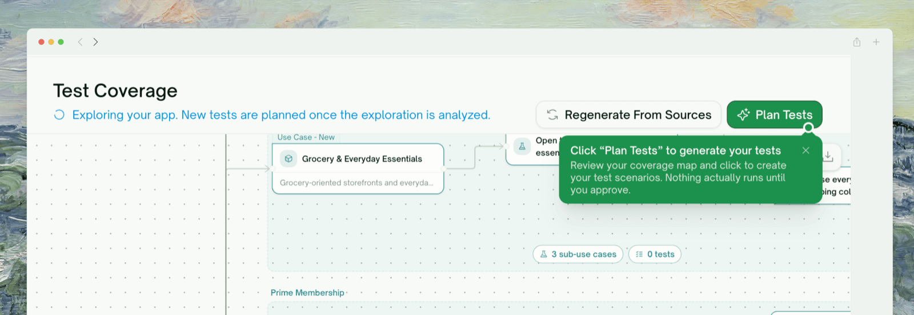
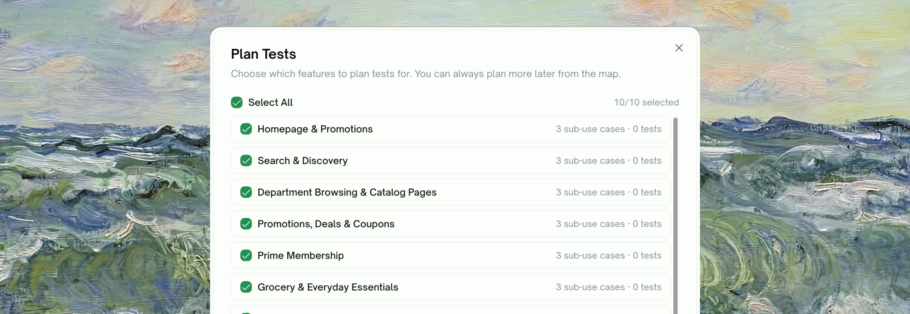
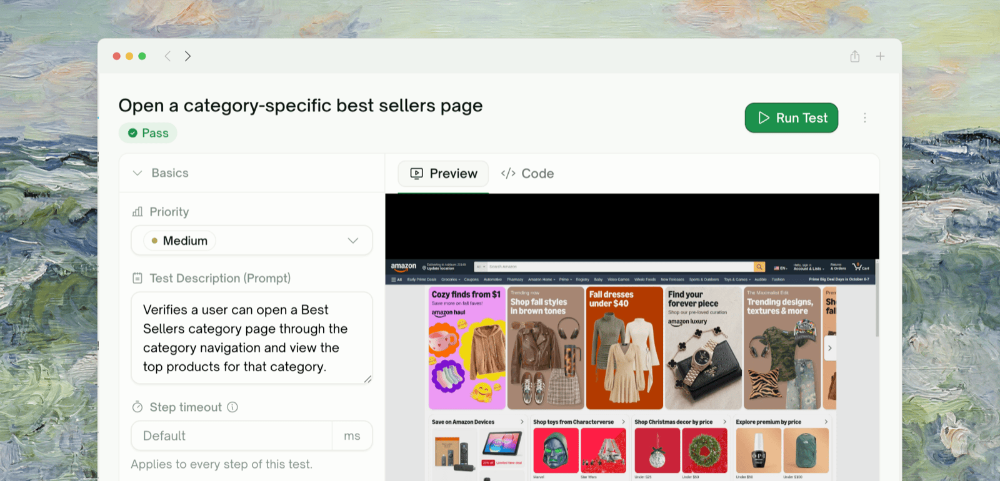
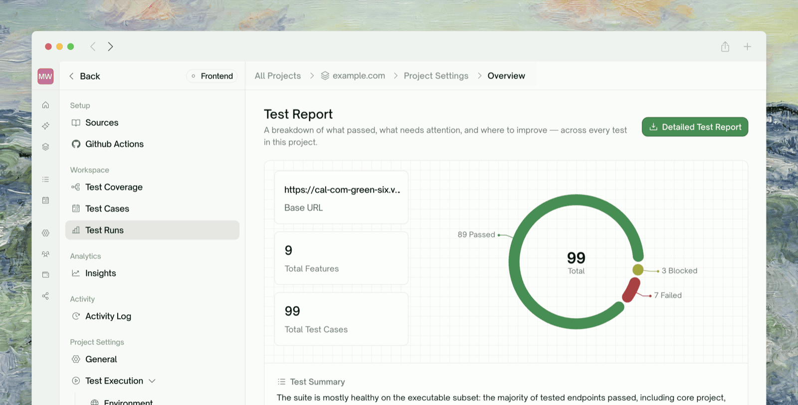

By the end of this guide you'll have a UI project that's been explored, planned, and run against your live app, with a recorded video for every test. No code on your side.

<Info>
**Doing API testing instead?** See the [API Quickstart](/web-portal/core/api/quickstart) for the backend-flavored walkthrough.
</Info>

{/* V3.1 (Sherry): main flow restructured to the new journey — create → exploration → coverage map → plan → run */}

## Step 1: Configure & Create Your Project

From <kbd>All Projects</kbd>, click <kbd>New Project</kbd>. The form has three steps: name the project, set <kbd>Test Type</kbd> to <kbd>Frontend UI</kbd>, enter your app's URL, configure sign-in, and optionally attach sources. Click <kbd>Create project</kbd> to save.

<Frame>
  
</Frame>

| Field | What to provide |
| :--- | :--- |
| <kbd>URL</kbd> | The public URL of the app to test (staging or local with a tunnel) |
| <kbd>Sign-in</kbd> | Choose **Sign-in required** if parts of your product are behind a login, then pick a method, such as **Test account credentials** or **OTP (one-time password) login**. See [Authentication (UI)](/web-portal/core/ui/ui-authentication) |
| <kbd>Test Sources</kbd> | Optional PRD or other documents that help TestSprite write better tests |

<Note>
The OTP Login choice is locked in at project creation — it can't be changed after the project is created.
</Note>

<Tip>
**Add a PRD as a source.** It's the biggest lever on plan quality: without one, the use-case map relies only on what TestSprite sees by exploring your live app.
</Tip>

## Step 2: Exploration & Use-Case Extraction

After you create the project, TestSprite reads your sources and its testing agents explore your live app. The project sidebar tracks the first run; stages that haven't started yet are marked **Not Started**.

<Frame>
  
</Frame>

When exploration finishes, TestSprite's testing agent extracts your use cases from your sources and what it found in your app. This takes a few minutes; progress is saved, and reopening the project drops you back at the current stage.

## Step 3: Check the Test Coverage Map

The **Test Coverage** map shows your use cases and how their tests are doing. Check it against how you think about the product: edit use cases here (tests are edited later, in Test Cases), or click <kbd>Regenerate From Sources</kbd> if the map misread your product.

<Frame>
  
</Frame>

<Tip>
Test cases are scoped to these use cases, so a minute fixing the map here saves pruning irrelevant tests later.
</Tip>

## Step 4: Plan Tests

Choose which features to plan tests for (<kbd>Select All</kbd> is usually right on a first run), then click <kbd>Plan Tests</kbd>. You can plan more later from the map.

<Frame>
  
</Frame>

TestSprite's testing agent then plans test cases across those use cases. Review, edit, and choose which to add; **nothing is added until you confirm**.

<Frame>
  
</Frame>

## Step 5: Generate & Run

Confirming the plan starts the run: the testing agent writes each test's code in a browser and runs it. The **Test Runs** page tracks it live, with the pass rate, <kbd>Running</kbd> / <kbd>Passed</kbd> / <kbd>Failed</kbd> / <kbd>Blocked</kbd> counts, and a per-test list. Switch to **Agent Actions View** to watch the recordings.

<Frame>
  
</Frame>

## Step 6: Replay Step-by-Step

Click any test row to open its detail page. The right pane plays the **recorded video** of the run; the **Steps** panel in the left column lists every action with a clickable HTML snapshot per step.

<Frame>
  
</Frame>

For failures, the **Error / Cause / Fix** tabs surface the Playwright error, the likely cause, and an AI-authored fix suggestion.

<Card title="Step-by-Step Replay" href="/web-portal/core/ui/ui-step-by-step" icon="list-check">
  Deeper tour of the per-step replay view
</Card>

## Step 7: Refine and Rerun

To change a test, describe the fix in **Chats**; TestSprite tweaks the assertions or regenerates the test. To re-execute, click <kbd>Run Test</kbd> on the test's detail page, or use [Edit Steps & Rerun](/web-portal/core/ui/ui-rerun#edit-steps--rerun) to rewrite steps and rerun in one go. [Auto-Heal](/web-portal/core/ui/auto-heal) absorbs UI changes that don't break the flow.

<CardGroup cols={2}>
  <Card title="Managing Test Cases" href="/web-portal/core/working-with-test/managing-test-cases" icon="pen-to-square">
    Every refinement path in detail
  </Card>
  <Card title="Auto-Heal" href="/web-portal/core/ui/auto-heal" icon="wand-magic-sparkles">
    Recover UI tests when the page changed but the flow is fine
  </Card>
</CardGroup>

## The Final Report

When the run finishes, click <kbd>View Report</kbd> to open the **Test Report**: pass / fail / blocked counts, failures with cause-and-fix suggestions, and links into each test. This is what you share with the team.

<Frame>
  
</Frame>

## Where to Go Next

<Columns cols={2}>
  <Card title="Feature Exploration" href="/web-portal/core/ui/feature-exploration" icon="compass">
    Deep dive on the exploration phase
  </Card>
  <Card title="Plan Generation & Editing" href="/web-portal/core/ui/ui-plan-gen" icon="list-check">
    The mechanics of plan review
  </Card>
  <Card title="Agent Actions" href="/web-portal/core/ui/agent-actions" icon="film">
    Project-level video gallery of every recording
  </Card>
  <Card title="Test Schedules" href="/web-portal/maintenance/monitoring" icon="clock">
    Run on a cadence to catch regressions
  </Card>
</Columns>
