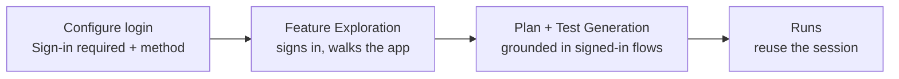

<Frame>
  
</Frame>

## Why UI Tests Need to Log In

Most of your product lives behind a login. If TestSprite can't sign in, it can only explore and test whatever is reachable while signed out — a marketing page, a login screen, maybe a public pricing page. To test the dashboard, the settings, the checkout, the actual app, TestSprite needs a way in.

You configure that once, up front. TestSprite then signs in the same way for every phase that touches your app — [feature exploration](/web-portal/core/ui/feature-exploration), test generation, and every run afterward.

<Info>
**This page is about front-end (browser) login only.** If you're testing an HTTP API, tokens are handled differently — see [Auto-Auth](/web-portal/core/api/auto-auth) for backend token refresh. The two are separate systems; nothing here applies to API projects.
</Info>

## Getting Started: "Sign-in required"

When you configure a Frontend (URLs) project, the auth section starts with two tabs, **Sign-in required** and **No sign-in**:

> **Sign-in required**: Choose this if parts of your product are behind a login. The TestSprite agent signs in with a test account to test those flows.

- **Choose No sign-in** if your app (or the part you want covered) is fully usable without an account. TestSprite explores and tests it anonymously.
- **Choose Sign-in required** and three login methods appear as cards, each matching a different way real users get into an app. Pick the one that fits yours.

<Frame>
  
</Frame>

| Method | Card | Best for | What **you** provide | Key limitations |
| :--- | :--- | :--- | :--- | :--- |
| **1. You provide an account** | <kbd>Test account credentials</kbd> | Apps with a plain username/password login and a test account you already control | Username + password | Doesn't cover OTP/2FA or social login on its own |
| **2. TestSprite manages an account** | <kbd>OTP (one-time password) login</kbd> | Apps that require email or SMS one-time codes to sign up / log in | Nothing: TestSprite registers and owns the account | **Fixed at project creation, can't be changed later.** One managed account per environment. Can't run two OTP logins at the same moment |
| **3. You log in, we record it** | <kbd>SSO (single sign-on), e.g. Google</kbd> | Apps that log in with **"Sign in with Google"** | A one-time manual sign-in in a live browser | Session expires and needs periodic re-login. Availability is gated (see [prerequisites](#method-3-prerequisites)) |

<Tip>
**Not sure which to pick?** If your app has a simple email + password login and you already have a test account, use **Test account credentials**; it's the simplest. If sign-in sends a code to your email or phone, use **OTP (one-time password) login**. If sign-in goes through "Continue with Google", use **SSO (single sign-on), e.g. Google**.
</Tip>

---

## Method 1 — Existing Test Account

You hand TestSprite a username and password for an account you already control. TestSprite signs in with them before exploring and before every run.

<Frame>
  
</Frame>

### Configuration

<Steps>
  <Step title="Select Test account credentials">
    Choose **Sign-in required**, then pick the **Test account credentials** card. Two fields appear.
  </Step>
  <Step title="Enter the credentials">
    | Field | What to provide |
    | :--- | :--- |
    | <kbd>Username</kbd> | The email or username your app's login form expects — e.g. `testuser@example.com` |
    | <kbd>Password</kbd> | The password for that account. Use the eye toggle to reveal what you typed. |
  </Step>
  <Step title="Continue">
    TestSprite validates that both fields are filled, then uses them to sign in during exploration and every run.
  </Step>
</Steps>

### Best for

- Standard email/username + password logins
- A dedicated **test account** you keep in a known state
- Staging environments with seeded accounts

### Limitations

- **Doesn't handle one-time codes on its own.** If your login sends an email or SMS code after the password step, this method gets stuck at the code prompt — use [Method 2](#method-2-otp-one-time-password-login) instead.
- **Doesn't handle social login.** "Continue with Google" and similar can't be driven with a username/password — use [Method 3](#method-3-sign-in-with-google).

<Tip>
**Use a dedicated test account, not a real user's.** Exploration and runs perform real actions while signed in. A throwaway account with broad permissions across the surface you want covered keeps your real users' data clean and gives TestSprite room to click freely.
</Tip>

---

## Method 2 — OTP (One-Time Password) Login

For apps that verify you with a one-time code — a signup or login that emails or texts a passcode. You provide **nothing**: TestSprite registers a dedicated test account whose email address and phone number it owns, so when your app sends a code, TestSprite receives it and enters it automatically.

<Frame>
  
</Frame>

### How it works

> **How OTP (one-time password) login works** — We sign up and log in on your site with a randomly generated TestSprite email address (and/or phone number), and enter the one-time passcodes it receives automatically.

Because TestSprite owns the inbox and phone number, the whole loop — register → receive the code → enter the code → land signed in — happens without you handing over any credentials.

### Configuration

<Steps>
  <Step title="Select OTP (one-time password) Login">
    Choose **Sign-in required**, then pick the **OTP (one-time password) Login** card.
  </Step>
  <Step title="Choose how your app verifies — Verify via">
    Pick the channel your app uses to send codes:

    | Option | Use when your app sends the code to… |
    | :--- | :--- |
    | <kbd>Email</kbd> | An email address |
    | <kbd>Phone</kbd> | A phone number (SMS) |
    | <kbd>Email + Phone</kbd> | Both — for two-factor flows that verify an email *and* a phone |
  </Step>
  <Step title="Create the project">
    That's it — there are no credentials to type. When the project is created, TestSprite provisions the managed account and uses it from then on.
  </Step>
</Steps>

### Best for

- Passwordless logins
- Signups that require email verification before you can proceed
- Two-factor flows where a code is the second factor

### Limitations

<Warning>
**OTP configuration is fixed at project creation and can't be changed later.** You choose the OTP channel (Email / Phone / Email + Phone) when the project is created, and it's locked from then on. You can't switch a project to OTP after the fact, turn OTP off, or rename an OTP environment. If you need to change it, create a new project (or a new environment) with the settings you want.
</Warning>

- **One managed account per environment.** The managed account is tied to the environment it was created in. To test with a second managed account, add another [environment](#multiple-test-accounts-multiple-environments).
- **OTP logins can't run at the exact same moment.** Because the managed inbox/phone would otherwise race for the same code, TestSprite serializes OTP logins within an environment — a second login waits for the first to finish and then reuses the session. In practice you won't notice this beyond a brief wait; it's why [session reuse](#reusing-a-login-session) matters most for this method.
- **Whether it succeeds depends on your signup/login flow.** There's no fixed list of supported sites — it works wherever TestSprite's agent can drive the registration and code-entry steps. If a flow can't be completed (unusual signup gates, extra required fields it can't guess, aggressive bot protection), the login fails loudly rather than silently running signed out. See [Troubleshooting](#troubleshooting).

---

## Method 3 — Sign in with Google

For **"Sign in with Google"** logins — the kind TestSprite can't (and shouldn't) automate directly. Instead of automating the login, TestSprite opens a real browser, **you** sign in with Google yourself, and TestSprite records the resulting session so every future run starts already signed in.

<Frame>
  
</Frame>

### How it works

When you finish creating the project (or click "Log in" from environment settings later), a **live browser opens right inside the modal**:

> **Log in to your app** — Sign in to your app in the live browser below (including "Sign in with Google"). When you're done, click "I've finished logging in" and we'll reuse this session for future test runs. You can skip this and add it later.

You drive that browser exactly as you would your own — click "Continue with Google" and complete Google's sign-in. When you're in, you click **I've finished logging in**, and TestSprite captures the signed-in session (cookies and local storage) so it can replay it later without asking you to log in again.

<Frame>
  
</Frame>

### Configuration

<Steps>
  <Step title="Select SSO (single sign-on)">
    Choose **Sign-in required**, then pick the **SSO (single sign-on), e.g. Google** card. (If the card isn't there, the feature isn't enabled for your account yet.)
  </Step>
  <Step title="Finish creating the project">
    After the project is created, the **Log in to your app** modal opens with a live browser pointed at your app. It can take a moment — you'll see *"Opening a live browser…"* first.
  </Step>
  <Step title="Sign in yourself in the live browser">
    Click "Continue with Google" and complete Google's sign-in. Take your time; the session stays alive while you work (there's a hard cap of about 15 minutes to finish).
  </Step>
  <Step title="Click I've finished logging in">
    TestSprite captures the session. You'll see **Login captured ✓** and a confirmation that future runs will start signed in.
  </Step>
</Steps>

<Note>
**Prefer not to log in right now?** Click **Skip for now**. The project is still created — you can capture the session later from environment settings (see [Re-authenticating](#re-authenticating-an-expired-session)). Until you do, runs execute signed out.
</Note>

### Best for

- Apps whose login is **"Sign in with Google"** ("Continue with Google")
- Any flow where the sign-in is better completed by a human once than automated

### Limitations

- **Sessions expire.** A captured session is good until it expires (your app's own session lifetime is the ceiling). After that you re-log-in once — see [Re-authenticating](#re-authenticating-an-expired-session).
- **It's a one-time manual step per session.** Unlike Methods 1 and 2, this needs a human at capture time. It's the trade-off for supporting logins that can't be safely automated.

### Prerequisites
- Your environment has a **public URL** the live browser can reach. Local URLs (`localhost`, private IPs) can't be reached from TestSprite's browser.

---

## Reusing a Login Session

Logging in on every single test wastes time and, for OTP or manual login, can be disruptive. TestSprite can **reuse a recent successful login** across runs instead of signing in again each time.

<Frame>
  
</Frame>

On the environment form (for OTP and manual-login environments) you'll find:

> **Reuse Login Session** — Skip logging in again if the last successful login is recent enough. Keep the window shorter than your site's session lifetime.

When on, set a **Reuse window** (in minutes). Within that window, runs start from the already-signed-in session; past it, TestSprite logs in fresh.

<Warning>
**Keep the reuse window shorter than your app's real session lifetime.** If you set 120 minutes but your app signs users out after 60, reused sessions will already be dead and runs will fail on an expired session. When in doubt, err short.
</Warning>

---

## Multiple Test Accounts — Multiple Environments

**Each account is one environment**, and a project can have several environments. That's how you cover *different roles* (admin vs. member) or *different tenants* (org A vs. org B): one environment per account.

<Frame>
  
</Frame>

### Adding Another Environment

<Steps>
  <Step title="Open the project's Environments settings">
    From the project, go to **Project Settings → Test Execution → Environment**. You'll see your existing environments; the default one carries an **Active** badge.
  </Step>
  <Step title="Click Add Environment">
    Give it a **Name** (e.g. `Admin`, `Staging`, `Tenant B`) and a **Website URL**, then configure its login exactly like the project's first account: **Sign-in required** plus one of the three methods.
  </Step>
  <Step title="Point tests at the right environment">
    Runs use the **Active** environment by default. Use **Set as Active** to switch which account new runs use, or pin an environment on a test list / schedule.
  </Step>
</Steps>

<Info>
Each environment holds exactly one test account — one username/password, or one managed OTP account, or one recorded session. 
**One caveat for OTP environments:** because their managed account is fixed at creation and can't be copied, an OTP environment can't be renamed. Name it correctly when you create it.
</Info>

---

## Re-authenticating an Expired Session (Method 3)

Recorded Google/SSO sessions don't last forever. When one expires, TestSprite tells you and runs fall back to signed-out until you refresh it.

<Frame>
  
</Frame>

On the environment's edit dialog, the **Manual login (Google / SSO)** card shows one of:

| State | What it means | Action |
| :--- | :--- | :--- |
| **Signed in** | A valid session is captured and runs reuse it. Shows when it expires. | Nothing needed |
| **Expired** | The saved login expired; runs execute signed out until you refresh. | Click **Log in again** |
| **Not logged in yet** | You skipped capture at creation. | Click **Log in** |

Clicking **Log in again** reopens the live browser — sign in once more and TestSprite captures a fresh session.

---

## Common Login Failures & Troubleshooting

<AccordionGroup>

  <Accordion title="My login sends a one-time code and Test account credentials gets stuck">
    Username/password alone can't get past a code prompt. Recreate the project (or add an environment) using **OTP (one-time password) Login** so TestSprite owns the inbox/phone and can enter the code automatically.
  </Accordion>

  <Accordion title="My app uses 'Continue with Google' and login never completes">
    Google sign-in can't be driven with a stored username and password. Use **SSO (single sign-on), e.g. Google** and complete the login yourself once in the live browser. If you don't see that card, the feature isn't enabled for your account yet; [reach out](https://discord.gg/QQB9tJ973e).
  </Accordion>

  <Accordion title="I can't switch an existing project to OTP, or turn OTP off">
    OTP settings are locked at project creation by design. You can't enable OTP on an existing project, disable it, change the channel, or rename an OTP environment. Create a new project or environment with the OTP settings you want.
  </Accordion>

  <Accordion title="Runs started failing after working fine — 'Sign in with Google' project">
    Recorded sessions expire (bounded by your app's own session lifetime). Go to **Project Settings → Test Execution → Environment**, open the environment, and use **Log in again** on the *Manual login (Google / SSO)* card to capture a fresh session. Consider a shorter [reuse window](#reusing-a-login-session) if this happens often.
  </Accordion>

  <Accordion title="The live browser won't open, or says the URL is unreachable">
    The manual-login browser needs a **publicly reachable URL**. `localhost` and private network addresses can't be opened from TestSprite's cloud browser. Point the environment at a public staging URL, or set up the MCP server to test locally.
  </Accordion>

  <Accordion title="An OTP run waited a while before starting">
    OTP logins are serialized within an environment so the shared inbox/phone doesn't grab the wrong code. A second run waits for the first login to finish, then reuses the session. Turning on [Reuse Login Session](#reusing-a-login-session) minimizes repeat logins.
  </Accordion>
</AccordionGroup>

---
## Where Login Fits in the UI Testing Flow

Login is configured up front, and everything downstream reuses it:

<Card>

</Card>

<Card title="Feature Exploration" href="/web-portal/core/ui/feature-exploration" icon="compass">
  Where login is first used — TestSprite signs in and walks your app. You can reconfigure credentials and retry from here.
</Card>

## Where to Go Next

<Columns cols={2}>
  <Card title="UI Quickstart" href="/web-portal/core/ui/quickstart" icon="play">
    The end-to-end walkthrough — login is Step 3
  </Card>
  <Card title="Feature Exploration" href="/web-portal/core/ui/feature-exploration" icon="compass">
    How TestSprite uses your login to explore the app
  </Card>
  <Card title="Environments" href="/web-portal/setup/environments" icon="layer-group">
    Managing multiple environments (and thus multiple accounts)
  </Card>
  <Card title="Auto-Auth (API)" href="/web-portal/core/api/auto-auth" icon="arrows-rotate">
    The backend equivalent — token refresh for API tests
  </Card>
</Columns>
