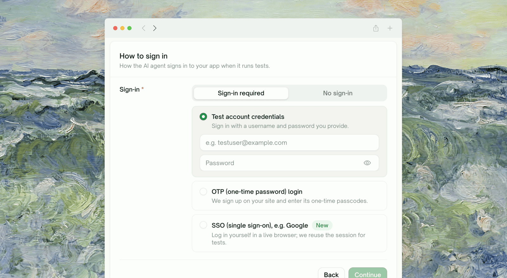
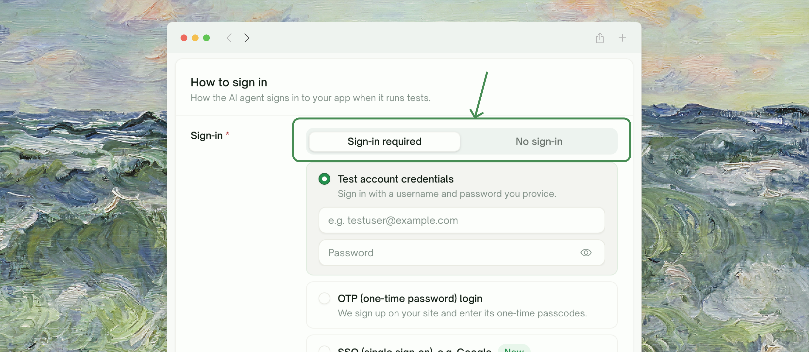
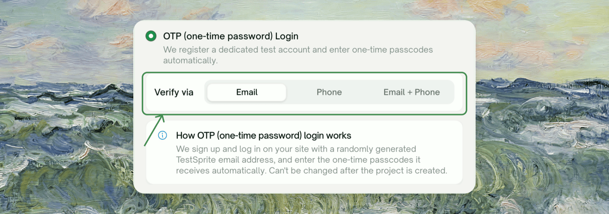
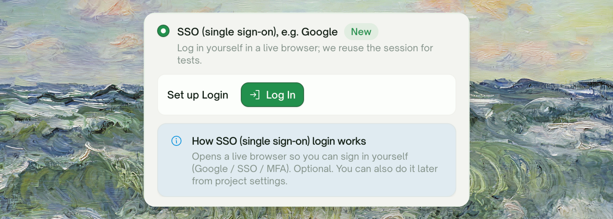
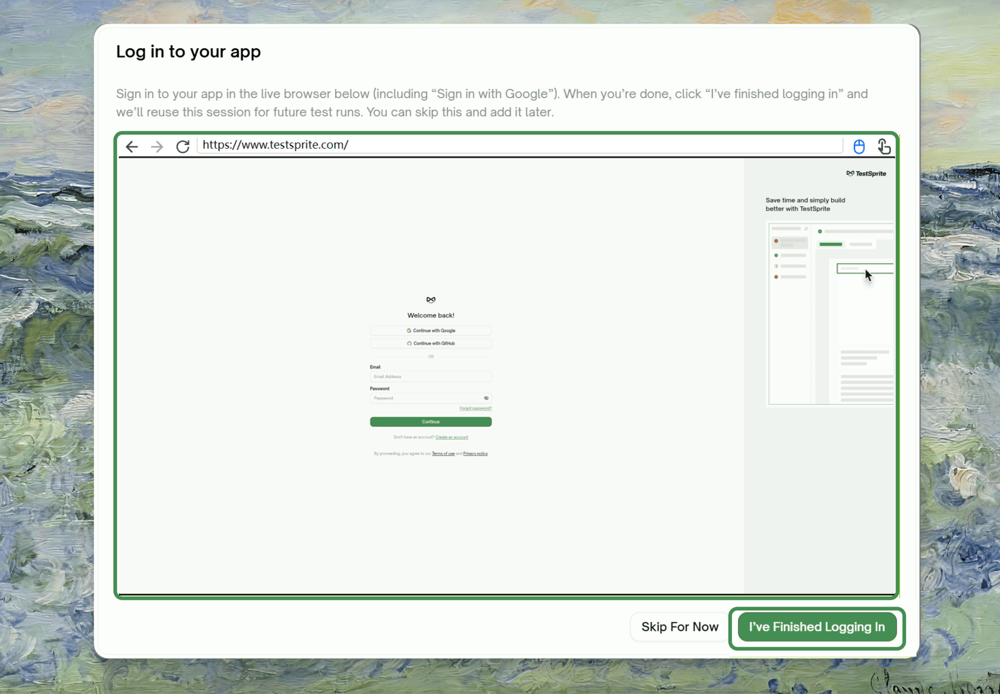
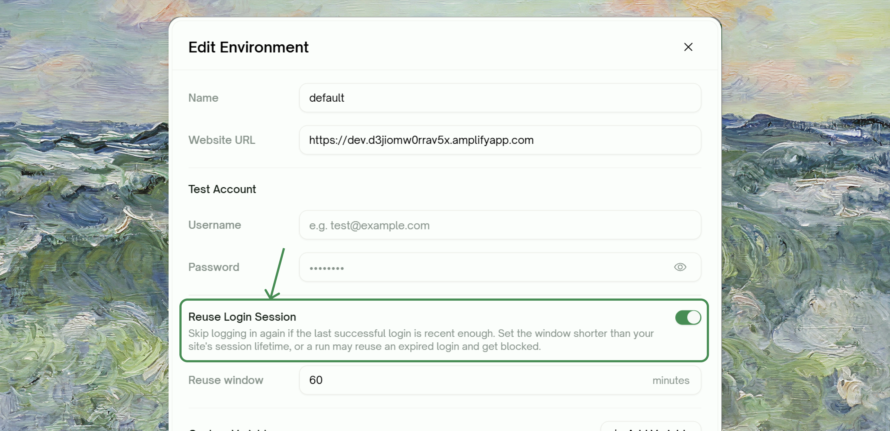
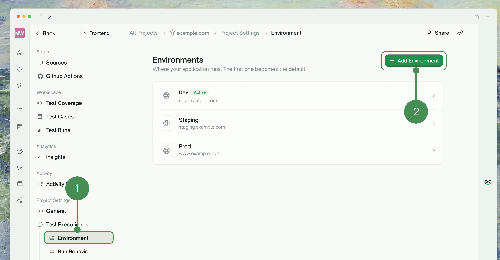
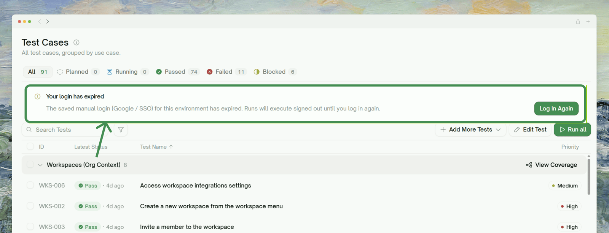

<Frame>
  
</Frame>

## Why UI Tests Need to Log In

Without a way to sign in, TestSprite can only explore and test what a signed-out visitor sees. You configure login once, and TestSprite signs in the same way for [feature exploration](/web-portal/core/ui/feature-exploration), test generation, and every run.

<Info>
This page covers browser login for UI projects only. For API projects, see [Auto-Auth](/web-portal/core/api/auto-auth).
</Info>

## Getting Started: Sign-in required

The sign-in section has two tabs. Choose **No sign-in** if the part of your app you want covered works without an account. Choose **Sign-in required** and three login methods appear as cards; pick the one that matches how users get into your app.

<Frame>
  
</Frame>

| Method | Card | Best for | What **you** provide | Key limitations |
| :--- | :--- | :--- | :--- | :--- |
| **1. You provide an account** | <kbd>Test account credentials</kbd> | Apps with a plain username/password login and a test account you already control | Username + password | Doesn't cover OTP/2FA or social login on its own |
| **2. TestSprite manages an account** | <kbd>OTP (one-time password) login</kbd> | Apps that require email or SMS one-time codes to sign up / log in | Nothing: TestSprite registers and owns the account | **Fixed at project creation, can't be changed later.** One managed account per environment. Can't run two OTP logins at the same moment |
| **3. You log in, we record it** | <kbd>SSO (single sign-on), e.g. Google</kbd> | SSO and social logins such as Google, plus logins that block automated sign-in (for example, a CAPTCHA or bot detection) | A one-time manual sign-in in a live browser | Session expires and needs periodic re-login. Availability is gated (see [prerequisites](#method-3-prerequisites)) |

---

## Method 1: Existing Test Account

You give TestSprite a username and password for an account you control. It signs in with them before exploring and before every run.

<Frame>
  
</Frame>

### Configuration

<Steps>
  <Step title="Select Test account credentials">
    Choose **Sign-in required**, then pick the **Test account credentials** card.
  </Step>
  <Step title="Enter the credentials">
    | Field | What to provide |
    | :--- | :--- |
    | <kbd>Username</kbd> | The email or username your app's login form expects, e.g. `testuser@example.com` |
    | <kbd>Password</kbd> | The password for that account. Use the eye toggle to reveal what you typed. |
  </Step>
  <Step title="Continue">
    TestSprite checks that both fields are filled, then uses them during exploration and every run.
  </Step>
</Steps>

### Best for

- Standard email/username + password logins
- A dedicated **test account** you keep in a known state
- Staging environments with seeded accounts

### Limitations

- **Doesn't handle one-time codes.** If your login sends an email or SMS code after the password step, this method gets stuck at the code prompt. Use [Method 2](#method-2-otp-one-time-password-login).
- **Doesn't handle SSO or social login.** "Continue with Google" and similar logins can't be driven with a username and password. Use [Method 3](#method-3-sign-in-with-google).

<Tip>
**Use a dedicated test account, not a real user's.** Exploration and runs perform real actions while signed in, so a throwaway account with broad permissions keeps real users' data clean.
</Tip>

---

## Method 2: OTP (One-Time Password) Login

For apps that email or text a one-time code at signup or login. You provide **nothing**: TestSprite registers a dedicated test account with an email address and phone number it owns, receives the code your app sends, and enters it automatically.

<Frame>
  
</Frame>

### Configuration

<Steps>
  <Step title="Select OTP (one-time password) Login">
    Choose **Sign-in required**, then pick the **OTP (one-time password) Login** card.
  </Step>
  <Step title="Choose how your app verifies (Verify via)">
    | Option | Use when your app sends the code to… |
    | :--- | :--- |
    | <kbd>Email</kbd> | An email address |
    | <kbd>Phone</kbd> | A phone number (SMS) |
    | <kbd>Email + Phone</kbd> | Both, for two-factor flows that verify an email *and* a phone |
  </Step>
  <Step title="Create the project">
    There are no credentials to type. When the project is created, TestSprite provisions the managed account and uses it from then on.
  </Step>
</Steps>

### Best for

- Passwordless logins
- Signups that require email verification before you can proceed
- Two-factor flows where a code is the second factor

### Limitations

<Warning>
**OTP configuration is fixed at project creation.** You can't switch a project to OTP later, turn OTP off, change the channel, or rename an OTP environment. To change it, create a new project or environment with the settings you want.
</Warning>

- **One managed account per environment.** To test with a second managed account, add another [environment](#multiple-test-accounts-multiple-environments).
- **OTP logins in one environment run one at a time**, so the managed inbox or phone doesn't pick up the wrong code. A second login waits for the first, then reuses its session. This is why [session reuse](#reusing-a-login-session) matters most for this method.
- **It depends on your signup and login flow.** It works wherever TestSprite's testing agent can drive registration and code entry. If a flow can't be completed (unusual signup gates, required fields it can't guess, aggressive bot protection), the login fails loudly rather than running signed out. See [Troubleshooting](#troubleshooting).

---

## Method 3: SSO (Single Sign-On)

For SSO and social logins such as **"Sign in with Google"**, and for any login that blocks automated sign-in. TestSprite doesn't automate these. Instead, it opens a real browser, **you** sign in yourself, and TestSprite records the session so later runs start signed in.

<Frame>
  
</Frame>

### How it works

When you finish creating the project (or click "Log in" from environment settings later), a **live browser opens inside the modal**. You sign in as usual (for example, click "Continue with Google" and complete Google's sign-in), then click **I've finished logging in**. TestSprite captures the signed-in session (cookies and local storage) to replay later.

<Frame>
  
</Frame>

### Configuration

<Steps>
  <Step title="Select SSO (single sign-on)">
    Choose **Sign-in required**, then pick the **SSO (single sign-on), e.g. Google** card. If the card isn't there, the feature isn't enabled for your account yet.
  </Step>
  <Step title="Finish creating the project">
    The **Log in to your app** modal opens with a live browser pointed at your app. You'll see *"Opening a live browser…"* first.
  </Step>
  <Step title="Sign in yourself in the live browser">
    Complete the sign-in. You have up to about 15 minutes.
  </Step>
  <Step title="Click I've finished logging in">
    TestSprite captures the session and shows **Login captured ✓**.
  </Step>
</Steps>

<Note>
**Not ready to log in?** Click **Skip for now**. The project is still created, and you can capture the session later from environment settings (see [Re-authenticating](#re-authenticating-an-expired-session)). Until then, runs execute signed out.
</Note>

### Best for

- SSO and social logins, such as **"Sign in with Google"** ("Continue with Google")
- Logins that block automated sign-in, for example with a CAPTCHA or bot detection
- Any sign-in that's better completed by a human once than automated

### Limitations

- **Sessions expire.** Your app's own session lifetime is the ceiling. After that, log in again once (see [Re-authenticating](#re-authenticating-an-expired-session)).
- **It needs a human at capture time**, once per session.

### Prerequisites
- Your environment has a **public URL** the live browser can reach. Local URLs (`localhost`, private IPs) can't be reached from TestSprite's browser.

---

## Reusing a Login Session

Instead of signing in before every test, TestSprite can reuse a recent successful login. On the environment form (for OTP and manual-login environments), turn on **Reuse Login Session** and set a **Reuse window** in minutes. Within the window, runs start from the signed-in session; after it, TestSprite logs in fresh.

<Frame>
  
</Frame>

<Warning>
**Keep the reuse window shorter than your app's real session lifetime.** If your app signs users out after 60 minutes and the window is 120, reused sessions will already be dead and runs will fail. When in doubt, err short.
</Warning>

---

## Multiple Test Accounts, Multiple Environments

**Each account is one environment**, and a project can have several. That's how you cover different roles (admin vs. member) or tenants (org A vs. org B).

<Frame>
  
</Frame>

### Adding Another Environment

<Steps>
  <Step title="Open the project's environments">
    Go to **Project Settings → Test Execution → Environment**. The default environment carries an **Active** badge.
  </Step>
  <Step title="Click Add Environment">
    Give it a **Name** (e.g. `Admin`, `Staging`, `Tenant B`) and a **Website URL**, then set up its login the same way: **Sign-in required** plus one of the three methods.
  </Step>
  <Step title="Point tests at the right environment">
    Runs use the **Active** environment by default. Use **Set as Active** to switch, or pin an environment on a test list or schedule.
  </Step>
</Steps>

<Info>
Each environment holds exactly one test account: one username/password, one managed OTP account, or one recorded session. An OTP environment can't be renamed, so name it correctly when you create it.
</Info>

---

## Re-authenticating an Expired Session (Method 3)

When a recorded SSO session expires, TestSprite tells you, and runs execute signed out until you refresh it.

<Frame>
  
</Frame>

On the environment's edit dialog, the **Manual login (Google / SSO)** card shows one of:

| State | What it means | Action |
| :--- | :--- | :--- |
| **Signed in** | A valid session is captured and runs reuse it. Shows when it expires. | Nothing needed |
| **Expired** | The saved login expired; runs execute signed out until you refresh. | Click **Log in again** |
| **Not logged in yet** | You skipped capture at creation. | Click **Log in** |

**Log in again** reopens the live browser so you can sign in and capture a fresh session.

---

## Common Login Failures & Troubleshooting

<AccordionGroup>

  <Accordion title="My login sends a one-time code and Test account credentials gets stuck">
    Username and password alone can't get past a code prompt. Recreate the project (or add an environment) with **OTP (one-time password) Login**.
  </Accordion>

  <Accordion title="My app uses SSO or social login, and login never completes">
    SSO and social logins such as Google can't be driven with a stored username and password, and some providers block automated sign-in. Use **SSO (single sign-on), e.g. Google** and log in yourself once in the live browser. If you don't see that card, the feature isn't enabled for your account yet; [reach out](https://discord.gg/QQB9tJ973e).
  </Accordion>

  <Accordion title="I can't switch an existing project to OTP, or turn OTP off">
    OTP settings are locked at project creation. Create a new project or environment with the OTP settings you want.
  </Accordion>

  <Accordion title="Runs started failing after working fine (SSO project)">
    The recorded session probably expired. Go to **Project Settings → Test Execution → Environment**, open the environment, and click **Log in again** on the *Manual login (Google / SSO)* card. If it happens often, shorten the [reuse window](#reusing-a-login-session).
  </Accordion>

  <Accordion title="The live browser won't open, or says the URL is unreachable">
    The manual-login browser needs a **publicly reachable URL**; `localhost` and private addresses can't be opened from TestSprite's cloud browser. Use a public staging URL, or set up the MCP server to test locally.
  </Accordion>

  <Accordion title="An OTP run waited a while before starting">
    OTP logins in one environment run one at a time, so a second run waits for the first login and then reuses its session. Turning on [Reuse Login Session](#reusing-a-login-session) cuts down repeat logins.
  </Accordion>
</AccordionGroup>

## Where to Go Next

<Columns cols={2}>
  <Card title="UI Quickstart" href="/web-portal/core/ui/quickstart" icon="play">
    The end-to-end walkthrough
  </Card>
  <Card title="Feature Exploration" href="/web-portal/core/ui/feature-exploration" icon="compass">
    How TestSprite uses your login to explore the app
  </Card>
  <Card title="Environments" href="/web-portal/setup/environments" icon="layer-group">
    Managing multiple environments (and accounts)
  </Card>
  <Card title="Auto-Auth (API)" href="/web-portal/core/api/auto-auth" icon="arrows-rotate">
    The backend equivalent: token refresh for API tests
  </Card>
</Columns>
