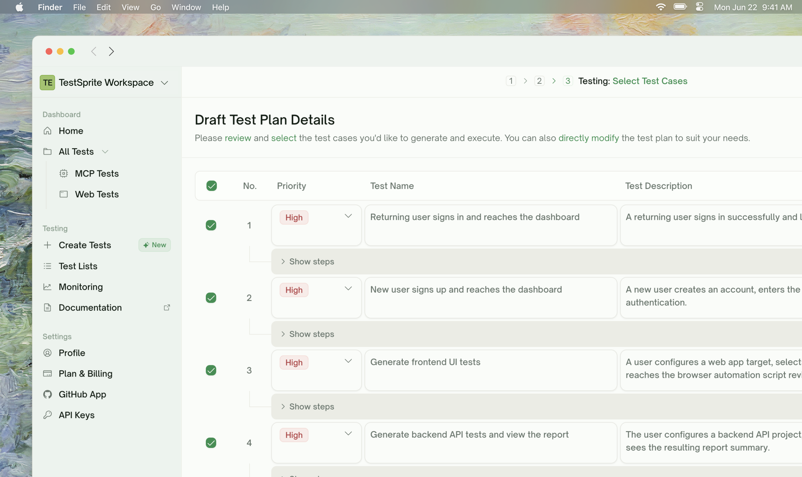
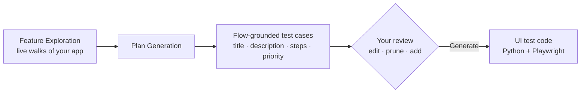
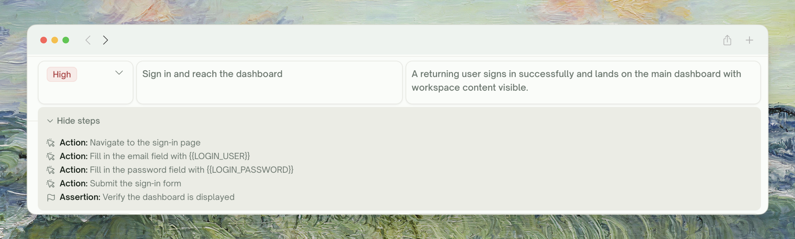
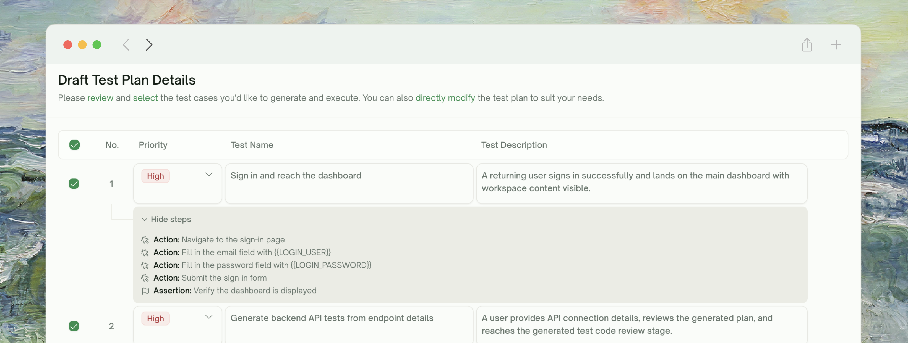
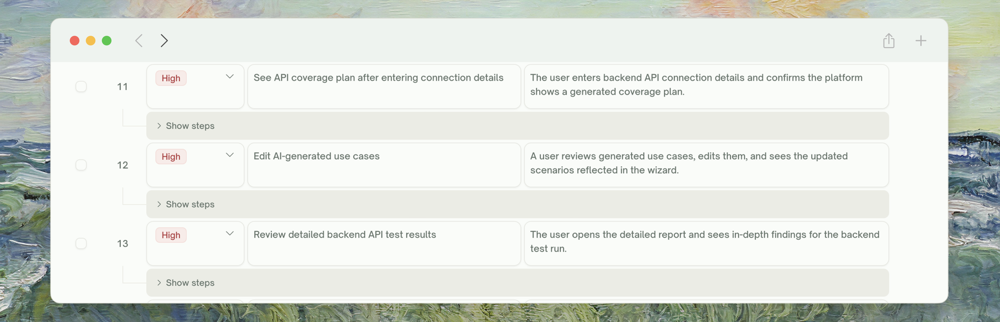
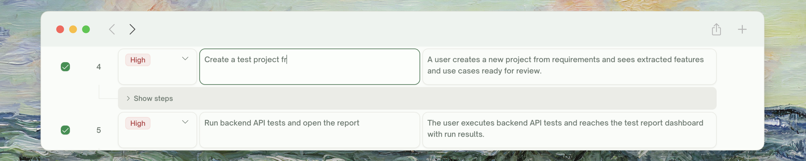
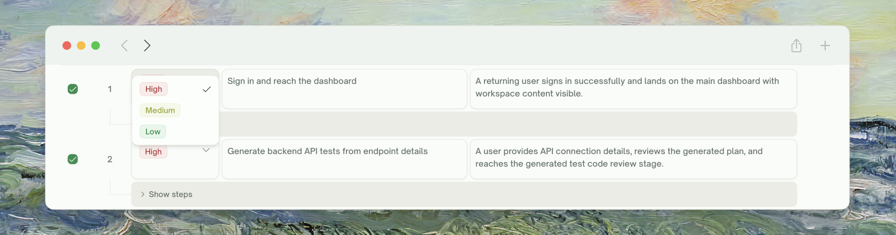
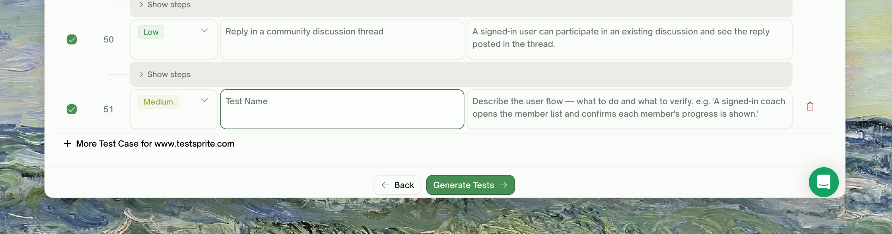
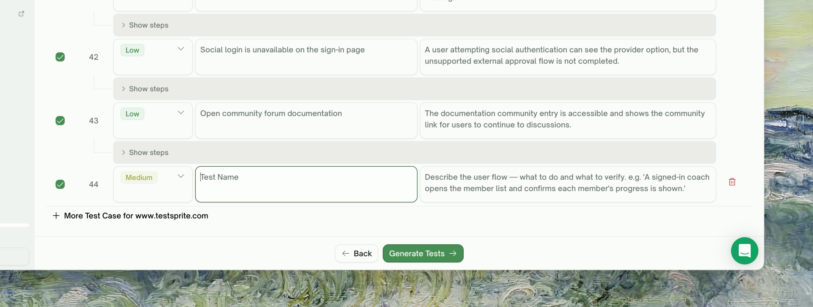
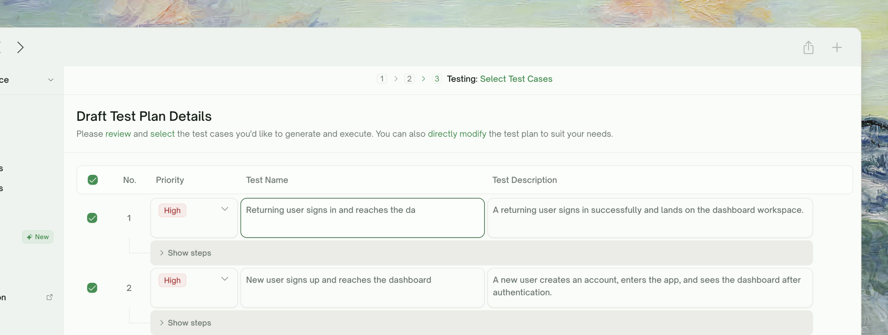

<Frame>
  
</Frame>

## What Plan Generation Does

UI Plan Generation takes the [Feature Exploration](/web-portal/core/ui/feature-exploration) output — the live walks TestSprite did through your app — and turns each feature into a list of test cases grounded in **real observed flows**. The plan is the contract you review and edit before any test code is written.

<Card>

</Card>

UI plans are **flow-grounded**: each case references an actual sequence of clicks, fills, and assertions TestSprite saw work during exploration. A plan row reads like:

> *"Verify a new user can sign up with a valid email and lands on the welcome screen"*

— not a description of an internal endpoint or contract. The plan reflects how a user actually moves through your app.

<Info>
**Nothing executes during plan generation.** No browser actions are issued. Plan generation is a pure read of: explored features + your description + extra-context hints + (Pro) your account-level UI conventions.
</Info>

## What Goes Into the Plan

| Input | Where it comes from | How it's used |
| :--- | :--- | :--- |
| <kbd>Explored features</kbd> | [Feature Exploration](/web-portal/core/ui/feature-exploration) | One sub-plan per feature, with cases grounded in observed flows |
| <kbd>PRD / extra context</kbd> | Configuration step | Shapes what's "in scope" vs "out of scope" |
| <kbd>Test account credentials</kbd> | Configuration step | Inform how authenticated paths get tested |
| <kbd>Site map (Use Case Flow)</kbd> | Built during exploration | Used as context — TestSprite knows which features connect |

Features that **couldn't be explored** (login wall, paywall, error page) get spec-based plans instead — derived from your description and extra context, but flagged as such so you know they're not flow-grounded.

## The Plan Structure

Each plan row is one test case with a **title**, **description**, and **priority**. Plan generation also produces an underlying **step list** — concrete Actions (clicks, fills, navigations) and Assertions (what to verify) — that's revealed per-row via a Show steps toggle.
<Frame>
  
</Frame>
Case count varies with feature complexity. A simple "Forgot Password" might get a couple of cases; a complex "Checkout" can produce 10+. Cases range from focused checks ("error shown when password is wrong") to whole-flow walks ("sign up, verify email, land on welcome").

<Tip>
**Plans use real observed flows when exploration covered the feature.** If feature exploration walked a checkout flow end-to-end, the plan knows the actual button labels ("Place order"), the actual confirmation URL, the actual fields in the address form. The plan will reference those literally — not generic "submit button". Features that couldn't be explored (login wall, paywall) get spec-based plans derived from your description instead.
</Tip>

## Reviewing the Plan

The plan view is a flat list of cases. Each row shows checkbox · No. · priority · title · description, with a per-row toggle to reveal the underlying step list.

<Steps>
  <Step title="Read the description, then Show steps if you need detail">
    The description is what drives generation. Click **Show steps** under the row to see the Action / Assertion list TestSprite will execute. Steps are read-only — adjust them by editing the description above.
      <Frame>
      
    </Frame>
  </Step>
  <Step title="Untick anything you don't want">
    Per-row checkbox toggles a single case. The header checkbox toggles **Select All** for the whole list.
        <Frame>
      
    </Frame>
  </Step>
  <Step title="Edit titles and descriptions in natural language">
    Both **Test Name** and **Test Description** are direct text inputs. Plain-text edits feed directly into generation.
          <Frame>
      
    </Frame>
  </Step>
  <Step title="Adjust priority if you want a case run first">
    Each row has a Priority dropdown (default **Medium**). Higher-priority cases run earlier when execution kicks in.
    <Frame>
      
    </Frame>
  </Step>
  <Step title="Add a custom case">
    Click **+ More Test Case** at the bottom of the list (the button is suffixed with the project name). A new row is inserted with empty title and description for you to fill in — included in the same generation batch as the rest.
    <Frame>
      
    </Frame>
  </Step>
</Steps>

<Tip>
**Don't be precious about pruning.** Selecting all is usually right on a first run for full coverage. The high-leverage cases tend to be 60% of what's there; pruning the rest makes runs faster but doesn't change correctness.
</Tip>

## Adding Test Cases in Natural Language

The bottom of the plan list has a chat input. TestSprite parses the request, figures out which feature it applies to, and writes a new case row.
<Frame>
  
</Frame>
<CodeGroup>
```text Targeted addition
Add a test for the Cart feature: user adds 3 items, then removes 1, then verifies the count is 2 and the total updates correctly.
```

```text Cross-feature scenario
Test that signing out from any page returns the user to the login screen.
```

```text Visual / accessibility
For the Search feature, add a test that the keyboard arrow keys navigate through the results dropdown.
```
</CodeGroup>

<Info>
**The added test gets grounded if the feature was explored.** If exploration walked the Cart, the new "remove an item" test inherits the explored selectors and flow. If the feature wasn't explored, the new case is spec-based.
</Info>

## Refining the Plan via Natural Language

Beyond Add-a-test, the chat panel supports broader refinements:
<Frame>
  
</Frame>
<CodeGroup>
```text Drop
Drop all the accessibility tests — we have a separate a11y suite.
```

```text Scope
For the Checkout feature, the test for "guest checkout" doesn't apply — we don't support guest checkout.
```

```text Tighten
Make the Login tests more strict about error messages: assert the exact error text, not just that "an error appears".
```
</CodeGroup>

TestSprite applies the request to the affected rows, re-renders the plan, and you can review/undo before clicking **Generate Tests**.

## What "Generate Tests" Triggers

Clicking **Generate Tests** advances the wizard to the next phase. The plan is frozen at click time — subsequent edits would require a re-generation.

<Card title="UI Test Generation" href="/web-portal/core/ui/ui-test-gen" icon="cube">
  Each plan case becomes a runnable Python + Playwright test
</Card>

## Plan Generation and Free-Plan Limits

<Card title="Plan Generation is free for all plans" href="/web-portal/admin/billing-and-plans" icon="credit-card">
  The credit cost lands at test generation (one credit per test) and exploration (counted against the 10-feature lifetime cap on Free, unlimited on paid).
</Card>

## Spec-Based Cases (Fallback for Unexplored Features)

When Feature Exploration couldn't reach a feature — paywall, login failure, transient error — plan generation still produces a plan for it, but **derived from your description and any extra context**, not from a real walk. These cases are flagged with a **Spec-based** badge.

Spec-based cases are best-effort:

- **They might be wrong about specific selectors or button labels** (no observed flow to ground them)
- **They might miss flows you actually have** (only what you described made it into the plan)
- **They still run.** Generation produces real Playwright code; selectors are resolved against the live DOM at run time.

If a spec-based case fails on first run, refine in chat with the actual UI labels — TestSprite will rewrite the test against the real flow.

## When the Plan Looks Wrong

<AccordionGroup>
  <Accordion title="A test is asserting on something that doesn't exist (e.g. a button labelled 'Submit' that's actually 'Save')">
    The case is spec-based or pre-redesign. Refine: "The button is labelled 'Save', not 'Submit'". TestSprite rewrites.
  </Accordion>
  <Accordion title="An obvious feature has zero test cases">
    Feature Exploration probably didn't reach it (check the exploration summary panel). Either:
    - Re-run exploration with a clearer test account or extra context
    - Add cases manually via chat
  </Accordion>
  <Accordion title="Tests are too generic — they don't reflect our domain">
    Add domain-specific extra context: "Our checkout has a special 'Express' lane for returning customers — make sure tests cover that path". Future runs incorporate it.
  </Accordion>
  <Accordion title="The plan has too many tests for a small feature">
    Untick the ones you find low-value. Plan generation errs on the side of coverage; you can prune to taste.
  </Accordion>
  <Accordion title="The plan ignored something I uploaded as a PRD">
    The PRD shapes the plan but doesn't override exploration. If exploration didn't walk the feature your PRD describes, plan generation falls back to spec-based — and your PRD wording may not have specific enough selectors to make the case work. Refine after generation.
  </Accordion>
</AccordionGroup>

## Where to Go Next

<Columns cols={2}>
  <Card title="Test Generation (UI)" href="/web-portal/core/ui/ui-test-gen" icon="cube">
    The next phase — turn the plan into runnable Playwright code
  </Card>
  <Card title="Step-by-Step Walkthrough" href="/web-portal/core/ui/ui-step-by-step" icon="list-check">
    What you'll see during execution
  </Card>
  <Card title="Refining Tests" href="/web-portal/core/working-with-test/refining-tests" icon="pen">
    Natural-language adjustments after generation
  </Card>
  <Card title="UI Testing — Overview" href="/web-portal/core/ui/ui-testing" icon="window-maximize">
    Step back to the journey map
  </Card>
</Columns>
