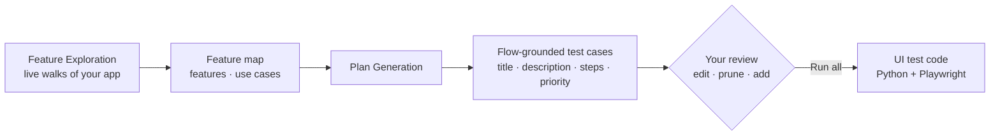

<Frame>
  
</Frame>

## What Plan Generation Does

TestSprite's testing agent takes what [Feature Exploration](/web-portal/core/ui/feature-exploration) observed in your app and plans test cases for each feature. The plan is what you review and edit before any test code is written.

<Card>

```mermaid
flowchart LR
    A[Feature Exploration<br/>live walks of your app] --> M[Feature map<br/>features · use cases] --> B[Plan Generation]
    B --> C[Flow-grounded test cases<br/>title · description · steps · priority]
    C --> D{Your review<br/>edit · prune · add}
    D -->|Run all| E[UI test code<br/>Python + Playwright]
```
</Card>

UI plans are **flow-grounded**: each case follows a sequence of clicks, fills, and assertions the agent saw work during exploration, using your real button labels, URLs, and form fields. A plan row reads like *"Verify a new user can sign up with a valid email and lands on the welcome screen"*.

<Info>
**Nothing runs during plan generation.** No browser actions are issued.
</Info>

## What Goes Into the Plan

| Input | Where it comes from | How it's used |
| :--- | :--- | :--- |
| <kbd>Explored features</kbd> | [Feature Exploration](/web-portal/core/ui/feature-exploration) | One sub-plan per feature, with cases grounded in observed flows |
| <kbd>PRD / extra context</kbd> | The New Project form's **Extra Context** step | Shapes what's "in scope" vs "out of scope" |
| <kbd>Test account credentials</kbd> | The New Project form's **Access details** step | Inform how authenticated paths get tested |
| <kbd>Feature map</kbd> | [Test Coverage](/web-portal/core/working-with-test/coverage-map), built from your PRD and exploration | Groups and scopes the tests by use case, and shows which features connect |

Features exploration couldn't reach get [spec-based cases](#spec-based-cases-fallback-for-unexplored-features) instead.

## The Plan Structure

Each plan row is one test case with a **title**, **description**, and **priority**, plus a step list (Actions such as clicks, fills, and navigations, and Assertions to verify) revealed with the **Show flow** toggle.
<Frame>
  
</Frame>
Case count varies with the feature: a simple "Forgot Password" might get a couple of cases, a complex "Checkout" 10 or more.

## Reviewing the Plan

The plan view lists cases grouped by use case. Each row shows checkbox · No. · priority · title · description.

<Steps>
  <Step title="Read the description, then Show flow if you need detail">
    The description is what drives generation. Click **Show flow** to see the Action / Assertion list; you can edit a step's text right there.
    <Frame>
      
    </Frame>
  </Step>
  <Step title="Untick anything you don't want">
    Each row's checkbox toggles one case; the header checkbox is **Select All**.
        <Frame>
      
    </Frame>
  </Step>
  <Step title="Edit titles and descriptions">
    **Test Name** and **Test Description** are plain text inputs, and your edits feed straight into generation.
          <Frame>
      
    </Frame>
  </Step>
  <Step title="Adjust priority if you want a case run first">
    Each row has a Priority dropdown (default **Medium**). Higher-priority cases run earlier.
    <Frame>
      
    </Frame>
  </Step>
  <Step title="Add a custom case">
    Click **+ More Test Case** at the bottom of the list (suffixed with the use case's name) and fill in the new row. It's generated with the rest.
    <Frame>
      
    </Frame>
  </Step>
</Steps>

<Tip>
**Selecting all is usually right on a first run.** Pruning makes runs faster but doesn't change correctness.
</Tip>

## Adding and Refining in Natural Language

Ask in **Chats** to add a case or change several at once. TestSprite works out which feature the request applies to and updates the plan; you can review or undo before clicking **Run all**.

<CodeGroup>
```text Add
Add a test for the Cart feature: user adds 3 items, then removes 1, then verifies the count is 2 and the total updates correctly.
```

```text Refine
Make the Login tests more strict about error messages: assert the exact error text, not just that "an error appears".
```
</CodeGroup>

A case added for an explored feature inherits its observed selectors and flow; otherwise it's spec-based.

## What "Run all" Triggers

Clicking **Run all** adds the cases and starts the first run, which generates and runs each test. The plan is frozen at click time; later edits require a re-generation.

<Card title="UI Test Generation & Execution" href="/web-portal/core/ui/ui-test-gen" icon="cube">
  Each plan case becomes a runnable Python + Playwright test
</Card>

## Spec-Based Cases (Fallback for Unexplored Features)

When exploration couldn't reach a feature (paywall, login failure, transient error), the plan for it is **derived from your description and extra context** instead of a real walk. These cases are best-effort:

- **Selectors or button labels may be wrong**, since there's no observed flow to ground them
- **They may miss flows you have**, since only what you described is in the plan
- **They still run**: selectors are resolved against the live DOM at run time

If one fails on its first run, refine it with the actual UI labels and TestSprite rewrites the test against the real flow.

## When the Plan Looks Wrong

<AccordionGroup>
  <Accordion title="A test is asserting on something that doesn't exist (e.g. a button labelled 'Submit' that's actually 'Save')">
    The case is spec-based or pre-redesign. Refine it: "The button is labelled 'Save', not 'Submit'", and TestSprite rewrites it.
  </Accordion>
  <Accordion title="An obvious feature has zero test cases">
    Exploration probably didn't reach it (check exploration on the <kbd>Sources</kbd> page). Re-run exploration with a clearer test account or extra context, or add cases via chat.
  </Accordion>
  <Accordion title="Tests are too generic and don't reflect our domain">
    Add domain-specific extra context, e.g. "Our checkout has an 'Express' lane for returning customers; make sure tests cover it". Future runs incorporate it.
  </Accordion>
  <Accordion title="The plan ignored something I uploaded as a PRD">
    The PRD shapes the plan but doesn't override exploration. If exploration didn't walk the feature your PRD describes, the case is spec-based and may lack specific selectors. Refine after generation.
  </Accordion>
</AccordionGroup>

## Where to Go Next

<Columns cols={2}>
  <Card title="Test Generation & Execution (UI)" href="/web-portal/core/ui/ui-test-gen" icon="cube">
    Turn the plan into runnable Playwright code
  </Card>
  <Card title="Step-by-Step Replay" href="/web-portal/core/ui/ui-step-by-step" icon="list-check">
    What you'll see during execution
  </Card>
  <Card title="Managing Test Cases" href="/web-portal/core/working-with-test/managing-test-cases" icon="pen">
    Natural-language adjustments after generation
  </Card>
</Columns>
