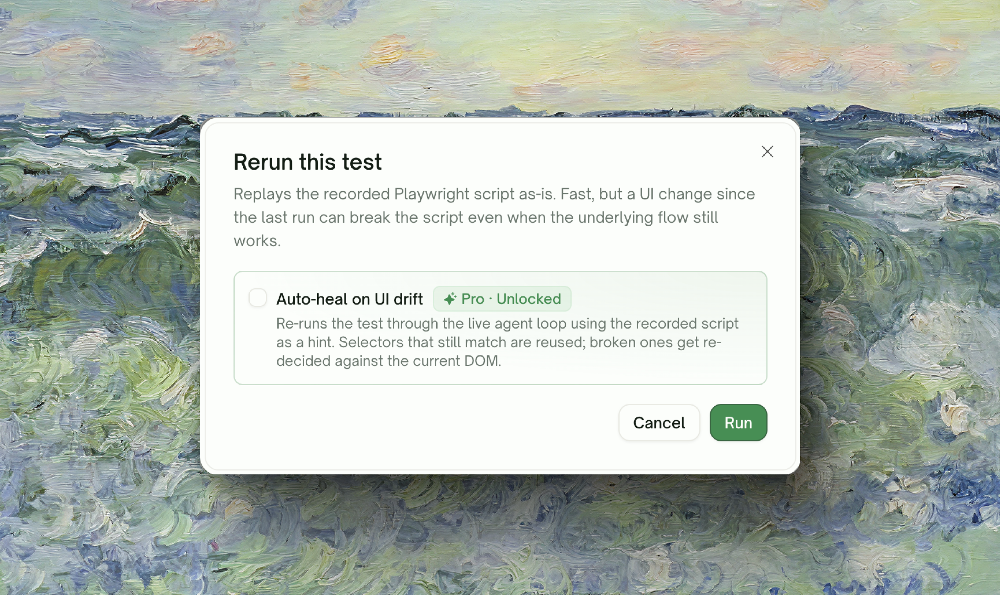
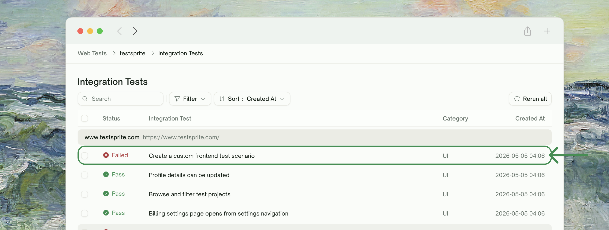
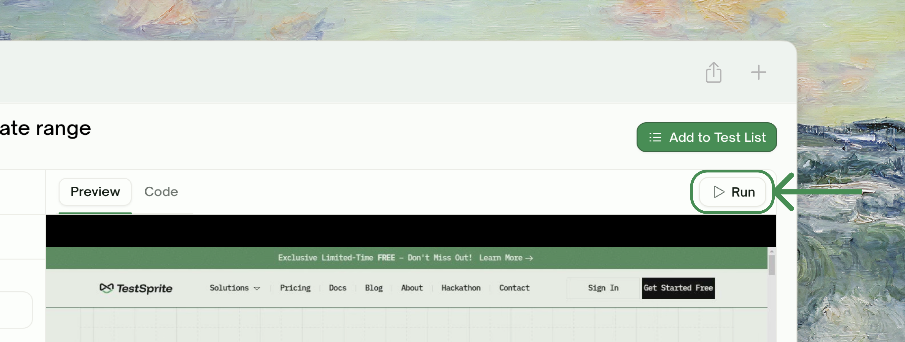
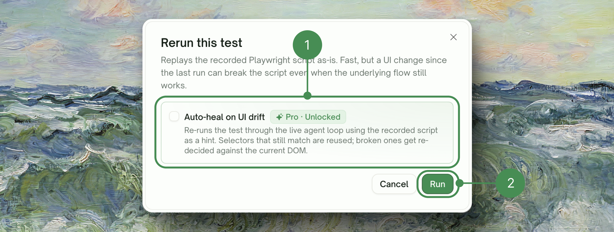
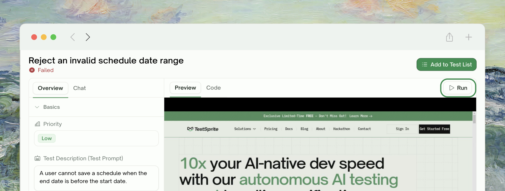
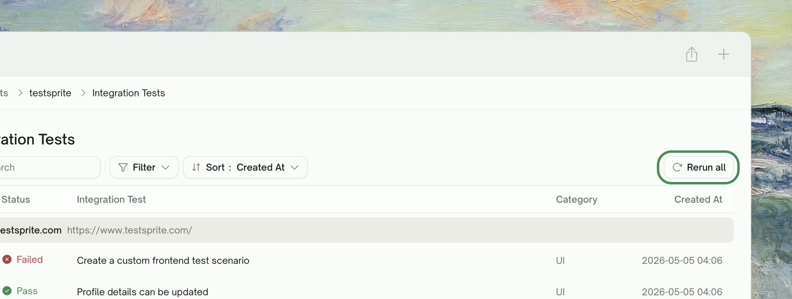
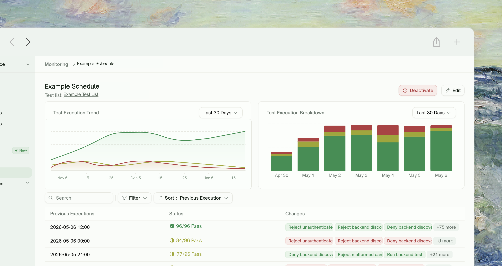

<Frame>
  
</Frame>

## What Rerun Does

Rerun re-executes a UI test against your live app using the test's saved Playwright script. Same actions, same assertions — replayed from scratch. There are three places you can trigger a rerun from, plus an optional **Auto-Heal** toggle that recovers tests when the page changed but the flow is fine (Pro plans).

This page is about plain rerun — what it does, where it lives, and how to use it. The Auto-Heal mechanics live on their own page.

<Card title="Auto-Heal (Pro)" href="/web-portal/core/ui/auto-heal" icon="wand-magic-sparkles">
  How TestSprite recovers UI tests when the page changed but the flow is fine
</Card>

## Quick Start

<Steps>
  <Step title="Open the test you want to rerun">
    From your project's **Integration Tests** list (sidebar default for UI projects), click into the test.
    <Frame>
      
    </Frame>
  </Step>
  <Step title="Click Run">
    The button in the right panel's tab bar is labeled <kbd>Run</kbd> when the editor is clean, or <kbd>Save & Run</kbd> when there are unsaved edits. Clicking it opens the **Rerun this test** confirmation dialog.

    The dialog has one toggle: **Auto-heal on UI drift** (Pro). Free-plan users see it locked with a Pro badge; Pro-plan users can toggle per rerun.
    <Frame>
      
    </Frame>
  </Step>
  <Step title="Confirm">
    Replay starts immediately. If you opted into Auto-Heal and the page has changed, the test is recovered automatically — see [Auto-Heal](/web-portal/core/ui/auto-heal) for what it covers.
    <Frame>
      
    </Frame>
  </Step>
  <Step title="Watch live or come back later">
    The test detail page updates in real time. You can stay and watch or navigate away and check the result later.
  </Step>
</Steps>

## Three Rerun Surfaces

### Single Test Rerun

From a test's detail page, click <kbd>Run</kbd> (or <kbd>Save & Run</kbd> if there are unsaved edits) → confirm in the **Rerun this test** dialog → done. The Auto-Heal toggle in the dialog is decided per rerun.

<Frame>
  
</Frame>

### Rerun All (Batch)

The <kbd>Rerun all</kbd> button on the project's Tests page toolbar queues every test in the project — useful after a refactor, dependency upgrade, or design pass. The Auto-Heal opt-in applies to the whole batch; tests that pass cleanly cost the same as a regular rerun, so opting in doesn't penalize a healthy suite.

<Frame>
  
</Frame>

### Scheduled Reruns

Schedules re-run your tests on a cadence (Hourly, Daily, Weekly, Monthly) and carry their own **Enable auto-heal** toggle, set once at creation. Agent minutes are only consumed when replay actually fails, so a schedule full of clean tests stays cheap — and overnight UI drift gets absorbed instead of paging someone in the morning.

<Frame>
  
</Frame>

<Card title="Schedule Monitoring" href="/web-portal/maintenance/monitoring" icon="clock">
  Set up cadences and route notifications
</Card>

## Edge Cases & Troubleshooting

<AccordionGroup>
  <Accordion title="The test always fails on rerun, even though I just regenerated it">
    Rerun replays the *saved* script. If you regenerated the test through Refining or a fresh generation, the saved script may be stale relative to your latest plan. Try a regular Run (not Rerun) to overwrite the saved artifact, then Rerun.
  </Accordion>
  <Accordion title="Rerun started but the page didn't update">
    The test detail page subscribes to live status updates. If you don't see progress within a few seconds, refresh — the rerun is still happening server-side; this is just a live-update hiccup.
  </Accordion>
  <Accordion title="I want to keep my unsaved edits but rerun the saved version">
    The single-button design means clicking <kbd>Save & Run</kbd> always saves first. To rerun without saving, discard your edits via `Cmd`/`Ctrl`+`Z` or by reverting the editor, then click <kbd>Run</kbd>. There is no "rerun-without-save-from-dirty-state" path by design — the dirty indicator (warning dot) signals you'd be running a different script than what's persisted.
  </Accordion>
  <Accordion title="Rerun all is greyed out">
    Either the project has no tests yet (still in plan-gen), or another project-level operation is in flight (e.g. an active wizard run). Wait for that to complete; the button re-enables when the project is idle.
  </Accordion>
</AccordionGroup>

## Where to Go Next

<Columns cols={2}>
  <Card title="Auto-Heal (Pro)" href="/web-portal/core/ui/auto-heal" icon="wand-magic-sparkles">
    Recover UI tests when the page changed but the flow is fine
  </Card>
  <Card title="Step-by-Step Walkthrough" href="/web-portal/core/ui/ui-step-by-step" icon="list-check">
    See exactly what happened on each step of a run
  </Card>
  <Card title="Schedule Monitoring" href="/web-portal/maintenance/monitoring" icon="clock">
    Set up nightly schedules to catch drift early
  </Card>
  <Card title="Comparing Runs" href="/web-portal/maintenance/comparing-runs" icon="code-compare">
    Diff two runs to see what changed step-by-step
  </Card>
</Columns>
