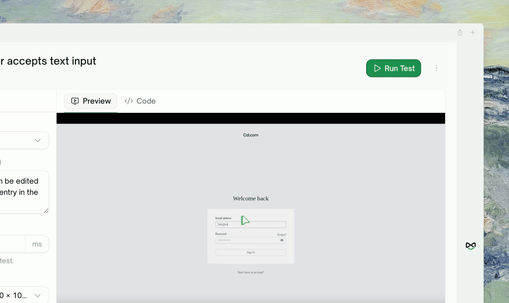
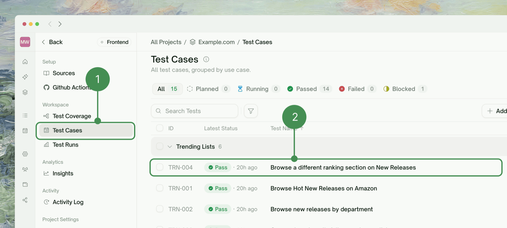
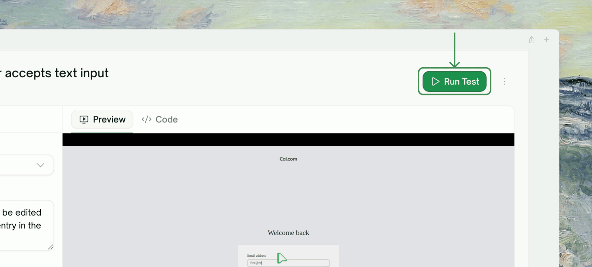
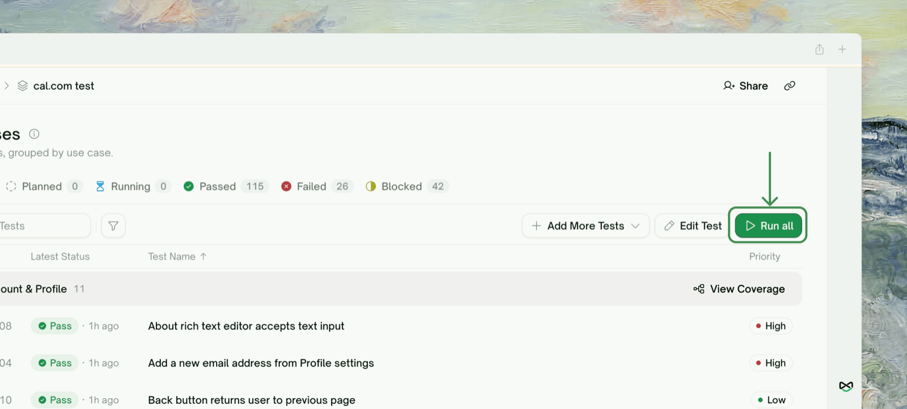

<Frame>
  
</Frame>

## What Rerun Does

Rerun re-executes a UI test against your live app from its saved script: same actions, same assertions, replayed from scratch. You can rerun one test, the whole project, or on a schedule; [Auto-Heal](/web-portal/core/ui/auto-heal) recovers tests when the page changed but the flow is fine. When the test itself needs to change first, use [Edit Steps & Rerun](#edit-steps--rerun).

## Quick Start

<Steps>
  <Step title="Open the test you want to rerun">
    From your project's **Test Cases** list in the sidebar, click into the test.
    <Frame>
      
    </Frame>
  </Step>
  <Step title="Click Run test">
    The button in the test's header reads <kbd>Run test</kbd>, or <kbd>Save & Run</kbd> when there are unsaved edits. Replay starts immediately.
    <Frame>
      
    </Frame>
  </Step>
  <Step title="Watch live or come back later">
    The test detail page updates in real time; you can leave and check the result later.
  </Step>
</Steps>

## Three Rerun Surfaces

### Single Test Rerun

<kbd>Run test</kbd> (or <kbd>Save & Run</kbd>) on a test's detail page, as in the Quick Start above.

### Rerun All (Batch)

<kbd>Run all</kbd> on the project's <kbd>Test Cases</kbd> toolbar queues every test in the project, useful after a refactor, dependency upgrade, or design pass.

<Frame>
  
</Frame>

### Scheduled Reruns

Schedules re-run your tests on a cadence (Hourly, Daily, Weekly, Monthly). See [Test Schedules](/web-portal/maintenance/monitoring).

<Frame>
  
</Frame>

## Edit Steps & Rerun

{/* V3.1 (Sherry): new section — modify steps then rerun, per V3.1 item 4.9.5 */}

When a test fails because the *test* is wrong (a step references a button that moved, or the flow gained a confirmation screen), fix the steps instead of rerunning the same script. Steps on a run's page are read-only history; edit on the test case, which the run page links to.

<Frame>
  
</Frame>

<Steps>
  <Step title="Open the editor">
    On a test case's detail page, click <kbd>Edit Steps</kbd> beside the **Runtime steps** section, or hover a step and click its pencil icon (*Edit steps & re-run from here*) to start editing **from that step**.
    <Frame>
      
    </Frame>
  </Step>
  <Step title="Rewrite from the pivot">
    If you started from a specific step, everything before it is **locked**. From that step on, change a step's text, toggle it between <kbd>Action</kbd> and <kbd>Assert</kbd>, insert steps with <kbd>Add step</kbd>, or delete steps.
  </Step>
  <Step title="Keep the pass criterion in sync">
    The run is **judged against** the <kbd>What counts as a pass</kbd> field at the top, not the steps. If your edits change what the test proves, update it too, or the run can do exactly what you asked and still fail.
  </Step>
  <Step title="Save & Re-Run">
    Click <kbd>Save & Re-Run</kbd>. The edited steps become the test's new definition (a new version appears in the version history), and the whole test runs immediately.
  </Step>
</Steps>

<Note>
**Locked ≠ skipped.** Every run starts from a fresh browser session, so locked steps still run exactly as written; they're only protected from editing.
</Note>

### Edit-and-Rerun vs. Plain Rerun

| | Plain Rerun | Edit Steps & Rerun |
|---|---|---|
| Test definition | Unchanged: replays the saved steps | Replaced: your edits become the new definition |
| Version history | No new version | A new version is created |
| When to use | Checking whether a failure reproduces, or whether the app was fixed | The failure is in the test itself: steps are stale or incomplete |

Edit Steps & Rerun is available for standalone UI test cases. It's not available for API tests, integration chains, read-only views (viewer role, historical versions), or while a run is in flight.

## Edge Cases & Troubleshooting

<AccordionGroup>
  <Accordion title="Rerun started but the page didn't update">
    If you don't see progress within a few seconds, refresh. The rerun is still happening; this is just a live-update hiccup.
  </Accordion>
  <Accordion title="I want to keep my unsaved edits but rerun the saved version">
    <kbd>Save & Run</kbd> always saves first. To rerun the saved version, discard your edits (`Cmd`/`Ctrl`+`Z` or revert the editor), then click <kbd>Run test</kbd>. The warning dot on a dirty editor tells you you'd be running a different script than what's saved.
  </Accordion>
  <Accordion title="Run all is greyed out">
    Either the project has no tests yet (still in plan generation), or another project-level operation, such as an active run, is in flight. The button re-enables when the project is idle.
  </Accordion>
</AccordionGroup>

## Where to Go Next

<Columns cols={2}>
  <Card title="Step-by-Step Replay" href="/web-portal/core/ui/ui-step-by-step" icon="list-check">
    See exactly what happened on each step of a run
  </Card>
  <Card title="Test Schedules" href="/web-portal/maintenance/monitoring" icon="clock">
    Set up nightly schedules to catch drift early
  </Card>
  <Card title="Insights" href="/web-portal/results/project-overview" icon="gauge">
    Regressions and quality trends across runs
  </Card>
</Columns>
