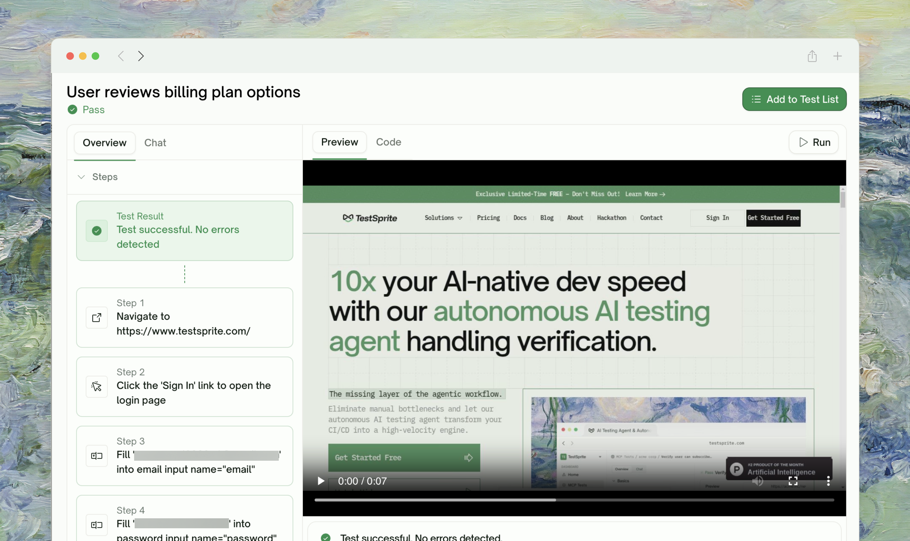
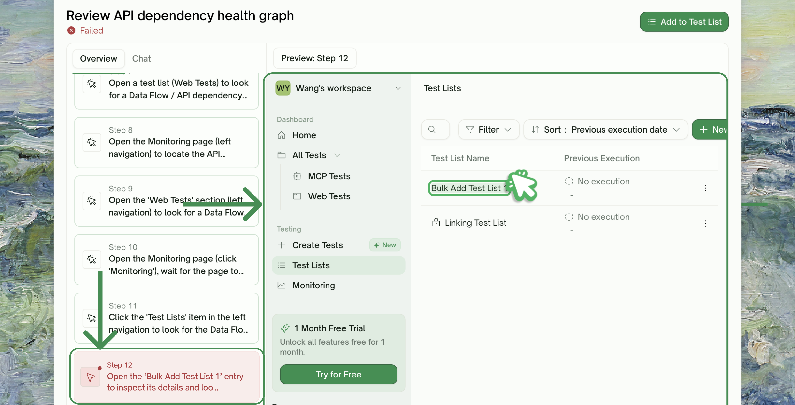
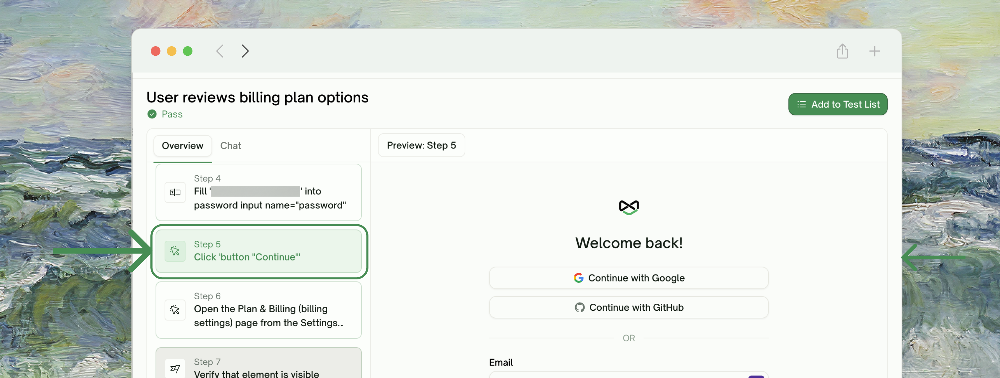
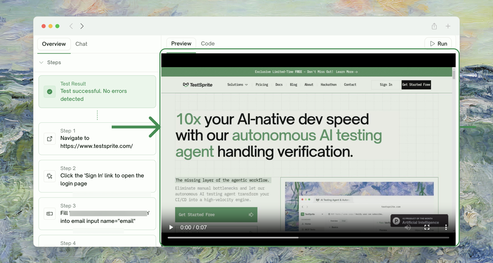
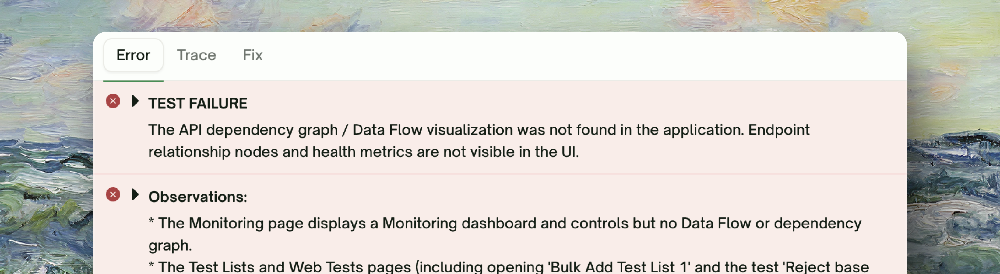

<Frame>
  
</Frame>

## What Step-by-Step Shows

The **Steps** panel sits inside the test detail page's **Overview** tab — one row per action and assertion the test took during execution. A **Test Result** block at the top shows the run-level outcome (PASSED / FAILED / BLOCKED / RUNNING); click any step row to load the **HTML snapshot** of the page at that moment in the right pane.

<Frame>
  
</Frame>

| Element | What it shows |
| :--- | :--- |
| <kbd>Step number</kbd> | Order in the run (1, 2, 3…) |
| <kbd>Action / Assertion</kbd> | The kind of step — `click`, `fill`, `navigate`, `scroll`, `wait` for actions; `visible`, `text`, `url`, `enabled` for assertions |
| <kbd>Description</kbd> | Plain-English summary of what the step did or checked |
| <kbd>Status</kbd> | Green (passed), red (failed), neutral (no assertion) |

## Where to Find It

Click any UI test from the project test list to land on its detail page (see [Test Detail](/web-portal/core/working-with-test/test-detail) for the broader page). The **Steps** section inside the **Overview** tab is the Step-by-Step view.

<Frame>
  
</Frame>

For tests run from the schedule monitoring page, the same Steps view renders inside the schedule run's per-test detail.

<Info>
**Step data persists with the test row, not with the run.** The Steps section always shows the steps of the **most recent run** for that test. Older run history requires comparing two runs (see [Comparing Runs](/web-portal/maintenance/comparing-runs)).
</Info>

## The Video and the Snapshot

The test detail's right pane has a **Preview** tab with the full recorded video (default browser controls — play/pause, scrubbing, speed, mute) and a **Code** tab with the test code.

When you click a step in the left-side Steps list, the right pane swaps to an **HTML snapshot** of the page at that step. Click the **Test Result** block at the top of the steps list to return to the video view.

<Frame>
  
</Frame>

Use the video for a continuous run-through; use the steps + snapshot for action-by-action localization.

## Failure Localization

The failed step row is highlighted in the list. Click it to load the HTML snapshot from that moment, then open the failure detail panel below for the diagnosis.

<Frame>
  
</Frame>

| Tab | What you see |
| :--- | :--- |
| <kbd>Error</kbd> | The headline failure message — with a friendly explanation prepended for common error families TestSprite recognizes (see below) |
| <kbd>Trace</kbd> | The raw stack / step trace from the run |
| <kbd>Fix</kbd> | An AI-authored cause-and-fix suggestion |

### Recognized error families

TestSprite recognizes common failure patterns and prepends a plain-English headline:

| Pattern | Headline shown |
| :--- | :--- |
| <kbd>UI drift</kbd> | *"There was an element UI drift which may have caused the issue. The page's layout has likely changed since this step was recorded, so the expected element couldn't be found in time."* — try [Auto-Heal](/web-portal/core/ui/auto-heal) or refine the test description. |
| <kbd>Auth failure</kbd> | *"We encountered an issue logging into your site with the provided username and password. Please double-check your credentials and try again."* |

Anything else falls through to the raw error text under the **Error** tab. Use the **Fix** tab for an AI suggestion on those.

## When the Steps Look Fine but the Test Failed

Sometimes every step shows Passed but the overall test is Failed. This is rare; typically caused by:

| Cause | What it looks like |
| :--- | :--- |
| <kbd>Final assertion outside the step list</kbd> | Some test code asserts after the main flow finishes — the failing assertion isn't tied to a step row |
| <kbd>Hidden timeout</kbd> | The run took too long overall, even though no individual step did |
| <kbd>Post-run validation</kbd> | A check that runs after the main flow detects something the in-flight asserts missed |

Check the **Error / Trace / Fix** tabs in the right pane below the Preview/Code area for the error not surfaced in any step row.

## Auto-Heal and the Steps View

Auto-Heal reruns may follow a different action sequence than the recorded script. The steps list always reflects the most recent run, so an auto-heal rerun replaces it — but the saved test code stays untouched unless you explicitly save updates.

<Card title="Auto-Heal (Pro)" href="/web-portal/core/ui/auto-heal" icon="wand-magic-sparkles">
  How Auto-Heal recovers UI tests when the page changed but the flow is fine
</Card>

## Edge Cases & Troubleshooting

<AccordionGroup>
  <Accordion title="The Steps section is empty for a test that ran">
    The Steps panel shows "Collecting steps…" while the run is in progress and "No steps recorded for this test run." if the run finished without producing step records. Refresh once the test status flips to Passed/Failed.
  </Accordion>
  <Accordion title="A step's HTML snapshot shows a blank page or a loading spinner">
    The action triggered a navigation/render but the snapshot was captured before the new state stabilized. Common with very fast pages or animation-heavy UIs. The next step's snapshot usually shows the settled state.
  </Accordion>
  <Accordion title="The video is missing but the steps are there">
    Recording failed for this run. The steps + HTML snapshots still convey what happened; only the playback experience is degraded.
  </Accordion>
  <Accordion title="The steps show actions I didn't write into the test">
    Auto-heal ran and recovered. The step list reflects what actually executed, not the original saved script.
  </Accordion>
</AccordionGroup>

## Where to Go Next

<Columns cols={2}>
  <Card title="Test Detail" href="/web-portal/core/working-with-test/test-detail" icon="file-magnifying-glass">
    The full test page with error trace, refinement, and rerun
  </Card>
  <Card title="Comparing Runs" href="/web-portal/maintenance/comparing-runs" icon="code-compare">
    Side-by-side step-by-step diffs between runs
  </Card>
  <Card title="Auto-Heal (Pro)" href="/web-portal/core/ui/auto-heal" icon="wand-magic-sparkles">
    Re-execute with UI-drift recovery
  </Card>
  <Card title="Refining Tests" href="/web-portal/core/working-with-test/refining-tests" icon="pen">
    Adjust a step or whole test in natural language
  </Card>
</Columns>
