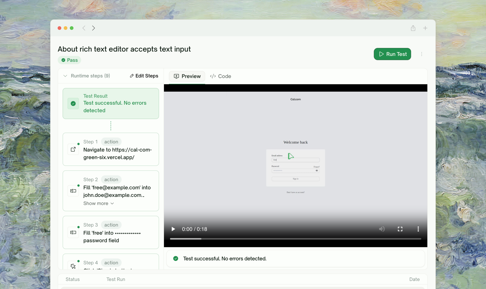
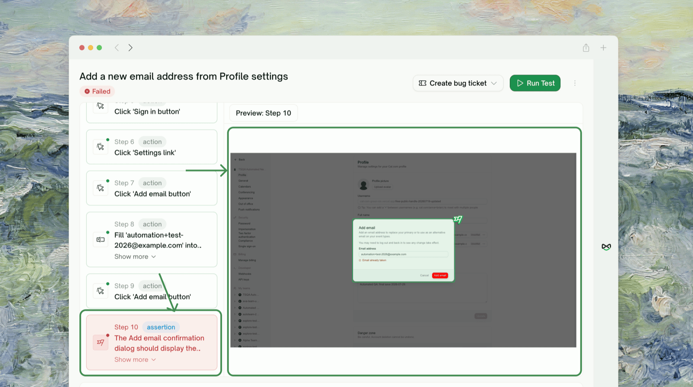
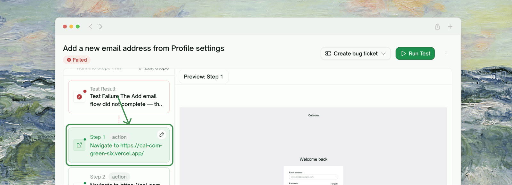
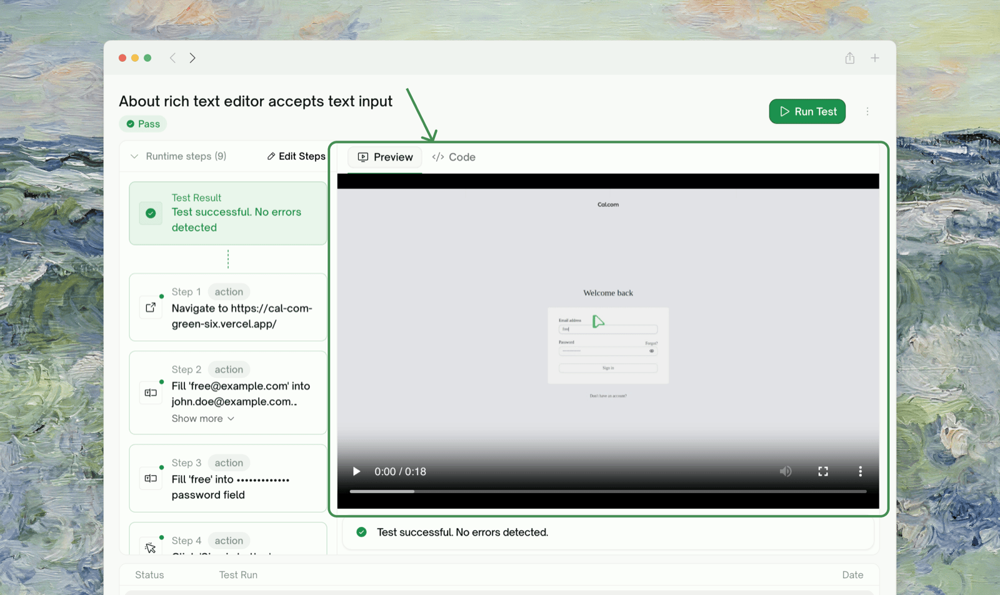
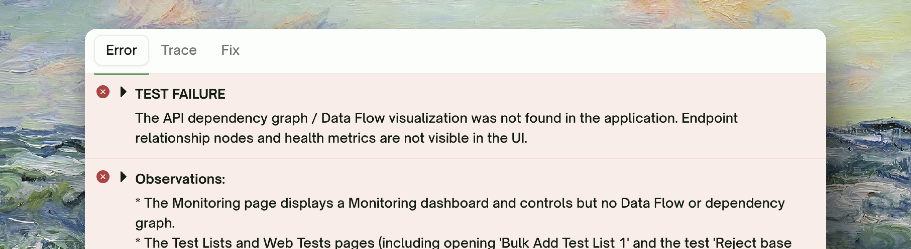
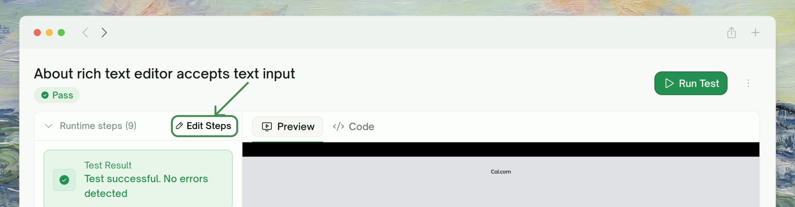
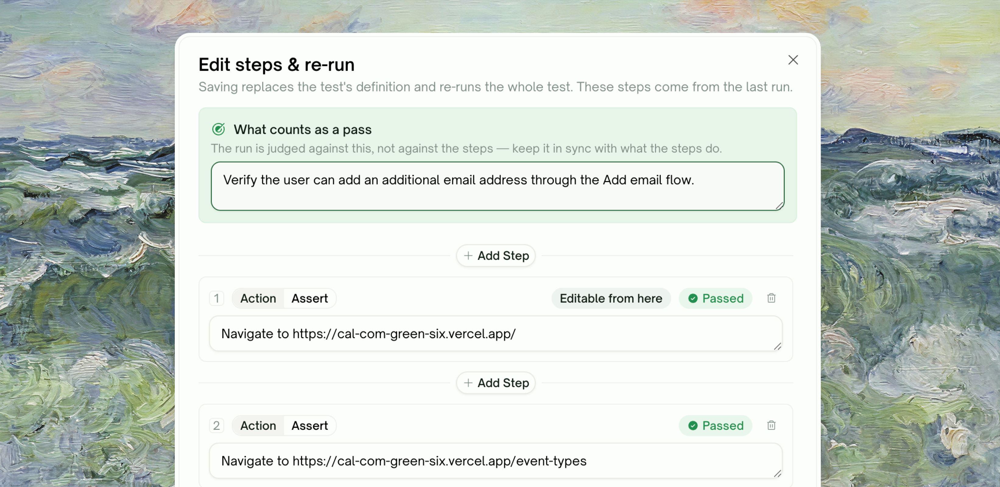

{/* #TODO_UPDATE — V3.1 修改（条目 4.9.4 · 4.9.5）：
  1. 补章节：错误信息、trace、输出怎么读
  2. 补章节：「修复建议 prompt」是什么、怎么拿去用
  3. 补章节：改完步骤直接重跑
*/}

<Frame>
  
</Frame>

## What Step-by-Step Shows

The **Steps** panel sits in the left column of the test detail page, with one row per action and assertion the test took during execution. A **Test Result** block at the top shows the run-level outcome (PASSED / FAILED / BLOCKED / RUNNING); click any step row to load the **HTML snapshot** of the page at that moment in the right pane.

<Frame>
  
</Frame>

| Element | What it shows |
| :--- | :--- |
| <kbd>Step number</kbd> | Order in the run (1, 2, 3…) |
| <kbd>Action / Assertion</kbd> | The kind of step — `click`, `fill`, `navigate`, `scroll`, `wait` for actions; `visible`, `text`, `url`, `enabled` for assertions |
| <kbd>Description</kbd> | Plain-English summary of what the step did or checked |
| <kbd>Status</kbd> | Green (passed), red (failed), neutral (no assertion) |

## Where to Find It

Click any UI test from the project test list to land on its detail page (see [Test Detail](/web-portal/core/working-with-test/test-detail) for the broader page). The **Steps** section in the left column is the Step-by-Step view.

<Frame>
  
</Frame>

For tests run from the Test Schedules page, the same Steps view renders inside the schedule run's per-test detail.

<Info>
**Step data persists with the test row, not with the run.** The Steps section always shows the steps of the **most recent run** for that test. Older run history requires comparing two runs (see [Comparing Runs](/web-portal/maintenance/comparing-runs)).
</Info>

## The Video and the Snapshot

The test detail's right pane has a **Preview** tab with the full recorded video (default browser controls — play/pause, scrubbing, speed, mute) and a **Code** tab with the test code.

When you click a step in the left-side Steps list, the right pane swaps to an **HTML snapshot** of the page at that step. Click the **Test Result** block at the top of the steps list to return to the video view.

<Frame>
  
</Frame>

Use the video for a continuous run-through; use the steps + snapshot for action-by-action localization.

## Failure Localization

The failed step row is highlighted in the list. Click it to load the HTML snapshot from that moment, then open the failure detail panel below for the diagnosis.

<Frame>
  
</Frame>

A UI test's failure detail has three tabs — read them in order:

| Tab | What you see |
| :--- | :--- |
| <kbd>Error</kbd> | *What* went wrong — the headline failure message, with a friendly explanation prepended for common error families TestSprite recognizes (see below). This is the assertion that failed or the reason the AI judge marked the run as not passing. |
| <kbd>Cause</kbd> | *Why* it went wrong — an AI diagnosis of the underlying reason, one level deeper than the raw error. |
| <kbd>Fix</kbd> | *What to do about it* — an AI-authored cause-and-fix suggestion. It's read-only guidance you apply yourself; a marker distinguishes it as AI-generated. |

<Note>
UI (frontend) tests show **Error / Cause / Fix**. The **Trace** tab — a raw stack/step trace — is a **backend-test** surface and is hidden for UI tests, which have no code stack to trace. A backend test additionally shows Trace (and, for API calls, the response output).
</Note>

### Recognized error families

TestSprite recognizes common failure patterns and prepends a plain-English headline:

| Pattern | Headline shown |
| :--- | :--- |
| <kbd>UI drift</kbd> | *"There was an element UI drift which may have caused the issue. The page's layout has likely changed since this step was recorded, so the expected element couldn't be found in time."* — try [Auto-Heal](/web-portal/core/ui/auto-heal) or refine the test description. |
| <kbd>Auth failure</kbd> | *"We encountered an issue logging into your site with the provided username and password. Please double-check your credentials and try again."* |

Anything else falls through to the raw error text under the **Error** tab. Use the **Fix** tab for an AI suggestion on those.

## Getting a Fix You Can Paste Into Your IDE

The **Fix** tab is read-only guidance for a single step. When you want something you can hand straight to a coding agent, TestSprite also produces a **copyable fix prompt** — a repo-oriented prompt that lists every concrete problem it found across the run and what to change, ready to paste into Claude Code, Cursor, or any LLM agent pointed at your codebase.

For a single failing test, the failure panel on this page has a **Copy fix prompt** button. For a prompt covering the whole run or several failures, you'll find it in two places:

<Columns cols={2}>
  <Card title="Test Report" href="/web-portal/results/test-report" icon="file-chart-column">
    The **Fix prompt for your coding agent** card — one prompt covering the whole run
  </Card>
  <Card title="Insights" href="/web-portal/results/project-overview" icon="gauge">
    The **Triage Queue** widget's **Copy Fix Prompt**, built from the clustered failing issues
  </Card>
</Columns>

## When the Steps Look Fine but the Test Failed

Sometimes every step shows Passed but the overall test is Failed. This is rare; typically caused by:

| Cause | What it looks like |
| :--- | :--- |
| <kbd>Final assertion outside the step list</kbd> | Some test code asserts after the main flow finishes — the failing assertion isn't tied to a step row |
| <kbd>Hidden timeout</kbd> | The run took too long overall, even though no individual step did |
| <kbd>Post-run validation</kbd> | A check that runs after the main flow detects something the in-flight asserts missed |

Check the **Error / Cause / Fix** tabs in the right pane below the Preview/Code area for the error not surfaced in any step row.

## Edit a Step and Re-Run

When a step is wrong — a bad description, a missing action, an assertion that doesn't match your intent — you can rewrite it and re-run the test in one move. This is how you *fix the test itself*, as opposed to reading a failure.

<Note>
The steps on a **run's** page are read-only history — a record of what happened, not an editor. To change the test, open its **test case** (the run page links straight to it) and edit there. Editing and re-running is available for **frontend/UI tests**.
</Note>

<Steps>
  <Step title="Open the step editor">
    On the test case, click <kbd>Edit Steps</kbd> — from the header, or from a specific executed step to start editing from that point.
    <Frame>
      
    </Frame>
  </Step>
  <Step title="Rewrite the steps">
    In the **Edit steps & re-run** dialog, each step is a plain-English description you can rewrite, and you can insert or delete steps. Because V3 executes natural-language steps, editing a step *is* authoring the test.

    - Steps **before your starting point are locked** — shown greyed with a lock. Locked ≠ skipped: they still re-execute exactly as written, they're just not what you're changing.
    - A pinned **"What counts as a pass"** field states the success criterion the AI judge scores the run against — edit it when you're changing what the test should prove.

    <Frame>
      
    </Frame>
  </Step>
  <Step title="Save & Re-Run">
    Click <kbd>Save & Re-Run</kbd>. TestSprite saves the edited steps as a new version of the test and immediately runs it — no separate navigation. The Steps view then reflects this new run.
  </Step>
</Steps>

<Note>
Saving replaces the test's definition and re-runs the whole test. For refining a test conversationally rather than editing steps directly, see [Refining Tests](/web-portal/core/working-with-test/refining-tests).
</Note>

## Auto-Heal and the Steps View

Auto-Heal reruns may follow a different action sequence than the recorded script. The steps list always reflects the most recent run, so an auto-heal rerun replaces it — but the saved test code stays untouched unless you explicitly save updates.

<Card title="Auto-Heal" href="/web-portal/core/ui/auto-heal" icon="wand-magic-sparkles">
  How Auto-Heal recovers UI tests when the page changed but the flow is fine
</Card>

## Edge Cases & Troubleshooting

<AccordionGroup>
  <Accordion title="The Steps section is empty for a test that ran">
    The Steps panel shows "Collecting steps…" while the run is in progress and "No steps recorded for this test run." if the run finished without producing step records. Refresh once the test status flips to Passed/Failed.
  </Accordion>
  <Accordion title="A step's HTML snapshot shows a blank page or a loading spinner">
    The action triggered a navigation/render but the snapshot was captured before the new state stabilized. Common with very fast pages or animation-heavy UIs. The next step's snapshot usually shows the settled state.
  </Accordion>
  <Accordion title="The video is missing but the steps are there">
    Recording failed for this run. The steps + HTML snapshots still convey what happened; only the playback experience is degraded.
  </Accordion>
  <Accordion title="The steps show actions I didn't write into the test">
    Auto-heal ran and recovered. The step list reflects what actually executed, not the original saved script.
  </Accordion>
</AccordionGroup>

## Where to Go Next

<Columns cols={2}>
  <Card title="Test Detail" href="/web-portal/core/working-with-test/test-detail" icon="file-magnifying-glass">
    The full test page with error trace, refinement, and rerun
  </Card>
  <Card title="Comparing Runs" href="/web-portal/maintenance/comparing-runs" icon="code-compare">
    Side-by-side step-by-step diffs between runs
  </Card>
  <Card title="Auto-Heal" href="/web-portal/core/ui/auto-heal" icon="wand-magic-sparkles">
    Re-execute with UI-drift recovery
  </Card>
  <Card title="Refining Tests" href="/web-portal/core/working-with-test/refining-tests" icon="pen">
    Adjust a step or whole test in natural language
  </Card>
</Columns>
