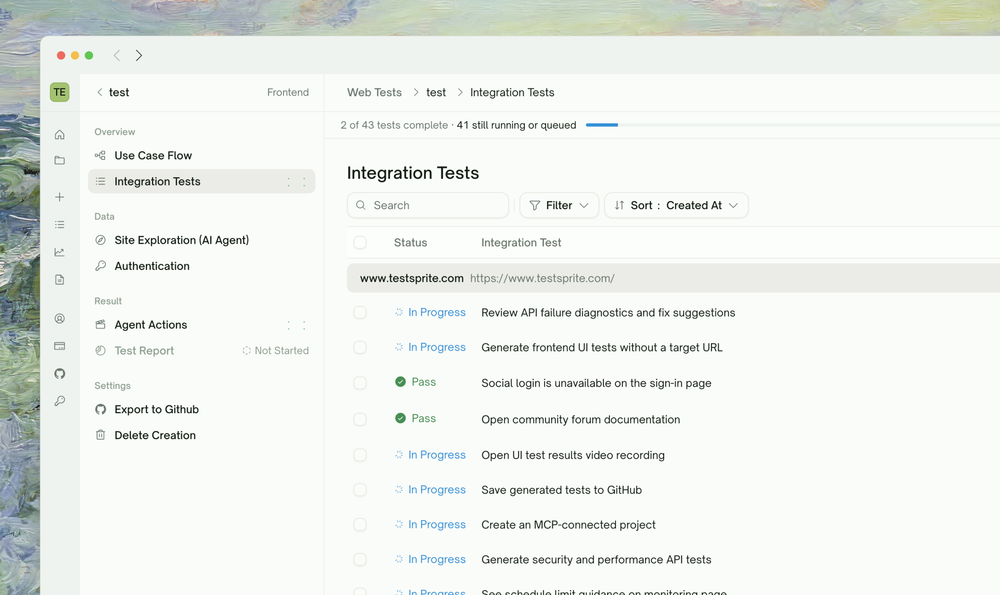
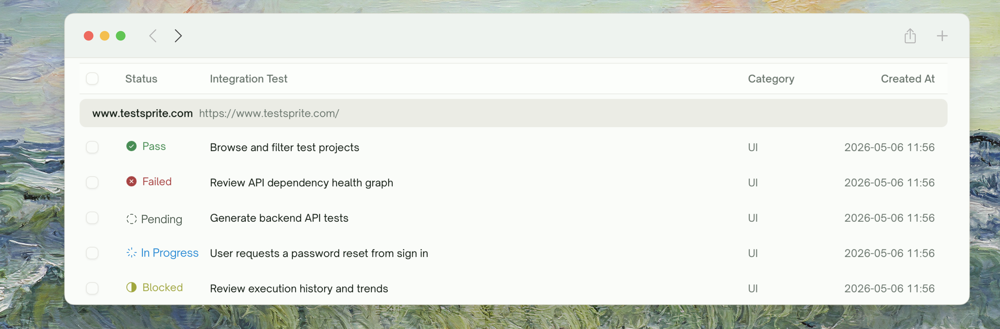
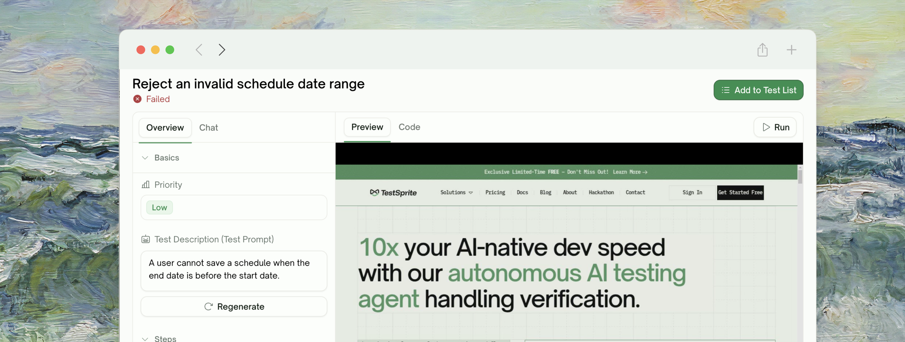
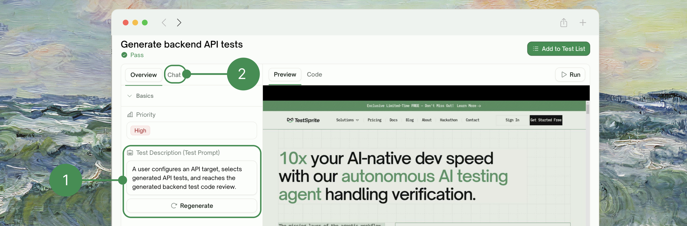

<Frame>
  
</Frame>

## What Test Generation Does

For each test case in the reviewed plan, TestSprite writes:

- A **Python + Playwright test file** that opens a real browser, drives your app through the flow, and asserts on the visible state at each step
- A **step list** that gets followed at runtime — clicks, fills, navigations, assertions

The output is real Playwright code you can drop into your CI/CD or regression suite if you want — but the primary use is execution within TestSprite's cloud sandbox where every step is observed.

## What Code Gets Generated

For each plan row, TestSprite writes a Python + Playwright test that drives a real browser through the flow and asserts on visible state. Roughly:

```python Generated UI test (illustrative)
from playwright.sync_api import sync_playwright, expect

def test_signin_with_valid_credentials_lands_on_dashboard():
    with sync_playwright() as p:
        browser = p.chromium.launch(headless=True)
        page = browser.new_page()
        try:
            page.goto(f"{BASE_URL}/login")
            page.get_by_label("Email").fill(TEST_USERNAME)
            page.get_by_label("Password").fill(TEST_PASSWORD)
            page.get_by_role("button", name="Sign in").click()

            expect(page).to_have_url(f"{BASE_URL}/dashboard")
            expect(page.get_by_text("Welcome")).to_be_visible()
        finally:
            browser.close()
```

What this gets you:

- **Coverage from observed behavior, not speculation.** Tests are grounded in flows TestSprite actually walked through during exploration — including the edge cases (form validation, error states, redirects) that handwritten suites typically skip until a customer hits them.
- **Survives your refactors.** Paired with [Auto-Heal (Pro)](/web-portal/core/ui/auto-heal), tests recover automatically when your UI changes but the underlying flow is intact. A button rename or component swap doesn't turn into a green-the-suite ticket.
- **Auditable, not magical.** Generated code is plain Python + Playwright — actions and assertions are line-by-line readable. Your QA team can review what's being checked; there's no proprietary DSL or opaque runtime to trust.
- **Maintained for you.** Refine a test in your own words and TestSprite regenerates the steps. Keeping the suite green is a paragraph of feedback, not a sprint of selector hunting.

## How Generation Runs

TestSprite generates each test from its plan row, verifies the output, and surfaces failures clearly. If a test can't be generated cleanly, it's marked Failed, the credit is refunded, and a **Regenerate** button appears on the row so you can try again.

## Watching Generation Live

Generation runs across plan rows in parallel. As each test finishes, it streams into the project test list with status:
<Frame>
  
</Frame>
| Status | Meaning |
| :--- | :--- |
| <kbd>Generating_Code</kbd> | TestSprite is writing and verifying the test (typically 10–30 seconds per test for UI) |
| <kbd>Idle</kbd> | Code generated, ready to run |
| <kbd>Running</kbd> | Test is executing in the cloud sandbox |
| <kbd>Passed</kbd> / <kbd>Failed</kbd> / <kbd>Blocked</kbd> | Final outcome after run |

Generation typically completes in 1–3 minutes total for a 20-test plan.

## What "Run" Does

When a UI test executes (initially after generation, or via **Rerun** later), TestSprite spins up a Playwright browser in the cloud sandbox, signs in with your test account, drives your app through the flow, captures per-step screenshots, records a full session video, and decides Pass/Fail from the assertions.

Once the run finishes, open the test detail page to play back the recorded video and step through the screenshots.

## How UI Tests Differ from API Tests

| | UI Tests | API Tests |
| :--- | :--- | :--- |
| Execution model | Playwright browser | requests HTTP client |
| Selector resolution | At runtime, against live DOM | Not applicable (URLs are stable) |
| Drift handling | [Auto-Heal (Pro)](/web-portal/core/ui/auto-heal) | Not needed — APIs don't drift like UIs |
| Multi-step concept | Each test is end-to-end self-contained | [Integration chains](/web-portal/core/api/integration-tests) link related tests through shared values |
| Recorded artifacts | Video + per-step screenshots | Request/response bodies |
| Typical test runtime | 5–30 seconds | 1–5 seconds |

## Reviewing a Failed Test

Click any Failed row to land on its detail page (see [Step-by-Step Walkthrough](/web-portal/core/ui/ui-step-by-step) for the rich view). You get:
<Frame>
  
</Frame>
| Element | What you get |
| :--- | :--- |
| <kbd>Recorded video</kbd> | The full run, in the right pane's **Preview** tab |
| <kbd>Per-step screenshots</kbd> | Click any step in the **Steps** list to load its HTML snapshot — see exactly when the test went off the rails |
| <kbd>Error</kbd> / <kbd>Trace</kbd> / <kbd>Fix</kbd> tabs | The Playwright error, raw stack trace, and an AI-authored cause-and-fix suggestion |
| <kbd>Chat</kbd> tab | Natural-language refinement of the test |
| <kbd>Rerun</kbd> | Plain replay — see [Rerun](/web-portal/core/ui/ui-rerun); recovers from UI changes with [Auto-Heal](/web-portal/core/ui/auto-heal) (Pro) |

## Iterating on a Test

To iterate on a generated test, open its detail page and **edit the test description** — saving re-triggers generation against the new wording.

<Frame>
  
</Frame>

For coverage on an entirely new feature or scenario, create a new project for it.

## Edge Cases & Troubleshooting

<AccordionGroup>
  <Accordion title="A generated test uses a selector that doesn't match my actual DOM">
    Two paths:
    - **Refine in chat**: "The Sign In button uses `data-testid='login-btn'`, not the role-based selector"
    - **Regenerate**: click Regenerate on the test row — generates a fresh test from scratch. Often picks up better selectors on a re-roll.
  </Accordion>
  <Accordion title="The test got generated against a feature I didn't explore">
    Plan generation produced a spec-based case for that feature. The test code is best-effort; first run may fail. Refine with actual UI details after the failure.
  </Accordion>
  <Accordion title="The Generate Tests button hangs / never finishes">
    Likely a single test stuck mid-generation. Check the project test list — if all rows are Idle except one in Generating, that's the culprit. Give it a couple of minutes; it will eventually surface as Failed and the rest of the suite continues.
  </Accordion>
  <Accordion title="My test imports a Playwright API I haven't seen before">
    Standard generation uses `playwright.sync_api` + standard library + pytest. If your description accidentally implied something exotic ("use playwright async"), generation may follow. Refine to standard or accept the variant.
  </Accordion>
  <Accordion title="The video captures are missing on a failed test">
    Recording is on by default. If video is missing, the cloud sandbox failed to capture (rare). The screenshots and Playwright trace should still be there — file a bug if all three are missing.
  </Accordion>
</AccordionGroup>

## Where to Go Next

<Columns cols={2}>
  <Card title="Step-by-Step Walkthrough" href="/web-portal/core/ui/ui-step-by-step" icon="list-check">
    Per-step screenshots, video, and run trace
  </Card>
  <Card title="Auto-Heal (Pro)" href="/web-portal/core/ui/auto-heal" icon="wand-magic-sparkles">
    Subsequent runs handle UI drift automatically
  </Card>
  <Card title="Refining Tests" href="/web-portal/core/working-with-test/refining-tests" icon="pen">
    Natural-language adjustments
  </Card>
  <Card title="Test Detail" href="/web-portal/core/working-with-test/test-detail" icon="file-magnifying-glass">
    Drill into one test's full result
  </Card>
</Columns>
