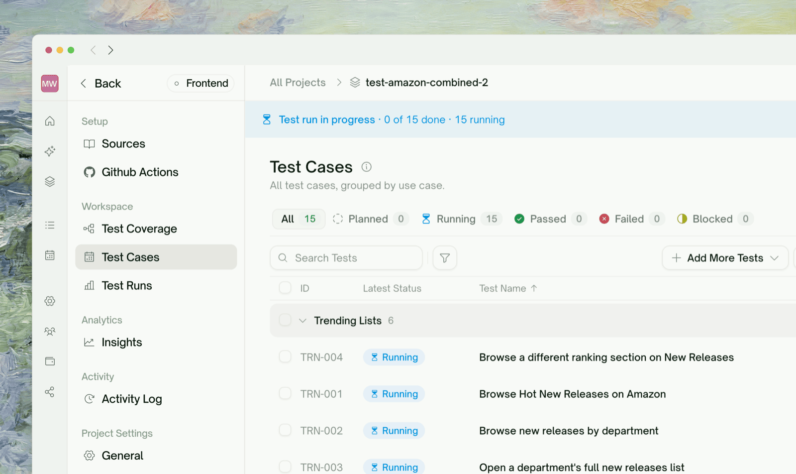
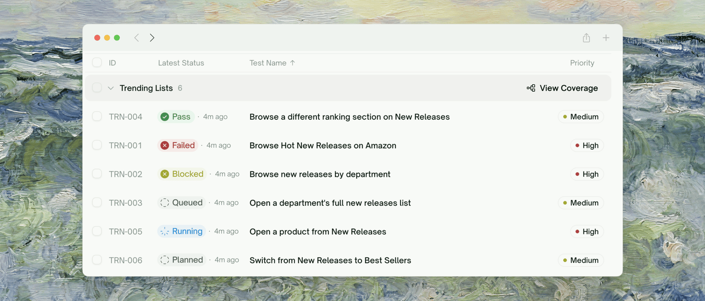
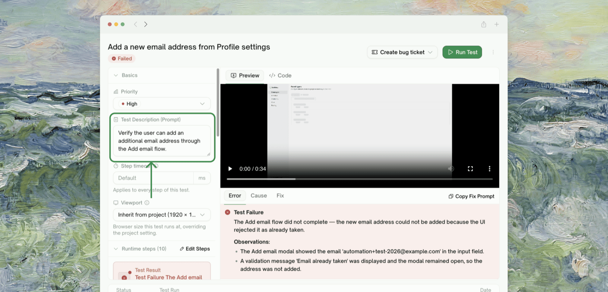

<Frame>
  
</Frame>

## What Test Generation Does

For each case in the reviewed plan, TestSprite's testing agent writes a **Python + Playwright test** that opens a real browser, drives your app through the flow, and asserts on the visible state at each step. You can drop the code into your own CI/CD, but its main use is running in TestSprite's cloud sandbox, where every step is observed.

```python Generated UI test (illustrative)
from playwright.sync_api import sync_playwright, expect

def test_signin_with_valid_credentials_lands_on_dashboard():
    with sync_playwright() as p:
        browser = p.chromium.launch(headless=True)
        page = browser.new_page()
        try:
            page.goto(f"{BASE_URL}/login")
            page.get_by_label("Email").fill(TEST_USERNAME)
            page.get_by_label("Password").fill(TEST_PASSWORD)
            page.get_by_role("button", name="Sign in").click()

            expect(page).to_have_url(f"{BASE_URL}/dashboard")
            expect(page.get_by_text("Welcome")).to_be_visible()
        finally:
            browser.close()
```

- **Grounded in observed behavior**: tests follow flows the agent walked during exploration, including form validation, error states, and redirects.
- **Survives refactors**: with [Auto-Heal](/web-portal/core/ui/auto-heal), tests recover when the UI changes but the flow still works.
- **Readable**: plain Python + Playwright, no proprietary DSL, so your QA team can review exactly what's checked.

## Watching Generation Live

Generation runs across plan rows in parallel. Each test is verified after it's generated; one that can't be generated cleanly is marked Failed so you can try again. Tests stream into the project test list with a status:
<Frame>
  
</Frame>
| Status | Meaning |
| :--- | :--- |
| <kbd>Planned</kbd> | In the plan, not generated and run yet |
| <kbd>Queued</kbd> | Part of a run, waiting for a free slot |
| <kbd>Running</kbd> | Test is executing in the cloud sandbox |
| <kbd>Passed</kbd> / <kbd>Failed</kbd> / <kbd>Blocked</kbd> | Final outcome after run |

A 20-test plan typically finishes generating in 1–3 minutes.

## What "Run" Does

Each time a UI test runs (after generation, or on a later rerun), TestSprite starts a Playwright browser in the cloud sandbox, signs in with your test account, drives the flow (resolving selectors against the live DOM), captures per-step screenshots and a full video, and decides Pass/Fail from the assertions. A typical UI test takes 5–30 seconds. For how this compares with API tests, see [Testing Lifecycle](/web-portal/concepts/testing-lifecycle).

## Reviewing a Failed Test

Click any Failed row to open its detail page (see [Step-by-Step Replay](/web-portal/core/ui/ui-step-by-step) for the full view):
<Frame>
  
</Frame>
| Element | What you get |
| :--- | :--- |
| <kbd>Recorded video</kbd> | The full run, in the right pane's **Preview** tab |
| <kbd>Per-step screenshots</kbd> | Click any step in the **Steps** list to load its HTML snapshot and see where the test went off the rails |
| <kbd>Error</kbd> / <kbd>Cause</kbd> / <kbd>Fix</kbd> tabs | The Playwright error, the likely cause, and an AI-authored fix suggestion |
| <kbd>Run test</kbd> | Plain replay (see [Edit & Rerun](/web-portal/core/ui/ui-rerun)); recovers from UI changes with [Auto-Heal](/web-portal/core/ui/auto-heal) |

## Iterating on a Test

Open the test's detail page and **edit the test description**; <kbd>Save & Run</kbd> regenerates the test against the new wording.

<Frame>
  
</Frame>

For coverage on an entirely new feature or scenario, create a new project for it.

## Edge Cases & Troubleshooting

<AccordionGroup>
  <Accordion title="A generated test uses a selector that doesn't match my actual DOM">
    Refine in chat, e.g. "The Sign In button uses `data-testid='login-btn'`, not the role-based selector".
  </Accordion>
  <Accordion title="The test got generated against a feature I didn't explore">
    It's a spec-based case, so the code is best-effort and the first run may fail. Refine with the actual UI details after the failure.
  </Accordion>
  <Accordion title="The first run hangs / never finishes">
    Usually one test is stuck mid-generation: every other row has a result and one is still Running. Give it a couple of minutes; it surfaces as Failed and the rest of the suite continues.
  </Accordion>
  <Accordion title="My test imports a Playwright API I haven't seen before">
    Generation normally uses `playwright.sync_api`, the standard library, and pytest. If your description implied something unusual ("use playwright async"), generation may follow it. Refine back to standard, or keep the variant.
  </Accordion>
  <Accordion title="The video captures are missing on a failed test">
    Recording is on by default; a missing video means the sandbox failed to capture it (rare). The screenshots and Playwright trace should still be there. File a bug if all three are missing.
  </Accordion>
</AccordionGroup>

## Where to Go Next

<Columns cols={2}>
  <Card title="Step-by-Step Replay" href="/web-portal/core/ui/ui-step-by-step" icon="list-check">
    Per-step screenshots, video, and run trace
  </Card>
  <Card title="Auto-Heal" href="/web-portal/core/ui/auto-heal" icon="wand-magic-sparkles">
    Subsequent runs handle UI drift automatically
  </Card>
  <Card title="Managing Test Cases" href="/web-portal/core/working-with-test/managing-test-cases" icon="pen">
    Natural-language adjustments
  </Card>
</Columns>
