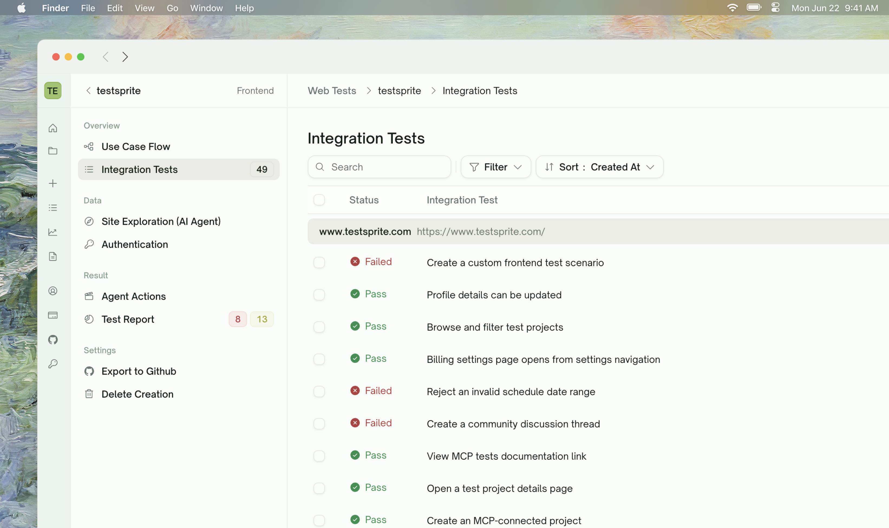
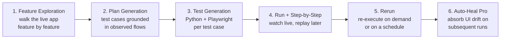
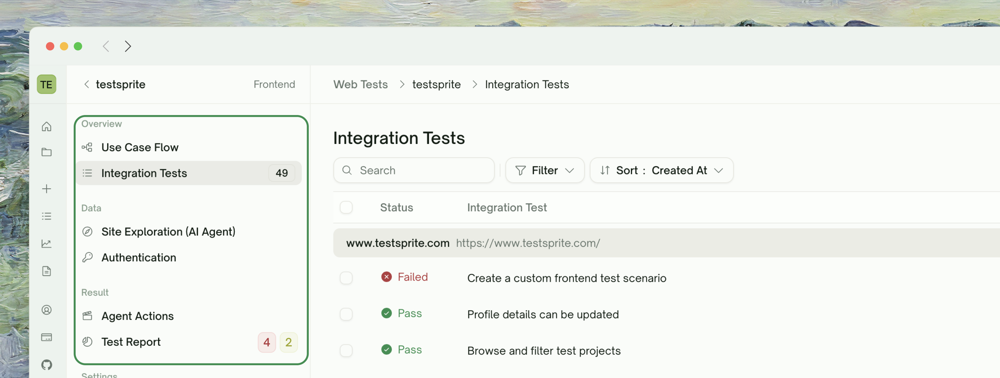
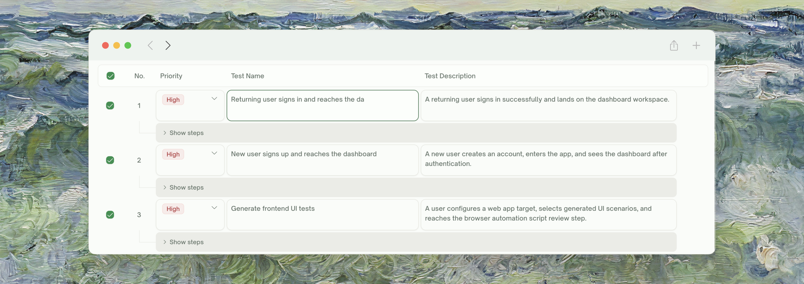

<Frame>
  
</Frame>

UI Testing in TestSprite is a journey from "here's my web app" to "here's a regression suite that catches UI bugs without breaking on every minor refactor". This page is the map.

## Key Features

| Feature | Description |
| :--- | :--- |
| <kbd>Fast Setup</kbd> | Get started in minutes — share your URL and (optionally) a test account |
| <kbd>Feature Exploration (Beta)</kbd> | TestSprite explores your live app feature by feature so the test plan reflects real behavior, not docs |
| <kbd>AI-Generated Test Cases</kbd> | Test plans tailored to your real screens and flows; full control to add, remove, or refine |
| <kbd>Step-by-Step Replay</kbd> | Every run records a video + per-step screenshots — replay to see what happened visually |
| <kbd>Live Test Preview</kbd> | Watch tests run in real time and catch issues as they happen |
| <kbd>Auto-Heal (Pro)</kbd> | When the UI drifts, TestSprite re-decides selectors against the live DOM instead of marking the test Failed |
| <kbd>Natural Language Refinement</kbd> | Adjust any test in natural language — no code required |
| <kbd>Reusable Test Code</kbd> | Generated Python + Playwright tests, ready to drop into CI/CD or regression suites |

## The UI Testing Journey

<Card>

</Card>

Each step gets its own page. Click through in order if you're new — or jump to the one giving you trouble.

<CardGroup cols={2}>
  <Card title="Feature Exploration" href="/web-portal/core/ui/feature-exploration" icon="compass">
    How TestSprite walks your live app to discover what to test
  </Card>
  <Card title="Plan Generation & Editing" href="/web-portal/core/ui/ui-plan-gen" icon="list-check">
    Review the plan grounded in observed flows; edit, add, prune
  </Card>
  <Card title="Test Generation" href="/web-portal/core/ui/ui-test-gen" icon="cube">
    Python + Playwright code per test case
  </Card>
  <Card title="Step-by-Step Walkthrough" href="/web-portal/core/ui/ui-step-by-step" icon="list-check">
    Per-step screenshots, video, and behavior trace for one test
  </Card>
  <Card title="Agent Actions" href="/web-portal/core/ui/agent-actions" icon="film">
    Project-level video gallery — every recording, bucketed by status
  </Card>
  <Card title="Rerun" href="/web-portal/core/ui/ui-rerun" icon="arrow-rotate-right">
    Re-execute a single test, the whole project, or a scheduled run
  </Card>
  <Card title="Auto-Heal (Pro)" href="/web-portal/core/ui/auto-heal" icon="wand-magic-sparkles">
    Recover UI tests when the page changed but the flow is fine
  </Card>
</CardGroup>

## What Lives Where

The Web Portal sidebar for a UI project is grouped into Overview / Data / Result. UI projects don't have integration chains, shared-value wiring, or cleanup phases, so the sidebar is shorter than a backend project's
<Frame>
  
</Frame>
| Group | Item | What you see |
| :--- | :--- | :--- |
| Overview | <kbd>Use Case Flow</kbd> | Site map of explored features; click a node to drill in |
| Overview | <kbd>Integration Tests</kbd><span style={{ display: "block", marginTop: "10px", fontSize: "0.95em", opacity: 0.7, fontStyle: "italic", letterSpacing: "0.02em" }}>default</span> | Flat list of UI test cases with status chips and last-run results — clicking a row opens its detail page (recorded video, step-by-step screenshots, error trace, refine + rerun) |
| Data | <kbd>Site Exploration</kbd> | Per-feature exploration walks: what TestSprite reached, where it got stuck |
| Data | <kbd>Authentication</kbd> | Test account credentials used during exploration and runs |
| Result | <kbd>Agent Actions</kbd> | Project-level video gallery of every test recording, bucketed by status — see [Agent Actions](/web-portal/core/ui/agent-actions) |
| Result | <kbd>Test Report</kbd> | Aggregated outcomes; badges show Failed (red) and Blocked (amber) counts |

Settings actions at the bottom of the sidebar: **Export to Github**, **Delete Creation**.

<Note>
Test list scheduling (paid; auto-heal toggle) lives under the global **Monitoring → Schedules** section, not the per-project sidebar.
</Note>

<Tip>
**UI testing is single-test-centric, not chain-centric.** Each UI test is end-to-end self-contained — sign in, do the thing, assert. There's no cross-test data wiring like there is in backend tests. The complexity in UI testing is on the per-test side (the page, timing, change absorption) not the multi-test orchestration side.
</Tip>

## Quick Start

<Card title="Quickstart" href="/web-portal/core/ui/quickstart" icon="play">
  Walk through your first UI project end-to-end — from project creation to a passing browser test — in about 10 minutes.
</Card>

## Refining Tests in Natural Language

Every test row supports natural-language refinement. You can say:

    <Frame>
      
    </Frame>

<CodeGroup>
```text Refine
Original: "Test login functionality"

Refined: "Verify the Sign In link directs users to the login page and that valid credentials land them on the dashboard."
```

```text Add
Add a test that signs up a new user with an invalid email and confirms the inline validation appears.
```

```text Edit
For the Checkout test, drop the assertion that the URL contains '/success' — our flow uses '/order/{id}' instead.
```
</CodeGroup>

TestSprite parses the request, regenerates affected test code, and re-runs. See [Refining Tests](/web-portal/core/working-with-test/refining-tests) for the full chat capabilities.

## Backend's Sibling Page

If you're testing an HTTP API rather than a website (UI / browser flows), the backend equivalent of this page is [API Testing — Overview](/web-portal/core/api/api-testing). The wizard, refinement, and rerun concepts mirror; the underlying execution model differs (HTTP requests vs. browser actions), and a few features are exclusive to one side:

| | UI Testing | API Testing |
| :--- | :--- | :--- |
| Discovery phase | Feature Exploration (TestSprite walks the live app) | API Discovery (reads your docs and confirms endpoint shapes) |
| Plan grounding | Observed flows | Observed responses |
| Test execution | Browser via Playwright | HTTP via requests |
| Multi-step concept | Each test is end-to-end | Integration chains across endpoints |
| Drift handling | [Auto-Heal](/web-portal/core/ui/auto-heal) on rerun | (No equivalent — APIs don't drift the same way) |
| Auth handling | Static test account | [Auto-Auth](/web-portal/core/api/auto-auth) for token refresh |

## Where to Go Next

<Columns cols={2}>
  <Card title="Feature Exploration" href="/web-portal/core/ui/feature-exploration" icon="compass">
    The first phase — walk the live app
  </Card>
  <Card title="Step-by-Step Walkthrough" href="/web-portal/core/ui/ui-step-by-step" icon="list-check">
    See exactly what happened on each step of a run
  </Card>
  <Card title="Auto-Heal (Pro)" href="/web-portal/core/ui/auto-heal" icon="wand-magic-sparkles">
    Absorb UI drift between runs without re-writing tests
  </Card>
  <Card title="Subscription Plans" href="/web-portal/admin/billing-and-plans" icon="credit-card">
    Free includes 10-feature exploration; Pro unlocks unlimited + Auto-Heal
  </Card>
</Columns>
