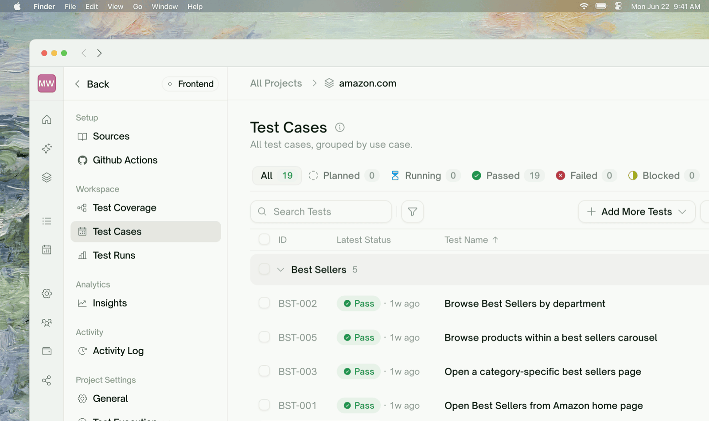
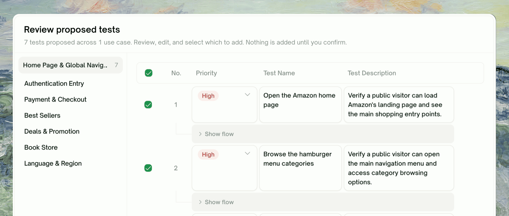

<Frame>
  
</Frame>

UI Testing takes you from "here's my web app" to a regression suite that catches UI bugs without breaking on every minor refactor.

## Key Features

| Feature | Description |
| :--- | :--- |
| <kbd>Fast Setup</kbd> | Share your URL and, optionally, a test account |
| <kbd>Multiple Sign-In Methods</kbd> | Test account credentials, OTP (one-time password) login with a TestSprite-managed account (email and SMS), or SSO (single sign-on) such as Google {/* V3.1 (Sherry): TODO finalize wording */} |
| <kbd>Feature Exploration</kbd> | TestSprite's testing agent explores your live app so the plan reflects real behavior, not docs |
| <kbd>AI-Generated Test Cases</kbd> | Plans tailored to your real screens and flows; add, remove, or refine any case |
| <kbd>Live Test Preview</kbd> | Watch tests run in real time |
| <kbd>Step-by-Step Replay</kbd> | Every run records a video and per-step screenshots |
| <kbd>Auto-Heal</kbd> | When the UI drifts, TestSprite re-decides selectors against the live DOM instead of failing the test |
| <kbd>Natural Language Refinement</kbd> | Adjust any test in plain language, no code required |
| <kbd>Reusable Test Code</kbd> | Generated Python + Playwright tests, ready for CI/CD or regression suites |

## The UI Testing Journey

<Card>

```mermaid
flowchart LR
    Z[1\. Configure Login<br/>pick a sign-in method<br/>for your app]
    A[2\. Feature Exploration<br/>walk the live app<br/>feature by feature]
    M[3\. Feature Map<br/>features and use cases<br/>on Test Coverage]
    B[4\. Plan Generation<br/>test cases grounded<br/>in observed flows]
    C[5\. Test Generation<br/>Python + Playwright<br/>per test case]
    D[6\. Run + Step-by-Step<br/>watch live, replay later]
    E[7\. Rerun<br/>re-execute on demand<br/>or on a schedule]
    F[8\. Auto-Heal<br/>absorb UI drift on<br/>subsequent runs]

    Z --> A --> M --> B --> C --> D --> E --> F
```
</Card>

Each step has its own page. New to TestSprite? Start with the [Quickstart](/web-portal/core/ui/quickstart), which walks the whole journey in about 10 minutes.

<CardGroup cols={2}>
  <Card title="Authentication (UI)" href="/web-portal/core/ui/ui-authentication" icon="key">
    Configure how TestSprite signs in: test account credentials, OTP, or SSO
  </Card>
  <Card title="Feature Exploration" href="/web-portal/core/ui/feature-exploration" icon="compass">
    How TestSprite walks your live app to discover what to test
  </Card>
  <Card title="Plan Generation & Editing" href="/web-portal/core/ui/ui-plan-gen" icon="list-check">
    Review the plan grounded in observed flows; edit, add, prune
  </Card>
  <Card title="Test Generation & Execution" href="/web-portal/core/ui/ui-test-gen" icon="cube">
    Python + Playwright code per test case
  </Card>
  <Card title="Step-by-Step Replay" href="/web-portal/core/ui/ui-step-by-step" icon="list-check">
    Per-step screenshots, video, and behavior trace for one test
  </Card>
  <Card title="Agent Actions" href="/web-portal/core/ui/agent-actions" icon="film">
    Every recording from a run, bucketed by status
  </Card>
  <Card title="Edit & Rerun" href="/web-portal/core/ui/ui-rerun" icon="arrow-rotate-right">
    Re-execute a single test, the whole project, or a scheduled run
  </Card>
  <Card title="Auto-Heal" href="/web-portal/core/ui/auto-heal" icon="wand-magic-sparkles">
    Recover UI tests when the page changed but the flow is fine
  </Card>
</CardGroup>

<Tip>
**Each UI test is self-contained**: sign in, do the thing, assert. Unlike API tests, no data is passed between tests, so the work is in the single test (the page, timing, and absorbing UI change).
</Tip>

## Where Things Live

A UI project's sidebar is grouped into Setup, Workspace, Analytics, Activity, and Project Settings; see the [Test Detail Page](/web-portal/core/working-with-test/test-detail) for what each item does. Scheduling lives outside the project, under **Automation → Test Schedules**.

## Refining Tests in Natural Language

You can refine any test in plain language, by editing its description or asking in **Chats**. For example:

```text
Add a test that signs up a new user with an invalid email and confirms the inline validation appears.
```

<Frame>
  
</Frame>

See [Managing Test Cases](/web-portal/core/working-with-test/managing-test-cases) for every way to do it.

## Testing an API Instead?

See [API Testing](/web-portal/core/api/api-testing). The flow mirrors this one; API projects discover and probe endpoints instead of walking pages, chain tests that depend on each other, and use [Auto-Auth](/web-portal/core/api/auto-auth) for token refresh rather than Auto-Heal. [Testing Lifecycle](/web-portal/concepts/testing-lifecycle) compares the two side by side.
