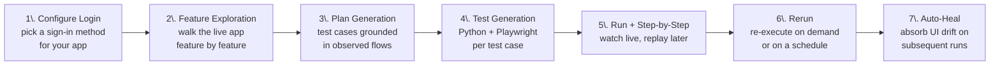

{/* #TODO_UPDATE — V3.1 修改（条目 4.2）：
  1. Key Features 表加一行「多种登录方式」(multiple login methods)
  2. Journey 流程图前面补一步「配置登录」(configure login)，链接到新的 Authentication (UI) 页
  3. 「What Lives Where」侧栏表同步新增 tab
*/}

<Frame>
  
</Frame>

UI Testing in TestSprite is a journey from "here's my web app" to "here's a regression suite that catches UI bugs without breaking on every minor refactor". This page is the map.

## Key Features

| Feature | Description |
| :--- | :--- |
| <kbd>Fast Setup</kbd> | Get started in minutes — share your URL and (optionally) a test account |
| <kbd>Feature Exploration</kbd> | TestSprite explores your live app feature by feature so the test plan reflects real behavior, not docs |
| <kbd>AI-Generated Test Cases</kbd> | Test plans tailored to your real screens and flows; full control to add, remove, or refine |
| <kbd>Step-by-Step Replay</kbd> | Every run records a video + per-step screenshots — replay to see what happened visually |
| <kbd>Live Test Preview</kbd> | Watch tests run in real time and catch issues as they happen |
| <kbd>Auto-Heal</kbd> | When the UI drifts, TestSprite re-decides selectors against the live DOM instead of marking the test Failed |
| <kbd>Natural Language Refinement</kbd> | Adjust any test in natural language — no code required |
| <kbd>Reusable Test Code</kbd> | Generated Python + Playwright tests, ready to drop into CI/CD or regression suites |
| <kbd>Multiple Sign-In Methods</kbd> | Log in with your own test account, let TestSprite register and manage accounts (email & SMS OTP supported), or record a browser session for Google and other third-party logins {/* V3.1 (Sherry): TODO finalize wording */} |

## The UI Testing Journey

<Card>

```mermaid
flowchart LR
    Z[1\. Configure Login<br/>pick a sign-in method<br/>for your app]
    A[2\. Feature Exploration<br/>walk the live app<br/>feature by feature]
    B[3\. Plan Generation<br/>test cases grounded<br/>in observed flows]
    C[4\. Test Generation<br/>Python + Playwright<br/>per test case]
    D[5\. Run + Step-by-Step<br/>watch live, replay later]
    E[6\. Rerun<br/>re-execute on demand<br/>or on a schedule]
    F[7\. Auto-Heal<br/>absorb UI drift on<br/>subsequent runs]

    Z --> A --> B --> C --> D --> E --> F
```
</Card>

Each step gets its own page. Click through in order if you're new — or jump to the one giving you trouble.

<CardGroup cols={2}>
  <Card title="Authentication (UI)" href="/web-portal/core/ui/ui-authentication" icon="key">
    Configure how TestSprite signs in — test account, managed account, or recorded session {/* V3.1 (Sherry): TODO confirm link once ui-authentication (Chunlin) lands */}
  </Card>
  <Card title="Feature Exploration" href="/web-portal/core/ui/feature-exploration" icon="compass">
    How TestSprite walks your live app to discover what to test
  </Card>
  <Card title="Plan Generation & Editing" href="/web-portal/core/ui/ui-plan-gen" icon="list-check">
    Review the plan grounded in observed flows; edit, add, prune
  </Card>
  <Card title="Test Generation" href="/web-portal/core/ui/ui-test-gen" icon="cube">
    Python + Playwright code per test case
  </Card>
  <Card title="Step-by-Step Walkthrough" href="/web-portal/core/ui/ui-step-by-step" icon="list-check">
    Per-step screenshots, video, and behavior trace for one test
  </Card>
  <Card title="Agent Actions" href="/web-portal/core/ui/agent-actions" icon="film">
    Project-level video gallery — every recording, bucketed by status
  </Card>
  <Card title="Rerun" href="/web-portal/core/ui/ui-rerun" icon="arrow-rotate-right">
    Re-execute a single test, the whole project, or a scheduled run
  </Card>
  <Card title="Auto-Heal" href="/web-portal/core/ui/auto-heal" icon="wand-magic-sparkles">
    Recover UI tests when the page changed but the flow is fine
  </Card>
</CardGroup>

## What Lives Where

The V3.1 sidebar for a UI project is grouped into Setup / Workspace / Analytics / Activity / Project Settings.

<Frame>
  
</Frame>

| Group | Item | What you see |
| :--- | :--- | :--- |
| Setup | <kbd>Sources</kbd> | The documents and pages TestSprite learned your product from; exploration progress lives here too |
| Setup | <kbd>GitHub Action</kbd> | Trigger test runs from pushes and pull requests — see [GitHub Integration](/web-portal/integrations/github-integration) |
| Workspace | <kbd>Test Coverage</kbd> | The use-case map: what's covered, what's planned, where the gaps are |
| Workspace | <kbd>Test Cases</kbd> | All test cases grouped by use case, with statuses — clicking a row opens its detail (steps, recording, error trace, edit + rerun) |
| Workspace | <kbd>Test Runs</kbd> | Execution history: per-run pass rate and per-test results, with List and Agent Actions views |
| Analytics | <kbd>Insights</kbd> | Quality trends, issues to fix, coverage. See [Insights](/web-portal/results/project-overview) |
| Activity | <kbd>Activity Log</kbd> | All project activity, newest first — who changed what, and when tests ran |
| Project Settings | <kbd>General</kbd> | Project configuration |
| Project Settings | <kbd>Environment</kbd> | Environments and environment variables for test runs |
| Project Settings | <kbd>Notifications & Ticketing</kbd> | Slack channel and ticketing setup for this project (see [Slack Notifications](/web-portal/integrations/slack-notifications)) |

The header also carries a <kbd>Share</kbd> button and a copy-link action on every project page.

<Note>
Test list scheduling (paid) lives under the global **Automation → Test Schedules** section, not the per-project sidebar.
</Note>

<Tip>
**UI testing is single-test-centric, not chain-centric.** Each UI test is end-to-end self-contained — sign in, do the thing, assert. There's no cross-test data wiring like there is in backend tests. The complexity in UI testing is on the per-test side (the page, timing, change absorption) not the multi-test orchestration side.
</Tip>

## Quick Start

<Card title="Quickstart" href="/web-portal/core/ui/quickstart" icon="play">
  Walk through your first UI project end-to-end — from project creation to a passing browser test — in about 10 minutes.
</Card>

## Refining Tests in Natural Language

Every test row supports natural-language refinement. You can say:

    <Frame>
      
    </Frame>

<CodeGroup>
```text Refine
Original: "Test login functionality"

Refined: "Verify the Sign In link directs users to the login page and that valid credentials land them on the dashboard."
```

```text Add
Add a test that signs up a new user with an invalid email and confirms the inline validation appears.
```

```text Edit
For the Checkout test, drop the assertion that the URL contains '/success' — our flow uses '/order/{id}' instead.
```
</CodeGroup>

TestSprite parses the request, regenerates affected test code, and re-runs. See [Refining Tests](/web-portal/core/working-with-test/refining-tests) for the full chat capabilities.

## Backend's Sibling Page

If you're testing an HTTP API rather than a website (UI / browser flows), the backend equivalent of this page is [API Testing — Overview](/web-portal/core/api/api-testing). The wizard, refinement, and rerun concepts mirror; the underlying execution model differs (HTTP requests vs. browser actions), and a few features are exclusive to one side:

| | UI Testing | API Testing |
| :--- | :--- | :--- |
| Discovery phase | Feature Exploration (TestSprite walks the live app) | API Discovery (reads your docs and confirms endpoint shapes) |
| Plan grounding | Observed flows | Observed responses |
| Test execution | Browser via Playwright | HTTP via requests |
| Multi-step concept | Each test is end-to-end | Integration chains across endpoints |
| Drift handling | [Auto-Heal](/web-portal/core/ui/auto-heal) on rerun | (No equivalent — APIs don't drift the same way) |
| Auth handling | Static test account | [Auto-Auth](/web-portal/core/api/auto-auth) for token refresh |

## Where to Go Next

<Columns cols={2}>
  <Card title="Feature Exploration" href="/web-portal/core/ui/feature-exploration" icon="compass">
    The first phase — walk the live app
  </Card>
  <Card title="Step-by-Step Walkthrough" href="/web-portal/core/ui/ui-step-by-step" icon="list-check">
    See exactly what happened on each step of a run
  </Card>
  <Card title="Auto-Heal" href="/web-portal/core/ui/auto-heal" icon="wand-magic-sparkles">
    Absorb UI drift between runs without re-writing tests
  </Card>
</Columns>
