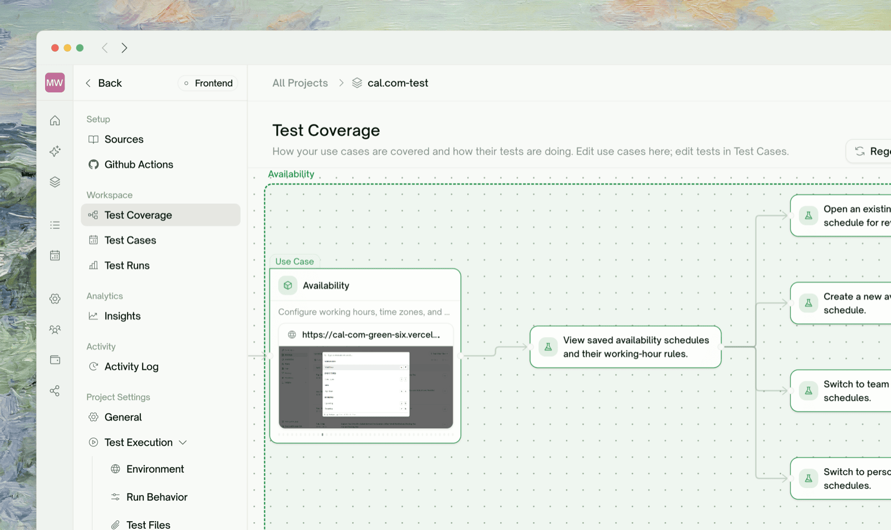
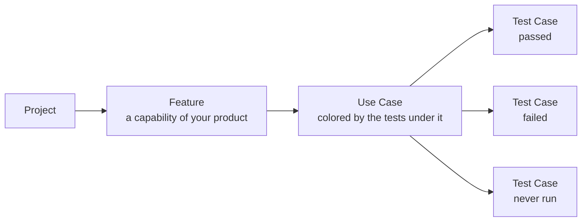
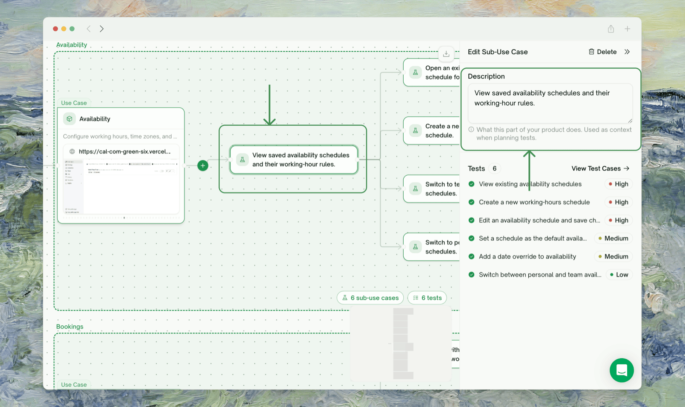
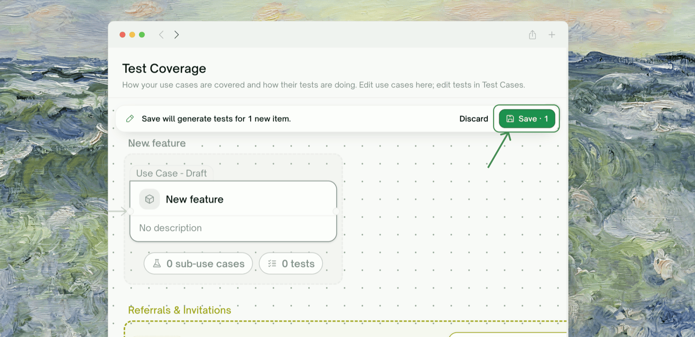
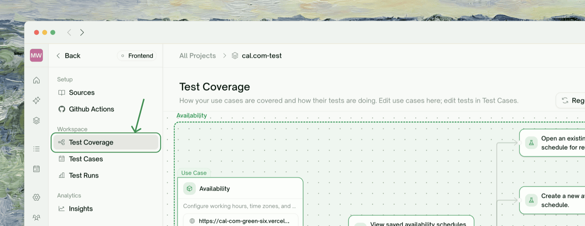
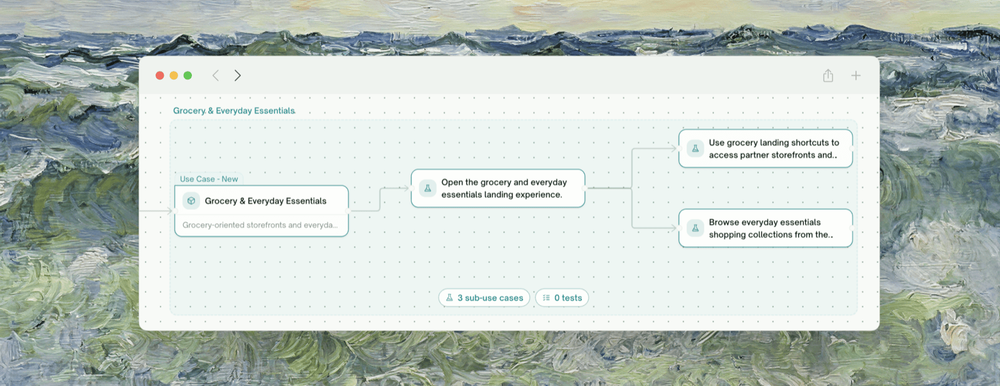
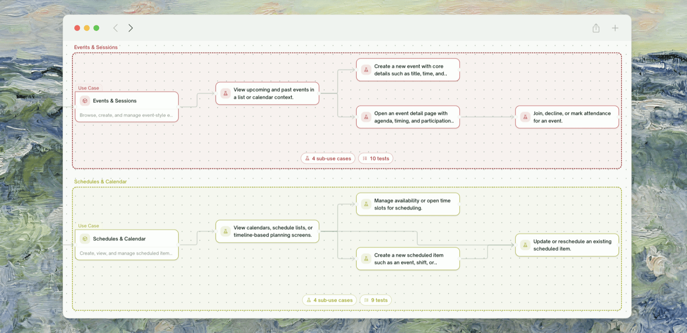

<Frame>
  
</Frame>

## Overview

<kbd>Test Coverage</kbd> is the project's visual map: your product's features on the left, the use cases under each feature, and the test cases attached to each use case. Every node is colored by its latest results, so one look answers *what's covered, what's passing, and where the blank spots are*.

Open it from the project's left nav — it's the first item under the project.

## Reading the Map

The map flows left to right: **Project → Feature → Use Case → Test Cases**. Each use-case node aggregates the results of the tests under it:

<Card>

</Card>

| Color | Meaning |
| :--- | :--- |
| 🟢 Green | Every test under this use case passed |
| 🔴 Red | At least one test genuinely failed — even one failure stands out |
| 🟡 Amber | Blocked or mixed — some tests pending, blocked, or never run alongside passing ones |
| 🔵 Blue | Tests are running right now; the edges leading into a running node light up too, so you can trace the live execution path |
| ⚪ Gray | Never run yet |

While you're editing, nodes also carry session tags: **New** (added this session), **Modified** (edited this session), and **Draft** (a hand-added test case not yet saved).

### Dependency arrows

Arrows between use cases show **logical prerequisites** — "checkout depends on product search" — identified when the plan was generated. They drive the left-to-right layout and help you read the product's structure.

<Note>
Dependency arrows describe the relationship between capabilities; they do **not** sequence test execution. Runs you launch from the map execute as a normal batch.
</Note>

## Editing Directly on the Map

<Frame>
  
</Frame>

There's no separate edit mode — the map is directly editable inline:

- **Add a feature** — hover the project root node and click <kbd>+</kbd>.
- **Add a use case** — hover a feature node and click <kbd>+</kbd>; or click the trailing <kbd>+</kbd> on an existing use case to add one that depends on it.
- **Rename / edit a description** — click a node and edit in the detail panel on the right.
- **Delete a feature or use case** — from the same detail panel.
- **Add a test case under a use case** — the <kbd>+</kbd> next to "Test cases" in the detail panel; or click the ✨ sparkle on a feature to have AI propose more tests for just that feature.

Edits are **staged**: a floating Save / Discard bar appears as soon as you change anything, and <kbd>Cmd/Ctrl+Z</kbd> undoes step by step. Nothing touches the plan until you save.

### What Save does

<Frame>
  
</Frame>

- **New use cases** get tests generated for them.
- **Deleted use cases** take their now-orphaned tests with them — the review dialog lists exactly what would be removed before you confirm.
- **Renames and description edits** save in one click and do *not* regenerate existing tests.

Editing pauses (with a tooltip explaining why) while tests are generating or running, and the map is read-only when you're viewing a past plan version.

<Tip>
You can export the whole map as a PNG — useful for planning docs and release-readiness slides.
</Tip>

## Workflow: Coverage-Gap Review Before a Release

The map is the fastest way to answer "what did we forget to test?" before shipping:

<Steps>
  <Step title="Open Test Coverage next to your PRD">
    Walk the feature list top to bottom against the release's requirements.
    <Frame>
      
    </Frame>
  </Step>
  <Step title="Hunt gray and missing nodes">
    Gray = exists but never run. Missing = the feature or flow isn't on the map at all — add it inline with <kbd>+</kbd> and let Save generate its tests.
    <Frame>
      
    </Frame>
  </Step>
  <Step title="Check the red and amber paths">
    A red node on a release-critical flow is a blocker conversation; amber usually means an environment or auth issue worth clearing before you trust the run.
    <Frame>
      
    </Frame>
  </Step>
  <Step title="Save and run the additions">
    New use cases generate their tests on save; run them and re-check the map — the goal is a green (or consciously accepted) path for every requirement.
  </Step>
</Steps>

## Where to Go Next

<Columns cols={2}>
  <Card title="Managing Test Cases" href="/web-portal/core/working-with-test/managing-test-cases" icon="list-check">
    Edit the tests behind each node — singly or in bulk
  </Card>
  <Card title="Test Detail Page" href="/web-portal/core/working-with-test/test-detail" icon="file-circle-info">
    The project page this map lives in
  </Card>
  <Card title="Refining Tests" href="/web-portal/core/working-with-test/refining-tests" icon="pen-to-square">
    Let AI improve a test that isn't checking the right thing
  </Card>
</Columns>
