<Frame>
  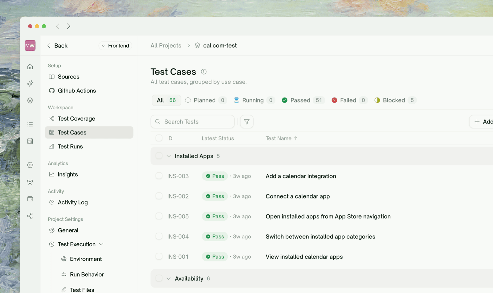
</Frame>

The <kbd>Test Cases</kbd> page lists every test in the project, grouped by use case. You can change a test yourself or have TestSprite's testing agent change it for you. Edits only count once the test re-runs, so saving a single case is **Save & Run**.

| To... | Use |
| :--- | :--- |
| Refocus or extend one test | [Edit its description](#editing-a-single-test-case) |
| Rewrite a test's flow step by step | [Edit its steps](#editing-steps) |
| Understand a failure and get a fix | [Ask AI in Chats](#asking-ai-for-a-fix) |
| Change many tests at once | [Batch editing](#batch-editing) |
| Add coverage | [Adding test cases](#adding-test-cases) |
| Start over after a major app change | [Regenerate from sources](#regenerating-from-sources) |

## Editing a Single Test Case

<Frame>
  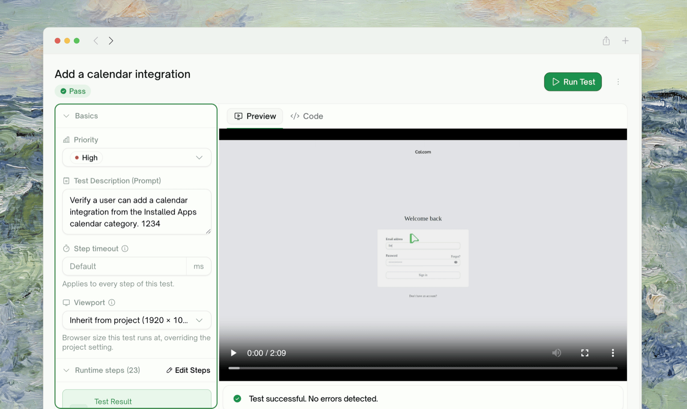
</Frame>

Click any row to open the test case as a drawer over the list, expandable to a full page. What you can change, and where:

| What | Where |
| :--- | :--- |
| **Priority** | The Basics section: High / Medium / Low |
| **Test Description (Prompt)** | The Basics section: the natural-language statement of what the test verifies, which the run is judged against |
| **Steps** | The <kbd>Edit steps</kbd> modal (see below) |
| **Code** | The Code tab |

Editing the description is the most common refinement. Rewrite what the test should verify, click <kbd>Save & Run</kbd>, and TestSprite updates the steps to match and re-runs that test. Be specific:

<Frame>
  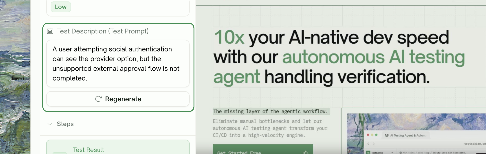
</Frame>

```text Before
Verify user can log in with valid credentials.
```

```text After
Verify the Sign In link directs users to the login page, that
submitting email "test@example.com" + password "test123" lands them
on the dashboard, and that the navbar avatar shows after login.
```

For API tests, <kbd>Save & Run</kbd> replays the existing stored code. Click <kbd>Regenerate</kbd> under the prompt instead whenever your edit changes what the code must do; it rewrites the code from your edited prompt, then runs.

Refine one or two tests at a time, re-run, and confirm before moving on; it's much easier to debug than editing twenty at once.

### Editing steps

<Frame>
  
</Frame>

The <kbd>Edit steps</kbd> modal lets you rewrite the flow from any step onward. Steps **before** the one you picked stay locked (they still run, just aren't editable); everything after is free text. Add, remove, or rewrite steps, each typed as an *action* or an *assertion*, and adjust the pass criterion in the same modal. Saving starts a run with the new steps immediately. For UI tests, edited steps run directly, with no code-generation step in between. See [Edit & Rerun](/web-portal/core/ui/ui-rerun) for the other ways to re-run.

For UI tests, [Auto-Heal](/web-portal/core/ui/auto-heal) also absorbs UI drift on reruns, so a moved button doesn't need an edit.

## Asking AI for a Fix

<Frame>
  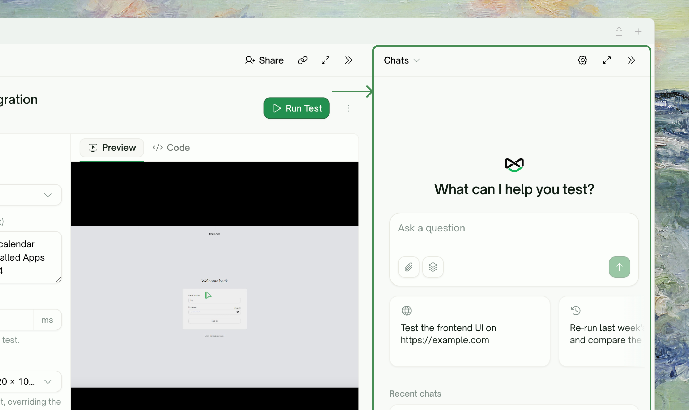
</Frame>

When you don't know why a test failed, open <kbd>Chats</kbd> beside the test and ask, for example *"Why did this fail?"*, *"What is this test checking?"*, or *"How do I fix this?"*. The assistant answers from the test's steps, the run's recording, and the failure trace, and any change it proposes arrives as a card you approve first (see [Approving Actions](/web-portal/ai-chat/approving-actions)). It doesn't see your application source code or PRD by default.

## Batch Editing

Click <kbd>Edit Test</kbd> on the toolbar to open the batch editor: every test case in the plan on one screen, with a use-case nav on the left. It has two modes:

<Frame>
  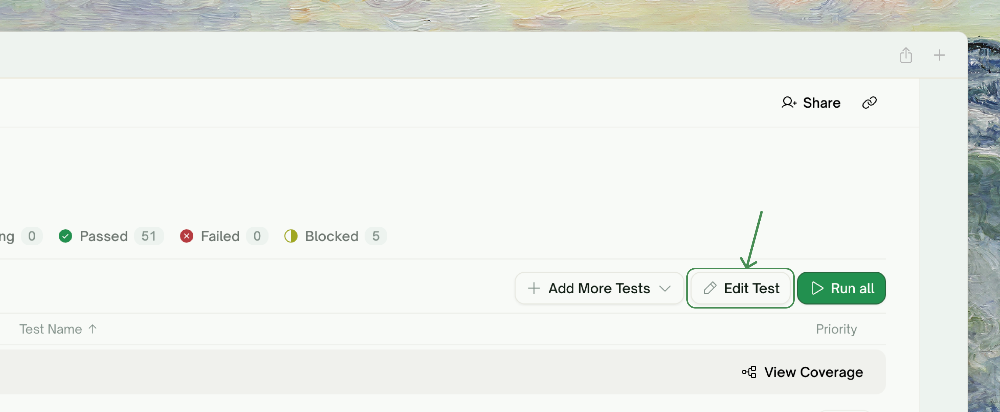
</Frame>

<Tabs>
  <Tab title="Form mode">
    <Frame>
      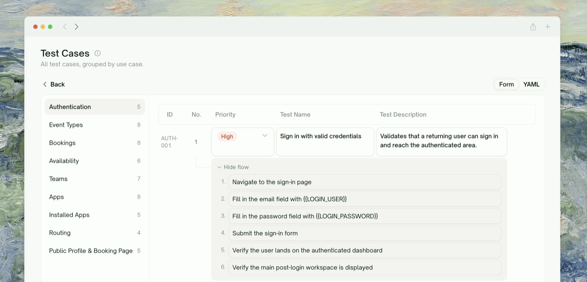
    </Frame>

    Every case as a row with **test name, priority, description, and each flow step** editable in place. Best for touching a handful of cases in context.

    Save writes only the rows you changed and reports per case if any row fails, so a partial save never silently loses the rest.
  </Tab>
  <Tab title="YAML mode">
    <Frame>
      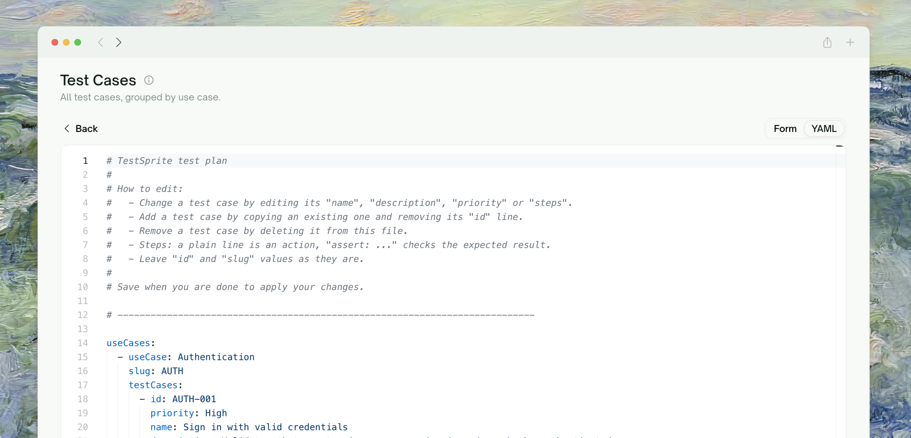
    </Frame>

    The whole plan as one YAML document. Best for sweeping edits: renumbering steps across many cases, find-and-replace on a URL, or pasting cases between projects.

    ```yaml
    useCases:
      - useCase: Authentication
        slug: authentication
        testCases:
          - id: TC001
            priority: High
            name: Login with valid credentials
            description: Verify that submitting valid credentials lands the
              user on the dashboard.
            steps:
              - Navigate to the login page
              - Enter "user@example.com" and the test password
              - Click the Sign In button
              - assert: The dashboard page is displayed
    ```

    The rules (also in the editor's header comment):
    - A plain step line is an **action**; `assert: ...` marks an **assertion**.
    - **Add** a case by copying an existing one and removing its `id` line.
    - **Remove** a case by deleting its block.
    - Leave `id` and `slug` values as they are; they map your edits back to existing cases.
  </Tab>
</Tabs>

Switching modes discards unsaved edits in the mode you're leaving; the editor warns you first.

## Adding Test Cases

The <kbd>Add More Tests</kbd> dropdown on the toolbar has both paths:

<Frame>
  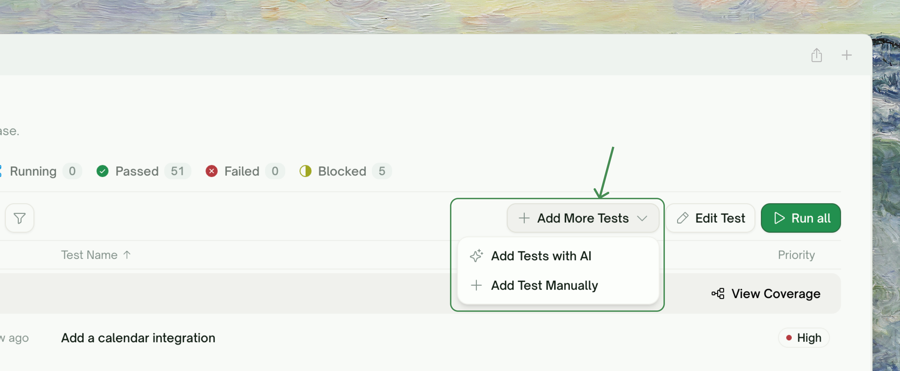
</Frame>

- **Add Tests with AI**: describe what you want covered (optionally scoped to one use case), and TestSprite's testing agent proposes a batch. Before anything is created, you can edit each proposal's title, description, priority, and steps, untick the ones you don't want, or hand-add rows.
- **Add Test Manually**: a form with use case, title, priority, description, and a step list (action or assertion per step).

You can also add from the [Coverage Map](/web-portal/core/working-with-test/coverage-map), per use case or with the per-feature ✨ AI shortcut.

## Regenerating from Sources

When your app has changed so much that the plan is more outdated than fixable (a major redesign, or a new API contract across many endpoints), rebuild it. Open <kbd>Test Coverage</kbd>, click <kbd>Regenerate from sources</kbd>, and confirm. TestSprite's testing agent discards the current use cases and extracts a new set from the project's sources, in the same project. Then plan tests from the new use cases and run them as usual.

<Frame>
  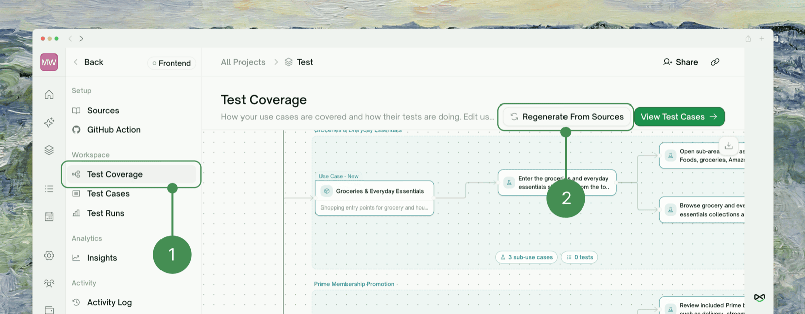
</Frame>

<Warning>
Regenerating can't be undone: all existing use cases and their generated test cases are removed. To keep the old suite alongside the new one, create a new project instead.
</Warning>

## Deleting Test Cases

- **One case**: the trash icon in its drawer, or the row's context menu. A case that has never run is labeled "Remove from plan"; one with run history warns you the history goes with it.

<Frame>
  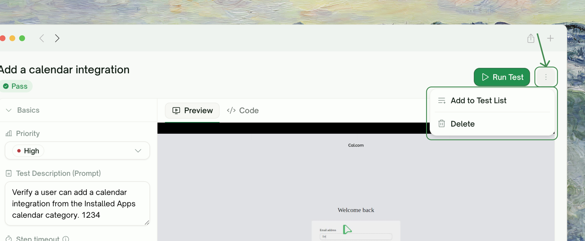
</Frame>

- **Many cases**: select rows and use the trash button in the toolbar.

<Frame>
  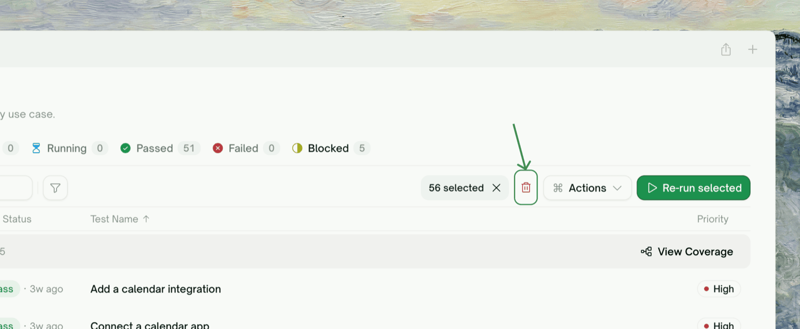
</Frame>

<Warning>
Deleting a test case permanently removes its run history too. If you might want the history later, deprioritize the case instead.
</Warning>

## Where to Go Next

<Columns cols={2}>
  <Card title="Coverage Map" href="/web-portal/core/working-with-test/coverage-map" icon="sitemap">
    Manage the plan visually, use case by use case
  </Card>
  <Card title="Edit & Rerun" href="/web-portal/core/ui/ui-rerun" icon="arrow-rotate-right">
    Every way to re-run a UI test
  </Card>
</Columns>
