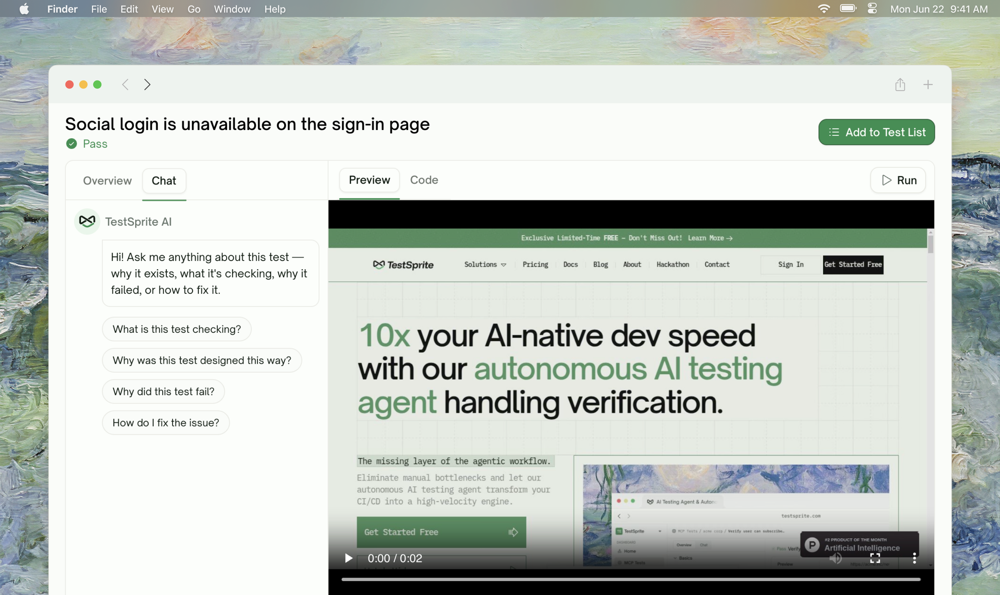
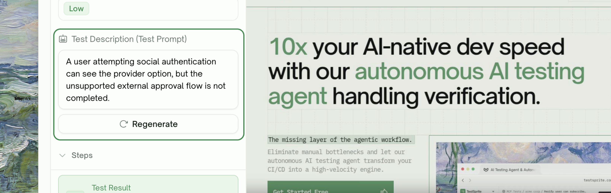
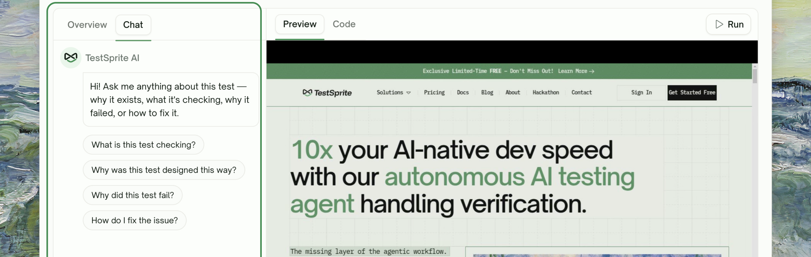
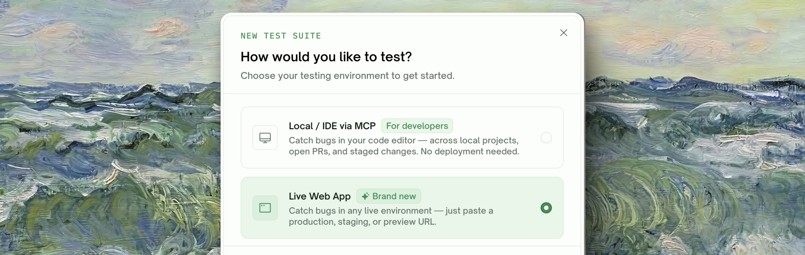

## Overview

The first run is rarely the last word. As you review results, you'll often want to tighten an assertion, point a step at a different element, expand the scope of a check, or rewrite a case entirely. TestSprite gives you three paths for that — pick the one that matches the size of the change.
    <Frame>
    
    </Frame>
| Path | When to use |
| :--- | :--- |
| <kbd>Edit the description</kbd> | You want to refocus or extend a single test (most common) |
| <kbd>Chat with the AI</kbd> | You want to ask why a test failed and let the AI propose a fix |
| <kbd>Regenerate the project</kbd> | The app changed materially and the existing plan no longer matches |

## Edit the Description

The fastest, most surgical path. You rewrite the test's description in natural language and TestSprite regenerates the steps to match.
    <Frame>
    
    </Frame>

<Tabs>
  <Tab title="When to use">
    - You want to **add a specific input value** ("use email `test@example.com`")
    - You want to **narrow scope** ("only verify the success message — don't follow the link")
    - You want to **extend coverage** ("after sign-in, also click the profile menu and verify the avatar loads")
    - You want to **fix a misinterpretation** — the AI's first read of the case missed your real intent
  </Tab>
  <Tab title="What happens">
    1. Open the test on the project detail page
    2. Click the description and edit it inline
    3. Save the change
    4. TestSprite regenerates the affected step(s) automatically
    5. Re-run the test (single test, not the whole project) to verify
  </Tab>
  <Tab title="Example">
    ```text Before
    Verify user can log in with valid credentials.
    ```

    ```text After
    Verify the Sign In link directs users to the login page, that
    submitting email "test@example.com" + password "test123" lands them
    on the dashboard, and that the navbar avatar shows after login.
    ```

    The new description is more specific about the link, the credentials, and an additional assertion on the avatar — TestSprite picks all of that up and updates the step list.
  </Tab>
</Tabs>

## Chat with the AI

When you want a conversation about the test instead of writing the change yourself. Useful for "why did this fail?" and "what would you change?" workflows.
    <Frame>
    
    </Frame>
<Tabs>
  <Tab title="When to use">
    - You don't fully understand **why a test failed** and want a plain-English explanation
    - You want to **brainstorm** what the test should check before committing to an edit
    - You want the AI to **propose a fix** and apply it on your behalf
    - You want to **ask about the test's design** — why was it written this way, what is it really checking
  </Tab>
  <Tab title="What happens">
    1. Open the test detail page
    2. Open the AI chat panel
    3. Ask anything — *"Why did this fail?"*, *"What is this test checking?"*, *"How do I fix this?"*
    4. The assistant grounds its answer in the test's steps, the run's recording, and the failure trace
    5. Apply suggested edits with one click, or copy the explanation back into the description manually
  </Tab>
  <Tab title="Suggested prompts">
    The chat panel ships with a few starters:

    - *What is this test checking?*
    - *Why was this test designed this way?*
    - *Why did this test fail?*
    - *How do I fix the issue?*

    You can ask anything else in natural language too.
  </Tab>
</Tabs>

<Note>
The AI sees the test's steps and the latest run's outcome. It does **not** see your application source code or PRD by default — it reasons from the test artifacts.
</Note>

## Regenerate from Scratch

The largest hammer. Use this when your app has changed materially since the project was created and the existing plan is more outdated than fixable.
    <Frame>
    
    </Frame>
<Tabs>
  <Tab title="When to use">
    - You **shipped a major redesign** and most existing tests reference old UI
    - You **changed your API contract** for many endpoints at once
    - You want to **start fresh** with the same project name and settings
  </Tab>
  <Tab title="What happens">
    1. Re-run the **Create a Test** wizard for the same starting URL or API
    2. UI projects re-explore from scratch — TestSprite captures the new behavior
    3. A fresh test plan is drafted against the current state of your app
    4. You can review and run as if it were a new project
  </Tab>
  <Tab title="Watch out">
    Regenerating creates a new project; it doesn't overwrite the old one. If you want the new project to live alongside the old one (for comparison), keep them both. If you want to retire the old one, delete it from its detail page after the new one is solid.

    For UI projects, regeneration counts against the **Free-plan exploration quota** (10 features lifetime). [See billing](/web-portal/admin/billing-and-plans) if you're close to the limit.
  </Tab>
</Tabs>

## Auto-Heal as a Refinement (UI Only)

For UI tests, **Auto-Heal** is a fourth refinement path that doesn't require any explicit edit. When you rerun a UI test with Auto-Heal opted in, TestSprite recovers the test against the new page if the underlying flow is still intact — UI drift gets absorbed without your involvement.

This is the right tool when:

- You haven't actually changed your test's intent
- You've redesigned the UI and the test is now hitting outdated selectors
- You want a no-touch path for nightly schedules to absorb routine drift

Auto-Heal is a Pro feature (Starter / Standard) — see [Auto-Heal](/web-portal/core/ui/auto-heal) for what it covers, the toggle locations, and how it's billed (extra credits only when recovery actually does work).

## Re-Running After a Refinement

After any refinement you have two options:

<Steps>
  <Step title="Re-run a single test">
    From the test detail page, use the rerun action on the row. Fastest way to confirm a fix without touching the rest of the suite.
  </Step>
  <Step title="Re-run the project">
    From the project detail page, use the rerun action at the top. Useful when the change you made could affect more than one test (e.g. a credential rotation, a context change).
  </Step>
</Steps>

## Tips

<AccordionGroup>
  <Accordion title="Be specific in descriptions">
    "Verify login" is harder for the AI to interpret than "Verify the Sign In link opens the login page and that submitting test credentials lands on the dashboard." More signal in the description = more accurate steps.
  </Accordion>
  <Accordion title="Use the chat for failures, edits for additions">
    Failures benefit from the chat's ability to read the run trace. Additions and scope changes are usually faster as direct description edits.
  </Accordion>
  <Accordion title="Refine in small batches">
    Edit one or two tests, re-run, confirm, then move on. Editing 20 tests at once and re-running everything is harder to debug if a few don't behave as expected.
  </Accordion>
  <Accordion title="Save reusable phrasing">
    If you find yourself adding the same instruction (e.g. *"only check the response body, not the headers"*) to many tests, capture it once and reuse it. The AI is consistent across descriptions written with similar phrasing.
  </Accordion>
</AccordionGroup>

## Where to Go Next

<Columns cols={2}>
  <Card title="Test Detail" href="/web-portal/core/working-with-test/test-detail" icon="layout">
    Where these refinement actions live in the UI
  </Card>
  <Card title="Comparing Runs" href="/web-portal/maintenance/comparing-runs" icon="git-compare">
    Verify your refinement actually changed the right tests
  </Card>
  <Card title="UI Testing" href="/web-portal/core/ui/ui-testing" icon="window-maximize">
    UI test wizard reference
  </Card>
  <Card title="API Testing" href="/web-portal/core/api/api-testing" icon="terminal">
    API test wizard reference
  </Card>
</Columns>
