## Overview
Every project (UI, API, or both) gets its own detail page at <kbd>Dashboard → Tests → [your project]</kbd> — the home base for its tests, runs, recordings, flows, credentials, and refinements. The visible tabs depend on project type: UI-only projects hide API tabs (Data Flow, Cleanup, Dynamic Variables, Integration Tests) and vice versa, with the core tabs shared.
    <Frame>
    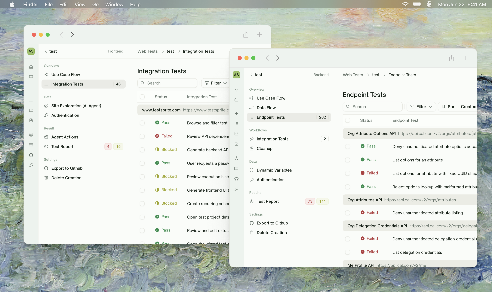
    </Frame>
## Tabs at a Glance

| Tab | Project type | Purpose |
| :--- | :--- | :--- |
| <kbd>Use Case Flow</kbd> | UI, API | Visual map of features and the steps under each one, color-coded by test status |
| <kbd>Data Flow</kbd> | API | Every HTTP call grouped by endpoint with status, request, response |
| <kbd>Site Exploration</kbd> | UI | Per-feature recordings of TestSprite exploring your app |
| <kbd>Endpoint Tests / Integration Tests</kbd> | UI, API | The flat list of test cases for this project |
| <kbd>Integration Tests (Workflows)</kbd> | API | Multi-step chains assembled from related endpoints |
| <kbd>Cleanup</kbd> | API | Post-run teardown of resources tests created |
| <kbd>Dynamic Variables</kbd> | API | Values captured from one test and reused in another |
| <kbd>Authentication</kbd> | UI, API | Test credentials (token / key / login) used during runs |
| <kbd>Agent Actions</kbd> | UI | Video gallery of every agent-driven user journey |
| <kbd>Test Report</kbd> | UI, API | Run-level summary with AI-authored analysis |

## Use Case Flow

    <Frame>
    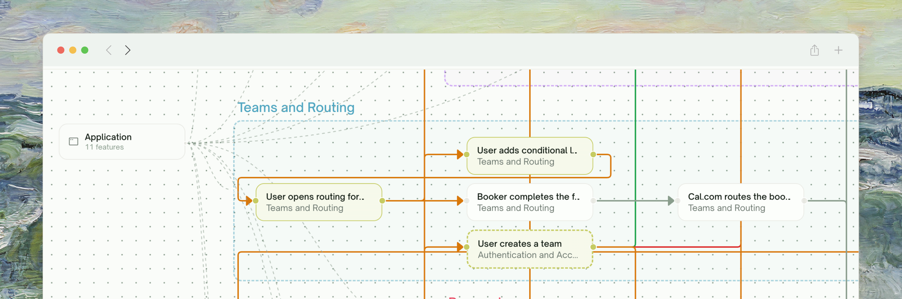
    </Frame>

<Tabs>
  <Tab title="What it is">
    An interactive map of your features. Each feature is a node; each user-flow step under a feature is a sub-node. After a run, every step is colored by status — passed, failed, partially passing, or not yet covered.

    UI projects render this from the features TestSprite identified during exploration. API projects render it from features extracted from your PRD or instructions.
  </Tab>
  <Tab title="When you'll use it">
    - **Sanity-check coverage** at a glance — gray nodes are uncovered features
    - **Pinpoint where things broke** — the failing node tells you which user flow needs attention
    - **Communicate to the team** — the diagram is exportable for stakeholders
  </Tab>
</Tabs>

## Data Flow (API only)

    <Frame>
    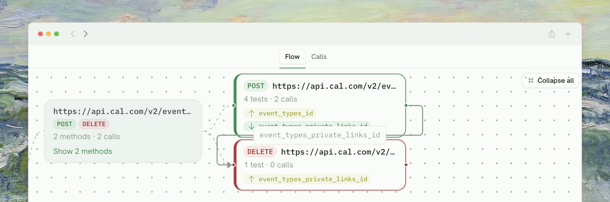
    </Frame>

<Tabs>
  <Tab title="What it is">
    Every HTTP call TestSprite made during the last run, grouped by endpoint. Each card shows the method, URL, status code, request body, and response body. Tests that capture variables ("produces") and tests that consume them ("uses") are linked across cards.
  </Tab>
  <Tab title="When you'll use it">
    - **Diagnose contract mismatches** — see the actual response that broke an assertion
    - **Trace multi-step chains** — follow how an `orderId` flowed from `POST /orders` to `GET /orders/{id}` to `DELETE /orders/{id}`
    - **Spot extra calls** TestSprite made beyond the planned tests (probe calls, retries) under the "Other observed behaviors" section per endpoint
  </Tab>
</Tabs>

## Site Exploration (UI only)

    <Frame>
    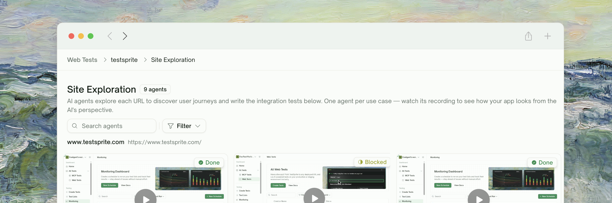
    </Frame>

<Tabs>
  <Tab title="What it is">
    A gallery of feature-by-feature explorations of your app — one tile per feature. Each tile shows the recording from that exploration and a short AI-authored summary of what was discovered.

    The status pill on each tile tells you whether exploration is still **Exploring**, **Done**, **Failed**, or **Idle**. While exploration is in flight you'll see the live stream; afterward, a persisted recording.
  </Tab>
  <Tab title="When you'll use it">
    - **See exactly what TestSprite saw** during exploration — useful for confirming the right pages were reached
    - **Browse past runs' recordings** without re-running exploration
    - **Filter by status** to focus on features that didn't complete
    - **Click a tile** to open the full per-feature report with attempted flows and visited pages
  </Tab>
</Tabs>

<Card title="Feature Exploration" href="/web-portal/core/ui/feature-exploration" icon="compass">
  How exploration works during the wizard
</Card>

## Endpoint Tests / Integration Tests

    <Frame>
    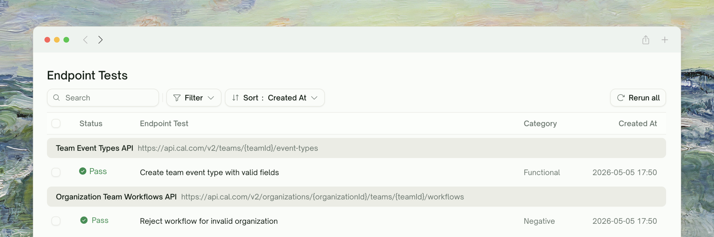
    </Frame>

<Tabs>
  <Tab title="What it is">
    The flat list of every test case in this project. The label depends on type:
    - **UI projects** call them <kbd>Integration Tests</kbd> — multi-step user journeys covering full flows
    - **API projects** call them <kbd>Endpoint Tests</kbd> — typically per-endpoint checks

    Each row shows the title, last status, and run controls. Click a row to open the per-test detail page with the full step-by-step report.
  </Tab>
  <Tab title="When you'll use it">
    - **Run individual tests** without re-executing the whole suite
    - **Filter by status** to focus on what failed
    - **Sort by recency or category** to triage
    - **Open a test's detail page** to see steps, assertions, and screenshots/responses
  </Tab>
</Tabs>

## Integration Tests — Workflows (API only)

    <Frame>
    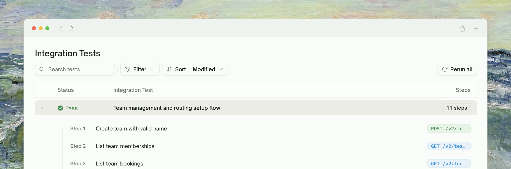
    </Frame>

<Tabs>
  <Tab title="What it is">
    Multi-step chains TestSprite identified across your tests when one endpoint's response feeds another (e.g. `POST /orders` produces an `orderId` that `GET /orders/{id}` then uses). Each row is a chain, executable as a single integration test.
  </Tab>
  <Tab title="When you'll use it">
    - **Verify end-to-end API workflows**, not just isolated endpoints
    - **Catch state-dependent bugs** that single-endpoint tests miss
    - **Re-run a specific chain** when you've fixed a step in the middle
  </Tab>
</Tabs>

## Cleanup (API only)

    <Frame>
    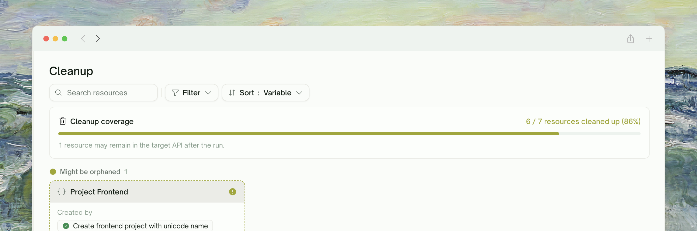
    </Frame>

<Tabs>
  <Tab title="What it is">
    A list of resources your tests created — records, files, sessions — with the status of each cleanup attempt. Resources marked **Has cleanup** were torn down successfully; **Orphaned** ones couldn't be reached or had no clean teardown path.

    Cleanup runs automatically after every API run. You'll see a "Running cleanup sweep" indicator briefly before the report finalizes.
  </Tab>
  <Tab title="When you'll use it">
    - **Confirm your test environment isn't drifting** from leftover data
    - **Spot orphaned resources** that need manual cleanup or a contract change
    - **Search and filter** by resource type or cleanup status
  </Tab>
</Tabs>

## Dynamic Variables (API only)
    <Frame>
    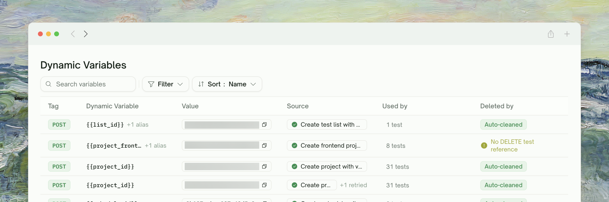
    </Frame>
<Tabs>
  <Tab title="What it is">
    The list of values one test captured and another test consumed, grouped by variable name. For each variable you'll see the captured value(s) and which tests produce or use it.
  </Tab>
  <Tab title="When you'll use it">
    - **Debug chained tests** — confirm the right value flowed from upstream to downstream
    - **Find where a value originates** when an integration test fails
    - **Audit the data flow** of your run end to end
  </Tab>
</Tabs>

## Authentication

    <Frame>
    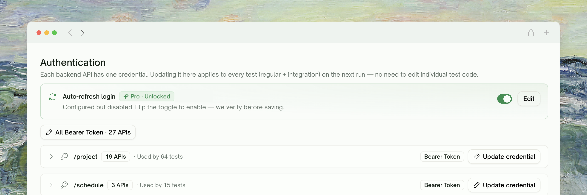
    </Frame>

<Tabs>
  <Tab title="What it is">
    The credentials TestSprite uses to call your APIs or sign into your app.

    For **API projects**: a per-API table with auth type (Bearer Token, API Key, Basic Token, None) and the masked secret value. APIs sharing the same auth type can be updated in bulk from a single row.

    For **UI projects**: a simpler form for the test account TestSprite uses during exploration (URL, username, password).

    All values are stored encrypted and shown masked — only the first 6 and last 4 characters of long secrets are visible.
  </Tab>
  <Tab title="When you'll use it">
    - **Rotate a token** mid-project without restarting from the wizard
    - **Update a single API's auth** when one endpoint moves to a different scheme
    - **Bulk-rotate the JWT** that covers a whole API surface
  </Tab>
</Tabs>

## Agent Actions (UI only)
    <Frame>
    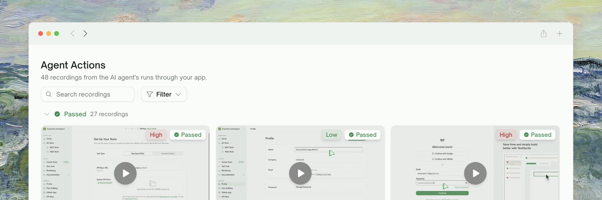
    </Frame>
<Tabs>
  <Tab title="What it is">
    A video gallery of every UI test run. Each tile is the recording produced while TestSprite walked through one user journey. Click a tile to open the inline player.
  </Tab>
  <Tab title="When you'll use it">
    - **Replay a failing test** to see exactly what happened on screen
    - **Hand a recording to a teammate** instead of describing the bug
    - **Filter by status** to focus on what needs investigation
  </Tab>
</Tabs>

## Test Report
    <Frame>
    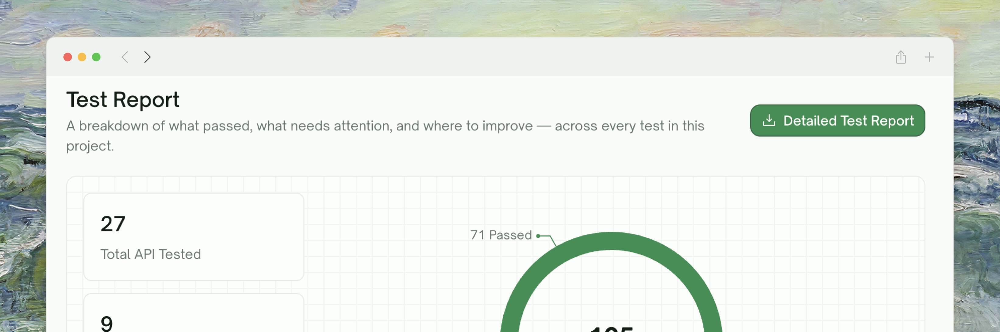
    </Frame>

<Tabs>
  <Tab title="What it is">
    The run-level summary view: pass/fail counts, an AI-authored analysis of the run, highlighted failures with cause-and-fix suggestions, and quick links to the per-test reports.

    The nav badge on this tab shows two counts when relevant — red for **Failed** tests and amber for **Blocked** tests (setup or auth issues, distinct from a real product bug).
  </Tab>
  <Tab title="When you'll use it">
    - **Get the headline** after a run finishes
    - **Triage failures fast** — the report groups by suspected cause
    - **Share the run** with the team via a link to this tab
    - **Re-run the project** from the action button at the top
  </Tab>
</Tabs>

<Card title="Refining Tests" href="/web-portal/core/working-with-test/refining-tests" icon="pen-to-square">
  How to iterate after reviewing the report
</Card>

## Inside a Test — Drill-Down View

Clicking any row in the Endpoint Tests / Integration Tests list opens that test's own detail page. The page is split into two panels:
    <Frame>
    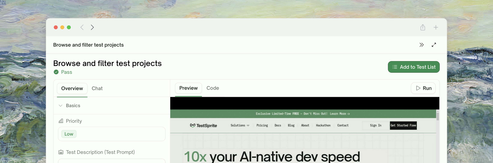
    </Frame>

**Left panel — info and refinement.** Two tabs:

| Tab | Content |
| :--- | :--- |
| <kbd>Overview</kbd> | Two collapsible sections: **Basics** (Priority, Description, the live-editable **Test Description (Test Prompt)** with a <kbd>Regenerate</kbd> action, and Terminal Output for API tests) and **Steps** (per-step playback for UI tests — see [Step-by-Step Walkthrough](/web-portal/core/ui/ui-step-by-step)) |
| <kbd>Chat</kbd> | The natural-language refinement panel — see [Refining Tests](/web-portal/core/working-with-test/refining-tests) |

**Right panel — code and preview.**

- **UI tests** show two tabs: <kbd>Preview</kbd> (recorded video of the run) and <kbd>Code</kbd> (the generated Playwright source).
- **API tests** show the code editor directly (generated Python).

The right panel's tab bar (or editor toolbar for API) hosts the primary action button: <kbd>Run</kbd> when the editor is clean, <kbd>Save & Run</kbd> when there are unsaved edits. Clicking it opens the **Rerun** dialog with the run options that apply to this test type — Auto-Heal toggle for UI tests; producer/teardown closure options for API tests. `Cmd`/`Ctrl`+`S` saves without running.

The toolbar at the top of the per-test page is intentionally minimal:

| Control | What it does |
| :--- | :--- |
| <kbd>Add to Test List</kbd> | Add this test to a Test List for grouping or scheduling — see [Test Lists](/web-portal/maintenance/test-lists) |

<Card title="Step-by-Step Walkthrough" href="/web-portal/core/ui/ui-step-by-step" icon="list-check">
  The rich per-step replay view for UI tests
</Card>

## Settings Actions

The bottom of the left nav has two project-level actions that show up when applicable:
| Action | Description |
| :--- | :--- |
| <kbd>Export to Github</kbd> | Push the generated test code to a connected GitHub repository. Requires the [GitHub App](/web-portal/integrations/github-integration) to be installed and a repo selected. |
| <kbd>Delete Creation</kbd> | Remove the entire project, including its tests, runs, recordings, and credentials. Asks for confirmation; not reversible. |

## Where to Go Next

<Columns cols={2}>
  <Card title="UI Testing" href="/web-portal/core/ui/ui-testing" icon="window-maximize">
    Create a UI project from scratch
  </Card>
  <Card title="API Testing" href="/web-portal/core/api/api-testing" icon="terminal">
    Create an API project from scratch
  </Card>
  <Card title="Refining Tests" href="/web-portal/core/working-with-test/refining-tests" icon="pen-to-square">
    Improve a test after reviewing it
  </Card>
  <Card title="Comparing Runs" href="/web-portal/maintenance/comparing-runs" icon="git-compare">
    Track what changed between runs
  </Card>
</Columns>
