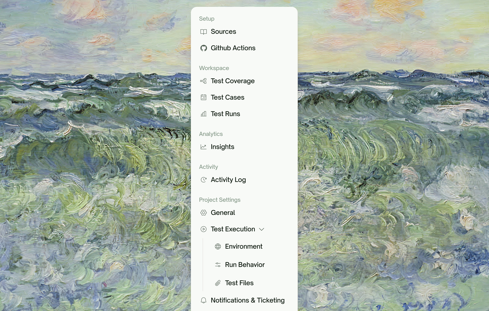
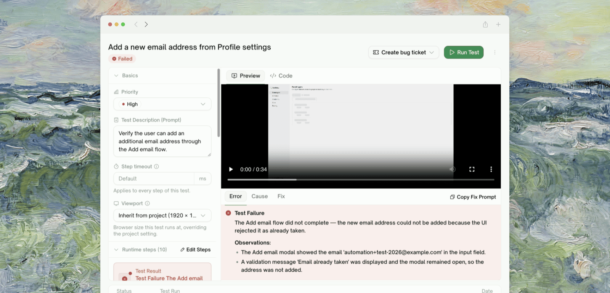
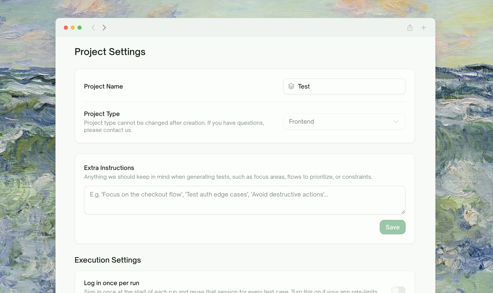

## Overview

Every project has its own detail page, the home base for its coverage map, test cases, runs, and settings. Open a project from <kbd>All Projects</kbd> and you land on its <kbd>Test Cases</kbd> (or, while the project is still being set up, on the stage it has reached or its Onboarding Checklist). Everything else is one click away in the left nav.

<Frame>
  
</Frame>

The header carries <kbd>Share</kbd> (invite someone to the workspace so they can open this project; see [Sharing a Project](/web-portal/admin/sharing)) and <kbd>Copy link</kbd>.

## The Left Nav at a Glance

<Frame>
  
</Frame>

| Section | What it shows |
| :--- | :--- |
| <kbd>Sources</kbd> | The documents and crawled pages the plan is grounded in |
| <kbd>GitHub Action</kbd> | CI triggers for this project. See [GitHub Integration](/web-portal/integrations/github-integration) |
| <kbd>Test Coverage</kbd> | The visual map of features, use cases, and their statuses. See [Coverage Map](/web-portal/core/working-with-test/coverage-map) |
| <kbd>Test Cases</kbd> | Every test, grouped by use case; API projects split into **Endpoint Tests** and **Integration Tests**. See [Managing Test Cases](/web-portal/core/working-with-test/managing-test-cases) |
| <kbd>Test Runs</kbd> | Every run of this project: watch one live or open its results and report |
| <kbd>Insights</kbd> | Current status at a glance. See [Insights](/web-portal/results/project-overview) |
| <kbd>Activity Log</kbd> | Who changed what in the project, and when |
| <kbd>Project Settings → General</kbd> | Rename or delete the project |
| <kbd>Environment</kbd> | Environment variables and per-environment configuration |
| <kbd>Notifications & Ticketing</kbd> | Where run results get announced and how failures become tickets |

## Test Cases: the Working List

<Frame>
  
</Frame>

Each row shows the case's title, priority, latest status, and last run time. The toolbar holds <kbd>Add More Tests</kbd>, <kbd>Edit Test</kbd> (batch editing), and the run button, which doubles as an **environment picker** when the project has environments configured. Select rows to run, delete, or add them to a [Test List](/web-portal/maintenance/test-lists) in bulk. Editing, adding, and deleting are covered in [Managing Test Cases](/web-portal/core/working-with-test/managing-test-cases).

## Inside a Test Case

Clicking a row opens the test case as a **drawer** over the list; expand it to a full page when you need more room.

<Frame>
  
</Frame>

- **Left, the definition**: priority, the test description (the prompt the run is judged against), and the step list. The name is the heading and can't be edited here; rename it in the batch editor (<kbd>Edit Test</kbd>). <kbd>Edit steps</kbd> opens the step editor; the primary button is <kbd>Save & Run</kbd>, because an edited test only means something once it re-runs.
- **Right, the evidence**: for UI tests, a <kbd>Preview</kbd> tab (the run's recording) and a <kbd>Code</kbd> tab; for API tests, the generated code and its terminal output.
- **Bottom, the run list**: the **Test runs** panel lists this case's past runs with status and date.

### Reading a failure

<Frame>
  
</Frame>

Work through the evidence in this order:

1. **The verdict and error message** in the result panel: what the judge concluded, in plain language.
2. **The step trace**: which step failed, with the page state at that moment. For UI tests, see [Step-by-Step Replay](/web-portal/core/ui/ui-step-by-step).
3. **The output**: terminal output for API tests, the recording for UI tests.
4. **The fix-suggestion prompt**: a ready-to-use prompt describing the failure. Copy it into Cursor, Claude Code, or your IDE and let your coding agent drive the fix.

After a change, saving the step editor or clicking <kbd>Save & Run</kbd> re-runs the case (for API tests, use <kbd>Regenerate</kbd> when the code itself must change). To re-check everything, run the whole project from the Test Cases toolbar. See [Managing Test Cases](/web-portal/core/working-with-test/managing-test-cases) for the details.

## Test Runs & Reports

<Frame>
  
</Frame>

<kbd>Test Runs</kbd> lists every execution of this project. While a run is in flight you can [watch it live](/web-portal/results/test-report#watching-a-run); afterwards, its [report](/web-portal/results/test-report) sums up the results with AI analysis of what broke and why, and can be downloaded as a PDF.

## Project Settings

<Frame>
  
</Frame>

| Action | Description |
| :--- | :--- |
| <kbd>Rename</kbd> | Change the project's name (autosaved) |
| <kbd>Share</kbd> | In the page header: adds someone to the workspace so they can open this project. See [Sharing a Project](/web-portal/admin/sharing) |
| <kbd>Export to GitHub</kbd> | In the project's row menu on <kbd>All Projects</kbd>. Pushes this project's generated test code to a GitHub repo, creating one if needed. Uses your personal GitHub login, not the GitHub App (see [Exporting Test Code to GitHub](/web-portal/integrations/github-integration#exporting-test-code-to-github)) |
| <kbd>Delete project</kbd> | Removes the project with its tests, runs, and recordings. Available to workspace admins and the project's creator; asks for confirmation; not reversible |

## Where to Go Next

<Columns cols={2}>
  <Card title="Coverage Map" href="/web-portal/core/working-with-test/coverage-map" icon="sitemap">
    The visual front door to this project's tests
  </Card>
  <Card title="Managing Test Cases" href="/web-portal/core/working-with-test/managing-test-cases" icon="pen-to-square">
    Improve a test after reviewing its results
  </Card>
  <Card title="Insights" href="/web-portal/results/project-overview" icon="gauge">
    Regressions and quality trends across runs
  </Card>
</Columns>
