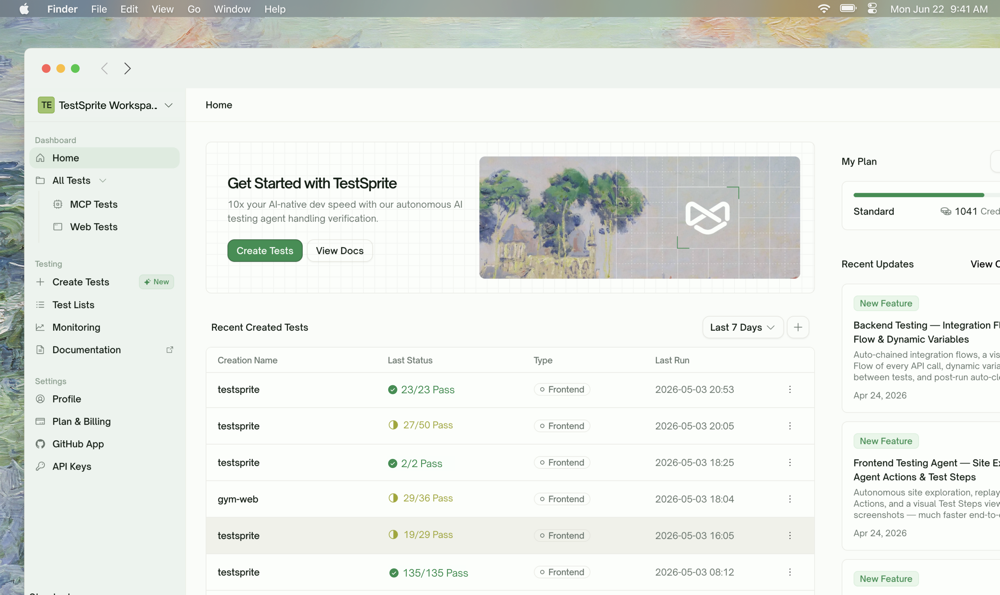
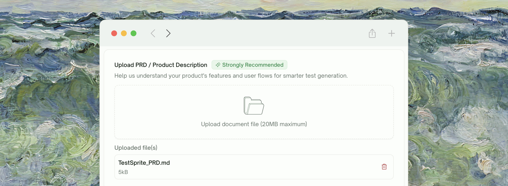
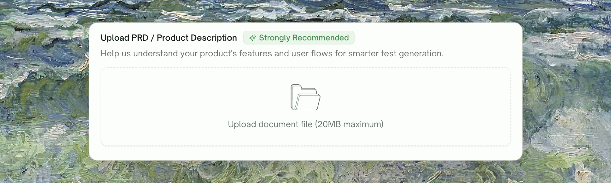
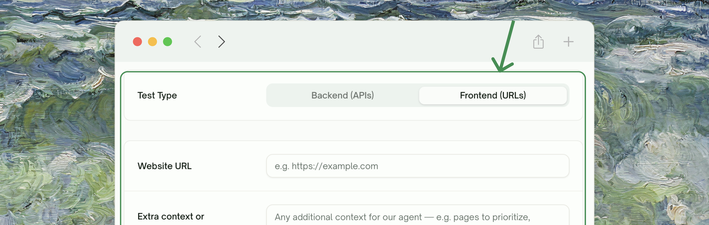
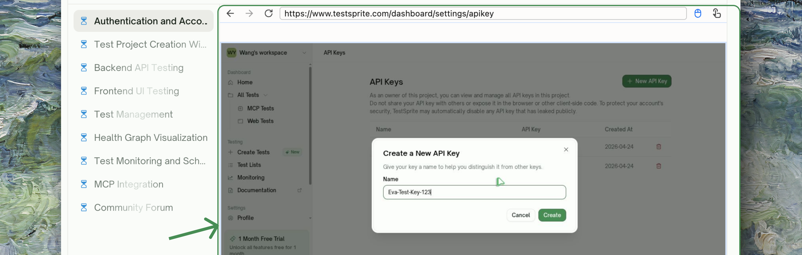
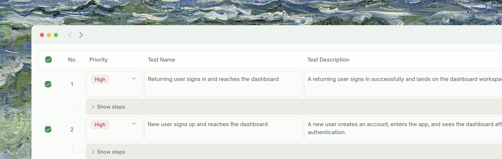

## What is the TestSprite Web Portal?

The TestSprite Web Portal is a browser dashboard that takes a project from "I have an app" to "I have a passing test suite running on a schedule" — without writing a single line of test code. It complements the [MCP Server](/mcp/getting-started/overview) (which lives in your IDE) by giving non-IDE users, QA, and engineering teams a shared place to configure projects, manage credentials, run tests, and review reports.

<Frame>
  
</Frame>

### Spec-Driven Testing

TestSprite is **spec-driven**. Plans are derived from what your product is *supposed to do* (your PRD), what the live app *actually does* (exploration / discovery), and the gap between the two.

<Tip>
Uploading a PRD isn't required, but it is **strongly recommended** — it's how TestSprite builds an accurate feature map of your product before any test is written, and it directly improves the quality and coverage of the generated plan.
</Tip>
<Frame>
  
</Frame>
### What It Tests

TestSprite covers two test types from the same dashboard:

<Frame>
  
</Frame>

<table style={{ lineHeight: "1.9" }}>
  <thead>
    <tr>
      <th style={{ paddingBottom: "18px", textAlign: "left" }}>Test type</th>
      <th style={{ paddingBottom: "18px", textAlign: "left" }}>What it covers</th>
      <th style={{ paddingBottom: "18px", textAlign: "left" }}>Planned from</th>
    </tr>
  </thead>
  <tbody>
    <tr>
      <td style={{ paddingTop: "16px" }}><kbd style={{ fontFamily: "inherit", fontSize: "0.95em" }}>UI (frontend)</kbd> — Playwright-driven, runs against a live URL</td>
      <td style={{ paddingTop: "16px" }}>User-journey flows, form validation, visual states, stateful components, auth flows, UI error handling</td>
      <td style={{ paddingTop: "16px" }}>A feature map built from your PRD plus Feature Exploration of your live app</td>
    </tr>
    <tr>
      <td><kbd style={{ fontFamily: "inherit", fontSize: "0.95em" }}>API (backend)</kbd> — Python-driven, runs against a base URL</td>
      <td>Functional workflows, schema validation, auth flows, data integrity across calls, error handling, security</td>
      <td>Your PRD plus OpenAPI / Swagger / Postman collections (or any free-form docs you upload) and live probes against the base URL</td>
    </tr>
  </tbody>
</table>

## How It Works

You provide a URL, credentials, and a PRD (**strongly recommended**). TestSprite builds a feature map from the PRD, explores or discovers your app, drafts a plan you can review, generates the tests, runs them in the cloud, and gives you a report you can refine in natural language.

<Steps>
  <Step title="Project Setup & PRD Upload">
    Name the project and upload your PRD (or any product-spec document — markdown / PDF / plain text all work). PRD upload is **strongly recommended**; it's the only thing this step asks for besides the name.
      <Frame>
      
    </Frame>
  </Step>
  <Step title="Feature & Use-Case Extraction">
    TestSprite reads your PRD and produces a **feature map** — a structured list of features and the use cases under each, rendered as a flow graph. This is what grounds the rest of the lifecycle; if you skipped the PRD, this step is bypassed and the wizard falls back to your URL inputs alone.
        <Frame>
      
    </Frame>
  </Step>
  <Step title="Configure">
    Provide your live URL, test-account credentials, and — for API projects — your API documentation (OpenAPI / Swagger / Postman or any free-form docs). Add natural-language hints for what to focus on or skip.
      <Frame>
      
    </Frame>
  </Step>
  <Step title="Explore or Discover">
    For UI, TestSprite walks your live app feature by feature, targeting the use cases from the feature map. For API, TestSprite reads endpoints from your docs and probes the base URL to confirm shapes.
        <Frame>
      
    </Frame>
  </Step>
  <Step title="Plan and Review">
    A test plan is drafted from the feature map + what was observed. You select / deselect / edit cases before generation runs.
      <Frame>
      
    </Frame>
  </Step>
  <Step title="Generate, Run, Report">
    Tests are generated and executed in our cloud. A run-level report highlights failures and suggests causes.
  </Step>
  <Step title="Refine and Schedule">
    Iterate on individual tests via the Chat tab. Group tests into Test Lists. Schedule continuous runs to catch regressions.
  </Step>
</Steps>

<Card title="Try it end-to-end" href="/web-portal/getting-started/your-first-test" icon="play">
  Walk through a complete project in about 15 minutes
</Card>

## Key Benefits

Different roles get different value out of the same dashboard:

- **For developers:** Skip the test-writing boilerplate. Watch your changes get exercised against real flows in minutes, not hours. Iterate in natural language when something needs to be tightened.
- **For QA teams:** Replace handwritten regression suites with a plan TestSprite re-derives from your live app. Use Test Lists and Monitoring to keep coverage running on a cadence.
- **For engineering leads:** Get reproducible reports, severity-ranked failures, and a defensible coverage story without standing up a test-writing organization.

## What Makes It Different

| Feature | Traditional Testing | TestSprite Web Portal |
| :--- | :--- | :--- |
| <kbd>Test case creation</kbd> | Writing test cases manually | **AI generates test cases automatically** from your live app + docs |
| <kbd>Setup</kbd> | Setting up frameworks, fixtures, runners | Almost **zero setup** — provide a URL and credentials |
| <kbd>Maintenance</kbd> | UI tests break on every minor tweak | **Auto-Heal** recovers UI tests when the page changes; **Auto-Auth** refreshes API tokens |
| <kbd>Debugging</kbd> | Reading stack traces, hunting causes | **AI cause-and-fix** on every failure; refine in natural language |
| <kbd>Coverage</kbd> | Limited to what someone wrote down | **Plan derived from observed behavior** — not just intent |

## Testing Capabilities

<Tabs>
  <Tab title="UI Testing (Frontend)">
    - **PRD-driven Feature Map** — features and use cases derived from your spec, rendered as a flow graph
    - **Feature Exploration (Beta)** — TestSprite walks your live app before any plan is written, targeting the use cases from the feature map
    - **Plan derived from spec + observed flows** — grounded in both intent and reality
    - **Auto-Heal** — recover automatically when the page changes instead of marking tests Failed
    - **Step-by-step replay** — per-step screenshots + recorded video for every run
    - **Visual states, form flows, auth flows, error handling**
    - Generated code in **Playwright + Python**
  </Tab>
  <Tab title="API Testing (Backend)">
    - **PRD-driven coverage** — uploading a PRD lets TestSprite plan to the *intent* of each endpoint, not just its shape
    - **Discovery** — endpoints sourced from OpenAPI / Swagger / Postman collections (or free-form docs you upload) plus live probes
    - **Dependency Chains** — independent tests run in parallel; dependent tests wait for what they need, with values passed forward
    - **Auto-Cleanup** — created resources are removed after the suite finishes
    - **Auto-Auth (Pro)** — auto-refresh login tokens before every run
    - **Dynamic Variables** — captured-at-runtime values surface in their own table
    - **Data Flow** — Flow + Calls views for inspecting traffic across a chain
  </Tab>
</Tabs>

## What's Inside the Dashboard

| Surface | What it does |
| :--- | :--- |
| <kbd>Create Tests</kbd> | The wizard that drives Configuration → Exploration/Discovery → Plan → Generation |
| <kbd>All Tests</kbd> | Every project you've created, grouped by type, with run status and quick-rerun |
| <kbd>Test Lists</kbd> | Group tests across projects into a single executable list — see [Test Lists](/web-portal/maintenance/test-lists) |
| <kbd>Monitoring</kbd> | Schedule Test Lists to run on a cadence with execution history — see [Monitoring](/web-portal/maintenance/monitoring) |
| <kbd>Settings → Workspace Settings</kbd> | Create and switch workspaces, manage members — see [Workspaces](/web-portal/admin/workspaces) |
| <kbd>Settings → API Keys</kbd> | Generate keys for MCP / external tooling |
| <kbd>Settings → GitHub App</kbd> | Connect repos for PR-based test runs and code export |
| <kbd>Settings → Plan & Billing</kbd> | Plan tier, monthly credits, and feature gating |

## Where to Go Next

<Columns cols={2}>
  <Card title="Your First Test" href="/web-portal/getting-started/your-first-test" icon="play">
    Walk through configuration to report end-to-end
  </Card>
  <Card title="Key Terms" href="/web-portal/concepts/key-terms" icon="book">
    Vocabulary used across the rest of the docs
  </Card>
  <Card title="Testing Lifecycle" href="/web-portal/concepts/testing-lifecycle" icon="circle-nodes">
    The mental model behind TestSprite's wizard
  </Card>
  <Card title="UI Testing" href="/web-portal/core/ui/ui-testing" icon="window-maximize">
    Start a UI project from scratch
  </Card>
  <Card title="API Testing" href="/web-portal/core/api/api-testing" icon="terminal">
    Start an API project from scratch
  </Card>
  <Card title="Join the Community" href="https://discord.gg/QQB9tJ973e" icon="comments">
    Discord for users and the team
  </Card>
</Columns>
