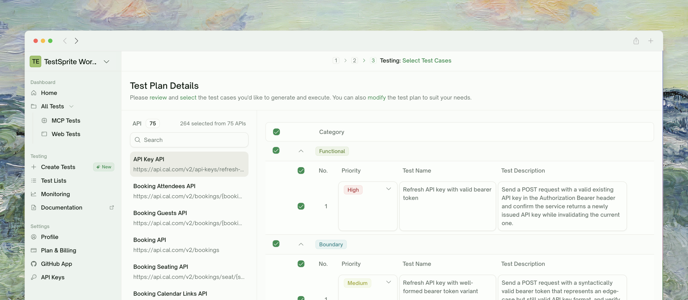
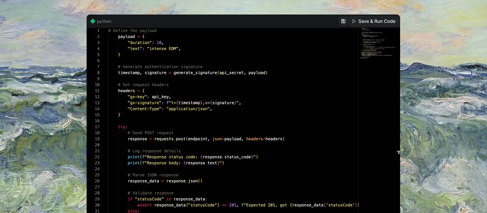

      <Frame>
      
      </Frame>

## Step 1: Customer Input

Simply provide your application details to get started

      <Frame>
      
      </Frame>

<div className="full-width-table two-column" style={{ gridTemplateColumns: '1fr 2fr' }}>
  <div className="table-header" style={{ padding: '12px', fontSize: '14px' }}>Requirement</div>
  <div className="table-header" style={{ padding: '12px', fontSize: '14px' }}>Description</div>
  
  <div className="table-cell" style={{ padding: '12px', fontSize: '14px', borderBottom: '1px solid var(--table-border-color, #e5e7eb)' }}><kbd>Application URLs</kbd></div>
  <div className="table-cell" style={{ padding: '12px', fontSize: '14px', borderBottom: '1px solid var(--table-border-color, #e5e7eb)' }}>Frontend and backend endpoints</div>
  
  <div className="table-cell" style={{ padding: '12px', fontSize: '14px', borderBottom: '1px solid var(--table-border-color, #e5e7eb)' }}><kbd>Authentication credentials</kbd></div>
  <div className="table-cell" style={{ padding: '12px', fontSize: '14px', borderBottom: '1px solid var(--table-border-color, #e5e7eb)' }}>API keys, login details, etc.</div>
  
  <div className="table-cell" style={{ padding: '12px', fontSize: '14px' }}><kbd>Testing requirements</kbd></div>
  <div className="table-cell" style={{ padding: '12px', fontSize: '14px' }}>Specific scenarios you want covered</div>
</div>

<Tip>
Our AI creates a completely customized testing plan in real-time—no templates or generic approaches.
</Tip>

## Step 2: Test Plans Auto Generation

TestSprite's AI creates a detailed, customized testing plan with thoughtfully crafted test cases targeting specific scenarios for your product. Each test case includes a clear description explaining its purpose and rationale.

      <Frame>
      
      </Frame>
      <br />


<Accordion title="Example test plan for back-end API testing">
Generated testing plan for [Amazon S3 `create_bucket` API](https://boto3.amazonaws.com/v1/documentation/api/latest/reference/services/s3/client/create_bucket.html):

1. **Basic Bucket Creation**
   - Create bucket with unique name and verify existence

2. **Name Validation**
   - Test invalid names (special characters, spaces) and verify error responses

3. **Location Constraints**
   - Create buckets in specific regions (us-east-1, eu-west-1)

4. **Access Control (ACL)**
   - Test different ACL settings (private, public-read, authenticated-read)

5. **Versioning**
   - Create bucket with versioning enabled and verify configuration

6. **...**
</Accordion>

## Step 3: User Review & Confirmation

Before proceeding, users can review the automatically generated test plans. This step allows you to <span style={{ color: "#10A363" }}> **manually adjust**</span>, add, or remove specific tests and ensure the generated plans align with your testing goals.
      <Frame>
      
      </Frame>
      <br />
## Step 4: Test Code Auto Generation (Implementation)
Based on the test plan from Step 2, here's an example of the actual Python test code that TestSprite's AI automatically creates


      <Frame>
      
      </Frame>

<Steps>
  <Step title="AI Code Generation">
    TestSprite's AI converts your approved test plan into production-ready code
  </Step>
  <Step title="Cloud Compilation">
    Code is automatically uploaded and compiled in our secure cloud environment
  </Step>
  <Step title="Smart Auto-Fixing">
    AI resolves compilation issues and applies self-patching for optimal accuracy
  </Step>
</Steps>

<Info>
**Zero coding required!** Our AI delivers the highest accuracy among all Testing Autopilot tools through intelligent self-patching.
</Info>

<Accordion title="View Generated Test Code Example">
```python Expandable Sample Test Code
import unittest
import boto3
from botocore.exceptions import ClientError

class TestCreateBucketAPI(unittest.TestCase):
    @classmethod
    def setUpClass(cls):
        # Initialize the S3 client
        cls.s3_client = boto3.client('s3')

    def test_basic_bucket_creation(self):
        bucket_name = 'test-bucket-basic'

        try:
            # Test creating a new S3 bucket
            self.s3_client.create_bucket(Bucket=bucket_name)
        except ClientError as e:
            self.fail(f"Error creating basic bucket: {e}")

        # Verify that the bucket exists
        response = self.s3_client.list_buckets()
        buckets = [bucket['Name'] for bucket in response['Buckets']]
        self.assertIn(bucket_name, buckets)

    def test_invalid_bucket_name(self):
        invalid_bucket_names = ['bucket with spaces', 'bucket_with_special_characters!']

        for bucket_name in invalid_bucket_names:
            with self.subTest(bucket_name=bucket_name):
                with self.assertRaises(ClientError) as context:
                    # Test creating a bucket with an invalid name
                    self.s3_client.create_bucket(Bucket=bucket_name)

                self.assertEqual(context.exception.response['Error']['Code'], 'InvalidBucketName')

    # And the other test cases ...

if __name__ == '__main__':
    unittest.main()
```
</Accordion>

## Step 5: Test Execution

TestSprite automatically executes the generated test cases in our cloud environment, closely monitoring the results to promptly detect any issues.

      <Frame>
      
      </Frame>

## Step 6: Review and Adjust

TestSprite's AI **automatically analyzes test failures**, **identifies root causes**, and provides **actionable recommendations** for quick resolution. **Chat with AI** using plain English to modify tests—**zero coding required**, **instant regeneration**, and **complete control** over your test scenarios.

<Tip>
**Pro tip:** Edit test prompts anytime to regenerate cases with different scenarios - no coding required!
</Tip>

      <Frame>
      
      </Frame>


**Available tools:**

<div className="full-width-table two-column" style={{ gridTemplateColumns: '1fr 2fr' }}>
  <div className="table-header" style={{ padding: '12px', fontSize: '14px' }}>Tool</div>
  <div className="table-header" style={{ padding: '12px', fontSize: '14px' }}>Description</div>
  
  <div className="table-cell" style={{ padding: '12px', fontSize: '14px', borderBottom: '1px solid var(--table-border-color, #e5e7eb)' }}><kbd>VS Code plugin</kbd></div>
  <div className="table-cell" style={{ padding: '12px', fontSize: '14px', borderBottom: '1px solid var(--table-border-color, #e5e7eb)' }}>Direct console adjustments</div>
  
  <div className="table-cell" style={{ padding: '12px', fontSize: '14px', borderBottom: '1px solid var(--table-border-color, #e5e7eb)' }}><kbd>AI chat assistant</kbd></div>
  <div className="table-cell" style={{ padding: '12px', fontSize: '14px', borderBottom: '1px solid var(--table-border-color, #e5e7eb)' }}>Questions and modifications</div>
  
  <div className="table-cell" style={{ padding: '12px', fontSize: '14px' }}><kbd>Prompt editing</kbd></div>
  <div className="table-cell" style={{ padding: '12px', fontSize: '14px' }}>Regenerate test cases</div>
</div>

## Step 7: Final Testing Report

TestSprite generates a comprehensive report covering

      <Frame>
      
      </Frame>


<div className="full-width-table two-column" style={{ gridTemplateColumns: '1fr 2fr' }}>
  <div className="table-header" style={{ padding: '12px', fontSize: '14px' }}>Section</div>
  <div className="table-header" style={{ padding: '12px', fontSize: '14px' }}>Description</div>
  
  <div className="table-cell" style={{ padding: '12px', fontSize: '14px', borderBottom: '1px solid var(--table-border-color, #e5e7eb)' }}><kbd>Test results</kbd></div>
  <div className="table-cell" style={{ padding: '12px', fontSize: '14px', borderBottom: '1px solid var(--table-border-color, #e5e7eb)' }}>Pass/fail status for each case</div>
  
  <div className="table-cell" style={{ padding: '12px', fontSize: '14px', borderBottom: '1px solid var(--table-border-color, #e5e7eb)' }}><kbd>Improvement areas</kbd></div>
  <div className="table-cell" style={{ padding: '12px', fontSize: '14px', borderBottom: '1px solid var(--table-border-color, #e5e7eb)' }}>Actionable recommendations</div>
  
  <div className="table-cell" style={{ padding: '12px', fontSize: '14px', borderBottom: '1px solid var(--table-border-color, #e5e7eb)' }}><kbd>Security findings</kbd></div>
  <div className="table-cell" style={{ padding: '12px', fontSize: '14px', borderBottom: '1px solid var(--table-border-color, #e5e7eb)' }}>Vulnerabilities and fixes</div>
  
  <div className="table-cell" style={{ padding: '12px', fontSize: '14px' }}><kbd>Team sharing</kbd></div>
  <div className="table-cell" style={{ padding: '12px', fontSize: '14px' }}>Export and collaborate easily</div>
</div>