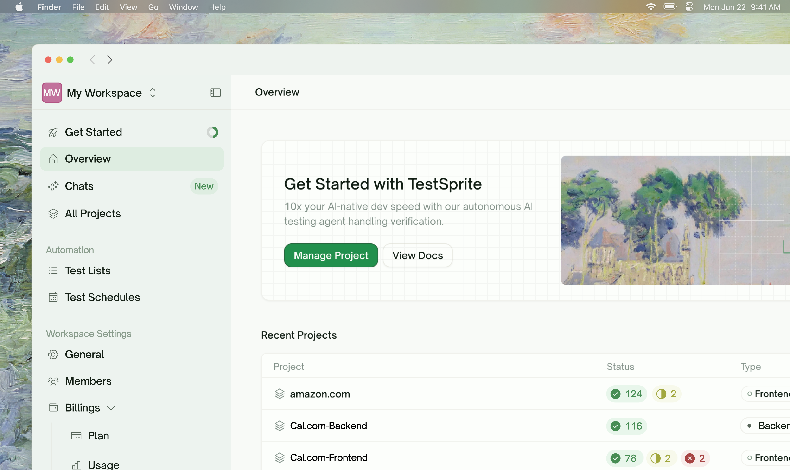
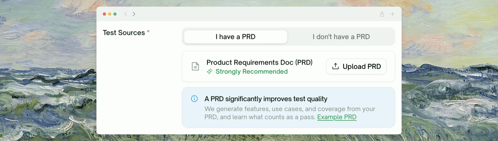
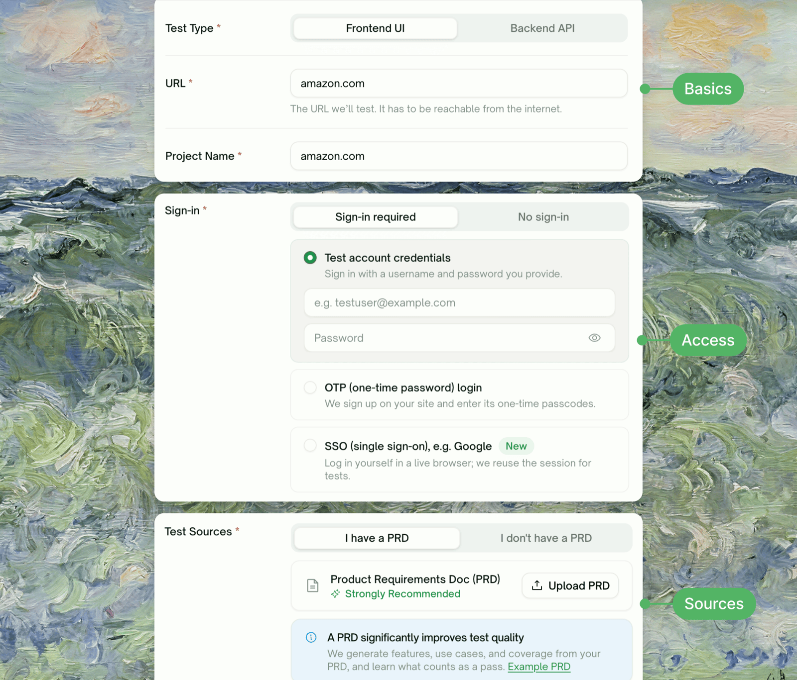
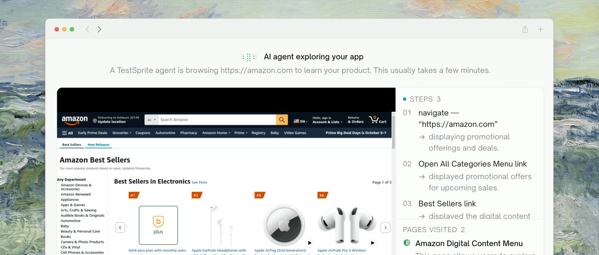
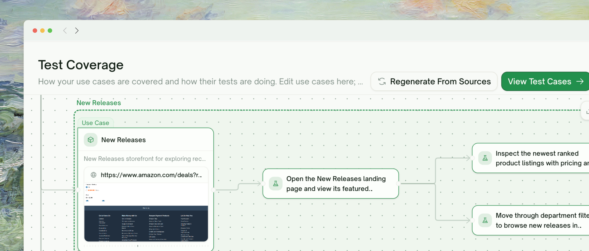
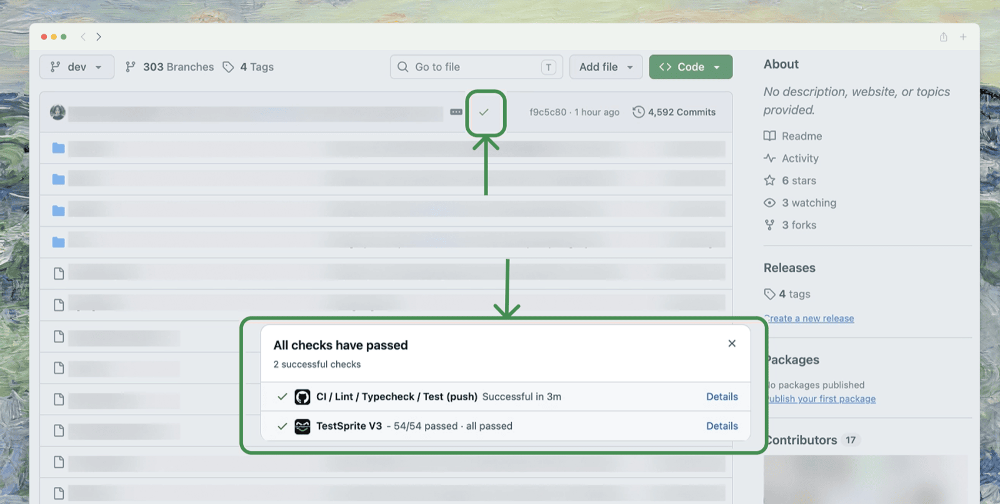

## What is the TestSprite Web Portal?

The TestSprite Web Portal is a browser dashboard that takes a project from "I have an app" to "I have a passing test suite running on a schedule", without writing a single line of test code. It complements the [TestSprite CLI](/cli/getting-started/overview) and the [MCP Server](/mcp/getting-started/overview), which bring TestSprite into your terminal, IDE, and coding agent, by giving your whole team a shared place to set up projects, run tests, and review results.

<Frame>
  
</Frame>

TestSprite is **spec-driven**: plans come from what your product is *supposed to do* (your PRD) and what the live app *actually does* (exploration or discovery). A PRD isn't required, but it is **strongly recommended**. It's the biggest lever on plan quality.

<Frame>
  
</Frame>

## What It Tests

<Frame>
  
</Frame>

| Test type | What it covers | Planned from |
| :--- | :--- | :--- |
| <kbd>UI (frontend)</kbd> | User journeys, forms, visual states, auth flows, UI error handling | Your PRD plus exploration of the live app |
| <kbd>API (backend)</kbd> | Functional workflows, schemas, auth, data integrity across calls, error handling, security | Your PRD, your API docs, and probes of your live API |

## How It Works

You provide a URL, credentials, and a PRD (**strongly recommended**). TestSprite builds a feature map from the PRD, explores or discovers your app, drafts a plan you can review, generates the tests, runs them in the cloud, and gives you a report. You can also refine the tests in natural language.

<Steps>
  <Step title="Create a project">
    Click <kbd>New Project</kbd> and enter your basic project information: your live URL, how to sign in, your PRD (**strongly recommended**), and more.
    <Frame>
      
    </Frame>
  </Step>
  <Step title="Explore or discover">
    For UI projects, TestSprite explores your live app. For API projects, it reads your API docs and probes the endpoints against your live API.
    <Frame>
      
    </Frame>
  </Step>
  <Step title="Build the feature map">
    TestSprite maps your product's features and the use cases under each, from your PRD and what it found.
    <Frame>
      
    </Frame>
  </Step>
  <Step title="Review the plan">
    Click <kbd>Plan Tests</kbd> and TestSprite's testing agent plans the test cases. Keep or edit the ones you want, then click <kbd>Run all</kbd>.
    <Frame>
      
    </Frame>
  </Step>
  <Step title="Run and review">
    Tests are generated and run in the cloud. Each ends <kbd>Passed</kbd>, <kbd>Failed</kbd>, or <kbd>Blocked</kbd>, and failures come with a suggested cause and fix.
    <Frame>
      
    </Frame>
  </Step>
  <Step title="Keep it running">
    Run your tests automatically to catch regressions: on every pull request or push with the [GitHub integration](/web-portal/integrations/github-integration), or on a cadence with [Test Schedules](/web-portal/maintenance/monitoring).
    <Frame>
      
    </Frame>
  </Step>
</Steps>

For the click-by-click version, start with the quickstart for your project type:

<CardGroup cols={2}>
  <Card title="UI Quickstart" href="/web-portal/core/ui/quickstart" icon="window-maximize">
    Your first frontend project, end to end (~10 min)
  </Card>
  <Card title="API Quickstart" href="/web-portal/core/api/quickstart" icon="terminal">
    Your first backend project, end to end (~10 min)
  </Card>
</CardGroup>

## Who It's For

- **Developers:** skip the test-writing boilerplate and see your changes exercised against real flows in minutes.
- **QA teams:** replace handwritten regression suites with a plan TestSprite derives from your live app, kept running with Test Lists and Test Schedules.
- **Engineering leads:** get reproducible reports and severity-ranked failures without building a test-writing team.

## Advanced Testing Capabilities

Beyond the core flow above:

<Tabs>
  <Tab title="UI Testing (Frontend)">
    - [Flexible sign-in](/web-portal/core/ui/ui-authentication): test account credentials, OTP (one-time password) login, or SSO (single sign-on) such as Google
    - [Auto-Heal](/web-portal/core/ui/auto-heal): tests recover when the page changes instead of failing
    - [Step-by-Step Replay](/web-portal/core/ui/ui-step-by-step): per-step screenshots and a video of every run
    - [Agent Actions](/web-portal/core/ui/agent-actions): every recording from a run, grouped by status
    - [Reusable test code](/web-portal/integrations/github-integration#exporting-test-code-to-github): generated **Playwright + Python**, exportable to GitHub
  </Tab>
  <Tab title="API Testing (Backend)">
    - [Dependency Chains](/web-portal/core/api/dependency-chains): dependent tests wait for the values they need
    - [Auto Cleanup](/web-portal/core/api/auto-cleanup): records your tests created are removed after the run
    - [Auto-Auth](/web-portal/core/api/auto-auth): login tokens refresh before every run
    - [Dynamic Variables](/web-portal/core/api/dynamic-variables): values captured in one test and reused in the next
  </Tab>
</Tabs>

## What's Inside the Dashboard

| Surface | What it does |
| :--- | :--- |
| <kbd>Chats</kbd> | Ask for what you want in plain language and approve each action before it happens. See [AI Chat](/web-portal/ai-chat/overview) |
| <kbd>All Projects</kbd> | Every project, grouped by type, with run status |
| <kbd>Test Lists</kbd> | Tests from any project, grouped into one runnable list. See [Test Lists](/web-portal/maintenance/test-lists) |
| <kbd>Test Schedules</kbd> | Run Test Lists on a cadence. See [Test Schedules](/web-portal/maintenance/monitoring) |
| <kbd>Workspace Settings</kbd> | Members and roles, billing, integrations, and API keys. See [Workspaces](/web-portal/admin/workspaces) |

## Where to Go Next

<Columns cols={2}>
  <Card title="Key Terms" href="/web-portal/concepts/key-terms" icon="book">
    The core vocabulary
  </Card>
  <Card title="Testing Lifecycle" href="/web-portal/concepts/testing-lifecycle" icon="circle-nodes">
    How UI and API projects differ, phase by phase
  </Card>
  <Card title="AI Chat" href="/web-portal/ai-chat/overview" icon="comments">
    Drive the portal in plain language
  </Card>
  <Card title="Join the Community" href="https://discord.gg/QQB9tJ973e" icon="comments">
    Discord for users and the team
  </Card>
</Columns>
