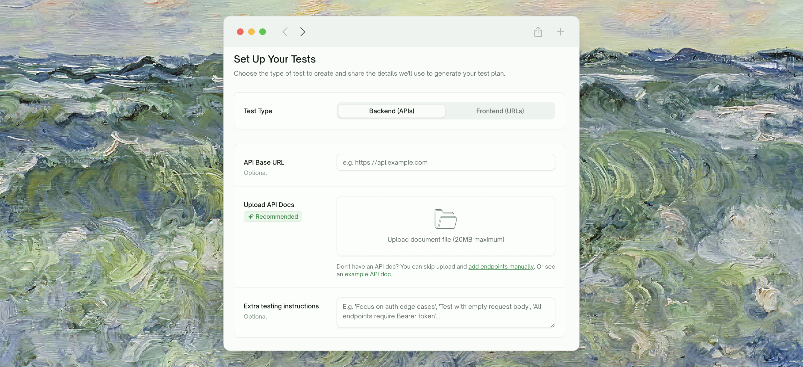
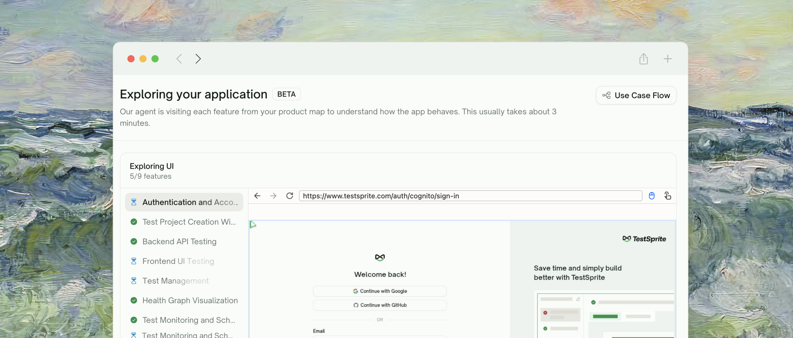
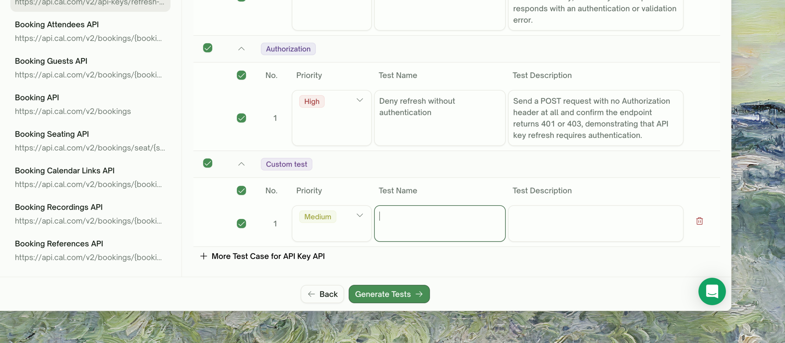
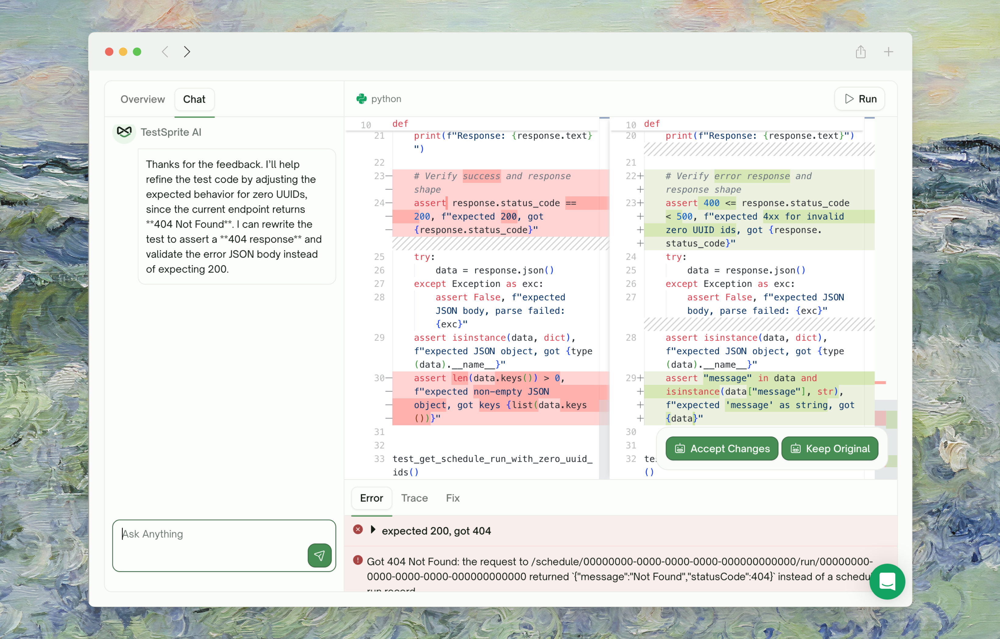

This page is the **conceptual** map of what a first run feels like. It's the same shape for UI and API projects: configure → understand your product → explore or discover → plan → generate → run → review.

For the click-by-click version, jump straight into the type-specific walkthrough that matches the project you're starting with.

<CardGroup cols={2}>
  <Card title="UI Quickstart" href="/web-portal/core/ui/quickstart" icon="window-maximize">
    Walk through your first frontend project end-to-end (~10 min)
  </Card>
  <Card title="API Quickstart" href="/web-portal/core/api/quickstart" icon="terminal">
    Walk through your first backend project end-to-end (~10 min)
  </Card>
</CardGroup>

## The Lifecycle

<Steps>
  <Step title="Project Setup & PRD Upload">
    Name the project and upload your PRD (or any product-spec document). PRD upload is **strongly recommended** — it's the single biggest lever on plan quality. Skip it only for a quick demo.
  </Step>
  <Step title="Feature & Use-Case Extraction">
    TestSprite reads your PRD and produces a **feature map** — a structured list of features and the use cases under each, rendered as a flow graph. This is what grounds the rest of the run. Skipped if no PRD was uploaded.
    <Frame>
      
    </Frame>
  </Step>
  <Step title="Configuration">
    Provide your live URL and credentials. UI projects ask for a starting URL + test account; API projects ask for the base URL + auth type + your API documentation.
    <Frame>
      
    </Frame>
  </Step>
  <Step title="Exploration or Discovery">
    For UI projects, TestSprite walks your live app feature by feature, targeting the use cases from the feature map. For API projects, TestSprite reads your docs and confirms endpoint shapes against the live URL.
    <Frame>
      
    </Frame>
  </Step>
  <Step title="Plan Review">
    A test plan is drafted from what was observed. You review, edit descriptions in natural language, deselect cases you don't want, then click <kbd>Generate Tests</kbd>.
    <Frame>
      
    </Frame>
  </Step>
  <Step title="Test Generation">
    TestSprite converts the approved plan into Python tests (with Playwright for UI), verifies each one in our cloud sandbox, and surfaces failed verifications clearly.
  </Step>
  <Step title="Execution">
    Tests run in the cloud and stream results back. Each row surfaces one of: <kbd>Pending</kbd>, <kbd>Running</kbd>, <kbd>Pass</kbd>, <kbd>Failed</kbd>, <kbd>Blocked</kbd>.
    <Frame>
      
    </Frame>
  </Step>
  <Step title="Review and Refine">
    The **Test Report** tab summarizes pass/fail counts, highlights failures with cause-and-fix suggestions, and links into per-test detail. To iterate on a specific test, open it and use the <kbd>Chat</kbd> tab — describe what to fix in natural language.
    <Frame>
      
    </Frame>
  </Step>
</Steps>

## Where to Go Next

<Columns cols={2}>
  <Card title="UI Quickstart" href="/web-portal/core/ui/quickstart" icon="window-maximize">
    Click-by-click walkthrough for frontend projects
  </Card>
  <Card title="API Quickstart" href="/web-portal/core/api/quickstart" icon="terminal">
    Click-by-click walkthrough for backend projects
  </Card>
  <Card title="Key Terms" href="/web-portal/concepts/key-terms" icon="book">
    Vocabulary used across the rest of the docs
  </Card>
  <Card title="Testing Lifecycle" href="/web-portal/concepts/testing-lifecycle" icon="circle-nodes">
    The lifecycle in more detail, with UI vs API differences called out
  </Card>
</Columns>
