<Frame>
  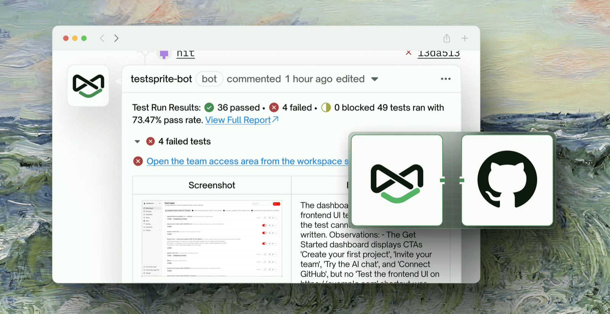
</Frame>

## Overview

- **Goal:** connect your GitHub repository to TestSprite so your tests run automatically every time a new deployment is ready — either on a pull request, or on a push to a branch.
- **Time needed:** about 10 minutes.
- **You will need:** permission to install a GitHub App on the repo's organization, a repo that already produces deployments, and a TestSprite project that already has test cases.

### How This Works

TestSprite does not build or deploy your app. It **listens** for a GitHub event that means *"the new build is deployed and the URL is live,"* then runs your test suite against that URL:

1. Your CI/CD pipeline builds and deploys your app, producing a deployment event in GitHub.
2. TestSprite receives that event through the GitHub integration.
3. TestSprite resolves the target URL to test — from the deployment, or from a URL pattern you define.
4. TestSprite runs your tests and posts results back to GitHub as a PR comment or a commit check.

### The Four Stages

| Stage | What you do | How often |
| :--- | :--- | :--- |
| Prerequisite | Confirm your repo produces a deployment | Once per repo |
| Step 1 | Connect the GitHub integration to your workspace | Once per workspace |
| Step 2 | Connect GitHub Action to a TestSprite project | Once per project |
| Trigger | Choose a Pull Request or Push trigger | Per trigger |

## Prerequisite: Prepare a Deployment in Your GitHub Repo

Before connecting anything, confirm that your repository actually creates a **deployment** that GitHub can report. TestSprite triggers off that deployment event, so it has to exist first. Pick the scenario that matches how you want to test:

- **Testing on push to a branch** — the branch must have a deployment attached to it. Confirm the branch has a recent, successful deployment check (e.g. a "Deploy" workflow run) with a live URL behind it.

  <Frame>
    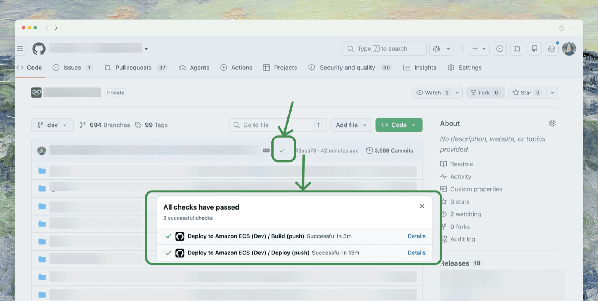
  </Frame>

- **Testing on a pull request** — the PR must produce its own preview deployment. Open an existing PR and confirm a deploy bot (Vercel, Amplify, or similar) has commented with a clickable preview URL, then open that URL to check the preview environment actually loads.

  <Frame>
    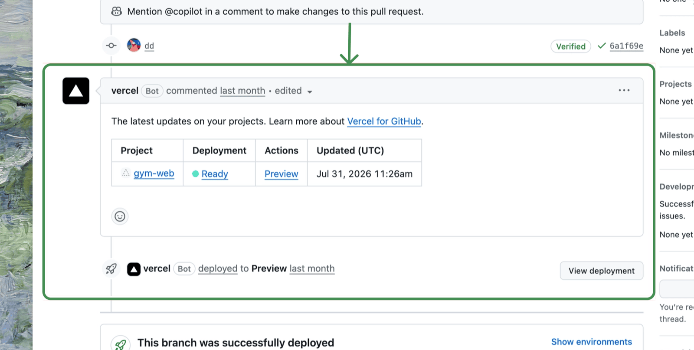
  </Frame>

  Any deploy bot works the same way — here's the equivalent Amplify comment on a different PR:

  <Frame>
    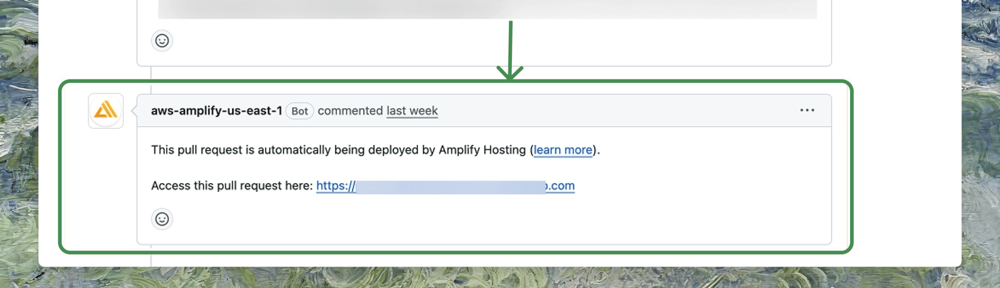
  </Frame>

<Warning>
Don't skip this check. If no deployment appears on your branch or PR, fix your CI/CD pipeline first — TestSprite has nothing to listen for until a deployment event exists.
</Warning>

## Step 1: Connect GitHub to Your Workspace

This is a one-time setup per workspace. It lets TestSprite read events from your repositories.

<Steps>
  <Step title="Open the integration">
    In TestSprite, go to <kbd>Workspace Settings → Connections → Integrations</kbd>, find the **GitHub** row, and click <kbd>Connect</kbd>.
    <Frame>
      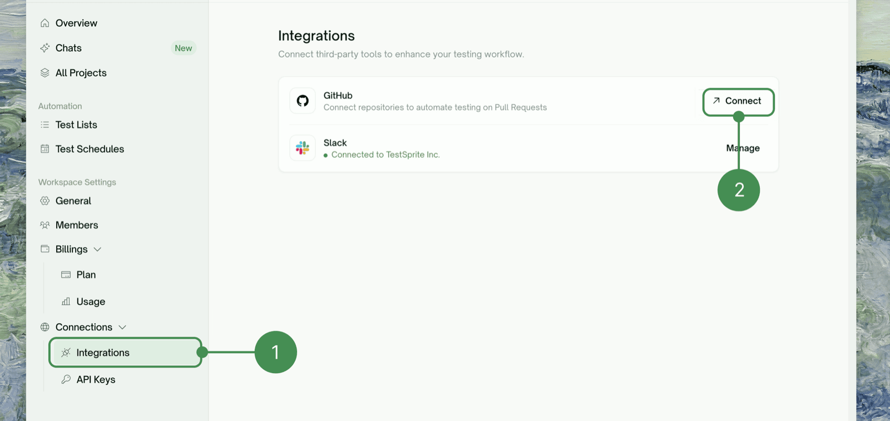
    </Frame>
  </Step>
  <Step title="Choose the account and repository access">
    You'll be redirected to GitHub. Choose the organization or personal account that owns the repo, then choose **All repositories** or **Only select repositories** to limit access to just the repos you want TestSprite to watch. Click <kbd>Install & Authorize</kbd>.

    TestSprite requests **read** access to actions, checks, issues, and metadata, and **read/write** access to code, commit statuses, deployments, and pull requests.
      <Frame>
        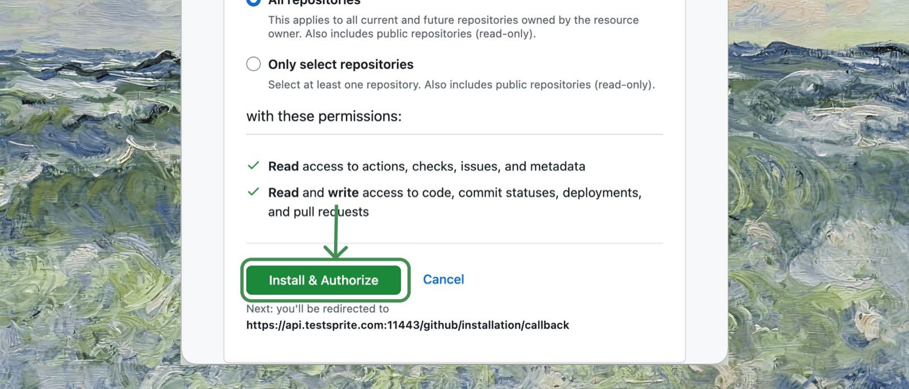
      </Frame>
  </Step>
  <Step title="Return to TestSprite">
    You'll be returned to TestSprite, and the GitHub integration should now show as **Connected**.
  </Step>
</Steps>

<Info>
If your organization doesn't appear in the list, you likely don't have permission to install GitHub Apps for it. Ask an org owner to approve the installation, then come back to this step.
</Info>

## Step 2: Connect GitHub Action to a Project

Now link a specific repository to a specific TestSprite project.

<Steps>
  <Step title="Open the project's GitHub Action tab">
    Open the TestSprite project you want to connect and go to the **GitHub Action** tab.
    <Frame>
      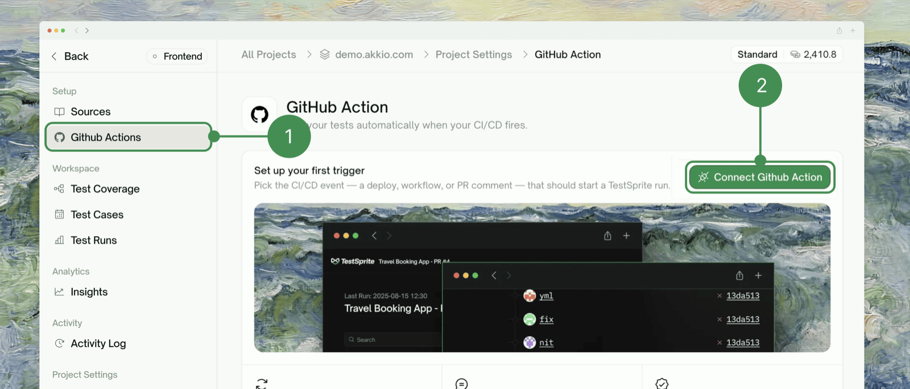
    </Frame>
  </Step>
  <Step title="Connect GitHub Action and pick a trigger type">
    Click <kbd>Add Trigger</kbd>, then choose how tests should be triggered:

    | Type | Best for | Results show up as |
    | :--- | :--- | :--- |
    | **Pull Request** | Catching regressions before merge | A comment on the PR |
    | **Push to Branch** | Testing a shared environment (staging, dev) after every merge | A check on the commit |

    You only need one to get started; create both if you want PR checks *and* branch checks.
  </Step>
</Steps>

## Trigger Rules

Each rule watches for a real signal from your own CI/CD — a check finishing, a workflow run completing, or even a deploy bot's PR comment (Vercel, Amplify, and similar all post one) — rather than reacting to "a PR was opened" or "a commit was pushed" the instant it happens.

<Info>
A Push trigger tests against a TestSprite [Environment](/web-portal/setup/environments) you've already configured for that branch — set that up first if you haven't.
</Info>

<Frame>
  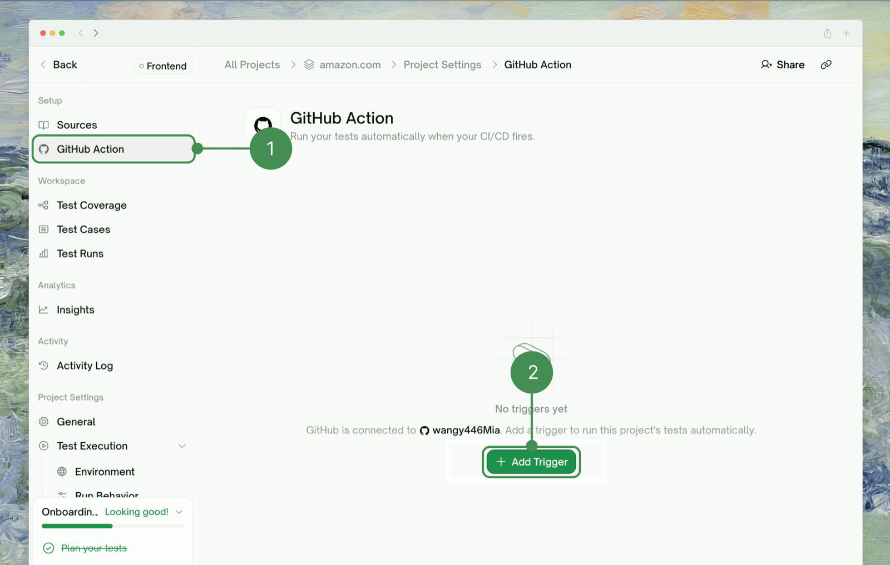
</Frame>

### Setting Up a Pull Request Trigger

<Steps>
  <Step title="Paste a sample PR link and detect events">
    In the <kbd>Connect Github Action</kbd> modal, stay on the **Pull Request** tab, paste the URL of an existing PR that has a working preview deployment, then click <kbd>Detect Events</kbd>. TestSprite lists the CI/CD events it found on that PR — checks, workflow runs, or bot comments.
    <Frame>
      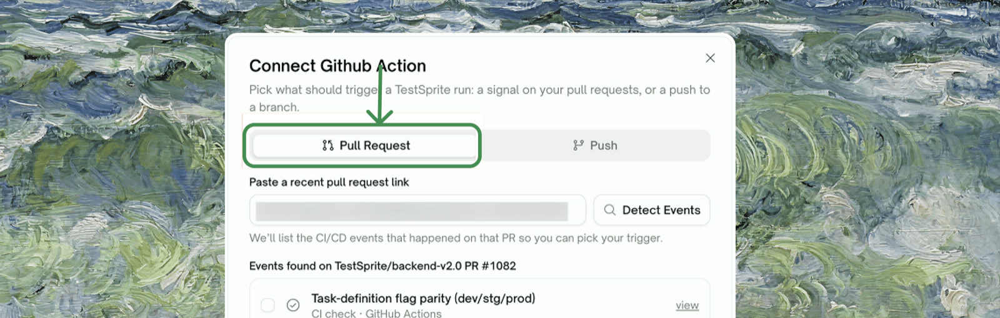
    </Frame>
    <Frame>
      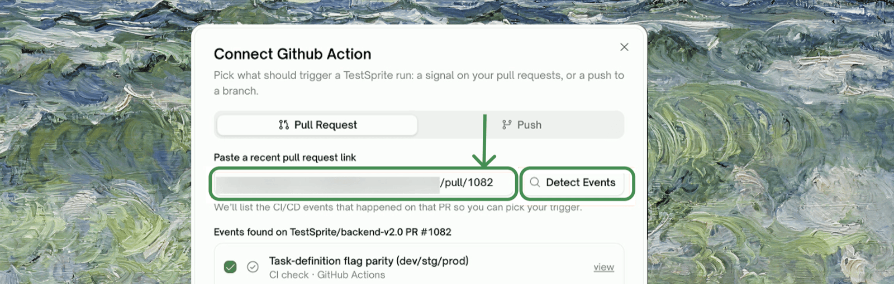
    </Frame>
  </Step>
  <Step title="Select the event that means 'deployment finished', and fill in the Target URL pattern">
    Pick the event that fires *after* the deployment is live and reachable — not one that fires at build start. Then tell TestSprite how to build the preview URL for any given PR, using placeholders `{pr}`, `{branch}`, `{branch-slug}`, `{sha}`, `{short-sha}` (e.g. a Vercel-style pattern: `https://my-app-git-{branch-slug}-my-team.vercel.app`).
    <Frame>
      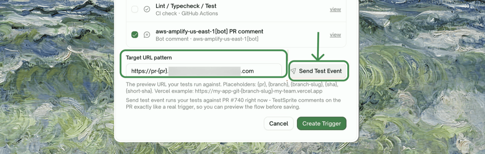
    </Frame>
  </Step>
  <Step title="Send a test event and verify">
    Click <kbd>Send Test Event</kbd>. TestSprite confirms it queued a run against that URL.
    <Frame>
      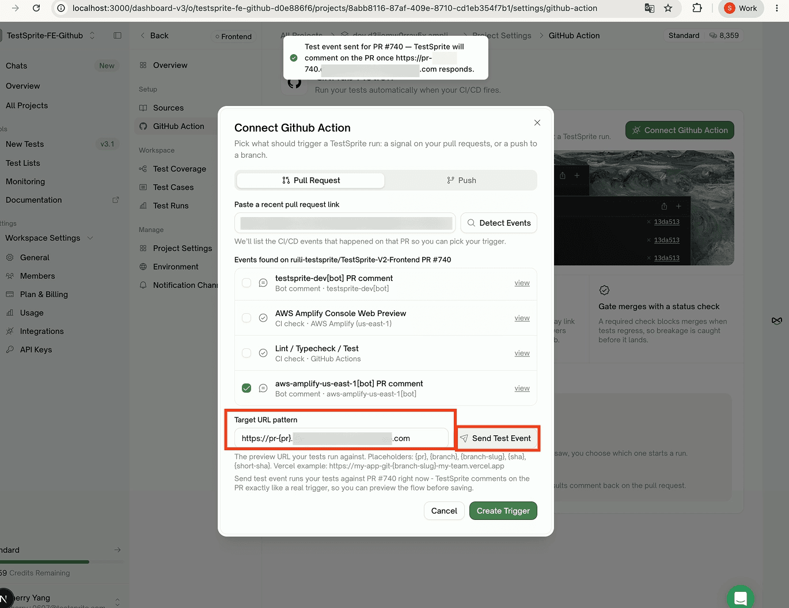
    </Frame>

    On the PR itself, a **testsprite-dev** comment appears showing the run in progress against that URL, and updates in place once results are in.
    <Frame>
      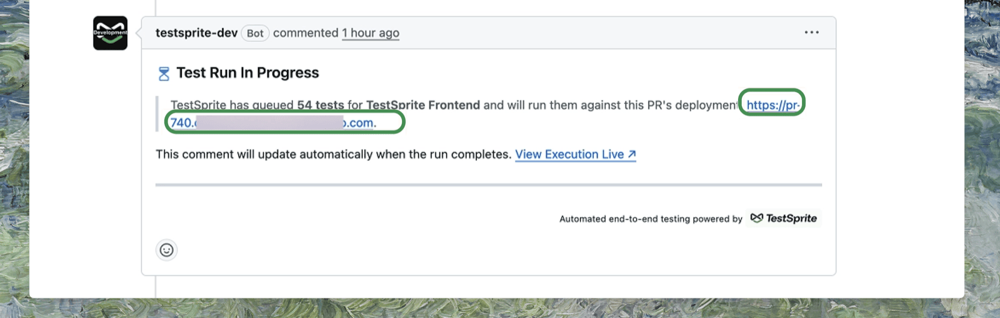
    </Frame>
    <Frame>
      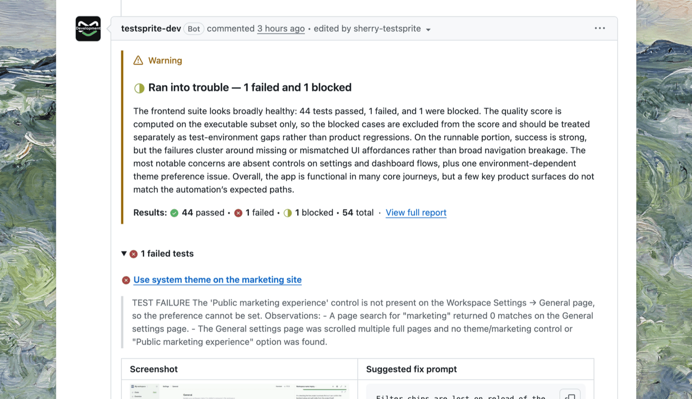
    </Frame>
  </Step>
  <Step title="Create the trigger">
    Once the test event looks right, click <kbd>Create Trigger</kbd>. It appears in the Triggers list, marked <kbd>Active</kbd>, and runs on every future PR automatically. Two optional toggles: **Include draft PRs**, and **Block PR until tests pass**.
  </Step>
</Steps>

### Setting Up a Push Trigger

<Steps>
  <Step title="Pick the repository and branch, and detect events">
    In the <kbd>Connect Github Action</kbd> modal, switch to the **Push** tab. Under **Repository and branch to watch**, choose the repo and type the branch (e.g. `main`, `dev`), then click <kbd>Detect Events</kbd>.
    <Frame>
      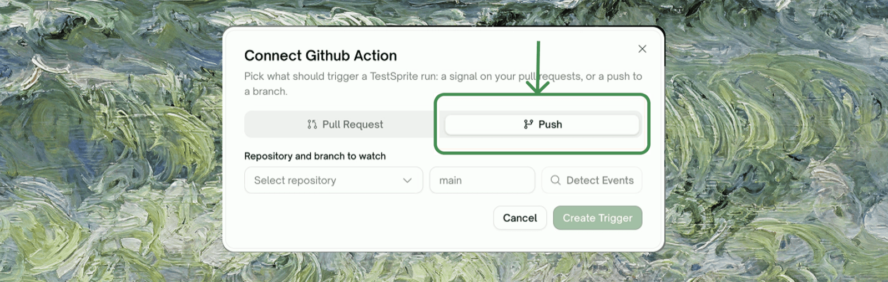
    </Frame>
  </Step>
  <Step title="Select the event">
    TestSprite lists what it saw on that branch — a named workflow (e.g. `CI`), a named CI check (e.g. `Lint / Typecheck / Test`), or the raw push itself (`push to <branch>`). Pick whichever one means "this push is ready to test."
    <Frame>
      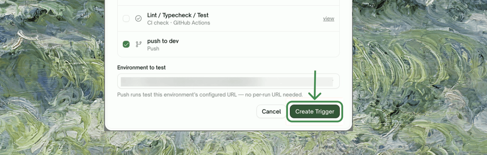
    </Frame>
  </Step>
  <Step title="Select the Environment to test">
    In the **Environment to test** dropdown, pick the TestSprite environment that matches this branch. Push runs test that environment's configured URL — no per-run URL pattern needed.
  </Step>
  <Step title="Create the trigger">
    Click <kbd>Create Trigger</kbd>. It's saved and active immediately.
  </Step>
  <Step title="Verify on your next push">
    Push a commit to that branch. Once the watched event fires, a **TestSprite** check appears on the commit alongside your other checks, showing pass/fail counts directly — open it for the full run.
    <Frame>
      
    </Frame>
  </Step>
</Steps>

Either type shows its own <kbd>Active</kbd> / <kbd>Disabled</kbd> status and a **Last matched** timestamp in the Triggers list, with its own enable/disable toggle and delete (trash) icon — so you can turn one off without losing its configuration.

## Trigger Activity

Below the Triggers list, the **Trigger activity** card — "What your triggers heard from GitHub, and what happened" — lists recent matches across all of a project's rules.

<Frame>
  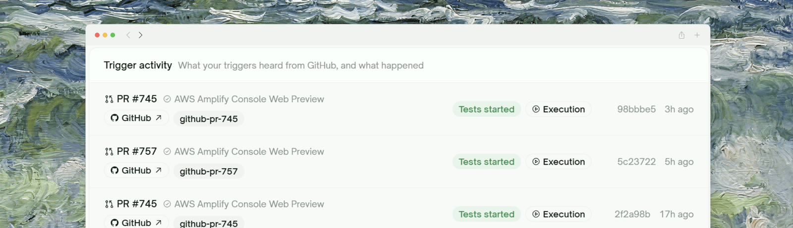
</Frame>

Each row shows the PR (or branch) and the workflow/check that matched, links out to <kbd>GitHub</kbd> and a short identifier (e.g. `github-pr-745`), an outcome badge (**Tests started** for a normal dispatch), a link to the <kbd>Execution</kbd> it kicked off, the short commit SHA, and a relative timestamp.

<Note>Activity is retained for **30 days**.</Note>

## Disconnecting a Repository

To stop a specific trigger without uninstalling anything, click its trash icon in the Triggers list — that trigger stops firing immediately, and existing run history stays accessible.

To fully revoke TestSprite's access to a repository (not just stop a trigger), edit the GitHub App's repository access from GitHub's side: **Settings → Applications → Installed GitHub Apps → TestSprite → Configure**, and change or remove that repo from the access list.

## Uninstalling the App Entirely

To remove the integration completely:

1. From GitHub, go to **Settings → Applications → Installed GitHub Apps**
2. Find **TestSprite** and click <kbd>Configure</kbd>
3. Scroll to the bottom and click <kbd>Uninstall</kbd>

The TestSprite settings page reverts to the not-yet-installed state. Reinstall any time to start over.

## Exporting Test Code to GitHub

Separate from everything above: **Export to GitHub** pushes the test code TestSprite generated for a project into a GitHub repository, so it lives alongside your source instead of only inside TestSprite.

<Warning>
This uses your **personal GitHub account connection**, not the GitHub App installed above — the App is for running tests against your repos' PRs; export is for pushing TestSprite's generated code *to* a repo, and needs your own GitHub login connected the first time you use it.
</Warning>

<Steps>
  <Step title="Trigger the export">
    Go to <kbd>All Projects</kbd>, click the <kbd>⋮</kbd> menu on the project's row, and select <kbd>Export to GitHub</kbd>.
    <Frame>
      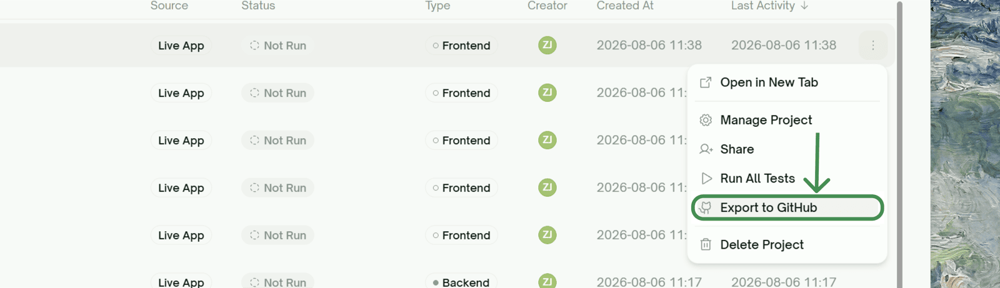
    </Frame>
  </Step>
  <Step title="Connect GitHub, if you haven't">
    If this account has no GitHub login connected yet, a **Connect GitHub** prompt opens first. Connect once; every later export reuses it.
  </Step>
  <Step title="TestSprite pushes the code">
    If the project has no linked repo yet, TestSprite **creates one for you** and adds you as a collaborator. Test code lands committed straight to `main`:
    - `testsprite_test_code/latest/` — the most recent execution's tests
    - `testsprite_test_code/history/execution_<timestamp>_<id>/` — every past execution that finished (passed or failed), kept as a history
  </Step>
</Steps>

<Info>
Export runs at the **project** level — it pushes every finished execution's generated test code, not just one test. There's currently no option to change the target branch or the file path it commits to.
</Info>

## Tips

<AccordionGroup>
  <Accordion title="Start with non-blocking for new triggers">
    Leave <kbd>Block PR until tests pass</kbd> off for the first few PRs while you confirm tests run cleanly. Flip it on once you're confident the suite is stable.
  </Accordion>
  <Accordion title="Use draft PRs for quick checks">
    Leaving <kbd>Include draft PRs</kbd> on means you can open a draft against your branch to get a TestSprite run without ceremony. Useful for "I'm about to refactor — does the suite pass first?" sanity checks.
  </Accordion>
  <Accordion title="Pair with scheduled monitoring">
    PR checks catch regressions before merge; [scheduled runs](/web-portal/maintenance/monitoring) catch regressions in production. Most teams run both.
  </Accordion>
</AccordionGroup>

## Where to Go Next

<Columns cols={2}>
  <Card title="Test Schedules" href="/web-portal/maintenance/monitoring" icon="chart-simple">
    Run tests on a schedule, not just on PRs
  </Card>
  <Card title="API Keys" href="/web-portal/admin/api-keys" icon="key">
    Other ways to integrate TestSprite with external tools
  </Card>
  <Card title="MCP Server" href="/mcp/getting-started/overview" icon="square-terminal">
    Generate tests from your IDE first
  </Card>
  <Card title="Test Detail" href="/web-portal/core/working-with-test/test-detail" icon="file-circle-info">
    Where PR-triggered runs land
  </Card>
</Columns>
