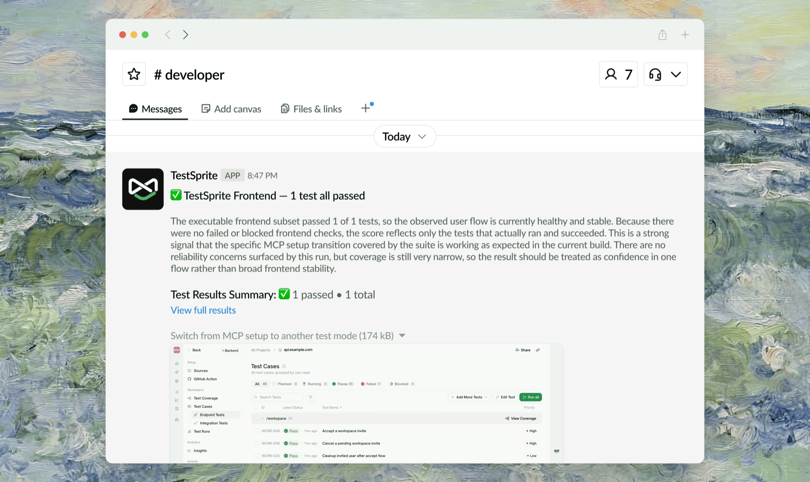
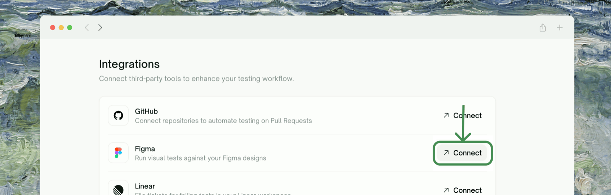
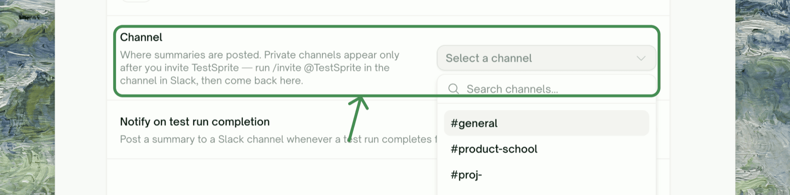
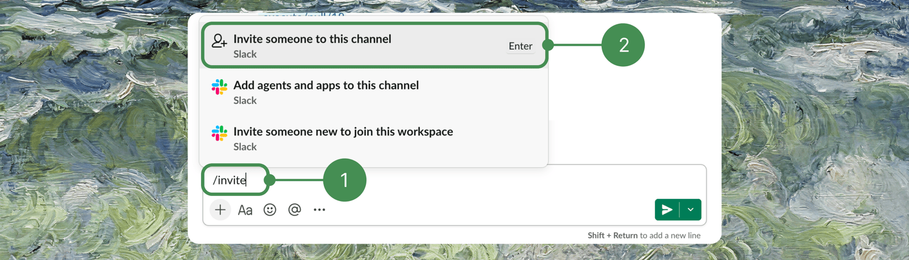
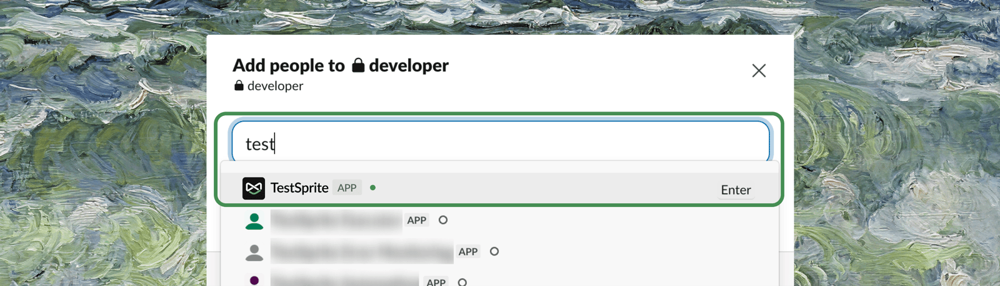

<Frame>
  
</Frame>

TestSprite can post a summary to your Slack workspace every time a test run completes, so your team sees results the moment they land — without anyone checking the dashboard. It works for every kind of run: manual, scheduled, GitHub-triggered, or started from the CLI.

Setup happens in two places:

1. **Connect Slack once per workspace** — links your TestSprite workspace to a Slack workspace (workspace Owner/Admin only).
2. **Pick a channel per project** — each project chooses its own channel and switches notifications on or off independently.

<Note>
Slack notifications are available on every plan. Connecting and disconnecting Slack requires the workspace **Owner** or **Admin** role.
</Note>

## Step 1 — Connect Slack (once per workspace)

{/* TODO (Sherry): retake — current shot's highlight box is on the Figma row; it should highlight Slack's Connect button */}
<Frame>
  
</Frame>

<Steps>
  <Step title="Open Integrations">
    In your workspace settings, go to <kbd>Workspace Settings</kbd> → <kbd>Connections</kbd> → <kbd>Integrations</kbd> and click the **Slack** row, then <kbd>Connect With Slack</kbd>.
  </Step>
  <Step title="Authorize TestSprite">
    A Slack authorization window opens. Approve the requested permissions — TestSprite asks only for what it needs to list channels and post messages:

    | Permission | Why |
    |---|---|
    | `channels:read` | List your public channels so you can pick one |
    | `groups:read` | List private channels the bot has been invited to |
    | `chat:write` | Post run summaries |
    | `chat:write.public` | Post to public channels without needing an invite |
  </Step>
  <Step title="Done — the workspace is linked">
    Back in TestSprite, the Slack page shows **Connected Workspace** with your Slack team's name. One Slack workspace is linked per TestSprite workspace; every project in it can now pick a channel.
  </Step>
</Steps>

## Step 2 — Choose a Channel for Each Project

<Frame>
  
</Frame>

<Steps>
  <Step title="Open the project's notification settings">
    In the project's sidebar, go to <kbd>Project Settings</kbd> → <kbd>Notifications & Ticketing</kbd>. The Slack card shows the connected workspace.
  </Step>
  <Step title="Pick a channel">
    Under **Channel**, select where summaries should be posted. Public channels appear as `#channel-name`; private channels show a lock icon.
  </Step>
  <Step title="Turn on notifications and save">
    Enable **Notify on test run completion** and click <kbd>Save changes</kbd>. From now on, every completed run of this project posts a summary to that channel.
  </Step>
</Steps>

## Public vs. Private Channels

<Warning>
**Private channels require one extra step.** The TestSprite bot cannot see a private channel until it is invited. In Slack, open the private channel and run `/invite @TestSprite` **first** — the channel won't appear in TestSprite's channel list until you do. After inviting, switch back to the TestSprite tab and the list refreshes automatically.
</Warning>

Inviting the bot takes a few seconds. In the private channel, type `/invite` and choose **Invite someone to this channel**:

<Frame>
  
</Frame>

Then search for the TestSprite app and add it:

<Frame>
  
</Frame>

| | Public channel | Private channel |
|---|---|---|
| Setup | Select from the list — works immediately, no invite needed | Run `/invite @TestSprite` in the channel first, then select it |
| Appears in channel list | Always | Only after the bot is invited |
| Who sees notifications | Anyone in the channel | Channel members only |

## What You'll Receive

A summary is posted **once per completed test run** — whether the run was started manually, by a schedule, by a GitHub event, or from the CLI. There is currently no "failures only" filter; if the project's toggle is on, every run reports.

### What's in a Notification Card

| Section | Contents |
|---|---|
| Header | Project name and the headline result — ✅ *"all passed"*, or how many of the total failed or were blocked |
| Run summary | An AI-written narrative of what happened in the run |
| Results line | Passed / failed / blocked / total counts, plus a **View full results** link back to the run in TestSprite |
| Failing tests | Up to 10 failed or blocked test titles (then *"…and N more"*) |
| Screenshots | Up to 5 screenshots, failures first |

<Tip>
**Choosing channels well beats filtering.** Since every run posts, route noisy projects (frequent scheduled runs) to a dedicated channel like `#testsprite-monitoring`, and keep release-critical projects in your team channel where a failure gets seen immediately.
</Tip>

## Change Channel, Disable, or Disconnect

- **Change a project's channel or turn its notifications off**: back in the project's <kbd>Project Settings</kbd> → <kbd>Notifications & Ticketing</kbd>, pick a different channel or flip **Notify on test run completion** off, then <kbd>Save changes</kbd>.
- **Disconnect Slack from the whole workspace**: go to <kbd>Workspace Settings</kbd> → <kbd>Connections</kbd> → <kbd>Integrations</kbd> → <kbd>Slack</kbd> and click <kbd>Disconnect</kbd> (Owner/Admin only). All projects stop posting immediately.

<Info>
Disconnecting keeps each project's channel choice. If you reconnect the same Slack workspace later, projects resume posting to their previously selected channels.
</Info>

## Troubleshooting

<AccordionGroup>
  <Accordion title="My private channel doesn't show up in the channel list">
    The bot hasn't been invited yet. In Slack, open the channel and run `/invite @TestSprite`, then return to the TestSprite tab — the list refreshes when the tab regains focus.
  </Accordion>
  <Accordion title="Notifications stopped arriving">
    Check three things in order: the project's **Notify on test run completion** toggle is still on; the workspace's Slack connection still shows **Connected** under <kbd>Workspace Settings</kbd> → <kbd>Connections</kbd> → <kbd>Integrations</kbd>; and, for a private channel, the `@TestSprite` bot is still a member (a bot removed from the channel fails silently).
  </Accordion>
  <Accordion title="I can't click Connect With Slack">
    Connecting requires the workspace **Owner** or **Admin** role. Members don't see <kbd>Integrations</kbd> at all.
  </Accordion>
</AccordionGroup>

## Where to Go Next

<CardGroup cols={2}>
  <Card title="Ticketing" icon="ticket" href="/web-portal/integrations/ticketing">
    Turn failed tests into tickets automatically
  </Card>
  <Card title="Test Schedules" icon="clock" href="/web-portal/maintenance/monitoring">
    Set up scheduled runs that report to Slack
  </Card>
</CardGroup>
