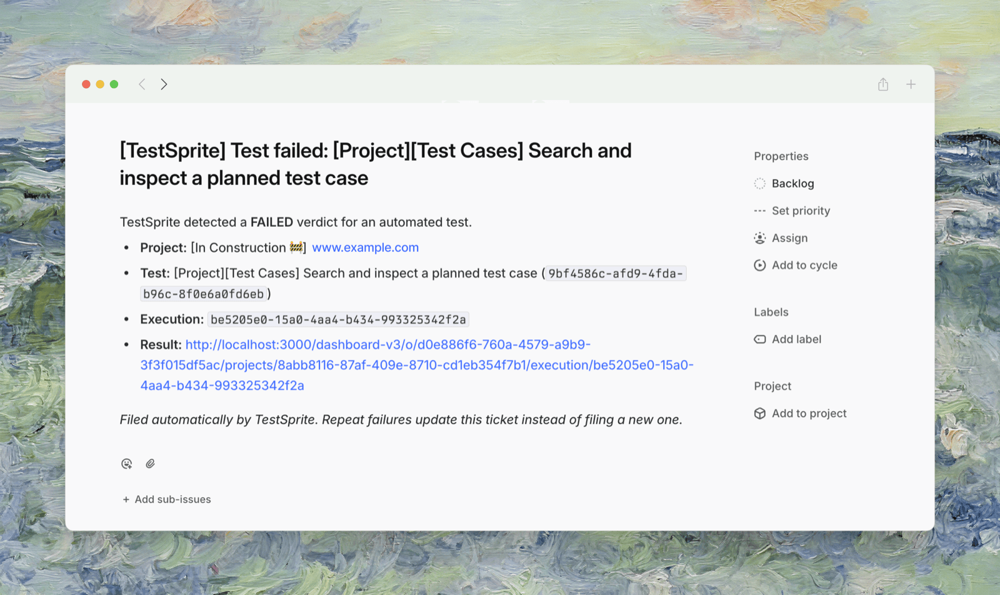
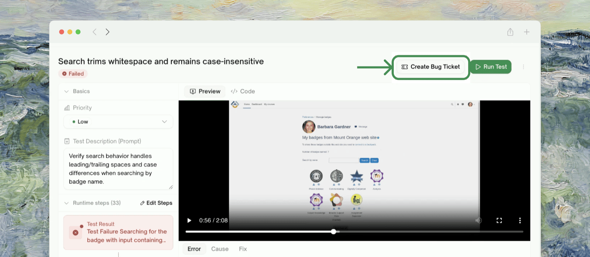
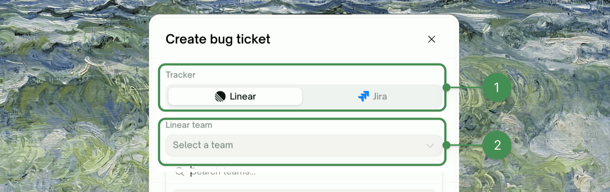
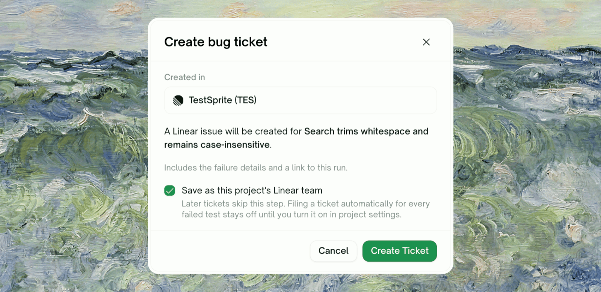
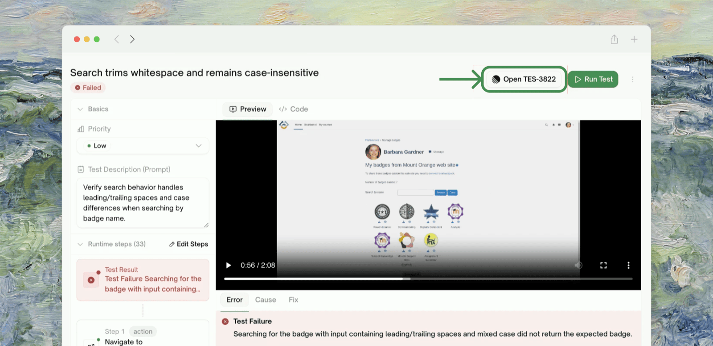
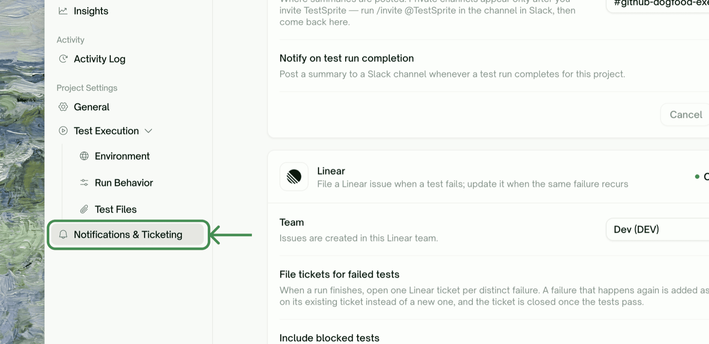

When a test fails, the next step is usually a ticket. TestSprite files that ticket for you — into **Jira** or **Linear** — either on demand for a single failure or automatically for every failure in a run. However you file, the same failure is never ticketed twice, and when the test recovers the ticket gets a follow-up comment so nobody chases a bug that's already fixed.

<Frame>
  
</Frame>

## Before You Start

<Info>
Ticketing files into **Jira** and **Linear**. You can connect one, both, or neither — each is configured independently per project. There is no GitHub Issues or built-in tracker for this feature.
</Info>

Two things need to be in place:

1. **Connect the tracker at the workspace level.** Go to <kbd>Workspace Settings → Connections → Integrations</kbd> and connect Jira and/or Linear via OAuth. This is a one-time, workspace-wide authorization. The per-project ticketing configuration (which team or project to file into) is separate and covered below.
2. **Pick where tickets land, per project.** Jira files into a **project** (as a `Bug`); Linear files into a **team**.

<Note>
Not every plan includes Jira and Linear ticketing. Compare plans on the [pricing page](https://www.testsprite.com/pricing).
</Note>

## Create a Ticket for a Single Failure

The fastest path — no project-wide setting to flip. Open any failed (or blocked) test and file a ticket for just that failure.

<Steps>
  <Step title="Click Create Bug Ticket">
    On a failed test's detail page, click <kbd>Create Bug Ticket</kbd> in the top-right. The button is available anywhere a failed run appears: the test case detail page, the execution detail page, and the test-cases list.
    <Frame>
      
    </Frame>
  </Step>
  <Step title="Choose the tracker and destination">
    In the **Create bug ticket** dialog, pick **Linear** or **Jira**, then select the **team** (Linear) or **project** (Jira) the issue should be created in.
    <Frame>
      
    </Frame>
  </Step>
  <Step title="Confirm">
    The confirm step shows exactly what will be filed: the test name, and that the ticket **includes the failure details and a link back to this run**. The destination you pick is saved for this project, so the next ticket skips the picker.

    <Frame>
      
    </Frame>

    <Note>
    Saving the destination as the default does **not** turn on automatic filing — that stays off until you enable it in project settings (see below).
    </Note>
  </Step>
  <Step title="Open the ticket">
    Click <kbd>Create Ticket</kbd>. TestSprite files the issue and the button changes to <kbd>Open TES-1234</kbd> (or the Jira key) — a direct link to the ticket.
    <Frame>
      
    </Frame>
  </Step>
</Steps>

<Tip>
To file for every failure in a run at once, turn on automatic filing (below). Failures that share a root cause are grouped onto one ticket rather than flooding your tracker (see [How Dedup Works](#how-dedup-works)).
</Tip>

Only **failed** or **blocked** tests can be ticketed — a passing test has nothing to file.

### What's in the Ticket

| Part | Contents |
| :--- | :--- |
| <kbd>Title</kbd> | `[TestSprite] Test failed: <test name>` (or `N tests failed: …` when several share a ticket) |
| <kbd>Body</kbd> | Project and test name, the execution id, and a **link back to the run** in TestSprite |
| <kbd>Probable cause</kbd> | The AI-diagnosed reason for the failure, when available |
| <kbd>Error</kbd> | The raw error text, in a code block |
| <kbd>Regression note</kbd> | If this test previously failed and recovered, a line linking the earlier ticket |

Secrets in the error and cause text are redacted before anything leaves TestSprite. Tickets currently link back to the run rather than attaching screenshots.

## Auto-File Tickets for Every Failure

Once a project's failures are stable enough that most are real bugs, let TestSprite file them without a click.

<Steps>
  <Step title="Open Notifications & Ticketing">
    In the project, go to <kbd>Project Settings → Notifications & Ticketing</kbd>. Each connected tracker — Slack, Linear, Jira — has its own card.
    <Frame>
      
    </Frame>
  </Step>
  <Step title="Pick the destination">
    On the Linear or Jira card, choose the **Team** (Linear) or **Project** (Jira) issues should be created in.
  </Step>
  <Step title="Turn on File tickets for failed tests">
    Flip <kbd>File tickets for failed tests</kbd> on and click <kbd>Save Changes</kbd>. From now on, when a run finishes, TestSprite opens one ticket per distinct failure.
  </Step>
</Steps>

Two settings shape how much gets filed:

| Setting | Default | Effect |
| :--- | :--- | :--- |
| <kbd>Include blocked tests</kbd> | Off | File tickets for blocked tests too, not only failed ones |
| <kbd>Max new tickets per run</kbd> | 20 | Cap on how many *new* tickets a single run can open (repeat failures still comment on existing tickets) |

<Warning>
**Before you enable auto-filing the first time, triage the project's failures manually once.** A project with a backlog of genuine failures will open a ticket for each distinct one on the next run — potentially dozens at once. Clear or cluster the known failures first, then turn the toggle on so it only files what's genuinely new.
</Warning>

This suits teams running TestSprite on a schedule or on every pull request, where failures should land in the tracker without anyone watching the dashboard. If you're still stabilizing a suite — lots of flaky or expected failures — stay on manual filing until the noise settles.

## How Dedup Works

TestSprite never files the same failure twice, using two layers:

- **One ticket per failing test.** A repeat failure of the same test updates its existing ticket with a "failed again" comment instead of opening a new one.
- **Same failure, one ticket across tests.** Failures that share a root cause (the same error signature) are grouped onto a single ticket — so a widespread outage doesn't spray your tracker with near-identical bugs. Grouping applies within a 7-day window, up to 25 tests per ticket.

Manual and automatic filing dedupe **against each other**: if you manually file into the same destination the project is configured to auto-file into, a later automatic run recognizes the existing ticket and comments on it rather than duplicating.

## When a Test Passes Again

When a previously-failing test passes on a later run, TestSprite posts a **recovery comment** on its ticket and stops updating it — closing the loop without you having to remember which tickets to revisit. If a ticket covered several tests, the comment notes how many are still failing; TestSprite keeps updating it until every test on it has recovered.

<Note>
TestSprite posts the recovery comment and stops tracking the ticket. It does not transition or close the issue in Jira or Linear — your team's own workflow owns the final status change. A later failure opens a fresh ticket, linked back to the recovered one.
</Note>

## Tips

<AccordionGroup>
  <Accordion title="Start with manual filing, then automate">
    Use <kbd>Create Bug Ticket</kbd> on individual failures while you're learning which failures are real. Once the noise settles, flip on auto-filing so you stop clicking.
  </Accordion>
  <Accordion title="File into a triage team or project">
    Point ticketing at a dedicated Linear team or Jira project (a "TestSprite" or "QA triage" bucket) rather than your main backlog. It keeps automatically-filed tickets from crowding hand-written work, and you can move the real ones over after review.
  </Accordion>
  <Accordion title="Use the Max new tickets per run cap as a safety valve">
    Leave the cap at a sane number (the default is 20) so a bad deploy that breaks half the suite can't open a hundred tickets in one run. Repeat failures still land as comments on the tickets you already have.
  </Accordion>
  <Accordion title="Both trackers at once">
    You can enable Linear and Jira simultaneously — each files independently into its own destination with its own dedup ledger. Useful when engineering lives in one tracker and QA in the other.
  </Accordion>
</AccordionGroup>

## Where to Go Next

<Columns cols={2}>
  <Card title="Slack Notifications" href="/web-portal/integrations/slack-notifications" icon="slack">
    Post run results to a channel alongside ticketing
  </Card>
  <Card title="Test Schedules" href="/web-portal/maintenance/monitoring" icon="chart-simple">
    Scheduled runs are the main source of auto-filed tickets
  </Card>
  <Card title="Test Detail" href="/web-portal/core/working-with-test/test-detail" icon="file-magnifying-glass">
    Where the Create Bug Ticket button lives
  </Card>
  <Card title="GitHub Integration" href="/web-portal/integrations/github-integration" icon="github">
    Run tests automatically on pull requests
  </Card>
</Columns>
