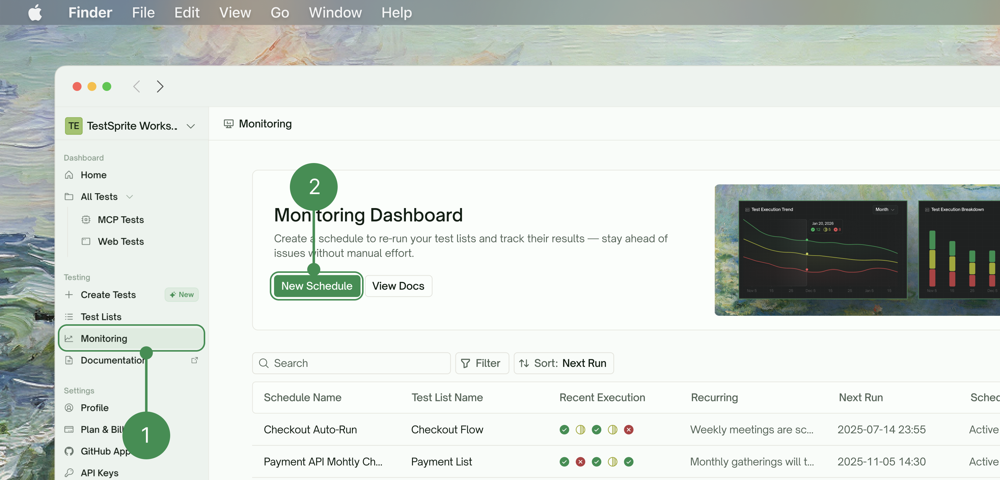
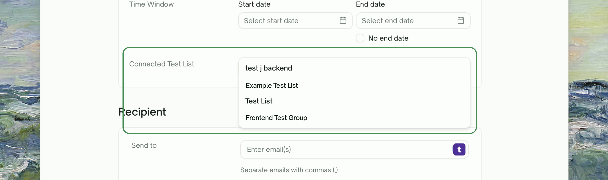
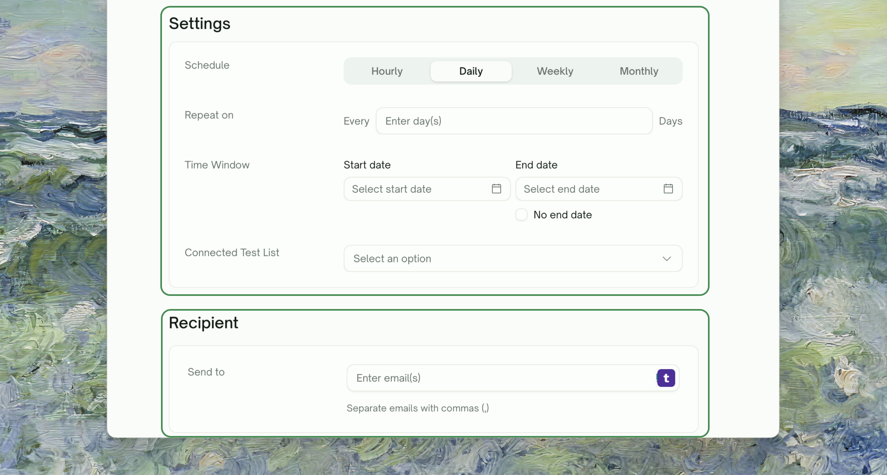
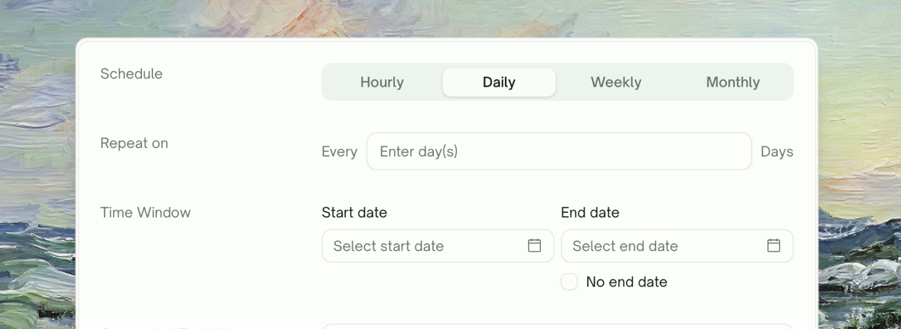
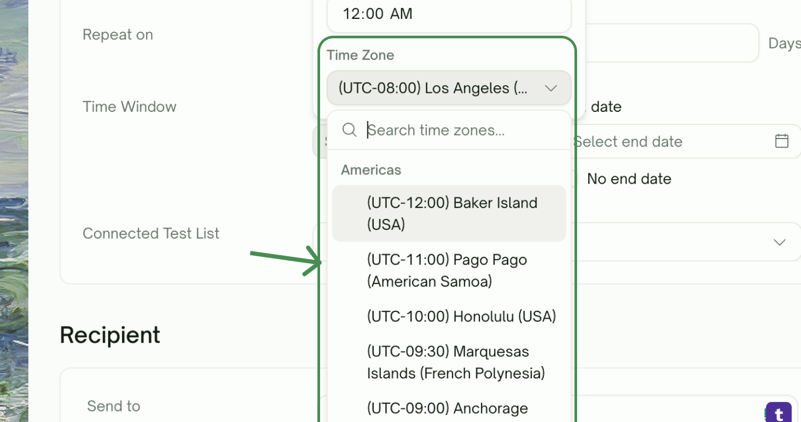
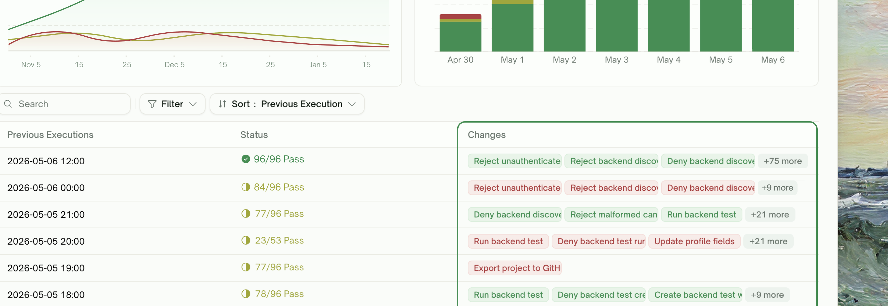

Schedules let you run **automated test executions** at regular intervals. Instead of manually triggering runs, you set up a schedule that executes your Test Lists on a cadence, giving you **continuous monitoring** of your application's health.

        <Frame>
        
        </Frame>
        <br />

<Info>
**Schedules are a Pro feature.** Free-plan accounts have **0 schedule slots** — schedule creation is gated until you upgrade. **Starter** includes 5 schedule slots; **Standard** includes unlimited. See [Subscription Plans](/web-portal/admin/billing-and-plans).
</Info>

## Key Benefits

- **Continuous Quality Assurance**: Automatically detect issues before they reach users. 24/7 monitoring and regression detection without manual effort.
- **Flexible Scheduling**: Recurring test executions with multiple scheduling options. Monitor run times and pause/modify schedules as needed.
- **Proactive Issue Detection**: Immediate notifications when tests fail. Track trends and identify performance degradation over time.

## Getting Started with Monitoring

### Prerequisites
Before setting up schedules:
  - **[Create Test Lists](/web-portal/maintenance/test-lists)**: You need existing test lists to schedule
  - **Verify Test Stability**: Ensure your tests run reliably
  - **Set Up Notifications**: Configure how you want to receive alerts
  - **Check Account Limits**: Verify your plan supports scheduling

### Steps
<Steps>
  <Step title="Navigate to Monitoring">
    Go to <kbd>Monitoring</kbd> and click <kbd>New Schedule</kbd> to get started

      <Frame>
      
      </Frame>
  </Step>
  <Step title="Select Test List">
    Choose an existing test list to schedule

    <Note>Review test cases and execution settings, and confirm test list is ready for automation.</Note>

      <Frame>
      
      </Frame>
  </Step>
  <Step title="Configure Schedule">
    Set **execution frequency** (daily, weekly, monthly), choose **specific times and days**, configure **timezone settings**, and set up **failure notifications**.

    <Frame>
      
    </Frame>
  </Step>
</Steps>

## Schedule Configuration

Configure when and how often your tests run automatically. Choose from multiple frequency options, set specific times and timezones, and customize scheduling patterns to match your monitoring needs.

### Frequency Options

Select how frequently your tests execute. Available options include hourly intervals, daily runs, weekly schedules on specific days, and monthly executions on set dates.

    <Frame>
      
    </Frame>

    <br />

<Tabs>
  <Tab title="Frequency Options">
Choose how often your tests run automatically. Select from hourly, daily, weekly, or monthly scheduling patterns.

| Frequency Options | Description |
| :--- | :--- |
| <kbd>Hourly</kbd> | Execute tests every N hours |
| <kbd>Daily</kbd> | Execute tests every day at specified time |
| <kbd>Weekly</kbd> | Run tests on specific days of the week |
| <kbd>Monthly</kbd> | Schedule tests for specific dates each month |
  </Tab>
  <Tab title="Example Configurations">
Real-world examples showing how to configure different schedule types with specific times and timezones.

```yaml expandable
Daily Schedule:
  Time: 06:00 AM UTC
  Frequency: Every day

Weekly Schedule:
  Days: Monday, Wednesday, Friday
  Time: 09:00 AM EST

Monthly Schedule:
  Date: 1st of every month
  Time: 12:00 PM PST
```
  </Tab>
</Tabs>

### Timezone Settings

Configure the timezone for your scheduled test executions. All schedules use **UTC by default**. You can specify different timezones to match your local time or business hours.

    <Frame>
      
    </Frame>

<Note>
**Timezone Best Practices:** Convert your **local time to UTC** for accurate scheduling. Consider **daylight saving time changes** that may affect execution times. Use a **consistent timezone** across your team to avoid confusion.
</Note>

## Managing Schedules

Once schedules are created, you can monitor their execution, view detailed status information, and manage them through the schedule dashboard. Track execution history, pause or modify schedules as needed, and ensure your monitoring runs smoothly.

### Reviewing Run-over-Run Changes

When you open a schedule, the executions table includes a **Changes** column that compares each run to the previous one and surfaces only the tests whose status changed:
        <Frame>
        
        </Frame>

- **Newly failed** test names appear as red chips — tests that passed last time but failed or got blocked this time
- **Newly recovered** test names appear as green chips — tests that failed or were blocked last time and pass now

Up to three names show per row, with `+N more` for longer lists. Runs with no status changes show `—`. This makes regressions and recoveries visible at a glance without opening each run.

### Schedule Dashboard

The Schedule Dashboard provides a comprehensive overview of all your automated test schedules, allowing you to monitor their status, execution history, and upcoming runs at a glance.

| Overview Information | Description |
| :--- | :--- |
| <kbd>Schedule Name</kbd> | Descriptive name for the scheduled execution |
| <kbd>Test List Name</kbd> | Associated test list that will be executed |
| <kbd>Recent Execution</kbd> | Result of the most recent execution |
| <kbd>Recurring</kbd> | How often the schedule runs (hourly, daily, weekly, monthly) |
| <kbd>Next Run</kbd> | When the next execution is scheduled |
| <kbd>Schedule Status</kbd> | Current schedule status (Active, Paused, Finished) |

### Schedule Actions

Manage your test schedules with these available actions. Each schedule can be controlled individually to fit your testing workflow and requirements.

| Action | Description |
| :--- | :--- |
| <kbd>Edit</kbd> | Modify timing and configuration |
| <kbd>Deactivate</kbd> | Stop a schedule from running going forward |