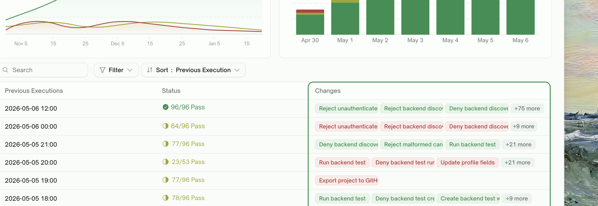

Schedules let you run **automated test executions** at regular intervals. Instead of manually triggering runs, you set up a schedule that executes a test list — or an entire project — on a cadence, giving you **continuous monitoring** of your application's health.

        <Frame>
        
        </Frame>
        <br />

<Info>
Not every plan includes schedules. Compare plans on the [pricing page](https://www.testsprite.com/pricing).
</Info>

<Note>
**Two versions of this page are in circulation.** Tell them apart at a glance on <kbd>Test Schedules</kbd>: the newer one lists your schedules as **cards**, the earlier one as a **table**. Almost everything below applies to both; the handful of real differences are collected in [Where the Two Views Differ](#where-the-two-views-differ), and flagged inline where they change what you should do.
</Note>

## Key Benefits

- **Continuous Quality Assurance**: Automatically detect issues before they reach users. 24/7 monitoring and regression detection without manual effort.
- **Flexible Scheduling**: Recurring test executions with multiple scheduling options. Monitor run times and pause/modify schedules as needed.
- **Results in your inbox**: List recipients on the schedule and each finished run emails them a pass/fail summary, so a regression is waiting for you rather than something you have to go looking for.

## Getting Started with Monitoring

### Prerequisites
Before setting up schedules:
  - **Something to run**: an existing **[test list](/web-portal/maintenance/test-lists)**, or — in the cards view — a whole **project**
  - **Verify Test Stability**: Ensure your tests run reliably
  - **Decide who gets the result email**: schedules notify by email only, to the addresses you enter
  - **Check Account Limits**: Verify your plan supports scheduling

### Steps
<Steps>
  <Step title="Navigate to Test Schedules">
    Go to <kbd>Automation → Test Schedules</kbd> and click <kbd>New Schedule</kbd> to get started

      <Frame>
      
      </Frame>
  </Step>
  <Step title="Choose what to run">
    Pick the test list you want on a cadence. In the cards view the same picker also lists your **projects** — see [What You Can Schedule](#what-you-can-schedule).

    <Note>Review test cases and execution settings, and confirm the test list is ready for automation.</Note>

      <Frame>
      
      </Frame>
  </Step>
  <Step title="Configure Schedule">
    Set **execution frequency** (hourly, daily, weekly, monthly), choose **specific times and days**, confirm the **timezone**, set the **time window** the schedule is active for, and list the **recipients** who should get the result email.

    <Frame>
      
    </Frame>
  </Step>
</Steps>

## What You Can Schedule

A schedule points at one thing, and you choose it when you create the schedule.

| Target | What runs | Where |
| :--- | :--- | :--- |
| <kbd>Test List</kbd> | The tests in that list, which may span several projects | Both views |
| <kbd>Project</kbd> | Every live test case in that project — no test list to build or keep current | Cards view only |

In the cards view the target picker is a single dropdown with two sections, <kbd>Test Lists</kbd> and <kbd>Projects</kbd>. Choose a project and an extra <kbd>Execution</kbd> section appears, where you pick which **execution environment** that project should run against.

<Note>
**A schedule's target is fixed once it's created.** You can rename a schedule, change its cadence, its time window and its recipients — but not re-point it at a different test list or project. To move a schedule to a different target, create a new one.
</Note>

Scheduling a project is the lower-maintenance option: tests added to the project later are picked up automatically, whereas a test list only ever runs the tests you put in it.

## Schedule Configuration

Configure when and how often your tests run automatically. Choose from multiple frequency options, set specific times and timezones, and customize scheduling patterns to match your monitoring needs.

### Frequency Options

Select how frequently your tests execute. Available options include hourly intervals, daily runs, weekly schedules on specific days, and monthly executions on set dates.

    <Frame>
      
    </Frame>

    <br />

<Tabs>
  <Tab title="Frequency Options">
Choose how often your tests run automatically. Select from hourly, daily, weekly, or monthly scheduling patterns.

| Frequency Options | Description |
| :--- | :--- |
| <kbd>Hourly</kbd> | Every N hours, 1–24 |
| <kbd>Daily</kbd> | Every N days, 1–31, at the time you set |
| <kbd>Weekly</kbd> | On the days of the week you select — pick one or more |
| <kbd>Monthly</kbd> | Every N months, 1–12, on a day from the 1st to the 28th, or the last day of the month |
  </Tab>
  <Tab title="Example Configurations">
Real-world examples showing how to configure different schedule types with specific times and timezones.

```yaml expandable
Daily Schedule:
  Frequency: Every 1 day
  Time: 06:00 AM
  Timezone: (UTC+00:00) London (UK)

Weekly Schedule:
  Days: Monday, Wednesday, Friday
  Time: 09:00 AM
  Timezone: (UTC-05:00) New York (USA)

Monthly Schedule:
  Frequency: Every 1 month, on the 1st
  Time: 12:00 PM
  Timezone: (UTC-08:00) Los Angeles (USA)
```
  </Tab>
</Tabs>

<Note>
The day-of-month options run from the **1st to the 28th**, plus a separate <kbd>Last day of month</kbd> choice — pick that one if you want the actual end of every month.
</Note>

### Time Window

A schedule also has a window it is active for:

- **Start date and time** — when the schedule begins. Choosing a time that has already passed doesn't fail; the schedule simply starts from now instead.
- **End date** — optional. Leave <kbd>End date</kbd> blank, or tick <kbd>No end date</kbd>, and the schedule runs indefinitely, which is what you want for ongoing monitoring. Set an end date for a schedule that should stop on its own, such as one covering a release window.

### Timezone Settings

Every time you enter for a schedule is interpreted in the timezone selected on the form. The picker offers roughly 50 zones grouped by region — Americas, Europe & Africa, Middle East & Asia, Asia Pacific — each labelled with its UTC offset, for example <kbd>(UTC-08:00) Los Angeles (USA)</kbd>.

    <Frame>
      
    </Frame>

<Warning>
**Check the timezone before you save — the default is not always yours.** The table view pre-fills the timezone your browser reports; the cards view starts every new schedule on **Los Angeles** no matter where you are. Neither defaults to UTC. A schedule set up without checking this is the usual reason a nightly run lands at the wrong hour.
</Warning>

<Note>
**Timezone Best Practices:** Pick the zone your team actually works in, so the times on the schedule read the way people expect. Consider **daylight saving time changes** that may shift execution times relative to UTC. Use a **consistent timezone** across your team to avoid confusion.
</Note>

## Who Gets the Results

Schedules notify by **email**, and the recipients are part of the schedule itself — the <kbd>Send to</kbd> field on the create and edit form. Enter one address or several, separated by commas.

Two things about that email are worth knowing before you rely on it:

- It is a **result report, not a failure alert**. It goes out when a run finishes, whether the run passed or failed, with the pass and fail counts in the message. The one run that sends nothing is a run that had no tests to execute — an empty test list, for example.
- If <kbd>Send to</kbd> is empty, **no result email is sent at all**, including when the run fails. The only mail an empty schedule still produces is the automatic-pause notice described below, which falls back to whoever created the schedule.

<Tip>
Use a team alias or a shared inbox rather than one person's address, so a nightly schedule keeps reporting to someone after that person is on leave or changes teams.
</Tip>

**Slack (cards view).** If a project has the Slack integration connected and enabled, that project posts a summary to your chosen channel whenever one of its runs finishes — scheduled runs included. Slack is set up per project in the project's integration settings, not on the schedule, so one setup covers every run of that project no matter what triggered it. A schedule pointed at a test list that spans several projects produces one Slack post per project, not one for the schedule as a whole.

## Managing Schedules

Once schedules are created, you can monitor their execution, view detailed status information, and manage them through the schedule dashboard. Track execution history, pause or modify schedules as needed, and ensure your monitoring runs smoothly.

### Schedule Dashboard

The Schedule Dashboard provides a comprehensive overview of all your automated test schedules, allowing you to monitor their status, execution history, and upcoming runs at a glance.

| Overview Information | Description |
| :--- | :--- |
| <kbd>Schedule Name</kbd> | Descriptive name for the scheduled execution |
| <kbd>Test List Name</kbd> | Associated test list that will be executed |
| <kbd>Recent Execution</kbd> | Result of the most recent execution |
| <kbd>Recurring</kbd> | How often the schedule runs (hourly, daily, weekly, monthly) |
| <kbd>Next Run</kbd> | When the next execution is scheduled |
| <kbd>Schedule Status</kbd> | Current schedule status (Active, Paused, Finished) |

In the cards view the same information is laid out per card — name, cadence in plain language, an <kbd>Active</kbd> or <kbd>Paused</kbd> badge, a strip of dots for the last five runs, and the date of the last run. Above the grid you can filter by <kbd>Recurring</kbd> and by <kbd>Schedule Status</kbd>, and sort by <kbd>Next Run</kbd>.

<Note>
<kbd>Finished</kbd> is a **table-view** status. It means the schedule has no future run left — its end date has passed, or its cadence and end date leave no matching time. It isn't paused and it hasn't failed; there is simply nothing more to run, and giving it a later end date, or clearing the end date, brings it back. The cards view has no equivalent label: a schedule that has run out of future runs still shows <kbd>Active</kbd> there, and the card shows only its last run, not its next one — so if a schedule has gone quiet, open <kbd>Edit</kbd> and check its end date.
</Note>

### Inside a Schedule

Open a schedule to see how it has been doing over time. The page leads with two charts, then lists every run it has produced.

| Section | What it tells you |
| :--- | :--- |
| <kbd>Test Execution Trend</kbd> | Pass, Blocked and Fail counts over time, so a slow slide is visible before anyone reports it. Switch the window between <kbd>Today</kbd>, <kbd>Last 7 Days</kbd> and <kbd>Last 30 Days</kbd> |
| <kbd>Test Execution Breakdown</kbd> | The same counts as bars — one bar per time bucket, hourly on the <kbd>Today</kbd> window and daily on the others. Better than the trend for answering "which day did this start on?" |
| <kbd>Previous Executions</kbd> | Every run this schedule has produced, newest first, with its timestamp and its pass count. A run still in flight shows as <kbd>In Progress</kbd>. Filter by status to pull out just the failures |

Click any completed run to open its full results, the same view you get from a manually triggered run.

<Note>
Because the breakdown bars are bucketed by hour or by day, a schedule that runs more than once per bucket — an hourly schedule viewed over 7 days, say — shows the **average** of those runs in one bar rather than a bar each. Use the <kbd>Previous Executions</kbd> list when you need per-run numbers.
</Note>

#### Reviewing Run-over-Run Changes

In the **table view**, the executions table includes a **Changes** column that compares each run to the previous one and surfaces only the tests whose status changed:
        <Frame>
        
        </Frame>

- **Newly failed** test names appear as red chips — tests that passed last time but failed or got blocked this time
- **Newly recovered** test names appear as green chips — tests that failed or were blocked last time and pass now

Up to three names show per row, with `+N more` for longer lists. Runs with no status changes show `—`. This makes regressions and recoveries visible at a glance without opening each run.

The cards view has no Changes column. To get the same answer there — and for a fuller side-by-side in either view — use [Comparing Runs](/web-portal/maintenance/comparing-runs).

### Schedule Actions

Manage your test schedules with these available actions. Each schedule can be controlled individually to fit your testing workflow and requirements.

| Action | Where | Description |
| :--- | :--- | :--- |
| <kbd>Edit</kbd> | Schedule menu, or the schedule's own page | Modify the name, timing, time window and recipients — plus, in the table view, the auto-heal toggle |
| <kbd>Pause</kbd> / <kbd>Resume</kbd> | <kbd>Edit</kbd> → <kbd>Status</kbd> | Stop the schedule from running, and start it again later. Reversible |
| <kbd>Delete</kbd> | Schedule menu, or the schedule's own page | Permanently removes the schedule, its trigger and its run history |

### Pausing and Re-enabling a Schedule

Pausing is done from the edit form, not from the schedule's menu. Open <kbd>Edit</kbd>, find the <kbd>Status</kbd> control, switch it from <kbd>Active</kbd> to <kbd>Pause</kbd>, and save. The schedule stops running but keeps everything else — its cadence, its history, its recipients. Switch it back to <kbd>Active</kbd> and save to resume; the next run lands at the next matching time.

A paused schedule still occupies one of your plan's schedule slots. Delete it if you need the slot back.

<Warning>
**Deleting is not the same as pausing, and it cannot be undone.** In the table view the delete action is labelled <kbd>Deactivate</kbd>, which reads like a reversible pause — it isn't. It removes the schedule and **its entire run history**, and there is no way to restore either. If you only want the schedule to stop for now, use <kbd>Edit</kbd> → <kbd>Status</kbd> → <kbd>Pause</kbd> instead.
</Warning>

### When TestSprite Pauses a Schedule for You

A schedule can also be paused automatically. When that happens, TestSprite emails the schedule's recipients — or the person who created it, if the schedule has none — so the pause doesn't go unnoticed.

<AccordionGroup>
  <Accordion title="Ten runs in a row with nothing passing" icon="circle-xmark">
    If **10 consecutive runs finish without a single passing test**, the schedule is paused. This is a circuit breaker: a schedule pointed at a dead environment, or at a login that has since changed, would otherwise keep running and keep spending credits every night for nothing.

    A single passing test resets the counter, so an intermittently failing suite will not trip it. Runs that execute no tests at all don't count either way. In the cards view, a run that errors out before producing any result counts the same as a run that finished with nothing passing.

    Fix whatever was failing, then re-enable the schedule from <kbd>Edit</kbd> → <kbd>Status</kbd>.

    <Warning>
    In the **table view**, re-enabling does not reset that counter. If the very next run still has nothing passing, the schedule pauses itself again immediately instead of waiting for another ten. Confirm the underlying problem is actually fixed — by running the test list manually once — before re-enabling. The cards view clears the counter on resume.
    </Warning>
  </Accordion>
  <Accordion title="The workspace is no longer on a paid plan (cards view)" icon="lock">
    Scheduling is a paid feature, so if the workspace moves to a plan without it, or the workspace itself is suspended, its schedules are paused and the recipients are emailed. Existing schedules aren't deleted: restore the plan and you can re-enable them.
  </Accordion>
  <Accordion title="Not enough credits, or a payment that hasn't gone through" icon="circle-exclamation">
    Neither of these pauses the schedule. If the balance won't cover a run, or a payment is still outstanding, that run is skipped and the schedule keeps its cadence — picking up again on the next run once the balance is topped up or the payment clears.
  </Accordion>
</AccordionGroup>

## Where the Two Views Differ

Everything not listed here behaves the same in both.

| | Table view | Cards view |
| :--- | :--- | :--- |
| **What you can schedule** | Test list only | Test list or a whole project |
| **Run-over-run Changes column** | <Icon icon="check" /> | <Icon icon="xmark" /> |
| **Per-run report download** | <Icon icon="xmark" /> | <Icon icon="check" /> |
| **In-flight runs on the charts and status filter** | <Icon icon="xmark" /> | <Icon icon="check" /> |
| **`Finished` status** | <Icon icon="check" /> | <Icon icon="xmark" /> — a run-out schedule still shows <kbd>Active</kbd> |
| **Auto-heal toggle on the schedule** | <Icon icon="check" /> | <Icon icon="xmark" /> |
| **Slack posts for scheduled runs** | <Icon icon="xmark" /> | <Icon icon="check" /> — per project |
| **Timezone the form starts on** | Your browser's | Los Angeles |
| **Delete is labelled** | <kbd>Deactivate</kbd> | <kbd>Delete</kbd> |
| **Resuming clears the auto-pause counter** | <Icon icon="xmark" /> | <Icon icon="check" /> |
| **Pauses when the plan no longer includes scheduling** | <Icon icon="xmark" /> | <Icon icon="check" /> |

## Where to Go Next

<Columns cols={2}>
  <Card title="Test Lists" href="/web-portal/maintenance/test-lists" icon="list-check">
    Build the collection of tests a schedule runs
  </Card>
  <Card title="Comparing Runs" href="/web-portal/maintenance/comparing-runs" icon="code-compare">
    Diff two runs in full, beyond the Changes column
  </Card>
  <Card title="Auto-Heal" href="/web-portal/core/ui/auto-heal" icon="wand-magic-sparkles">
    Absorb UI drift so nightly runs fail for real reasons
  </Card>
</Columns>
