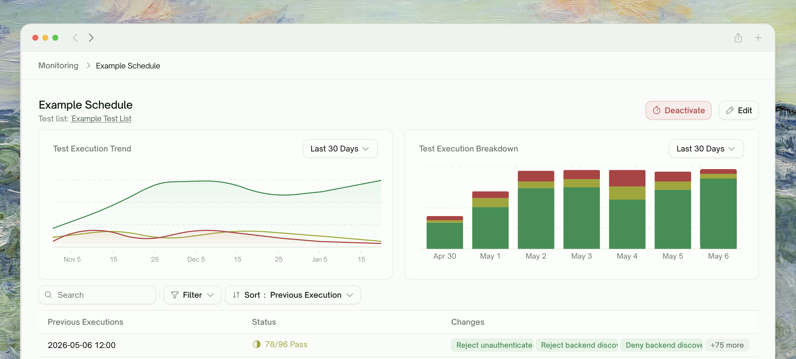
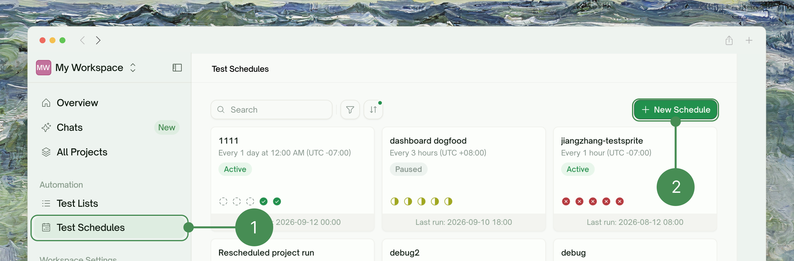
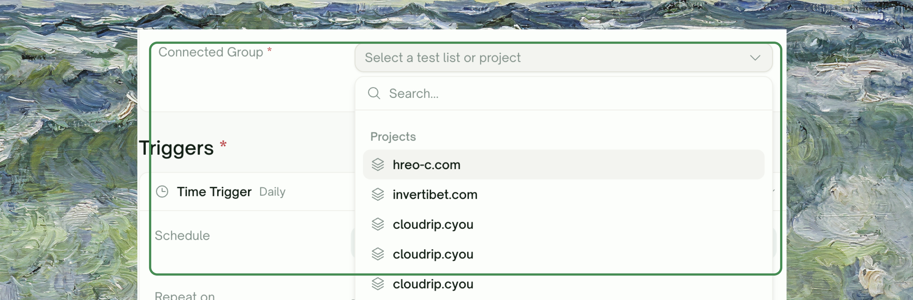
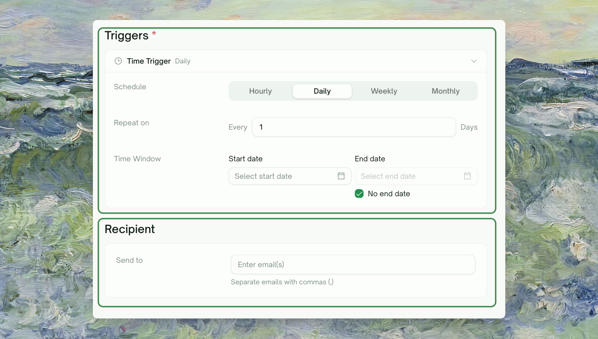
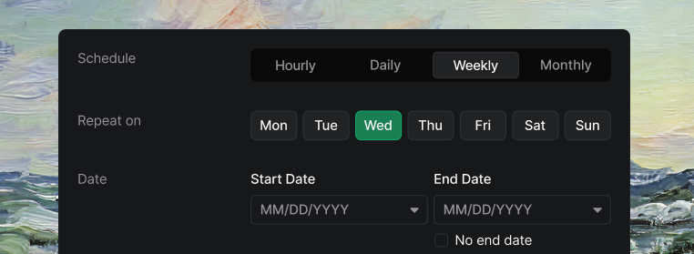
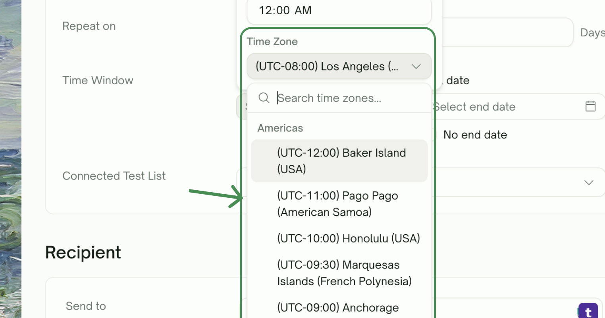

A schedule runs a test list, or a whole project, automatically on a cadence, so you get **continuous monitoring** of your application without triggering runs by hand.

<Frame>
  
</Frame>

<Info>
Not every plan includes schedules. Compare plans on the [pricing page](https://www.testsprite.com/pricing).
</Info>

## Creating a Schedule

You need **something to run** (an existing [test list](/web-portal/maintenance/test-lists) or a whole **project**) and the **email addresses** that should get the results; schedules notify by email.

<Steps>
  <Step title="Navigate to Test Schedules">
    Go to <kbd>Automation → Test Schedules</kbd> and click <kbd>New Schedule</kbd>.
    <Frame>
      
    </Frame>
  </Step>
  <Step title="Choose what to run">
    Pick a test list or a project. See [What You Can Schedule](#what-you-can-schedule).
    <Frame>
      
    </Frame>
  </Step>
  <Step title="Configure the schedule">
    Set the **frequency** (hourly, daily, weekly, monthly), the **times and days**, the **timezone**, the **time window** the schedule is active for, and the **recipients** who get the result email.
    <Frame>
      
    </Frame>
  </Step>
</Steps>

## What You Can Schedule

A schedule points at one thing, chosen when you create it. The target picker has two sections, <kbd>Test Lists</kbd> and <kbd>Projects</kbd>.

| Target | What runs |
| :--- | :--- |
| <kbd>Test List</kbd> | The tests in that list, which may span several projects |
| <kbd>Project</kbd> | Every live test case in that project, with no test list to build or keep current. An extra <kbd>Execution</kbd> section lets you pick the **execution environment** it runs against |

Scheduling a project is the lower-maintenance option: tests added to the project later are picked up automatically, whereas a test list only runs the tests you put in it.

<Note>
**A schedule's target is fixed once it's created.** You can rename a schedule and change its cadence, time window, and recipients, but not re-point it at a different test list or project. To change the target, create a new schedule.
</Note>

## Schedule Configuration

### Frequency Options

<Frame>
  
</Frame>

<Tabs>
  <Tab title="Frequency Options">

| Frequency | Description |
| :--- | :--- |
| <kbd>Hourly</kbd> | Every N hours, 1–24 |
| <kbd>Daily</kbd> | Every N days, 1–31, at the time you set |
| <kbd>Weekly</kbd> | On the days of the week you select (one or more) |
| <kbd>Monthly</kbd> | Every N months, 1–12, on a day from the 1st to the 28th, or the last day of the month |
  </Tab>
  <Tab title="Example Configurations">

```yaml expandable
Daily Schedule:
  Frequency: Every 1 day
  Time: 06:00 AM
  Timezone: (UTC+00:00) London (UK)

Weekly Schedule:
  Days: Monday, Wednesday, Friday
  Time: 09:00 AM
  Timezone: (UTC-05:00) New York (USA)

Monthly Schedule:
  Frequency: Every 1 month, on the 1st
  Time: 12:00 PM
  Timezone: (UTC-08:00) Los Angeles (USA)
```
  </Tab>
</Tabs>

### Time Window

- **Start date and time**: when the schedule begins. A time that has already passed doesn't fail; the schedule simply starts from now.
- **End date**: optional. Leave <kbd>End date</kbd> blank, or tick <kbd>No end date</kbd>, and the schedule runs indefinitely. Set an end date for a schedule that should stop on its own, such as one covering a release window.

### Timezone Settings

Every time you enter is interpreted in the timezone selected on the form. Each zone in the picker is labelled with its UTC offset, for example <kbd>(UTC-08:00) Los Angeles (USA)</kbd>.

<Frame>
  
</Frame>

<Warning>
**Check the timezone before you save.** New schedules start on **Los Angeles** time, not your browser's timezone or UTC. This is the usual reason a nightly run lands at the wrong hour. Daylight saving time changes can also shift execution times relative to UTC.
</Warning>

## Who Gets the Results

Schedules notify by **email**. Recipients are part of the schedule itself: the <kbd>Send to</kbd> field on the create and edit form takes one address or several, separated by commas.

- It is a **result report, not a failure alert**. It goes out when a run finishes, passed or failed, with the pass and fail counts. The only run that sends nothing is one with no tests to execute, such as an empty test list.
- If <kbd>Send to</kbd> is empty, **no result email is sent at all**, even when the run fails. The only mail such a schedule still produces is the automatic-pause notice described below, which goes to whoever created the schedule.

<Tip>
Use a team alias or a shared inbox rather than one person's address, so a nightly schedule keeps reporting to someone after that person is on leave or changes teams.
</Tip>

**Slack.** If a project has the Slack integration connected and enabled, it posts a summary to your chosen channel whenever one of its runs finishes, scheduled runs included. Slack is set up per project, not on the schedule, so a schedule pointed at a test list that spans several projects produces one Slack post per project.

## Managing Schedules

The <kbd>Test Schedules</kbd> page shows each schedule as a card: its name, cadence in plain language, an <kbd>Active</kbd> or <kbd>Paused</kbd> badge, dots for the last five runs, and the date of the last run. Above the grid you can filter by <kbd>Recurring</kbd> and <kbd>Schedule Status</kbd>, and sort by <kbd>Next Run</kbd>.

A schedule that has run past its end date still shows <kbd>Active</kbd>. If a schedule has gone quiet, open <kbd>Edit</kbd> and check its end date.

### Inside a Schedule

Open a schedule to see how it has been doing over time: two charts, then every run it has produced.

| Section | What it tells you |
| :--- | :--- |
| <kbd>Test Execution Trend</kbd> | Pass, Blocked and Fail counts over time, so a slow slide is visible before anyone reports it. Switch the window between <kbd>Today</kbd>, <kbd>Last 7 Days</kbd> and <kbd>Last 30 Days</kbd> |
| <kbd>Test Execution Breakdown</kbd> | The same counts as bars, one per time bucket (hourly on <kbd>Today</kbd>, daily on the others). Better than the trend for answering "which day did this start on?" |
| <kbd>Previous Executions</kbd> | Every run this schedule has produced, newest first, with its timestamp and pass count. A run still in flight shows as <kbd>In Progress</kbd>. Filter by status to pull out just the failures |

Click any completed run to open its full results and report, the same view you get from a manually triggered run.

<Note>
The breakdown bars are bucketed by hour or day, so a schedule that runs more than once per bucket (an hourly schedule viewed over 7 days, say) shows the **average** of those runs in one bar. Use <kbd>Previous Executions</kbd> for per-run numbers.
</Note>

To see which tests changed between runs, use the project's [Insights](/web-portal/results/project-overview): new regressions are flagged <kbd>New</kbd> in **Issues to Fix**, and the **Regressions** trend counts them run by run.

### Schedule Actions

| Action | Where | Description |
| :--- | :--- | :--- |
| <kbd>Edit</kbd> | Schedule menu, or the schedule's own page | Change the name, timing, time window, and recipients |
| <kbd>Pause</kbd> / <kbd>Resume</kbd> | <kbd>Edit</kbd> → <kbd>Status</kbd> | Stop the schedule from running, and start it again later |
| <kbd>Delete</kbd> | Schedule menu, or the schedule's own page | Permanently removes the schedule, its trigger, and its run history |

### Pausing and Re-enabling a Schedule

Pausing is done from the edit form, not the schedule's menu. Open <kbd>Edit</kbd>, switch <kbd>Status</kbd> from <kbd>Active</kbd> to <kbd>Pause</kbd>, and save. The schedule keeps its cadence, history, and recipients. Switch back to <kbd>Active</kbd> and save to resume; the next run lands at the next matching time.

A paused schedule still occupies one of your plan's schedule slots. Delete it if you need the slot back.

<Warning>
**Deleting is not the same as pausing, and it can't be undone.** It removes the schedule and **its entire run history**. To stop a schedule for now, use <kbd>Edit</kbd> → <kbd>Status</kbd> → <kbd>Pause</kbd>.
</Warning>

### When TestSprite Pauses a Schedule for You

When a schedule is paused automatically, TestSprite emails its recipients (or its creator, if it has none) so the pause doesn't go unnoticed.

<AccordionGroup>
  <Accordion title="Ten runs in a row with nothing passing" icon="circle-xmark">
    If **10 consecutive runs finish without a single passing test**, the schedule is paused. This stops a schedule pointed at a dead environment, or at a login that has since changed, from running every night for nothing.

    A single passing test resets the counter, so an intermittently failing suite won't trip it. Runs that execute no tests don't count either way; a run that errors out before producing any result counts the same as a run with nothing passing.

    Fix whatever was failing, then re-enable the schedule from <kbd>Edit</kbd> → <kbd>Status</kbd>. Resuming clears the counter.
  </Accordion>
  <Accordion title="The workspace's plan no longer includes scheduling" icon="lock">
    If the workspace moves to a plan without scheduling, or is suspended, its schedules are paused and the recipients are emailed. Nothing is deleted: restore the plan and you can re-enable them.
  </Accordion>
  <Accordion title="Not enough credits, or a payment that hasn't gone through" icon="circle-exclamation">
    Neither pauses the schedule. That run is skipped and the schedule keeps its cadence, picking up again once the balance is topped up or the payment clears.
  </Accordion>
</AccordionGroup>

## Where to Go Next

<Columns cols={2}>
  <Card title="Test Lists" href="/web-portal/maintenance/test-lists" icon="list-check">
    Build the collection of tests a schedule runs
  </Card>
  <Card title="Insights" href="/web-portal/results/project-overview" icon="gauge">
    Regressions and quality trends across runs
  </Card>
</Columns>
