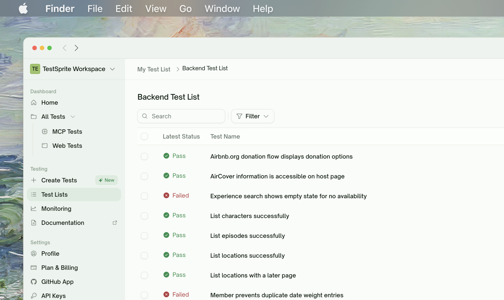
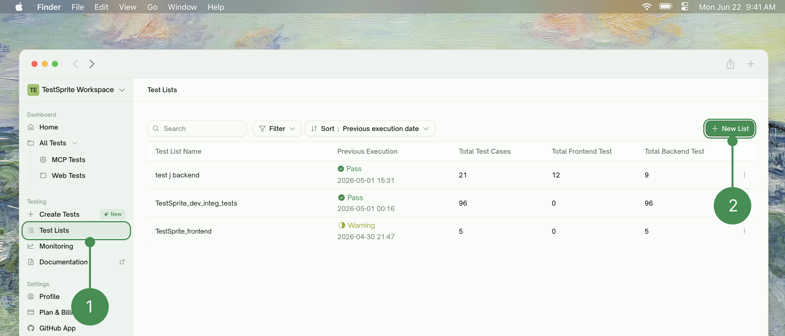
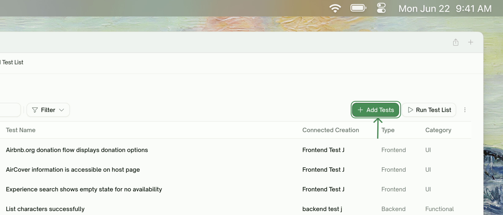
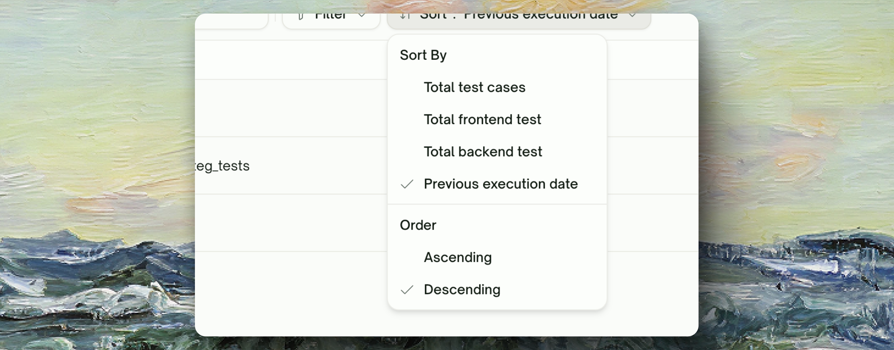

Test Lists are organized collections of test cases that help you group related tests together. Whether you're testing different features, environments, or user flows, Test Lists provide a structured way to manage your testing efforts.

    <Frame>
      
    </Frame>

## Key Features

| Feature | Description |
| :--- | :--- |
| <kbd>Centralized Test Management</kbd> | View all test lists in one dashboard, track execution status across collections, search and filter by name or status, and sort by date, count, or type |
| <kbd>Test Organization</kbd> | Organize Frontend Tests with browser automation, Backend Tests for API functionality, and Mixed Collections combining both test types |
| <kbd>Execution Tracking</kbd> | Track your **previous execution** status to view the test's last run with **status indicators** showing **Passed** (all tests completed successfully), **Warning** (some tests need review), or **Failed** (tests encountered errors). |

## Creating Test Lists

<Steps>
  <Step title="Navigate to Test Lists">
    Go to <kbd>Dashboard</kbd> → <kbd>Test Lists</kbd> and click <kbd>New List</kbd> to get started
    <Frame>
      
    </Frame>
  </Step>
  <Step title="Add Test Cases">
    Add test cases from existing creations in <kbd>All Tests</kbd>, or create new tests by configuring web application information and letting TestSprite's AI generate comprehensive test cases
    <Frame>
    
    </Frame>
  </Step>
  <Step title="Organize and Configure">
    Name your test list descriptively, review and customize generated test cases, and maintain your test lists as needed
  </Step>
</Steps>

## Managing Test Lists

<Tabs>
  <Tab title="Search & Filter">
      <Frame>
      
    </Frame>

| Option | Description |
| :--- | :--- |
| <kbd>Search</kbd> | Search by test list name to quickly find specific collections |
| <kbd>Passed</kbd> | Show only successfully executed test lists |
| <kbd>In Progress</kbd> | Filter test lists currently running |
| <kbd>Warning</kbd> | Filter test lists with mixed pass/fail results that need review |
| <kbd>Failed</kbd> | Display test lists with execution errors |
| <kbd>Blocked</kbd> | Filter test lists that were blocked from completing |
  </Tab>
  <Tab title="Sorting Options">

        <Frame>
      
    </Frame>

| Option | Description |
| :--- | :--- |
| <kbd>Total test cases</kbd> | Order by number of tests in the list |
| <kbd>Total frontend test</kbd> | Order by frontend test count |
| <kbd>Total backend test</kbd> | Sort by backend test count |
| <kbd>Previous execution date</kbd> | Sort by most recently executed |
  </Tab>
</Tabs>

## Test List Details

Each test list displays:

| Field | Description |
| :--- | :--- |
| <kbd>Test List Name</kbd> | Descriptive identifier for your test collection |
| <kbd>Previous Execution</kbd> | Last run date and time |
| <kbd>Total Test Cases</kbd> | Combined count of all tests in the list |
| <kbd>Total Frontend Test</kbd> | Number of UI/browser tests |
| <kbd>Total Backend Test</kbd> | Number of API/server tests |

## Execution Actions

| Action | Description |
| :--- | :--- |
| <kbd>Add Tests</kbd> | Open the test picker to add tests from existing projects |
| <kbd>Run Test List</kbd> | Execute all tests in the list |
| <kbd>Delete Test List</kbd> | Remove test list (with confirmation) |
