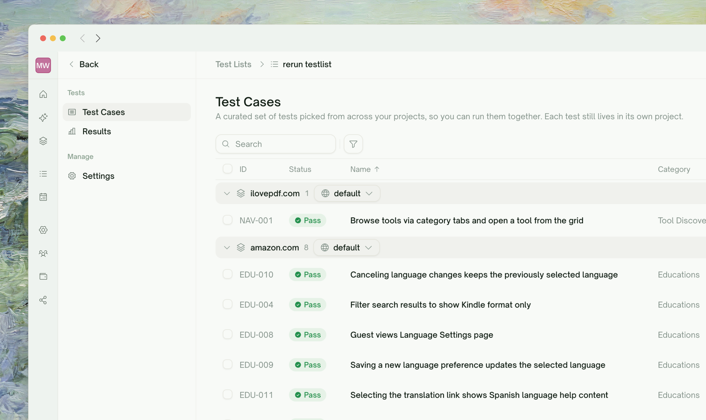
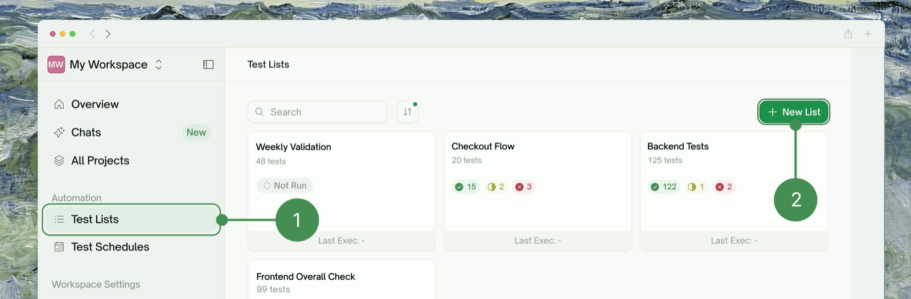
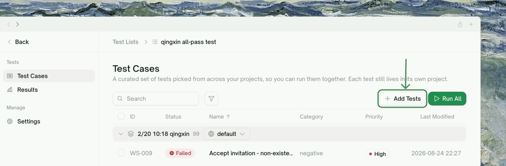

A Test List is a reusable collection of test cases, frontend, backend, or both, from one project or several: a regression suite, a smoke check, a release gate. You run a list as one unit, track its execution history, and schedule it with [Test Schedules](/web-portal/maintenance/monitoring).

    <Frame>
      
    </Frame>

## Creating Test Lists

<Steps>
  <Step title="Navigate to Test Lists">
    Go to <kbd>Automation</kbd> → <kbd>Test Lists</kbd> and click <kbd>New List</kbd> to get started
    <Frame>
      
    </Frame>
  </Step>
  <Step title="Add Test Cases">
    Add test cases from existing creations in <kbd>All Projects</kbd>
    <Frame>
    
    </Frame>
  </Step>
  <Step title="Name and maintain the list">
    Name the list descriptively and keep it up to date as your tests change
  </Step>
</Steps>

## The Test Lists Page

Each list shows its name, previous execution date and time, and test counts (total, frontend, and backend), along with the status of its last run:

| Status | Meaning |
| :--- | :--- |
| <kbd>Passed</kbd> | All tests completed successfully |
| <kbd>Warning</kbd> | Mixed pass/fail results that need review |
| <kbd>Failed</kbd> | Tests encountered errors |
| <kbd>Blocked</kbd> | The run was blocked from completing |
| <kbd>In Progress</kbd> | Currently running |

Search by list name, filter by any of these statuses, and sort by total, frontend, or backend test count, or by previous execution date.

## Execution Actions

| Action | Description |
| :--- | :--- |
| <kbd>Add Tests</kbd> | Open the test picker to add tests from existing projects |
| <kbd>Run Test List</kbd> | Execute all tests in the list |
| <kbd>Delete Test List</kbd> | Remove test list (with confirmation) |
