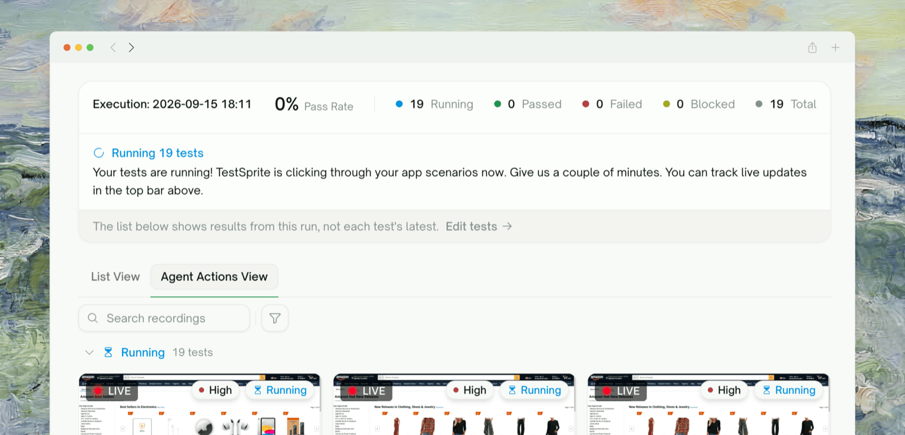
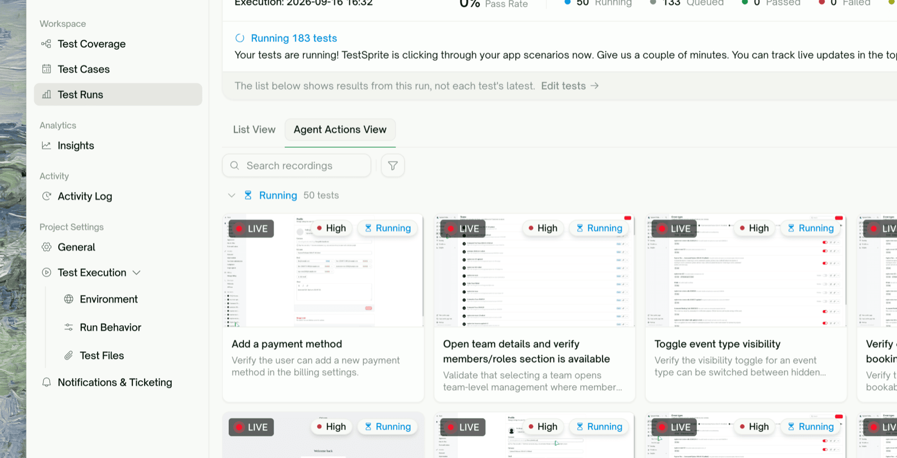
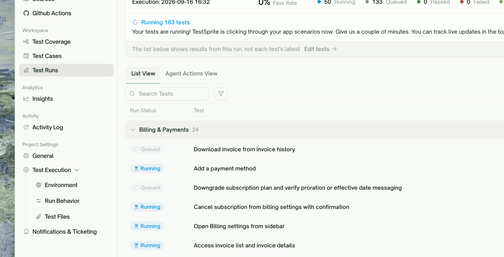

{/* ⚠️ V3.1 screenshots pending — placeholder image paths below use the `liverun-*.png` convention and don't exist in images/ yet. Replace each <Frame> src before publishing. */}

<Frame>
  
</Frame>

## Runs Are Watchable, Not Just Reported

When you start a UI run, you don't have to wait for it to finish to see anything. TestSprite streams the run as it happens: each test shows up as a **live view of the agent driving your app**, the counts at the top tick up in real time, and you can open any test to watch its steps land one by one.

This page is about the **in-flight** experience — while tests are still running. For the finished-run summary, see [Test Report](/web-portal/results/test-report).

## The Run Report Header

At the top of the run page, a **Run Report** panel summarizes the run as it progresses. While tests are still going, it shows a **Running** outcome and a live count breakdown:

| Count | What it means |
| :--- | :--- |
| <kbd>Pass Rate</kbd> | Percentage passing so far (updates as tests resolve) |
| <kbd>Running</kbd> | Tests whose browser session is live right now |
| <kbd>Queued</kbd> | Tests accepted but not yet started (waiting their turn — common on paced runs) |
| <kbd>Passed</kbd> / <kbd>Failed</kbd> / <kbd>Blocked</kbd> | Resolved outcomes so far |
| <kbd>Total</kbd> | All tests in this run |

The numbers refresh automatically every couple of seconds — no need to reload.

<Info>
**The report reflects *this run*, not each test's latest status.** A blue banner notes: *"The list below shows results from this run, not each test's latest."* If you re-ran a subset, the numbers here are scoped to the run you're watching.
</Info>

## Two Ways to Watch: Agent Actions View vs. List View

The run page has two tabs. They show the *same run* two different ways, and each is better for a different question.

| | <kbd>Agent Actions View</kbd> | <kbd>List View</kbd> |
| :--- | :--- | :--- |
| **Shows** | A tile per test — a **live view of the agent** in each running test, becoming a replayable video when it finishes | A status **table** of every test in the run, grouped by feature |
| **Best when** | *"Show me what the agent is doing right now"* — watch behavior unfold, spot a test going the wrong way | *"Where does the whole run stand?"* — scan status at scale, sort/filter, jump to a specific test |
| **Default for** | **Frontend (UI) runs** — the recordings are the primary artifact | Backend runs (and available on UI runs via the tab) |

Switch between them anytime with the tab bar — you're never locked into one. Both share the same live Run Report header.

### Agent Actions View (the live agent view)

<Frame>
  
</Frame>

Tiles are grouped by status, with **Running first** (the most actionable), then Passed, Failed, Blocked. While a test is running its tile streams a **live view of the agent walking through your app**, marked with a red **LIVE** badge. When the test finishes, that same tile turns into the recorded video you can replay.

- **Running** tiles show the live stream (starting with *"Starting…"* until the first frame arrives).
- **Search recordings** and filter by status or priority to focus.
- Empty state while warming up: *"Recording agent runs — AI agents record every test run; tiles appear here as recordings land."*

<Note>
**Queued tests don't appear as tiles yet.** A test that hasn't started has nothing to stream, so it joins the gallery the moment it begins running.
</Note>

### List View (the results table)

<Frame>
  
</Frame>

The **List View** tab is the run-scoped test table — every test grouped by feature, each row carrying a live **status chip** that flips from Queued → Running → Passed / Failed / Blocked as the run proceeds. Sort by **Run Status**, search by title, or filter to just the status you care about (e.g. show only **Running** or only **Failed**).

Click any row to open that test's detail (see [step snapshots](#reading-real-time-step-snapshots) below).

<Tip>
**Filter to Failed while the run is still going.** You don't have to wait for the whole suite — as soon as a test fails, it shows up under the Failed filter, so you can start triaging while the rest keep running.
</Tip>

## Reading Real-Time Step Snapshots

Open any test — a row in List View, or a tile in Agent Actions View — and you get a live, per-step view of what the agent is doing inside that one test.

<Frame>
  
</Frame>

### The live step list

Inside the test detail, the **Execution Steps** section fills in as the agent acts:

| State | What you see |
| :--- | :--- |
| Just started | **"Collecting steps…"** — the run began but no step has landed yet |
| Running | Each action (`click`, `fill`, `navigate`…) and assertion (`visible`, `text`, `url`…) appears as it executes; the summary row reads **"Test running…"** with a spinner |
| Finished | The full step list, sliced at the first failed step if the test failed |

### The per-step snapshot

Click any step and the right pane shows an **HTML snapshot of the page at that moment** (header *"Preview: Step N"*) — the actual DOM the agent saw, not a screenshot. This is how you localize *where* a run started going wrong, step by step.

Alongside the steps, the **Preview** tab shows the same **live agent stream** for that test while it's running (placeholder: *"Test in progress. Results will appear here when it completes."*), so you get both the step-by-step trace and the live browser view in one place.

<Info>
**Snapshots and steps update by polling, every couple of seconds.** There's a slight lag between what the agent does and what you see — this is normal. If a snapshot looks blank, the page hadn't settled when that frame was captured; the next step usually shows the stable state.
</Info>

## How the Live View Works (and Its Limits)

A few things worth knowing so the behavior doesn't surprise you:

<AccordionGroup>
  <Accordion title="The live view is a frame stream, not smooth video">
    While a test runs, the preview is a **stop-motion stream of the agent's browser** — frames refreshed about once a second — not full-motion video. It's meant to show you *what* the agent is doing, not to be a perfect screen recording. The polished, seekable video is produced once the test finishes.
  </Accordion>
  <Accordion title="Everything updates by polling, so expect a small lag">
    Counts, step lists, and snapshots refresh every 2–3 seconds. If something doesn't seem to update, give it a moment or refresh the page — the run is still progressing server-side; only the live view hiccupped.
  </Accordion>
  <Accordion title="A running tile shows LIVE; a Queued test shows nothing yet">
    **Running** = the browser session for that test is live (you'll see the LIVE badge and the frame stream). **Queued** = accepted but not started — nothing to watch until it begins. On paced runs, tests move from Queued to Running in batches.
  </Accordion>
  <Accordion title="Re-run all / Re-run failed are disabled while a run is in progress">
    You can't kick off another full run on top of an in-flight one. Wait for the current run to finish; the rerun buttons re-enable when the project is idle.
  </Accordion>
</AccordionGroup>

## Where to Go Next

<Columns cols={2}>
  <Card title="Test Report" href="/web-portal/results/test-report" icon="clipboard-check">
    The run summary once everything finishes
  </Card>
  <Card title="Step-by-Step Walkthrough" href="/web-portal/core/ui/ui-step-by-step" icon="shoe-prints">
    Replay a finished test action by action
  </Card>
  <Card title="Agent Actions" href="/web-portal/core/ui/agent-actions" icon="film">
    The full recording gallery for a project
  </Card>
  <Card title="Rerun" href="/web-portal/core/ui/ui-rerun" icon="arrow-rotate-right">
    Re-execute a test or the whole project after you've triaged
  </Card>
</Columns>
