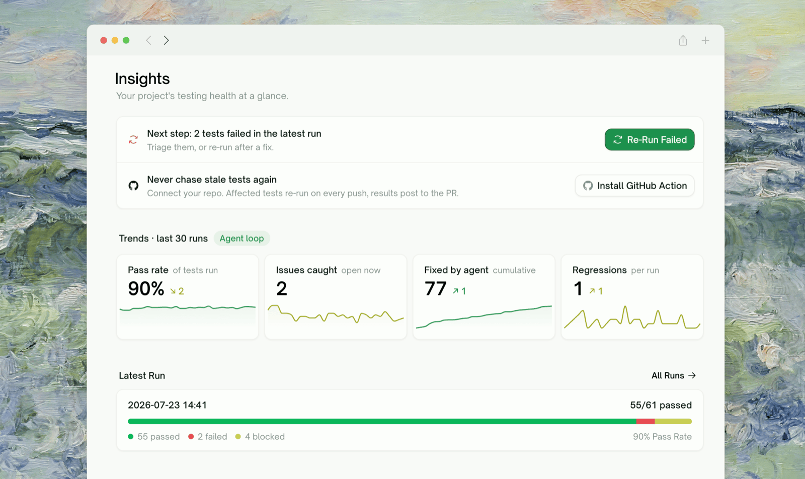
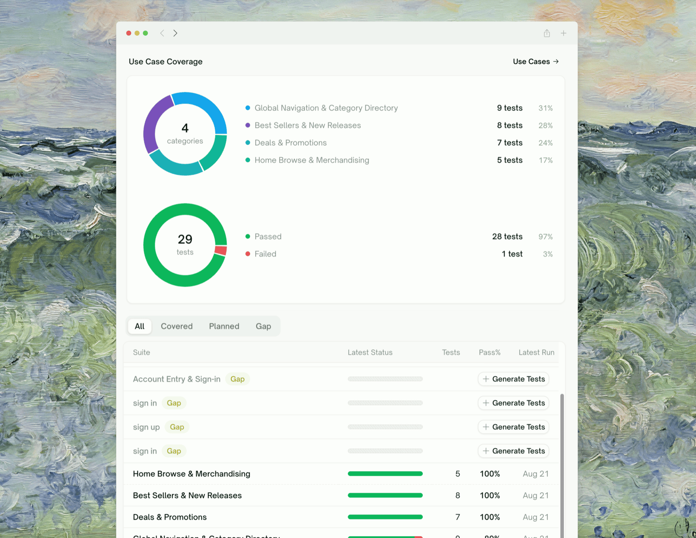
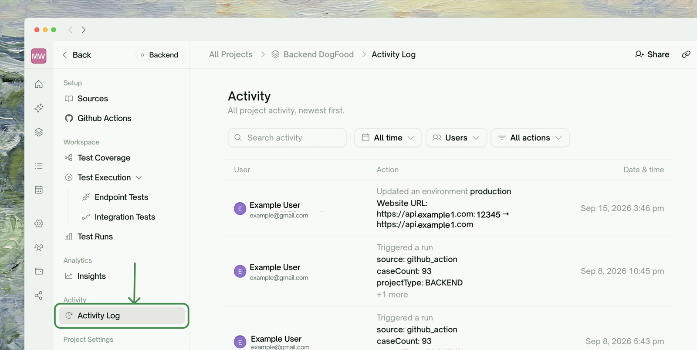

<Frame>
  
</Frame>

The **Insights** page is your project's health report. It's under **Analytics** in every project's sidebar and answers three questions in one screen: *what needs attention right now*, *how is quality trending*, and *what happened lately*.

## How to Read This Page

| Section | What it tells you |
|---|---|
| Next step card | The single most useful action right now — generate tests, re-run failures, or relax |
| <kbd>Trends</kbd> | Four quality metrics across your last runs — is the project getting better or worse? |
| <kbd>Issues to Fix</kbd> | The triage queue: failing tests grouped by root cause, worth-fixing-first on top |
| <kbd>Use Case Coverage</kbd> | Which use cases are covered, planned, or still gaps |

At the top, TestSprite also surfaces contextual prompts when they apply — e.g. *"We noticed changes in your repo"* with a **Re-run all tests** button when your code has moved since the last run, or a suggestion to enable the GitHub Action for a connected repo.

## Issues to Fix (Triage Queue)

{/* TODO (Sherry): screenshot — Issues to Fix widget with an expanded group */}

The queue lists every test case whose **latest result** is failed or blocked, but one row is **one root cause, not one test**. Failures with the same diagnosis (same HTTP status and error signature) are clustered together, so a single backend bug that breaks eight tests shows up as one row tagged *"8 tests"*, not eight rows.

**How it's sorted:** failed groups above blocked ones → groups containing a **regression** first → the largest cluster first (one fix clears the most tests). Blocked tests are collapsed behind a *"Blocked · N tests that could not run"* toggle so they don't bury real failures.

**Badges to look for:**

| Badge | Meaning |
|---|---|
| <kbd>New</kbd> | A regression — this test used to pass and now fails. Look at what changed. |
| <kbd>Flaky</kbd> | Within the last 5 runs this test has both passed and failed — suspect the test or the environment before the product. |
| <kbd>N tests</kbd> | How many test cases share this root cause |

**Clearing the queue, item by item:**

<Steps>
  <Step title="Expand the top row">
    Click a row to see the **Suggested fix** and the affected tests. Click any test pill to open its detail drawer without leaving the page.
  </Step>
  <Step title="Decide: real bug, flaky test, or stale test">
    A <kbd>New</kbd> badge points at a regression; a <kbd>Flaky</kbd> badge points at instability. For anything ambiguous, check the test's historical results in its detail view.
  </Step>
  <Step title="Act, then re-run">
    For product bugs, click <kbd>Copy Fix Prompt</kbd> to copy a ready-made prompt (diagnosis, endpoint, response, suggested fix, affected tests) and paste it into your coding agent. After a fix — or for suspected flakes — hit the row's **Re-run** button to re-run every affected test at once.
  </Step>
</Steps>

<Info>
There's no manual "dismiss" — the queue is fully derived from results. A row disappears the moment its tests pass on a re-run. When the queue is empty you'll see **"Nothing to fix."**
</Info>

## Quality Trends

{/* Trends widget is visible in the hero screenshot above; add a close-up here later if useful */}

The <kbd>Trends</kbd> widget plots **one point per run** (up to the last 50 runs — not calendar time), across four metrics. Each card shows the current value, a sparkline, and a delta arrow vs. the previous run (green = moving the right way):

| Metric | What it counts | Good direction |
|---|---|---|
| Pass rate | % of tests passing, carrying forward each test's last known verdict | Up |
| Issues caught | Tests currently not passing | Down |
| Fixed by agent | Cumulative count of tests that went failed/blocked → passed | Up |
| Regressions | Tests that went passed → failed in that run | Down |

How to interpret common patterns:

- **Failing several runs in a row** — likely a real regression; check what changed around the first failing run (the Activity Log helps here).
- **Alternating pass / fail** — a flaky test or unstable environment, not a product bug; these also get the <kbd>Flaky</kbd> badge in the triage queue.
- **Sudden drop across many tests at once** — usually an environment or authentication problem rather than many simultaneous bugs.

## Use Case Coverage

<Frame>
  
</Frame>

- **Use Case Coverage** breaks your use-case map into <kbd>Covered</kbd> / <kbd>Planned</kbd> / <kbd>Gap</kbd> tabs with per-suite pass rates. Rows flagged <kbd>Gap</kbd> have a **Generate tests** shortcut; <kbd>Planned</kbd> rows have **Run tests**. Low-pass-rate rows are tinted so weak suites stand out.

## Project Activity Log

<Frame>
  
</Frame>

The activity feed lives on its own page: in the project sidebar, open <kbd>Activity Log</kbd> (under **Activity**). It lists *all project activity, newest first* — each row shows **who did what to which entity, and when**, with before → after values for edits.

Recorded activity covers the full project lifecycle: test cases created/edited/deleted, use cases generated, runs triggered and completed, schedules created or paused, environments and sources changed, members joining or changing roles, GitHub triggers, and Slack/email notifications sent.

Filter the feed by **user**, **time window** (last 24 hours / 7 days / 30 days / all time), or **event type** — useful for answering *"who changed this test?"* or *"what happened right before the pass rate dropped?"*.

## Suggested Workflow: Weekly Quality Review

<Info>
Run your weekly quality meeting directly off this page:

1. **Clear the triage queue** — walk <kbd>Issues to Fix</kbd> top to bottom; the sorting already puts the highest-leverage fix first.
2. **Read the Trends deltas** — a falling pass rate or rising regressions is the week's headline.
3. **Scan Use Case Coverage** — assign any <kbd>Gap</kbd> rows before the next release.
4. **Skim the Activity Log** — confirm nothing unexpected changed (tests deleted, schedules paused).
</Info>

## Where to Go Next

<CardGroup cols={2}>
  <Card title="Test Report & Export" icon="file-lines" href="/web-portal/results/test-report">
    Download a shareable PDF report for any run
  </Card>
  <Card title="Rerun" icon="arrow-rotate-right" href="/web-portal/core/ui/ui-rerun">
    Re-run a single test, a failure group, or the whole project
  </Card>
</CardGroup>
