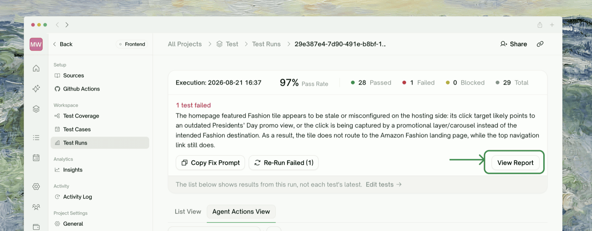
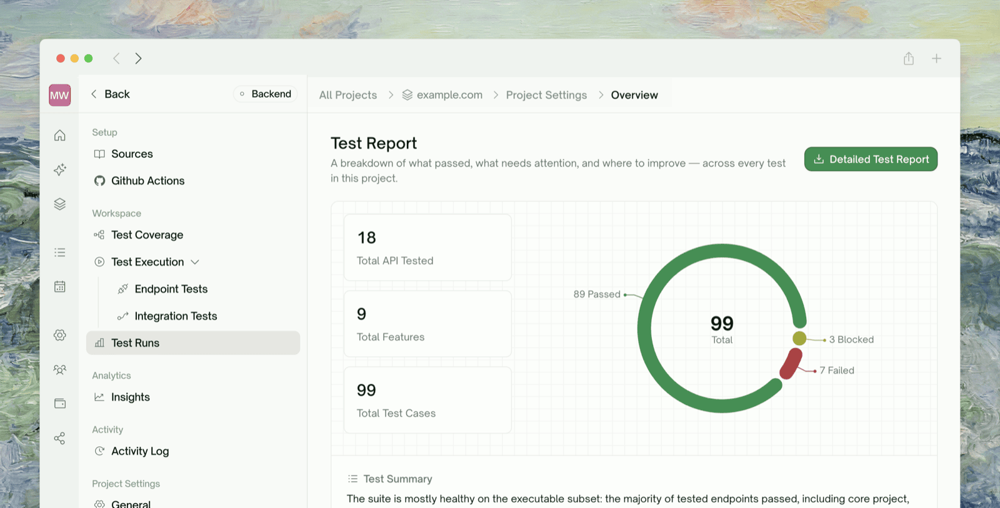
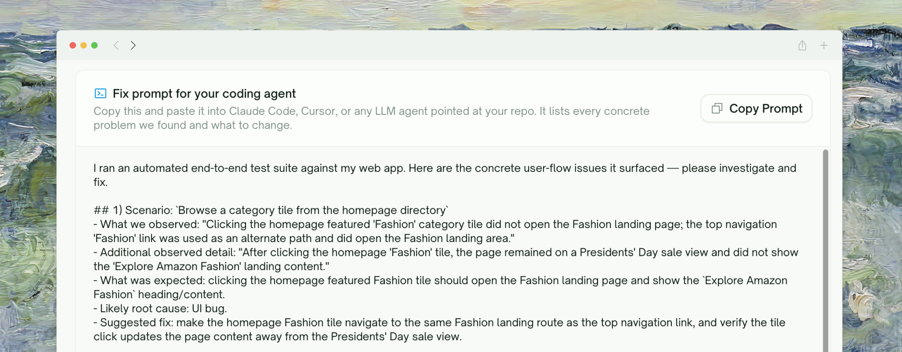
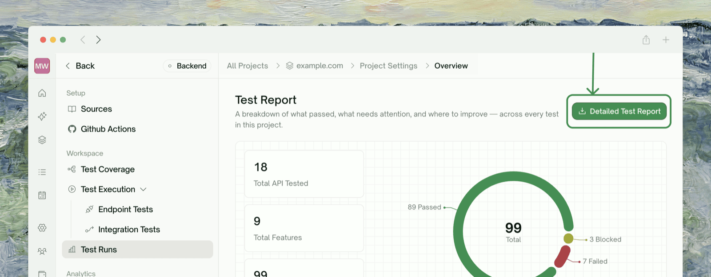

<Frame>
  
</Frame>

Every run has its own page under <kbd>Test Runs</kbd>. Watch it live while it runs, then open its **report** when it finishes: the pass rate, failures grouped by root cause, an AI-written summary, and a fix prompt for your coding agent.

## Watching a Run

You don't have to wait for a run to finish. The **Run Report** header at the top of the run page shows the pass rate and live counts (<kbd>Running</kbd>, <kbd>Queued</kbd>, <kbd>Passed</kbd>, <kbd>Failed</kbd>, <kbd>Blocked</kbd>, <kbd>Total</kbd>), refreshed every couple of seconds. The page shows results from **this run**, not each test's latest status.

The run page has two tabs showing the same run two ways:

<Tabs>
  <Tab title="Agent Actions View">
    The default for UI runs. A tile per test streams the agent driving your app (marked **LIVE**) and becomes a replayable recording when the test finishes. Queued tests join the gallery as soon as they start. See [Agent Actions](/web-portal/core/ui/agent-actions).
    <Frame>
      
    </Frame>
  </Tab>
  <Tab title="List View">
    The default for API runs, also available on UI runs. A status table of every test in the run, grouped by feature, with a live status chip that moves from Queued to Running to Passed, Failed, or Blocked. Sort by **Run Status**, search by title, or filter to one status.
    <Frame>
      
    </Frame>
  </Tab>
</Tabs>

<Tip>
**Filter to Failed while the run is still going.** A test appears under Failed as soon as it fails, so you can start triaging while the rest keep running.
</Tip>

Open any test to watch its steps land live: the step list fills in as the agent acts, and clicking a step shows an HTML snapshot of the page at that moment. See [Step-by-Step Replay](/web-portal/core/ui/ui-step-by-step) for how to read it.

<Frame>
  
</Frame>

A few things to expect while a run is live:

- The live preview is a frame stream refreshed about once a second. The seekable video is produced when the test finishes.
- Counts, steps, and snapshots refresh every 2 to 3 seconds. A blank snapshot usually means the page hadn't settled yet; the next step shows the stable state.
- <kbd>Re-run all</kbd> and <kbd>Re-run failed</kbd> stay disabled until the current run finishes.

## Reading the Report

Click <kbd>View Report</kbd> on a run's page to open that run's report. It comes from an AI analysis pass that runs automatically when the run finishes; until it's done, the page shows **"Analyzing your results"**.

<Frame>
  
</Frame>

<Frame>
  
</Frame>

| Section | What it tells you |
| :--- | :--- |
| <kbd>Stat cards</kbd> | Coverage at a glance: **Total API Tested** (backend) or **Base URL** (frontend), **Total Features**, **Total Test Cases** |
| <kbd>Pass distribution</kbd> | A donut of **passed / failed / blocked**: your pass rate and where the failures sit |
| <kbd>Test Summary</kbd> | A plain-English narrative of how the run went |
| <kbd>Fix prompt</kbd> | A copy-paste prompt for your coding agent (see below) |
| <kbd>Issues found</kbd> | Failed and blocked tests **grouped by root cause**, so ten failures from one bug read as one issue |
| <kbd>What could be better</kbd> | Concrete weaknesses the analysis spotted |
| <kbd>Recommendations</kbd> | Suggested next steps |

The report covers outcomes and coverage, not timing; for when a run happened, use the **Test Runs** history.

### The AI Fix Prompt

The **Fix prompt for your coding agent** card lists every concrete problem the run found and what to change. Click **Copy prompt** and paste it into Claude Code, Cursor, or any agent pointed at your repo. When there's nothing actionable, the card is empty.

<Frame>
  
</Frame>

You'll find the same kind of prompt in [Issues to Fix](/web-portal/results/project-overview) on Insights and, for one failing test at a time, in the [Step-by-Step Replay](/web-portal/core/ui/ui-step-by-step) failure detail.

## Downloading the PDF

The PDF is a fuller, print-ready version of the same run, with a cover, a table of contents, coverage tables, and per-failure detail including source code. Your browser produces it through its print dialog (nothing is stored on the server), so you can regenerate it any time.

<Steps>
  <Step title="Click Detailed Test Report">
    On the report page, click <kbd>Detailed Test Report</kbd>. A new tab opens and assembles the full report.
    <Frame>
      
    </Frame>
  </Step>
  <Step title="Let it finish generating">
    Wait for the **Generating** spinner to settle before printing.
  </Step>
  <Step title="Print to PDF with the right settings">
    In the print dialog, choose **Save as PDF** and use these settings so the report renders correctly:

    | Setting | Value |
    | :--- | :--- |
    | <kbd>Background graphics</kbd> | On |
    | <kbd>Margins</kbd> | None |
    | <kbd>Scale</kbd> | 100% |
  </Step>
</Steps>

| PDF section | Contents |
| :--- | :--- |
| <kbd>Cover</kbd> | Date, report title, a contents list, and four headline tiles: **Test Runs**, **Pass Rate**, **Issues**, **Saved By TestSprite** (an estimate of engineering time saved) |
| <kbd>Table of Contents</kbd> | Two-level outline of the report |
| <kbd>Executive Summary</kbd> | A **High-Level Overview** table (project, type, totals, pass/fail/blocked) plus **Key Findings**: the Test Summary, What could be better, and Recommendations |
| <kbd>Coverage</kbd> | Per-type detail: backend endpoint/integration coverage, or frontend UI coverage |
| <kbd>Failure detail</kbd> | For each **failed or blocked** test (passing tests aren't itemized): status, priority, description, a preview link, the error / cause / fix, and the test's source code |

Reports have no fixed expiry; they re-render from the run whenever you open them. Embedded screenshot links expire after about a week, so download the PDF if you need a permanent copy with images.

## Where to Go Next

<Columns cols={2}>
  <Card title="Insights" href="/web-portal/results/project-overview" icon="gauge">
    Issues to fix and quality trends across runs
  </Card>
  <Card title="Edit & Rerun" href="/web-portal/core/ui/ui-rerun" icon="arrow-rotate-right">
    Re-run a test or the whole project after you've triaged
  </Card>
</Columns>
