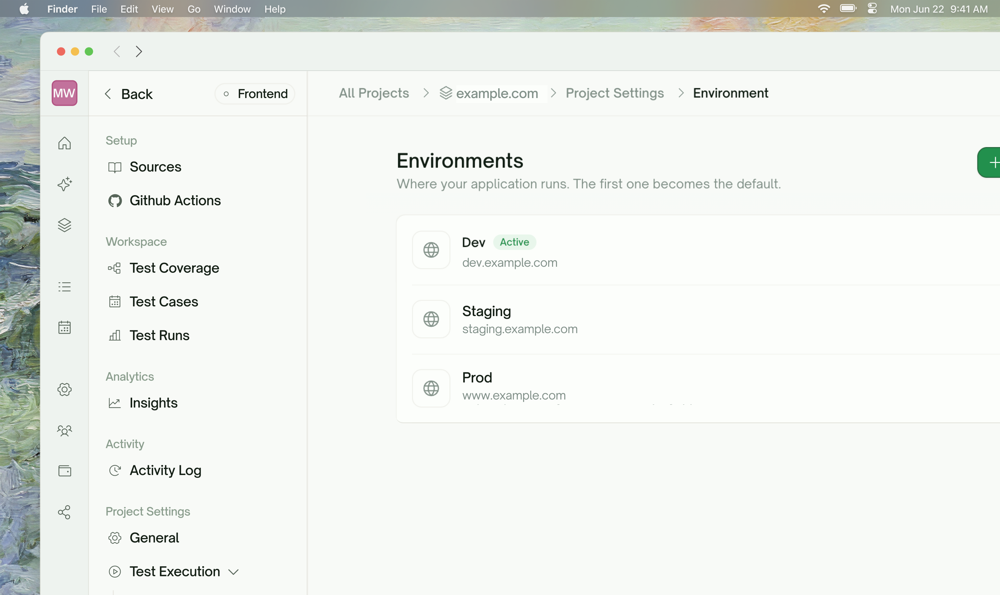
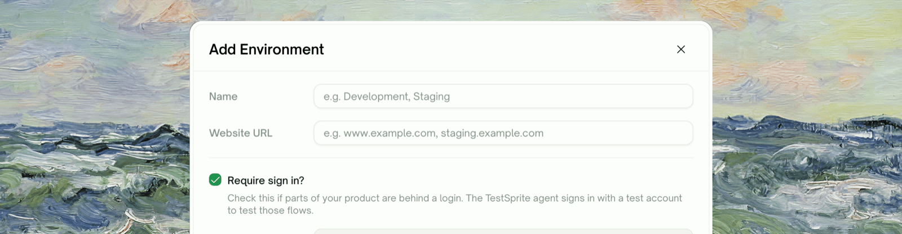
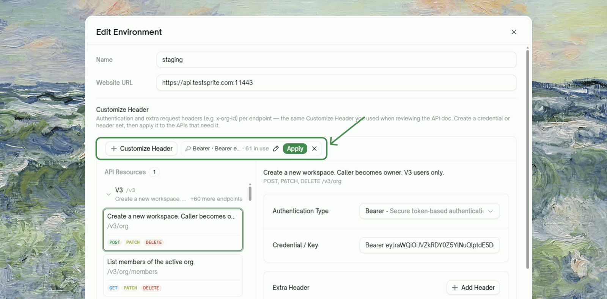
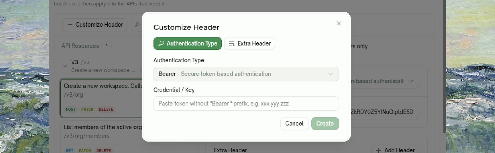
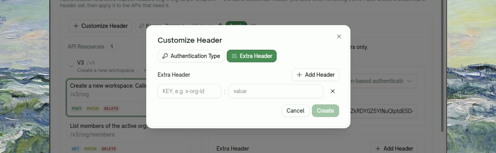
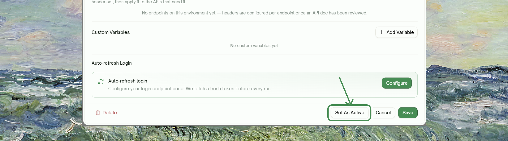

<Frame>
  
</Frame>

## What an Environment Is

An **environment** is one place your application runs. Every project has at least one, and each bundles what differs between deployments:

| Field | What it holds |
| :--- | :--- |
| **Name** | A label like `dev`, `staging`, or `production` |
| **Website URL** | The base URL tests run against |
| **Authentication** | The credentials tests authenticate with (backend projects: bearer token / API key / basic; frontend projects: test account login) |
| **Custom Variables** | Your own key–value pairs (environment variables) |

Tests describe *what* to verify; the environment supplies *where* and *with which values*. That's what lets one suite cover several deployments.

Environments live in **Project Settings → Test Execution → Environment**. Click any environment in the list to edit it.

## Creating an Environment

Click **Add Environment** in the top-right of the Environments page and fill in the deployment's details, typically one entry each for `dev`, `staging`, and `production`.

<Frame>
  
</Frame>

<br />

<Frame>
  
</Frame>

- **Authentication** sets how tests authenticate against this deployment: `None`, `Basic`, `Bearer Token`, or `API Key`. You can refine it per endpoint later (see below).
- **Auto-refresh Login** can be set up right away if the deployment's tokens expire; TestSprite then fetches a fresh token before every run. See [Auto-Auth](/web-portal/core/api/auto-auth).
- The first environment a project gets becomes the **Active** one automatically.

## Environment Variables (Custom Variables)

### Where they're defined

Open an environment and scroll to **Custom Variables**. Click **Add Variable** and enter a `KEY = value` pair. Variables are defined **per environment**, so the same key usually holds a different value in each:

```
# staging                          # production
TENANT_ID = acme-staging           TENANT_ID = acme
SUPPORT_EMAIL = qa@acme.dev        SUPPORT_EMAIL = support@acme.com
```

<Frame>
  
</Frame>

### How tests reference them

You don't paste values into test cases. When TestSprite generates test code, values from the environment are stamped as `VAR_{key}` placeholders (for example `VAR_{TENANT_ID}`) and resolved from the **currently selected environment** right before each test runs. So:

- **Switching environments never requires regenerating tests.** Every run re-resolves the placeholders.
- **A variable a test references must exist in every environment you run against**, or the placeholder has nothing to resolve to.

<Note>
Environment variables are **static configuration you define** (a tenant ID, a support email). [Dynamic Variables](/web-portal/core/api/dynamic-variables) are **values captured at run time** from one test's response and fed into another (a freshly created `user_id`).
</Note>

## Per-Endpoint Authentication and Headers (Backend)

A backend environment also has the **Customize Header** panel, the same tool you used when reviewing the API doc. It sets authentication and extra request headers **per endpoint**, for APIs where a login route is public, an admin group needs a different key, or every call needs an `x-org-id`.

<Frame>
  
</Frame>

Create a credential or header set once, then apply it to the endpoints that need it:

<Tabs>
  <Tab title="Authentication Type">
    A credential set: `Bearer` / `API Key` / `Basic` plus the credential value. Endpoints without one fall back to the environment-level authentication chosen at creation.

    <Frame>
      
    </Frame>
  </Tab>
  <Tab title="Extra Header">
    Plain request headers (e.g. `x-org-id`) sent alongside the credential. Different header sets can stack on the same endpoint.

    <Frame>
      
    </Frame>
  </Tab>
</Tabs>

Each chip shows how many endpoints carry it (`61 in use`). **Apply** opens an endpoint picker, and selecting an endpoint in the list shows exactly which credential and headers its tests will send.

## Managing Multiple Environments

- **One environment is always Active** (marked with a badge). Runs you trigger from the portal execute against the Active environment.
- Open an environment and click **Set As Active** to switch.
- Every project keeps at least one environment; the last one can't be deleted.
- Deleting an environment doesn't affect existing tests; they resolve against whichever environment is Active when they next run.

<Warning>
Point non-production environments at real deployments you own, and be deliberate before making `production` the Active environment: API tests send real requests, and tests that create or delete records will do so against whatever the Active environment points at.
</Warning>

## Running the Same Suite Against Different Environments

Because tests store placeholders, "run against staging instead" is a configuration change, not a test change:

<Steps>
  <Step title="Ad-hoc runs">
    Set the target environment as **Active**, then trigger the run. Every URL, credential, and `VAR_{key}` resolves from that environment.

    <Frame>
      
    </Frame>
  </Step>
  <Step title="Test Lists and schedules">
    A [Test List](/web-portal/maintenance/test-lists) can pin an environment **per project** it contains, and a schedule runs its list with those pins. Your nightly can run against staging while your Active environment stays on dev.
  </Step>
</Steps>

## What Belongs Where

Rule of thumb: **identity and secrets go in the authentication configuration; everything else that varies per deployment goes in variables or the URL field.**

| Value | Put it in | Why |
| :--- | :--- | :--- |
| Base URL / domain | The environment's **Website URL** field | It's what every request is joined onto |
| Tenant ID, org ID, region, feature toggles | **Custom Variables** | Plain configuration, resolved into tests as `VAR_{key}` |
| Tokens, API keys, passwords | **Customize Header → Authentication Type** (or [Auto-Auth](/web-portal/core/api/auto-auth)) | Masked in the UI, redacted from exported code, and rotatable in one place |
| A tenant header every request must carry (e.g. `x-org-id`) | **Customize Header → Extra Header** | A variable can't attach itself to a request on its own |

A token in a custom variable technically works, but it loses masking, export redaction, and one-click rotation, and anyone opening the environment dialog can read it.

## Related

<CardGroup cols={3}>
  <Card title="Auto-Auth" href="/web-portal/core/api/auto-auth" icon="arrows-rotate">
    Fetch a fresh token before every run
  </Card>
  <Card title="Dynamic Variables" href="/web-portal/core/api/dynamic-variables" icon="brackets-curly">
    Runtime values that flow between tests
  </Card>
  <Card title="Test Lists" href="/web-portal/maintenance/test-lists" icon="list-check">
    Curated suites with per-project environment pins
  </Card>
</CardGroup>
