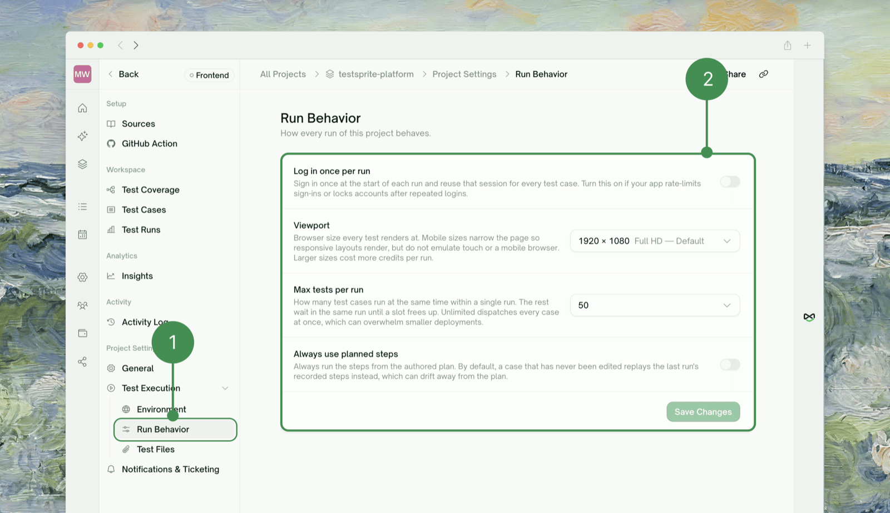

Open the project → <kbd>Project Settings → Test Execution → Run Behavior</kbd> in the sidebar.

<Frame>
  
</Frame>

<Info>**Viewport** and **Log in once per run** are Frontend-only — a Backend project has no browser to apply them to.</Info>

| Setting | What it does | Change it when |
| :--- | :--- | :--- |
| **Viewport** | Browser window size for every test in the project (desktop/tablet/mobile presets, e.g. `1920×1080` default, `390×844` iPhone). Mobile presets narrow the page but don't emulate touch or a mobile browser. Bigger = more credits per run. | You need to check a layout at a specific breakpoint |
| **Log in once per run** | Signs in once, shares that session across all cases in the run instead of logging in per case. Forced on (and locked) for OTP-based auth. | Your app rate-limits sign-ins or locks the account after repeated logins |
| **Max tests per run** | How many cases run concurrently; the rest queue for a free slot. Options: `10 / 25 / 50 / 75 / 100 / Unlimited` — default `50`. | Turn it **down** for a smaller/shared target that chokes under load; turn it **up** to finish runs faster |
| **Always use planned steps** | Forces every case to run its authored plan. Off by default — an unedited case instead replays its last run's recorded steps, which can drift from the plan over time. | You've noticed a case drifting from its plan and want the plan to always win |

<Note>
**Two quick presets** — Daily regression: default viewport, planned steps **on** (stay aligned with the plan), max tests at default or lower for a shared target. Mobile-focused: just switch **Viewport** to a mobile preset; the other three settings aren't specific to mobile, so pick them the same way you would for any other run.
</Note>

## Where to Go Next

<CardGroup cols={2}>
  <Card title="GitHub Integration" href="/web-portal/integrations/github-integration" icon="github">
    Run tests automatically with these same settings, on PRs and pushes
  </Card>
  <Card title="Rerun" href="/web-portal/core/ui/ui-rerun" icon="arrow-rotate-right">
    Trigger a fresh run after changing a setting
  </Card>
  <Card title="Test Detail" href="/web-portal/core/working-with-test/test-detail" icon="table-list">
    Where a run's results land once it's finished
  </Card>
  <Card title="Your First Test" href="/web-portal/getting-started/your-first-test" icon="play">
    Haven't created a project yet? Start here
  </Card>
</CardGroup>
